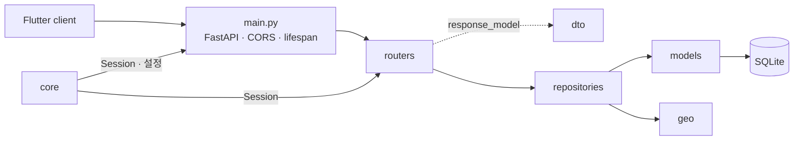

# `backend/app` — FastAPI 애플리케이션

HTTP 요청을 받아 SQLite 데이터를 조회하고 Flutter가 소비하는 JSON·지도 리소스로
직렬화한다. 최단 경로 계산은 서버에 없으며 클라이언트가 `navigation_graph`로 수행한다.

## 문서 목차

| 경계 | 디렉터리 | 역할 |
|---|---|---|
| 진입점 | [`main.py`](main.py) | 앱 팩토리, CORS, lifespan, 라우터, `/health` |
| HTTP | [`routers/`](routers/README.md) | 파라미터·의존성·상태 코드 번역 |
| 계약 | [`dto/`](dto/README.md) | Pydantic 요청/응답 스키마 |
| 조회 | [`repositories/`](repositories/README.md) | SQL 조회, 검색, 응답 dict·타일 조립 |
| 저장 | [`models/`](models/README.md) | SQLAlchemy ORM 테이블 |
| 계산 | [`geo/`](geo/README.md) | 좌표 변환과 지도 타일 순수 수학 |
| 기반 | [`core/`](core/README.md) | 설정, DB Session, 개발 진단 로그 |

## 요청 흐름

별도 service 계층은 없다. 서버의 주요 책임이 조회·변환·직렬화이므로 라우터는 얇게
유지하고 데이터 조립은 repositories에서 끝낸다.

## `main.py`

- `create_app()`을 uvicorn과 테스트가 함께 사용한다.
- `NAV_HTTP_CAPTURE=1`일 때만 요청 캡처 미들웨어와 로그 정리 lifespan을 붙인다.
- `buildings`, `fonts`, `query` 라우터를 등록한다.
- `NAV_WARM_EMBEDDING=1`이면 임베딩 모델을 백그라운드에서 미리 로드한다.
- 모듈 전역 `app = create_app()`이 `app.main:app` 실행 경로다.

## 실패 지점

- `main.py` import 시 무거운 임베딩 모델을 올리면 테스트와 경량 서버도 torch를 로드한다.
- 라우터에 SQL·검색 로직을 넣으면 repository 테스트와 HTTP 상태 코드 검증이 결합된다.
- DTO와 ORM을 같은 모델로 쓰면 저장 스키마 변경이 API 계약을 바로 깨뜨린다.
- `core`가 routers/repositories를 역으로 import하면 순환 의존이 생긴다.

## 자주 하는 작업

| 하고 싶은 것 | 위치 |
|---|---|
| 새 HTTP API | `dto` → `repositories` → `routers` 순으로 연결 |
| 앱 시작/종료 동작 | `main.py` lifespan |
| 새 환경변수·DB 설정 | `core/` |
| 좌표·타일 수학 | `geo/` |

---

> **다음 읽기:** [`app/core` — 애플리케이션 설정과 DB 연결](core/README.md)
