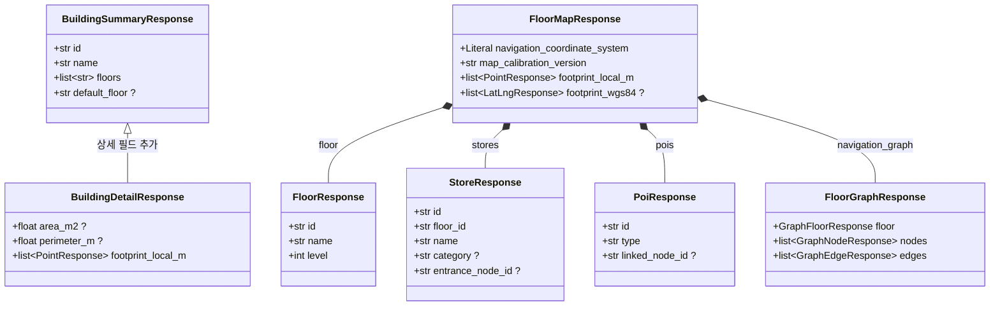
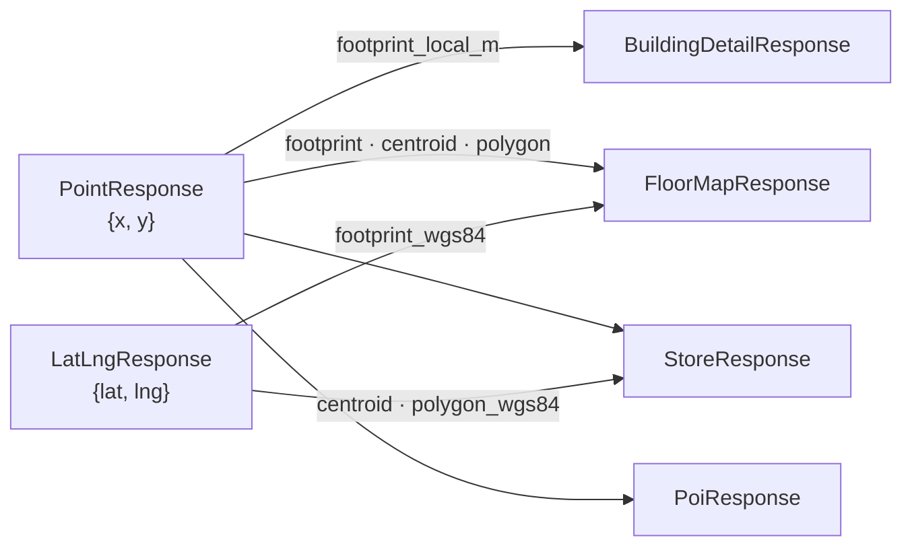
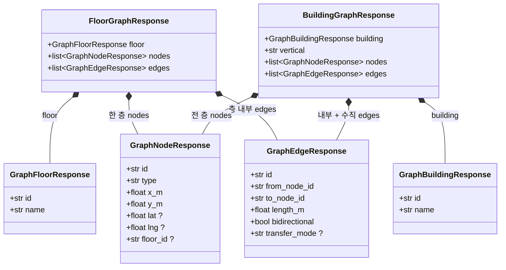
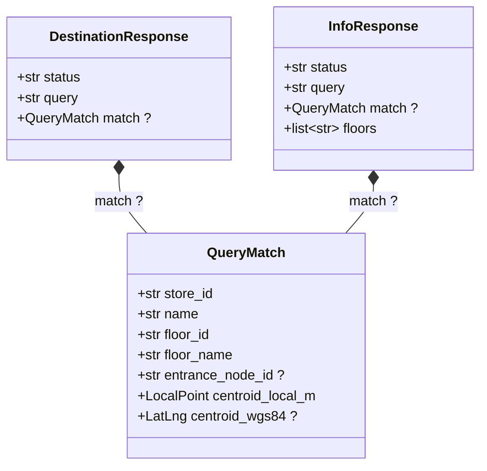

# `app/dto` — API 요청/응답 계약 (Pydantic)

HTTP로 **오가는 데이터의 모양**을 Pydantic 모델로 정의한다. FastAPI가 이 모델로
응답을 직렬화(`response_model`)하고 요청 Body를 검증한다.

> Spring 대응: DTO + Jackson 직렬화 스키마.
> **`models/`(ORM)와 역할이 다르다** — 저장되는 모양이 아니라 클라이언트에 보이는 모양이다. dto는 models를 import하지 않는다.

---

## 구성 파일

| 파일 | 대상 응답 | 핵심 모델 |
|---|---|---|
| `building.py` | 건물 목록/상세 | `BuildingSummaryResponse`, `BuildingDetailResponse` |
| `floor_map.py` | 층 지도 화면 | `FloorMapResponse`, `StoreResponse`, `PoiResponse` |
| `route.py` | 길찾기 그래프 | `FloorGraphResponse`, `BuildingGraphResponse`, `GraphNodeResponse`, `GraphEdgeResponse` |
| `query.py` | 자연어 질의 | `DestinationResponse`, `InfoResponse`, `QueryMatch` |
| `health.py` | 헬스 체크 | `HealthResponse` |
| `__init__.py` | 패키지 표식 | — |

---

## 응답 모델 구조

### 1. 건물 조회와 층 지도

건물 목록·상세와 한 층을 화면에 그리는 데 필요한 응답이다. `FloorMapResponse`는
매장·POI뿐 아니라 단일 층 경로 그래프도 함께 포함한다.



좌표 관계만 따로 보면 다음과 같다.



### 2. 단일 층·건물 전체 경로 그래프

`FloorGraphResponse`와 `BuildingGraphResponse`는 node·edge 타입을 공유한다. 단일 층 응답은
층 내부 edge만, 건물 전체 응답은 모든 층 node와 수직 전이 edge까지 담는다.



- `GraphEdgeResponse.from_node_id`와 `to_node_id`는 JSON에서 각각 `from`, `to`로 노출된다.
- `GraphNodeResponse.floor_id`는 건물 전체 그래프에서 node가 속한 층을 구분한다.
- `transfer_mode`는 `elevator`·`escalator` 같은 수직 이동 edge에만 있다.
- `BuildingGraphResponse.vertical`은 `auto`·`elevator`·`escalator` 정책을 나타낸다.

### 3. 자연어 목적지·정보 질의

두 응답은 같은 `QueryMatch`를 품지만 상태와 추가 필드가 다르다. 목적지 응답은 경로 시작
node를 제공하고, 정보 응답은 같은 시설이 존재하는 층 목록을 제공한다.



- `DestinationResponse.status`: `ok`, `ok_no_route`, `no_match`.
- `InfoResponse.status`: `ok`, `no_match`.
- `/query/destination`과 `/query/ai`는 같은 `DestinationResponse`를 사용한다.

### 공통으로 생략한 타입

`HealthResponse`는 필드가 하나이고 다른 모델과 연결되지 않아 그림에서 뺐다. 좌표 타입은
모양이 같아도 파일마다 **중복 정의**되어 있어 JSON 출력은 같지만 Python 타입은 별개다.

| 모양 | 정의된 곳 |
|---|---|
| `{x, y}` | `floor_map.PointResponse`, `route.LocalPointResponse`, `query.LocalPoint` |
| `{lat, lng}` | `floor_map.LatLngResponse`, `query.LatLng` |

`route.py`·`query.py`가 `floor_map.py`를 import하지 않으려다 생긴 중복이다. 정리하려면
좌표 타입만 담는 모듈을 따로 두고 셋이 공유하면 되지만, 응답 스키마가 바뀌지 않으므로 급하진 않다.

`?`는 nullable이다. `floor_map.py`가 `route.py`를 import해 층 지도 응답 안에
`FloorGraphResponse`를 넣으며, 반대 방향 import는 없다.

---

## 왜 ORM과 분리하는가

같은 "건물"이라도 계층마다 모양이 다르다.

```python
# models/building.py — 저장되는 모양
class Building(Base):
    floors: Mapped[list["Floor"]]      # Floor 객체(관계)

# dto/building.py — 나가는 모양
class BuildingSummaryResponse(BaseModel):
    floors: list[str]                  # 층 "이름" 문자열만
```

ORM을 그대로 반환하면 DB 컬럼을 바꾸는 순간 API가 깨지고 내부 구조가 샌다. dto로 끊으면
DB와 API 계약이 **독립적으로** 바뀐다.

## API 전용 표현들

- **키 이름 변경**: `GraphEdgeResponse`는 `from_node_id`를 `Field(alias="from")`으로 노출한다(내부 컬럼명 ≠ API 키).
- **계산 필드**: `StoreResponse.centroid_wgs84`, `polygon_wgs84`처럼 DB에 없고 변환으로만 만들어지는 값.
- **리터럴 제약**: `navigation_coordinate_system: Literal["local_m"]`처럼 계약을 타입에 박아 둔다.

---

## 의존성 방향

```
dto/*  ──►  pydantic 만 (models·sqlalchemy import 안 함)

routers/*  ──►  dto (response_model=..., 요청 Body 타입)
```

- **dict를 실제로 조립하는 곳은 `repositories/`다.** 기존 JSON 모양의 순수 dict를 만들고, FastAPI가 라우터의 `response_model`(=dto)로 그 dict를 검증·직렬화한다.
- 즉 dto는 "계약 선언"이고, 값 생성은 다른 계층이 한다.

---

## 자주 하는 작업

| 하고 싶은 것 | 방법 |
|---|---|
| 응답에 필드 추가 | 해당 dto에 필드 추가 + 값을 만드는 `repositories/` dict도 수정 |
| API 키 이름만 바꾸기 | `Field(alias="...")` (DB/모델은 그대로) |
| 요청 Body 검증 | 라우터에서 Pydantic 모델을 파라미터로 받기(`query.py`의 `DestinationRequest` 참고) |

---

> **다음 읽기:** [`app/geo` — 좌표 변환·지도 타일 순수 로직](../geo/README.md)
