# `app/dto` — API 요청/응답 계약 (Pydantic)

HTTP로 **오가는 데이터의 모양**을 Pydantic 모델로 정의한다. FastAPI가 이 모델로
응답을 직렬화(`response_model`)하고 요청 Body를 검증한다.

> Spring 대응: DTO + Jackson 직렬화 스키마.
> **`models/`(ORM)와 역할이 다르다** — 저장되는 모양이 아니라 클라이언트에 보이는 모양이다. dto는 models를 import하지 않는다.

---

## 구성 파일

| 파일 | 대상 응답 | 핵심 모델 |
|---|---|---|
| `building.py` | 건물 목록/상세 | `BuildingSummaryResponse`, `BuildingDetailResponse` |
| `floor_map.py` | 층 지도 화면 | `FloorMapResponse`, `StoreResponse`, `PoiResponse` |
| `route.py` | 길찾기 그래프 | `FloorGraphResponse`, `BuildingGraphResponse`, `GraphNodeResponse`, `GraphEdgeResponse` |
| `query.py` | 자연어 질의 | `DestinationResponse`, `InfoResponse`, `QueryMatch` |
| `health.py` | 헬스 체크 | `HealthResponse` |
| `__init__.py` | 패키지 표식 | — |

---

## 응답 모델 구조

```mermaid
classDiagram
    class BuildingSummaryResponse {
        +str id
        +str name
        +list~str~ floors 「표시 순서」
        +str default_floor ?
    }
    class BuildingDetailResponse {
        +float area_m2 ?
        +float perimeter_m ?
        +list~PointResponse~ footprint_local_m
    }
    class FloorMapResponse {
        +Literal navigation_coordinate_system
        +str map_calibration_version
        +list~PointResponse~ footprint_local_m
        +list~LatLngResponse~ footprint_wgs84 ?
    }
    class FloorResponse {
        +str id 「불투명 내부 id」
        +str name 「B2 라벨」
        +int level
    }
    class StoreResponse {
        +str id
        +str floor_id
        +str name
        +str category ?
        +str subcategory ?
        +str entrance_node_id ?
    }
    class PoiResponse {
        +str id
        +str type 「아이콘 키」
        +str name ?
        +str linked_node_id ?
    }
    class FloorGraphResponse
    class GraphFloorResponse {
        +str id
        +str name
    }
    class GraphNodeResponse {
        +str id
        +str type
        +float x_m
        +float y_m
        +float lat ?
        +float lng ?
        +str floor_id ? 「건물 전체 그래프만」
    }
    class GraphEdgeResponse {
        +str id
        +str from_node_id 「alias: from」
        +str to_node_id 「alias: to」
        +float length_m
        +bool bidirectional
        +str transfer_mode ? 「elevator·escalator」
    }
    class BuildingGraphResponse {
        +GraphBuildingResponse building
        +str vertical 「auto·elevator·escalator」
    }
    class GraphBuildingResponse {
        +str id
        +str name
    }
    class DestinationResponse {
        +str status 「ok·ok_no_route·no_match」
        +str query
    }
    class InfoResponse {
        +str status 「ok·no_match」
        +str query
        +list~str~ floors
    }
    class QueryMatch {
        +str store_id
        +str name
        +str floor_id
        +str floor_name
        +str entrance_node_id ?
    }
    class PointResponse {
        +float x
        +float y
    }
    class LatLngResponse {
        +float lat
        +float lng
    }

    BuildingSummaryResponse <|-- BuildingDetailResponse : 상속

    FloorMapResponse *-- FloorResponse : floor
    FloorMapResponse *-- StoreResponse : stores
    FloorMapResponse *-- PoiResponse : pois
    FloorMapResponse *-- FloorGraphResponse : navigation_graph

    FloorGraphResponse *-- GraphFloorResponse : floor
    FloorGraphResponse *-- GraphNodeResponse : nodes
    FloorGraphResponse *-- GraphEdgeResponse : edges

    BuildingGraphResponse *-- GraphBuildingResponse : building
    BuildingGraphResponse *-- GraphNodeResponse : nodes 「전 층」
    BuildingGraphResponse *-- GraphEdgeResponse : edges 「+수직 전이」

    DestinationResponse *-- QueryMatch : match ?
    InfoResponse *-- QueryMatch : match ?

    StoreResponse ..> PointResponse : centroid·polygon
    StoreResponse ..> LatLngResponse : wgs84 ?
    PoiResponse ..> PointResponse : position
    QueryMatch ..> LatLngResponse : centroid_wgs84 ?
```



`?` nullable · 실선은 포함, 점선은 좌표 타입 사용.
`floor_map.py`가 `route.py`를 import한다(층 지도 응답이 그래프를 품는다) — 반대 방향은 없다.

다이어그램에서 뺀 것: `HealthResponse`(필드 1개, 다른 모델과 안 엮임)와 **중복 정의된 좌표 타입들**.
같은 모양의 점 타입이 파일마다 따로 있다 — 구조가 같아 JSON 출력은 동일하지만 타입은 별개다.

| 모양 | 정의된 곳 |
|---|---|
| `{x, y}` | `floor_map.PointResponse`, `route.LocalPointResponse`, `query.LocalPoint` |
| `{lat, lng}` | `floor_map.LatLngResponse`, `query.LatLng` |

`route.py`·`query.py`가 `floor_map.py`를 import하지 않으려다 생긴 중복이다. 정리하려면
좌표 타입만 담는 모듈을 따로 두고 셋이 공유하면 되지만, 응답 스키마가 바뀌지 않으므로 급하진 않다.

---

## 왜 ORM과 분리하는가

같은 "건물"이라도 계층마다 모양이 다르다.

```python
# models/building.py — 저장되는 모양
class Building(Base):
    floors: Mapped[list["Floor"]]      # Floor 객체(관계)

# dto/building.py — 나가는 모양
class BuildingSummaryResponse(BaseModel):
    floors: list[str]                  # 층 "이름" 문자열만
```

ORM을 그대로 반환하면 DB 컬럼을 바꾸는 순간 API가 깨지고 내부 구조가 샌다. dto로 끊으면
DB와 API 계약이 **독립적으로** 바뀐다.

## API 전용 표현들

- **키 이름 변경**: `GraphEdgeResponse`는 `from_node_id`를 `Field(alias="from")`으로 노출한다(내부 컬럼명 ≠ API 키).
- **계산 필드**: `StoreResponse.centroid_wgs84`, `polygon_wgs84`처럼 DB에 없고 변환으로만 만들어지는 값.
- **리터럴 제약**: `navigation_coordinate_system: Literal["local_m"]`처럼 계약을 타입에 박아 둔다.

---

## 의존성 방향

```
dto/*  ──►  pydantic 만 (models·sqlalchemy import 안 함)

routers/*  ──►  dto (response_model=..., 요청 Body 타입)
```

- **dict를 실제로 조립하는 곳은 `repositories/`다.** 기존 JSON 모양의 순수 dict를 만들고, FastAPI가 라우터의 `response_model`(=dto)로 그 dict를 검증·직렬화한다.
- 즉 dto는 "계약 선언"이고, 값 생성은 다른 계층이 한다.

---

## 자주 하는 작업

| 하고 싶은 것 | 방법 |
|---|---|
| 응답에 필드 추가 | 해당 dto에 필드 추가 + 값을 만드는 `repositories/` dict도 수정 |
| API 키 이름만 바꾸기 | `Field(alias="...")` (DB/모델은 그대로) |
| 요청 Body 검증 | 라우터에서 Pydantic 모델을 파라미터로 받기(`query.py`의 `DestinationRequest` 참고) |
