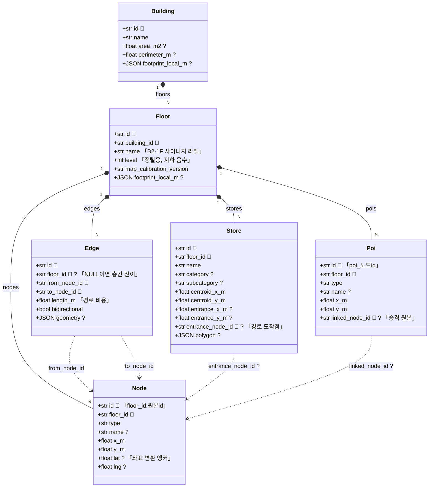

# `app/models` — SQLAlchemy ORM 엔티티

DB **테이블 정의(스키마)**를 담는다. SQLAlchemy `DeclarativeBase` 기반 ORM 클래스들이다.
`Base.metadata`가 이 선언에서 테이블을 만들고(`create_all`), 각 계층이 이 객체로 DB를 읽고 쓴다.

> Spring 대응: JPA `@Entity`. **API 응답 형태(`dto/`)와는 별개다** — 저장되는 모양 vs 나가는 모양.

---

## 구성 파일

| 파일 | 엔티티 | 관계 |
|---|---|---|
| `base.py` | `Base` (DeclarativeBase) | 모든 엔티티의 공통 부모 |
| `building.py` | `Building`, `Floor` | `Building 1:N Floor` 양방향 |
| `navigation.py` | `Node`, `Edge` | `Edge → Node` 단방향 2개(from/to) |
| `place.py` | `Store`, `Poi` | Floor 소속 + 선택적 Node FK |
| `__init__.py` | 위 전부 re-export | `Base.metadata` 등록 보장 |

---

## 엔티티 관계



`🔑` PK · `🔗` FK · `?` nullable · 실선은 소유(층이 지우면 같이 사라짐), 점선은 참조.

- **`Floor`가 허브다.** Node·Edge·Store·Poi 모두 `floor_id`로 층에 매인다.
- **`Edge.floor_id`는 nullable.** 층 내부 간선은 층 id를, **층을 잇는 수직 전이 간선(엘리베이터/에스컬레이터)은 `NULL`**을 가진다. 단일 층 조회(`get_floor_graph`)는 `floor_id`로 필터되어 전이 간선을 자연히 제외하고, 건물 전체 그래프(`get_building_graph`)만 전이 간선을 합쳐 층 간 경로에 쓴다(`Edge.transfer_mode`·`Edge.bidirectional` 참고 — 에스컬레이터는 방향이 있어 단방향이다).

---

## 설계 규칙 (중요)

- **역방향 컬렉션을 만들지 않는다.** `Node.outgoing_edges` 같은 관계는 없다. 그래프 조회는 한 층의 Node·Edge 전체를 한 번에 읽어 `navigation_graph`로 직렬화하므로(경로 탐색 자체는 클라이언트가 온디바이스로 수행) 역방향 관계가 불필요하고, 있으면 N+1을 유발한다.
- **지도 좌표 배열은 JSON 컬럼.** `geometry`, `polygon`, `footprint_local_m`은 관계로 분해하지 않고 SQLite JSON으로 저장한다(`Mapped[list[dict] | None]`). 별도 테이블로 쪼개면 불필요한 JOIN만 는다.
- **좌표는 평면 컬럼.** `x_m`, `y_m`처럼 미터 단위 float. `{"x":…, "y":…}` 중첩 JSON으로의 변환은 `repositories/`가 응답 dict를 조립할 때 명시적으로 한다.
- **인덱스는 조회 패턴 기준.** `idx_nodes_floor`, `idx_edges_from` 등 실제 필터/조인 컬럼에만 건다.

---

## 식별자 설계 — `id`는 String 자연 키

모든 엔티티의 `id`가 `String`이다. DB가 매기는 auto-increment `Long`이 **아니라**, 원천 데이터(다베오 스튜디오)가 이미 부여한 **자연 키(natural key)를 그대로 PK로 쓴다.**

| 엔티티 | 실제 id 예시 |
|---|---|
| Building | `thehyundai-seoul` (슬러그) |
| Floor | `FL-1ibh3iudjt4ro0414` (소스 내부 식별자) |
| Node | `{floor_id}:{원본id}` (층 스코프 합성) |
| Store / Poi | 소스 부여 id / `poi_{노드id}` |

왜 auto-increment `Long`이 아닌가:

- **소스가 id를 소유한다.** 노드·간선·매장이 소스 JSON에서 서로를 이 id로 참조한다(`Edge.from/to`, `Store.entrance_node_id`). 새 정수 id를 생성하면 시드 때 **모든 참조를 번역**해야 한다.
- **재시드 안정성.** 개발 DB는 `reset_and_seed`로 통째로 재생성한다. 문자열 자연 키는 재시드해도 그대로지만, auto-increment 정수는 순서가 바뀌어 외부 참조(클라이언트가 저장한 매장 id 등)가 깨질 수 있다.
- **디버깅·역추적.** 로그·API에서 `thehyundai-seoul:node_12`가 `48213`보다 읽기 쉽고, 다베오 원본과 1:1로 이어진다.

트레이드오프: 문자열 PK는 정수보다 인덱스·조인이 약간 무겁지만 이 규모(층당 노드 수백 개)에선 무의미하다. **정렬·산술이 필요한 값은 문자열 id에 얹지 않고 별도 정수 컬럼으로 둔다** — 예: 층 순서는 `Floor.level`(정수), 표시 라벨은 `Floor.name`(문자열, "B2"/"1F")로 분리.

---

## 의존성 방향

```
models/*  ──►  sqlalchemy, models.base 만 (app 상위 계층에 의존 안 함)

repositories / scripts.seed  ──►  models
dto/  ──X──  models   (역할 분리: dto는 models를 import하지 않는다)
```

- **models는 순수 스키마 계층.** 조회 로직(`select`)은 여기 두지 않고 `repositories/`에 둔다.
- `__init__.py`가 모든 모델을 import해야 `Base.metadata`에 테이블이 등록된다 — `create_all` 전에 반드시 `import app.models`가 필요.

---

## 자주 하는 작업

| 하고 싶은 것 | 방법 |
|---|---|
| 컬럼 추가 | 해당 엔티티에 `Mapped[...] = mapped_column(...)` 추가 → DB 재생성(`reset_and_seed`) |
| 새 테이블 | 새 엔티티 클래스 + `__init__.py`에 등록 |
| 스키마 반영 | 마이그레이션 도구 없음 → 개발 DB는 `python -m scripts.seed.reset_and_seed`로 drop & create |
| API에 노출할 필드 고르기 | models가 아니라 `dto/`에서 결정 |

---

> **다음 읽기:** [`app/dto` — API 요청/응답 계약](../dto/README.md)
