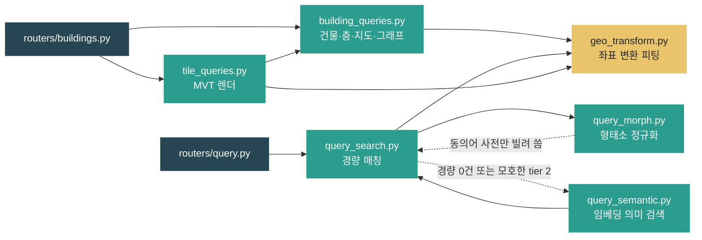
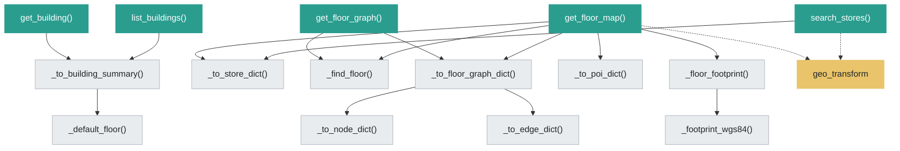
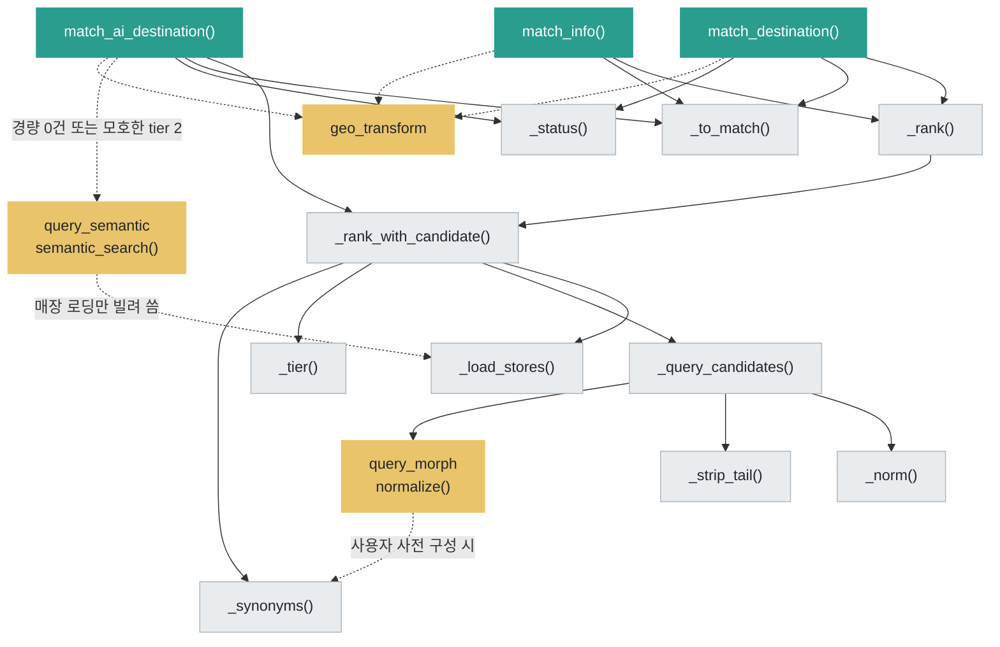
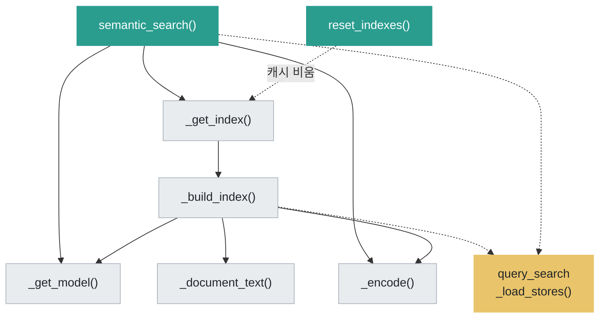
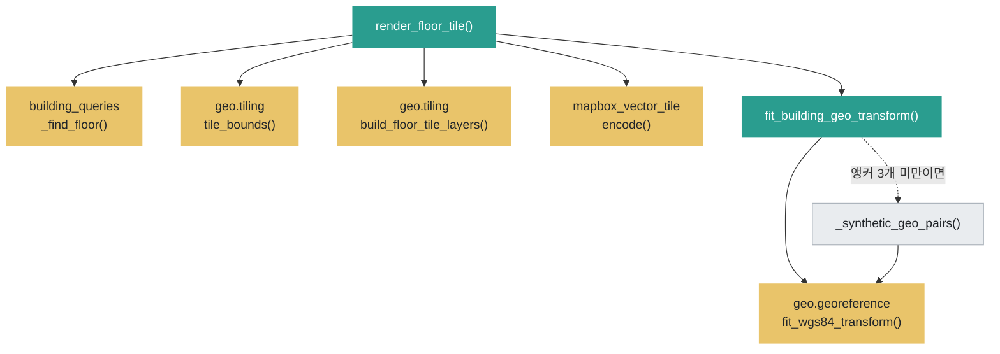

# `app/repositories` — DB 조회 + 응답 dict 조립

Session으로 DB를 읽어 **기존 API 응답과 같은 모양의 순수 dict**를 만든다.
`select()` 조회와 ORM→dict 변환이 여기 모인다. HTTP 상태 코드는 모른다(변환은 라우터가).

> Spring 대응: Repository + 일부 Mapper. 조회부터 응답 dict 조립까지 이 계층에서 끝낸다(별도 service 계층은 두지 않는다 — 서버는 조회·직렬화만 하고, 경로 계산은 클라이언트가 온디바이스로 수행).

---

## 구성 파일

| 파일 | 역할 | 핵심 함수 |
|---|---|---|
| `building_queries.py` | 건물/층/매장/지도/그래프 조회 + dict 조립 | `list_buildings`, `get_building`, `search_stores`, `get_floor_map`, `get_floor_graph`, `get_building_graph` |
| `query_search.py` | 자연어 질의 경량 매칭(이름·카테고리·동의어) | `match_destination`, `match_info`, `match_ai_destination` |
| `query_morph.py` | 질의 형태소 정규화(Kiwi). 조사·어미 제거 | `normalize` |
| `query_semantic.py` | 임베딩 의미 검색(FAISS). 경량 미스·모호한 부분 일치 보완 | `semantic_search`, `reset_indexes`, `warm_model_in_background` |
| `geo_transform.py` | 건물 `local_m → wgs84` 변환을 요청 시점에 피팅 | `fit_building_geo_transform` |
| `tile_queries.py` | 층 지도를 MVT 바이트로 렌더링 | `render_floor_tile` |
| `__init__.py` | 패키지 표식 | — |

---

## 모듈 연관관계 (전체 그림)

모듈 사이의 의존만 본다. 함수 단위는 아래 모듈별 다이어그램에서 따로 본다.



두 개의 공유 지점이 이 계층의 핵심이다.

- **`geo_transform`(노랑)을 네 경로가 모두 거친다.** 지도·타일·질의가 같은 좌표를 가리키려면 반드시 이 함수 하나를 통해야 한다. 여기가 어긋나면 "지도에선 맞는데 타일에선 어긋나는" 증상이 난다.
- **`query_semantic`·`query_morph`가 `query_search`를 되부른다.** 순환처럼 보이지만 각각 `_load_stores`(매장 로딩)·`_synonyms`(동의어 사전)만 빌려 쓰는 단방향 재사용이다. `query_morph` 쪽은 함수 안에서 지연 import해 모듈 로드 시점의 순환을 피한다.

---

## `building_queries.py` 내부



- `_to_floor_graph_dict()`를 **층 지도와 그래프 API가 공유한다.** 클라이언트가 층 지도 응답 한 번으로 그래프까지 캐시할 수 있는 이유다.
- `_floor_footprint()`는 층 외곽선이 없을 때만 건물 것으로 폴백한다 — 지하층에 1F 윤곽이 그려지던 문제의 대응.

---

## `query_search.py` 내부



- **`_load_stores()`가 이 계층의 허브다.** 세 공개 함수와 의미 검색이 전부 이걸 통해 매장을 읽으므로, 여기 걸린 층 필터가 모든 경로에 동시에 적용된다.
- **점선은 조건부**다. 정확 이름·카테고리 또는 단일 매장명 부분 일치는 1차에서 끝난다.
  최상위 `(tier, 구두점 후보 순서)`에 서로 다른 매장명이 여럿이면 ID순 후보를 임의 확정하지 않고
  의미 검색으로 넘긴다. 일반 검색용 `_rank()`는 같은 내부 순위를 쓰되 후보 순서 필드만 감춘다.
- **`_query_candidates()`는 원문을 보존하면서 끝 구두점을 단계적으로 제거한다.**
  각 후보는 `_strip_tail()`(의문형 꼬리) → `query_morph.normalize()`(조사·어미) 순으로
  정규화한다. `"A.P.C."`는 원문 정확 일치를 유지하고 `"화장실이 어디야?"`도 잡는다.
  Kiwi가 없으면 꼬리 제거 결과를 쓴다.

---

## `query_semantic.py` 내부



- **`_get_model()`과 `_get_index()`는 둘 다 지연 로드 싱글턴**이다. 락 안에서 한 번 더 확인해 동시 요청이 모델·인덱스를 중복 생성하지 않게 한다.
- **모델 로드는 로컬 캐시 우선(`_load_model`)이다.** `local_files_only=True`로 먼저 시도해 HF Hub 왕복(경고·지연)을 없애고, 캐시가 없을 때만 Hub로 폴백한다. 배포 이미지는 빌드 때 `scripts.warm_embedding_model`로 캐시를 채운다.
- **`warm_model_in_background()`는 기동 시 워밍용이다.** `NAV_WARM_EMBEDDING=1`이면 `main.create_app()`이 이 데몬 스레드를 띄워 `_get_model()`을 미리 돌린다. `_model_lock`이 직렬화하므로 워밍 중 첫 질의가 들어와도 중복 로드 없이 같은 인스턴스를 쓴다.
- **인덱스는 `store_id`만 캐시한다.** ORM 객체는 매 요청 현재 세션으로 새로 읽는다(`semantic_search → _load_stores`) — detached 객체와 stale 층 정보를 피하기 위해서다.
- 모델 로드가 실패하면 `_get_model()`이 `None`을 돌려주고 AI 경로만 조용히 비활성된다. 경량 매칭은 계속 동작한다. 백그라운드 워밍이 실패해도 같은 방식으로 degrade한다.

---

## `tile_queries.py` · `geo_transform.py` 내부



- 수학(`geo/`)과 조회(`repositories/`)를 나눈 경계가 여기서 보인다. 타일 **바이트 인코딩**만 외부 포맷 라이브러리에 의존하므로 `geo`가 아니라 이쪽에 있다.
- 점선 폴백은 실측 앵커가 없는 합성 데이터용이다. 위치는 가짜지만 형태·크기는 정확한 지도가 나온다.

> 색: 초록 = 공개 함수(라우터가 부름), 회색 = 모듈 내부 헬퍼, 노랑 = 다른 모듈.

---

## 반환 규칙 (라우터와의 계약)

| 반환 | 뜻 | 라우터 처리 |
|---|---|---|
| dict / list | 정상 결과 | 200 |
| `None` | 없는 Building/Floor | 404 |
| 빈 `[]` | 검색 결과 없음(대상은 존재) | 200 + 빈 목록 |

- 모든 조회 함수는 **첫 인자가 `Session`**이고, 상태 코드를 던지지 않는다.
- ORM 객체를 그대로 반환하지 않고 `_to_store_dict` 등으로 **명시적으로 dict를 조립**한다(내부 `from_node_id`→`from` 키 변경, `centroid_wgs84` 계산 등). 최종 검증·직렬화는 라우터의 `response_model`(=`dto/`)이 한다.

## `geo_transform.py` — 변환 피팅

```python
def fit_building_geo_transform(session, building_id) -> GeoTransform
```

- 건물의 모든 층 Node 중 **실측 wgs84가 채워진 것**을 대응점으로 뽑아 `geo.georeference.fit_wgs84_transform`으로 피팅한다.
- 대응점이 3개 미만이면(합성 데이터 등) 서울시청 앵커에 1m=1m로 배치하는 **합성 대응점**으로 대체한다 — 위치는 가짜지만 형태/크기는 정확한 지도를 보여주기 위함.
- **DB 컬럼으로 저장하지 않고 매 요청 즉석 피팅한다.** 타일(`tile_queries`)과 JSON 지도(`building_queries`)가 이 함수를 공유해야 두 경로가 같은 좌표를 가리킨다.

## `tile_queries.py` — MVT 렌더

- `geo.tiling.build_floor_tile_layers`로 GeoJSON 레이어를 만든 뒤 **`mapbox_vector_tile.encode`로 바이트 인코딩**한다(외부 포맷 라이브러리 의존이라 geo가 아닌 여기서).

---

## 의존성 방향

```
repositories/*  ──►  models (select), geo (변환·타일 수학), sqlalchemy
tile_queries    ──►  building_queries._find_floor, geo_transform, mapbox_vector_tile

routers/*   ──►  repositories (단순 조회)
```

- repositories는 `models`와 `geo`에 의존하지만 `dto`·`routers`에는 의존하지 않는다(계약은 라우터가 dto로 강제).

---

## 자주 하는 작업

| 하고 싶은 것 | 방법 |
|---|---|
| 새 조회 API 추가 | 조회 함수(`Session` 첫 인자) 작성 → dto 추가 → 라우터에서 연결 |
| 응답 dict 필드 바꾸기 | `_to_*_dict` 헬퍼 수정 + 대응 `dto/` 수정 |
| 좌표가 지도/타일에서 다르게 보임 | 둘 다 `fit_building_geo_transform`을 쓰는지 확인 |
