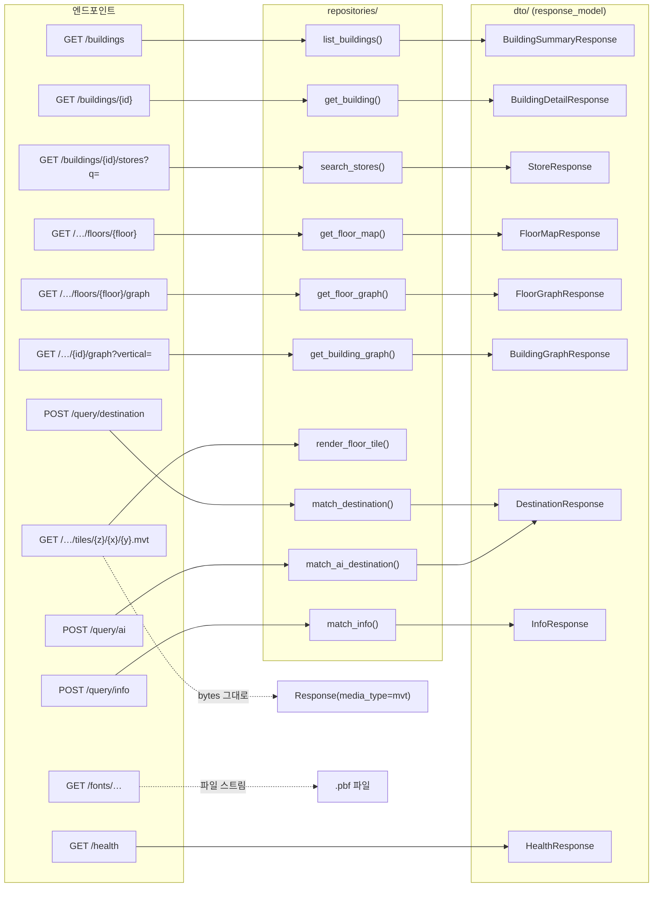

# `app/routers` — HTTP 엔드포인트 (경계 계층)

URL·쿼리 파라미터 파싱, `Depends(get_db)` 주입, `response_model`(=`dto/`) 지정,
그리고 **아래 계층의 반환을 HTTP 상태 코드로 번역**하는 일만 한다. 비즈니스 로직은 없다.

> Spring 대응: `@RestController`. 얇게 유지 — 조회는 `repositories/`. 경로 계산은 서버에 없다(클라이언트가 `navigation_graph`로 온디바이스 수행).

---

## 구성 파일

| 파일 | prefix | 담당 |
|---|---|---|
| `buildings.py` | `/buildings` | 건물/층/지도/그래프/타일 |
| `fonts.py` | `/fonts` | MapLibre 글리프(.pbf) 서빙 |
| `query.py` | `/query` | 자연어 질의 (경량 매칭 + AI 임베딩 검색) |
| `__init__.py` | — | 패키지 표식 |

라우터 등록은 `app/main.py`의 `create_app()`에서 `include_router`로 한다. `/health`도 거기 있다.

---

## 엔드포인트 → 조회 함수



- **대부분의 엔드포인트는 조회 함수 하나에 dto 하나로 1:1 대응한다.** 라우터에 로직이 없다는 뜻이다.
- **`/query/destination`과 `/query/ai`는 같은 `DestinationResponse`를 쓴다.** 응답 계약이 같아야 클라이언트가 두 경로를 갈아끼울 수 있다.
- **타일과 글리프만 `response_model`이 없다.** JSON이 아니라 바이너리를 그대로 내보낸다.

---

## 상태 코드 번역 규칙

아래 계층은 상태 코드를 모른다. 라우터가 반환값을 번역한다.

| 아래 계층 반환 | 라우터 |
|---|---|
| dict / list | 200 |
| `None` | `HTTPException(404)` |
| `ValueError` | `HTTPException(400, str(error))` |

```python
# buildings.py — 전형적 핸들러
@router.get("/{building_id}", response_model=BuildingDetailResponse)
def get_building(building_id: str, session: Session = Depends(get_db)):
    result = building_queries.get_building(session, building_id)
    if result is None:
        raise HTTPException(status_code=404, detail="Building not found")
    return result
```

주의점:

- **모든 핸들러는 `def`(동기)로 선언한다.** SQLAlchemy 동기 IO라 `async def`로 두면 이벤트 루프가 막힌다(동기 `def`는 anyio 스레드풀에서 실행됨).
- `buildings.py`는 **조회를 `repositories.building_queries`**로 처리한다. 최단 경로는 서버에서 계산하지 않고, 층 지도 응답의 `navigation_graph`를 받아 **클라이언트가 온디바이스 탐색**한다.
- **층 간 이동은 `GET /{id}/graph`가 담당한다.** 층별 `/graph`는 `floor_id`로 필터돼 수직 전이 간선(엘리베이터/에스컬레이터)이 빠지므로 한 층 안에서만 경로를 낼 수 있다. 건물 전체 그래프는 전 층 노드 + 층 내부 간선 + 전이 간선을 합쳐 층 간 경로를 가능하게 하고, `?vertical=auto|elevator|escalator`로 수직 이동 수단 정책을 고른다.
- `fonts.py`는 `resources/fonts/`에서 `.pbf`를 읽어 준다. 없는 범위는 404가 아니라 **빈 200**을 돌려준다(MapLibre가 404를 스타일 오류로 보고 심볼 레이아웃을 멈추지 않게). 경로 조작 방지로 `FONTS_DIR` 밖 접근을 차단한다.

---

## 의존성 방향

```
routers/buildings.py
    ──►  core.database.get_db
    ──►  dto/ (response_model)
    ──►  repositories.building_queries, tile_queries

main.create_app()  ──►  routers (include_router)
```

- 라우터는 가장 바깥 경계. 그 위는 프레임워크(FastAPI/uvicorn)뿐이다.

---

## 자주 하는 작업

| 하고 싶은 것 | 방법 |
|---|---|
| 새 엔드포인트 | 핸들러(`def` + `Depends(get_db)`) → `response_model`에 dto 지정 → 조회 호출 |
| 새 라우터 파일 | `APIRouter(prefix=...)` 만들고 `main.create_app()`에서 `include_router` |
| 에러 응답 형태 변경 | `HTTPException(status_code, detail=...)` (핸들러에서만) |
| 응답 필드 추가 | 여기 말고 `dto/` + `repositories/` |

---

> **다음 읽기:** [`backend/scripts` — 데이터 준비와 오프라인 도구](../../scripts/README.md)
