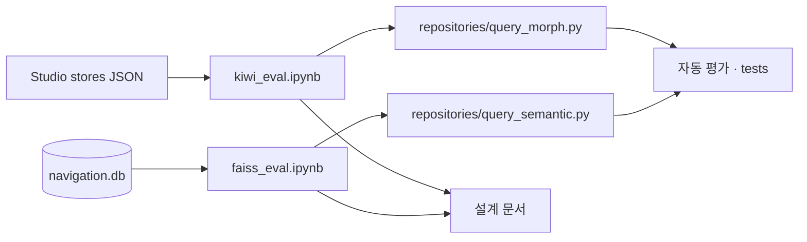

# `backend/notebooks` — 자연어 검색 품질 분석

운영 서버 코드가 아니라 검색 설계와 임계값의 근거를 남기는 분석 노트북이다.
재현 가능한 자동 회귀 검사는 `scripts/evaluate_query_hybrid.py`와 `tests/`가 담당한다.

## 구성 파일

| 파일 | 데이터 | 목적 |
|---|---|---|
| [`faiss_eval.ipynb`](faiss_eval.ipynb) | 시드된 `data/navigation.db` | 의미 검색 top-k, 긍정/부정 점수, threshold·margin 분석 |
| [`kiwi_eval.ipynb`](kiwi_eval.ipynb) | `resources/studio/.../stores_*.json` | 조사·어미 제거, 사용자 사전, 전 층 정규화 회귀 분석 |

## 분석 관계

관련 설계 문서는 [KIWI](../../docs/backend/native/KIWI.md)와
[FAISS](../../docs/backend/native/FAISS.md)를 참고한다.

## 실행 전제

- `requirements-dev.txt`의 Jupyter·분석 의존성을 설치한다.
- FAISS 노트북 전에 `python -m scripts.seed.reset_and_seed`로 DB를 준비한다.
- Kiwi 노트북은 Studio JSON을 직접 읽으므로 DB 시드가 필요 없다.
- 노트북의 현재 출력보다 셀을 처음부터 다시 실행한 결과를 신뢰한다.

## 실패 지점

- 실데이터가 바뀐 뒤 저장된 셀 출력만 보면 현재 코드와 다른 결론을 낼 수 있다.
- 노트북 전용 실험 코드를 운영 repository와 따로 복사하면 둘의 정규화 규칙이 갈라진다.
- 점수 threshold 하나만 최적화하면 긍정 재현율과 부정 오탐의 상충을 숨긴다.
- 노트북 성공을 CI 회귀 검증으로 간주하지 않는다.

---

> **다음 읽기:** [`backend/tests` — 서버 검증](../tests/README.md)
