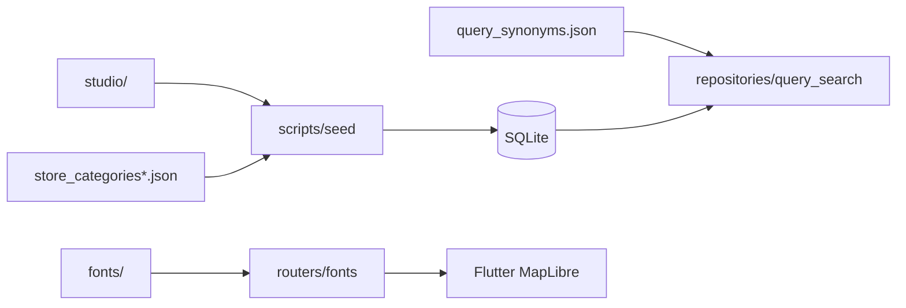

# `backend/resources` — 서버 정적·입력 데이터

DB를 재생성할 수 있는 Studio 입력, MapLibre 글리프, 자연어 검색 사전과 매장 분류를
보관한다. `data/navigation.db`와 달리 재생성의 근거이므로 Git에서 추적한다.

## 문서 목차

| 경로 | 역할 | 소비자 |
|---|---|---|
| [`studio/`](studio/README.md) | 층별 그래프·매장·좌표 입력 | `scripts/seed/studio_adapter.py` |
| [`fonts/`](fonts/README.md) | MapLibre SDF glyph 범위와 라이선스 | `app/routers/fonts.py` |
| [`query_synonyms.json`](query_synonyms.json) | 사용자 표현 → 표준 검색어 | `repositories/query_search.py`, `query_morph.py` |
| [`store_categories.json`](store_categories.json) | 매장 ID 기반 카테고리 보정 | `scripts/seed/studio_adapter.py` |
| [`store_category_by_name.json`](store_category_by_name.json) | 매장명 기반 카테고리 fallback | `scripts/seed/studio_adapter.py` |

## 소비 관계

## 변경 규칙

- JSON은 UTF-8로 저장한다.
- Studio 파일을 수정한 뒤 DB를 다시 시드하고 참조 무결성 테스트를 실행한다.
- 동의어는 표준어와 별칭 방향을 확인하고 `test_query_search.py`로 회귀를 고정한다.
- 카테고리 보정은 ID 우선, 이름 fallback이며 같은 이름의 다른 매장 영향을 확인한다.
- 폰트 파일을 교체할 때 `OFL.txt` 등 배포 라이선스를 함께 유지한다.

## 실패 지점

- 생성 DB만 수정하면 다음 `reset_and_seed`에서 변경이 사라진다.
- Studio node/edge ID를 바꾸고 store의 `entrance_node_id`를 갱신하지 않으면 길찾기가 끊긴다.
- 동의어 JSON 오류는 서버 첫 import 또는 첫 질의 시 검색 전체를 막을 수 있다.
- 원본과 변환 산출물을 구분하지 않으면 같은 변환을 두 번 적용할 수 있다.

---

> **다음 읽기:** [`resources/studio` — 층별 내비게이션 원본](studio/README.md)
