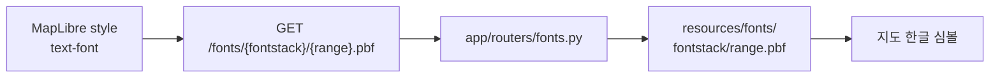

# `resources/fonts` — MapLibre SDF 글리프

지도 위 한글·영문 심볼을 렌더링하기 위한 MapLibre glyph 범위 파일이다. 서버가 파일을
그대로 제공하고 클라이언트 MapLibre가 필요한 유니코드 범위를 요청한다.

## 구조

| 경로 | 역할 |
|---|---|
| [`Noto Sans KR Regular/`](Noto%20Sans%20KR%20Regular/) | `{start}-{end}.pbf` 형식의 256 codepoint glyph 범위 |
| [`OFL.txt`](OFL.txt) | Noto Sans KR 배포 라이선스 |

## 요청 흐름

glyph 생성 도구는 [`../../scripts/transform/make_glyphs.js`](../../scripts/transform/make_glyphs.js)다.

## 실패 지점

- 파일명 범위가 256 단위 규약과 다르면 MapLibre 요청 경로와 맞지 않는다.
- style의 fontstack 이름과 디렉터리 이름이 다르면 모든 범위를 찾지 못한다.
- 일부 한글 범위만 빠져도 특정 매장명만 공백으로 보여 전체 오류처럼 보이지 않을 수 있다.
- 폰트 파일만 교체하고 라이선스를 제거하지 않는다.
- 경로 조작 방지는 router가 담당하므로 파일 제공 코드를 우회해 새 endpoint를 만들지 않는다.

## 검증

현재 fonts router 전용 자동 테스트는 없다. 서버에서 서로 다른 glyph 범위 URL의 status,
media type, body를 확인하고 실제 Flutter 지도에서 서로 다른 초성의 한글 매장명이
표시되는지 함께 본다.

---

> **다음 읽기:** [`scripts/seed` — DB 초기화와 Studio 적재](../../scripts/seed/README.md)
