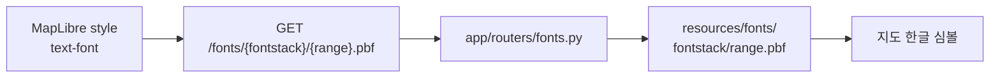

# `resources/fonts` — MapLibre SDF 글리프

지도 위 한글·영문 심볼을 렌더링하기 위한 MapLibre glyph 범위 파일이다. 서버가 파일을
그대로 제공하고 클라이언트 MapLibre가 필요한 유니코드 범위를 요청한다.

## 구조

| 경로 | 역할 |
|---|---|
| [`Pretendard Regular/`](Pretendard%20Regular/) | `{start}-{end}.pbf` 형식의 256 codepoint glyph 범위 |
| [`OFL.txt`](OFL.txt) | Pretendard 배포 라이선스 |

## 요청 흐름

```mermaid
flowchart LR
    STYLE["MapLibre style<br/>text-font"]
    REQUEST["GET /fonts/{fontstack}/{range}.pbf"]
    ROUTER["app/routers/fonts.py"]
    FILE["resources/fonts/<br/>fontstack/range.pbf"]
    SYMBOL["지도 한글 심볼"]

    STYLE --> REQUEST --> ROUTER --> FILE
    FILE --> SYMBOL
```

glyph 생성 도구는 [`../../scripts/transform/make_glyphs.js`](../../scripts/transform/make_glyphs.js)다.

## 실패 지점

- 파일명 범위가 256 단위 규약과 다르면 MapLibre 요청 경로와 맞지 않는다.
- 디렉터리 이름은 클라이언트 `core/map_fonts.dart`의 상수와 **글자 하나까지 같아야** 한다.
  앱 UI 글꼴(`pubspec.yaml`의 Pretendard)과 같은 가족으로 맞춰 둔 값이라, 한쪽만 바꾸면
  지도 라벨과 시트 텍스트가 다른 글꼴로 보인다.
- style의 fontstack 이름과 디렉터리 이름이 다르면 모든 범위를 찾지 못한다.
- 일부 한글 범위만 빠져도 특정 매장명만 공백으로 보여 전체 오류처럼 보이지 않을 수 있다.
- router는 **없는 fontstack도 빈 200**으로 돌려준다. 새 앱은
  `Pretendard Regular/`만 요청해야 하며, 다른 이름의 응답이 비어 있는지도 테스트한다.
- 폰트 파일만 교체하고 라이선스를 제거하지 않는다.
- 경로 조작 방지는 router가 담당하므로 파일 제공 코드를 우회해 새 endpoint를 만들지 않는다.

## 검증

fonts router 전용 통합 테스트는 [`tests/integration/map/test_fonts.py`](../../tests/integration/map/test_fonts.py)가
있다. 있는/없는 glyph 범위의 status·media type·body, 캐시 헤더(`Cache-Control`·`ETag`·304),
잘못된 범위 400, 경로 조작 방어까지 확인한다. 실제 Flutter 지도에서 서로 다른 초성의
한글 매장명이 표시되는지는 함께 눈으로 본다.

---

> **다음 읽기:** [`scripts/seed` — DB 초기화와 Studio 적재](../../scripts/seed/README.md)
