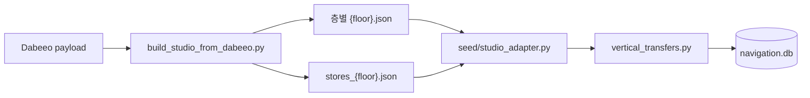

# `resources/studio` — 층별 내비게이션 원본

외부 지도 데이터를 서버 시드가 읽을 수 있는 층별 JSON으로 정규화한 결과다. 현재 기본
데이터셋은 `thehyundai-seoul-dabeeo`이며 지하 6층부터 지상 6층까지 포함한다.

## 파일 구조

```text
thehyundai-seoul-dabeeo/
├── b6.json ... 6f.json          # 층 footprint·node·edge·좌표 기준
└── stores_b6.json ... stores_6f.json  # 층별 매장 polygon·입구 node
```

## 생성과 적재



`studio_adapter.discover_floor_codes()`가 디렉터리의 층 파일을 찾아 적재 범위를 결정한다.
층별 ID는 building 범위에서 충돌하지 않도록 시드 과정에서 scope된다.

## 데이터 불변식

- 모든 층은 같은 건물 `local_m` 기준을 공유한다.
- edge의 `from`·`to` node가 해당 데이터셋에 존재해야 한다.
- store `entrance_node_id`는 같은 층의 접근 가능한 node를 가리킨다.
- 층 표시명과 내부 `floor_id`는 구분한다.
- 엘리베이터·에스컬레이터 node의 type·좌표가 층 간 전이 생성의 근거다.

## 실패 지점

- stores 파일만 갱신하고 층 graph를 갱신하지 않으면 입구 node 참조가 오래된 값이 된다.
- 층마다 좌표 원점을 따로 정규화하면 건물 전체 그래프의 수직 전이가 어긋난다.
- 파일명 층 코드와 JSON 내부 층 이름이 다르면 적재 순서·조회가 혼란스러워진다.
- 실데이터 값의 정확한 개수를 테스트에 고정하면 데이터 보정 때 불필요한 회귀가 생긴다.

## 검증

`python -m scripts.seed.reset_and_seed` 후 `tests/integration/test_real_data_smoke.py`로
참조 무결성과 실제 파이프라인을 확인한다.

---

> **다음 읽기:** [`resources/fonts` — MapLibre SDF 글리프](../fonts/README.md)
