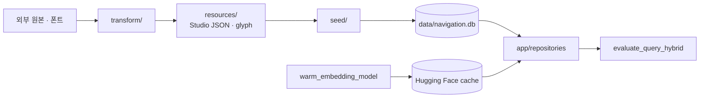

# `backend/scripts` — 데이터 준비와 오프라인 도구

서버 요청 바깥에서 실행하는 CLI와 변환 로직이다. DB를 다시 만드는 작업, 원본 파일을
Studio 형식으로 바꾸는 작업, 검색 품질 평가, 임베딩 모델 사전 다운로드를 분리한다.

## 문서 목차

| 경로 | 역할 |
|---|---|
| [`seed/`](seed/README.md) | SQLite 초기화와 Studio 데이터 적재 |
| [`transform/`](transform/README.md) | 원본 데이터·층 정렬·수직 전이·글리프 변환 |
| [`evaluate_query_hybrid.py`](evaluate_query_hybrid.py) | 29개 질의로 경량+FAISS 최종 경로와 FAISS 단독 비교 |
| [`warm_embedding_model.py`](warm_embedding_model.py) | 문장 임베딩 모델을 캐시에 받고 실제 encode까지 확인 |

## 데이터 흐름



## 실행

`backend/`에서 모듈 경로로 실행한다.

```text
python -m scripts.seed.reset_and_seed
python -m scripts.evaluate_query_hybrid
python -m scripts.warm_embedding_model
```

`warm_embedding_model`은 네트워크와 약 420MB 모델 저장 공간이 필요하며 런타임 첫 요청이
다운로드를 기다리지 않게 하는 준비 단계다.

## 실패 지점

- `reset_and_seed`는 기존 개발 DB를 삭제하고 다시 만든다. 필요한 로컬 데이터가 있는지 먼저 확인한다.
- transform 출력과 seed 입력 경로가 달라지면 변환은 성공해도 DB에는 이전 데이터가 들어간다.
- 검색 평가는 시드된 `thehyundai-seoul` DB가 없으면 의미 있는 결과를 내지 못한다.
- 모델 다운로드 성공만 확인하고 encode를 생략하면 손상된 weight·tokenizer를 놓칠 수 있다.

## 의존 규칙

- `transform/`은 가능한 한 DB를 모르는 파일→파일/값→값 로직으로 유지한다.
- `seed/`만 `app.core.database`와 `app.models`에 의존한다.
- 평가 스크립트는 운영 repository 함수를 그대로 호출해 실제 하이브리드 경로를 측정한다.

---

> **다음 읽기:** [`scripts/transform` — 순수 데이터 변환](transform/README.md)
