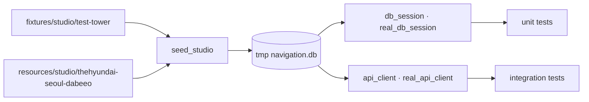

# `backend/tests` — 서버 검증

순수 함수·시드·검색 로직을 빠르게 확인하는 단위 테스트와 실제 FastAPI·임시 SQLite를
통과하는 통합 테스트를 분리한다.

## 문서 목차

| 경로 | 역할 |
|---|---|
| [`unit/`](unit/README.md) | 좌표·타일·검색·시드 변환의 작은 단위 검증 |
| [`integration/`](integration/README.md) | FastAPI endpoint, DB, 전체 그래프·타일·실데이터 스모크 |
| [`fixtures/`](fixtures/README.md) | 값 단언용 합성 Studio 데이터 |
| [`conftest.py`](conftest.py) | 임시 SQLite, Session, TestClient, 합성/실데이터 fixture |

## 픽스처 흐름



- 합성 fixture는 값이 고정되어 정확한 응답을 단언한다.
- 실데이터 fixture는 편집될 수 있으므로 개수보다 참조 무결성·기본 불변식을 확인한다.
- `create_app()`의 DB 의존성만 임시 Session으로 override해 운영 라우터 구성을 그대로 쓴다.

## 실행

`backend/`에서:

```text
python -m pytest
python -m pytest tests/unit -q
python -m pytest tests/integration -q
```

## 실패 지점

- 로컬 개발 DB를 테스트에 직접 쓰면 테스트 순서와 개인 데이터에 따라 결과가 달라진다.
- `dependency_overrides`를 테스트 뒤 비우지 않으면 다음 TestClient가 이전 DB를 본다.
- 실데이터의 매장 수·ID 전체를 고정하면 정상적인 데이터 보정도 실패로 판단한다.
- 단위 테스트에서 HTTP 상태 코드까지 검증하거나 통합 테스트에서 내부 helper만 호출하지 않는다.

---

> **다음 읽기:** [`tests/fixtures` — 결정적인 합성 입력](fixtures/README.md)
