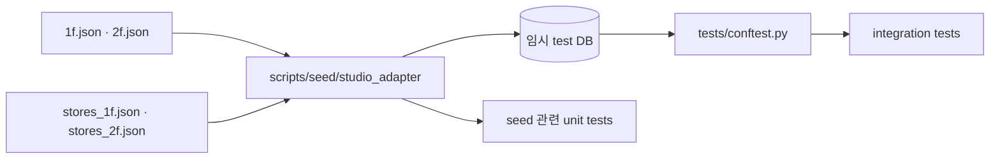

# `tests/fixtures` — 결정적인 합성 입력

실데이터 변경과 무관하게 API 결과를 정확히 단언할 수 있도록 만든 작은 Studio 데이터다.
현재 `studio/test-tower`가 두 층과 수직 이동 연결을 제공한다.

## 구조

```text
fixtures/
└── studio/
    └── test-tower/
        ├── 1f.json
        ├── 2f.json
        ├── stores_1f.json
        └── stores_2f.json
```

## 테스트 공급 관계



## fixture 설계 원칙

- 실제 Studio 스키마와 같은 필드·좌표계를 사용한다.
- 층별 node·edge·store ID는 작고 사람이 추적 가능하게 유지한다.
- store 입구, 양방향 edge, 층 순서, 엘리베이터 전이를 최소 데이터로 표현한다.
- 새로운 실패 조건을 추가할 때 기존 값의 의미를 바꾸기보다 필요한 최소 사례를 덧붙인다.

## 실패 지점

- fixture를 실데이터의 축소 복사본으로 만들면 원본 갱신 때 함께 흔들린다.
- 테스트를 통과시키기 위해 비현실적인 필드를 넣으면 adapter 계약을 잘못 검증한다.
- JSON node ID를 바꾸고 edge·store 참조를 함께 바꾸지 않으면 시드 단계부터 실패한다.
- 실제 데이터에만 있는 문제는 이 fixture가 아니라 `real_*` 스모크 fixture로 검증한다.

---

> **다음 읽기:** [`tests/unit` — 순수 로직과 작은 경계 검증](../unit/README.md)
