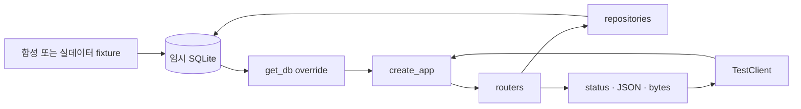

# `tests/integration` — FastAPI·DB 통합 검증

시드된 임시 SQLite와 실제 `create_app()` 라우터 구성을 사용해 HTTP 계약부터 repository,
ORM, 좌표 변환까지 이어지는 경로를 확인한다.

## 테스트 영역

| 영역 | 주요 파일 |
|---|---|
| 앱·건물·매장 | `test_api.py`, `test_store_api.py`, `test_seed.py` |
| 층/건물 그래프 | `test_floor_graph.py`, `test_building_graph.py`, `test_multi_floor.py` |
| 자연어 질의 | `test_queries.py`, `test_query_api.py`, `test_query_semantic_smoke.py` |
| 지도 타일 | `test_tiles.py` |
| 실데이터 | `test_real_data_smoke.py` |

## 요청 검증 흐름



## 합성 데이터와 실데이터

- 기본 `api_client`는 `test-tower`를 사용해 ID·층 순서·edge 수 같은 값을 정확히 단언한다.
- `real_api_client`는 더현대 데이터를 사용해 전 층 적재와 참조 무결성을 스모크 검증한다.
- 의미 모델이 없거나 로드에 실패해도 경량 검색 API는 계속 동작하는지 분리해 본다.

## 실패 지점

- endpoint 결과만 확인하고 DB 의존성 override를 빼먹으면 로컬 `navigation.db`를 읽을 수 있다.
- 층별 그래프와 건물 전체 그래프를 혼동하면 수직 전이 포함 여부를 잘못 단언한다.
- 타일은 JSON이 아니라 bytes와 media type을 확인해야 한다.
- 실데이터 테스트는 정확한 매장 수보다 node/edge/store 참조와 필수 필드를 검증한다.

## 실행

```text
python -m pytest tests/integration -q
```

---

> **백엔드 구조 읽기 완료.** 전체 목차로 돌아가려면 [`backend/README.md`](../../README.md)를 본다.
