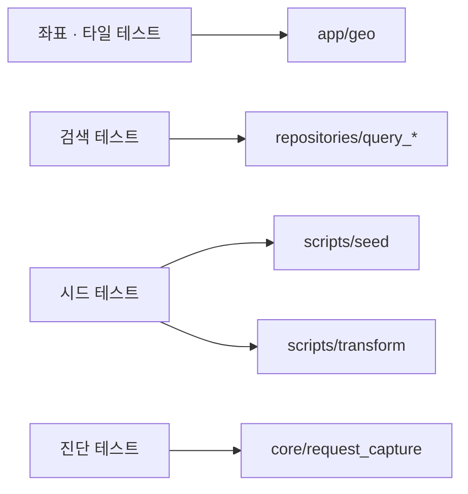

# `tests/unit` — 순수 로직과 작은 경계 검증

HTTP 요청 전체를 띄우지 않고 함수·변환·진단 수명주기를 좁게 검증한다. 필요한 경우
임시 DB Session을 쓰지만 endpoint 계약은 integration 테스트에 맡긴다.

## 테스트 영역

| 영역 | 주요 파일 |
|---|---|
| 좌표·타일 | `test_georeference.py`, `test_tiling.py`, `test_floor_alignment.py` |
| 질의 | `test_query_search.py`, `test_query_morph.py`, `test_query_ai.py`, `test_query_coverage.py` |
| 시드·변환 | `test_seed_navigation.py`, `test_studio_adapter_edges.py`, `test_vertical_transfers.py`, `test_reset_and_seed.py` |
| 진단 | `test_request_capture.py` |

## 코드 관계



## 작성 기준

- 하나의 실패 원인을 설명하는 최소 입력을 사용한다.
- 실제 `query_synonyms.json` 같은 계약 리소스 의존은 테스트 상단에 명시한다.
- 시간·파일·모델·DB는 monkeypatch 또는 임시 경로로 경계를 고정한다.
- FAISS 모델 자체보다 “언제 의미 검색으로 넘어가는가” 같은 라우팅 규칙을 우선 검증한다.

## 실패 지점

- private helper의 현재 구현 순서만 고정하면 안전한 refactor도 막는다.
- 실제 Hugging Face 다운로드가 단위 테스트에서 일어나면 느리고 네트워크에 의존한다.
- 부동소수 좌표를 완전 일치로 비교하면 플랫폼 차이에 취약하다.
- 변환 테스트가 출력 일부만 보고 node/edge 참조 무결성을 놓치지 않게 한다.

## 실행

```text
python -m pytest tests/unit -q
```

---

> **다음 읽기:** [`tests/integration` — FastAPI·DB 통합 검증](../integration/README.md)
