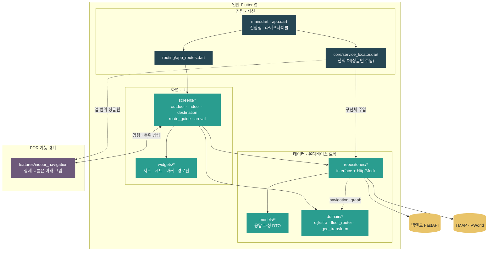
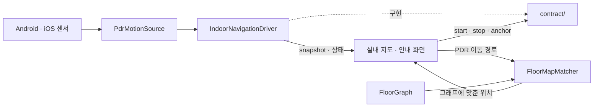
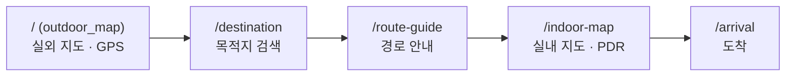
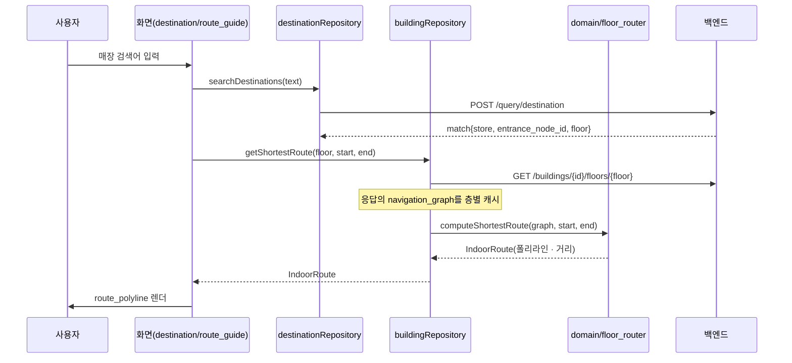

# `client` — Flutter 앱 구조

실외(GPS·지도)에서 실내(층 지도·경로 안내)까지 이어지는 내비게이션 앱. **백엔드는
그래프·매장·지도 데이터만 주고, 최단 경로 계산과 실내 측위(PDR)는 앱이 온디바이스로**
수행한다. 서버 왕복 없이 이미 받아둔 그래프로 즉시 반응하기 위해서다.

> 실행법은 루트 [README](../README.md)·[로컬 개발 가이드](../docs/guide/local-development-guide.md).
> 이 문서는 `lib/` 코드 구조를 설명한다. 각 주요 디렉터리는 자체 `README.md`에
> 역할·구성 파일·의존 경계·실패 지점·자주 하는 작업을 더 자세히 적는다.

## Getting Started

This project is a starting point for a Flutter application.

A few resources to get you started if this is your first Flutter project:

- [Learn Flutter](https://docs.flutter.dev/get-started/learn-flutter)
- [Write your first Flutter app](https://docs.flutter.dev/get-started/codelab)
- [Flutter learning resources](https://docs.flutter.dev/reference/learning-resources)

For help getting started with Flutter development, view the
[online documentation](https://docs.flutter.dev/), which offers tutorials,
samples, guidance on mobile development, and a full API reference.

## 문서 목차

| 디렉토리 | 역할 |
|---|---|
| [`main.dart`](lib/main.dart) · [`app.dart`](lib/app.dart) | 진입점. 앱 라이프사이클(백/포그라운드 → PDR 세션 제어) |
| [`core/`](lib/core/README.md) | 전역 배선. DI 싱글턴, API 주소·키·데모 건물 |
| [`routing/`](lib/routing/README.md) | 화면 경로 이름과 `MaterialApp` 등록 규칙 |
| [`screens/`](lib/screens/README.md) | 실외·실내 지도, 목적지 검색, 경로 안내, 도착, 디버그 화면 |
| [`widgets/`](lib/widgets/README.md) | 지도·경로선·검색 시트·마커·공통 바 |
| [`features/`](lib/features/README.md) | 독립 기능 목차: PDR 실내 측위와 지도/PDR 개발 진단 |
| ↳ [`indoor_navigation/`](lib/features/indoor_navigation/README.md) | PDR 계약·컨트롤러·맵 매칭·플랫폼 센서·진단 |
| ↳ [`debug_mode/`](lib/features/debug_mode/README.md) | 개발용 지도 오버레이·보정·PDR 흔적·설정 시트 |
| [`repositories/`](lib/repositories/README.md) | 백엔드·외부 API 접근: 인터페이스 + `Http`/`Mock` 구현 |
| [`models/`](lib/models/README.md) | 백엔드 응답·화면 데이터를 표현하는 Dart 모델 |
| [`domain/`](lib/domain/README.md) | 온디바이스 최단 경로·경로선·좌표 변환 |
| [`state/`](lib/state/README.md) | 앱에서 유지하는 사용자 상태(즐겨찾기) |
| [`theme/`](lib/theme/README.md) | 색상·간격·공통 `ThemeData` |

## 처음 읽는 순서

처음 보는 사람은 아래 순서대로 읽는다. 각 문서 맨 아래의 **다음 읽기** 링크가 이 순서를
그대로 이어 주므로, 목차로 돌아오지 않아도 된다.

```text
client README
→ core → routing → models → domain → repositories
→ state → theme → widgets → screens
→ features → indoor_navigation
→ contract → platform → application → debug → debug_mode
```

## 디렉터리 구조

```text
client/
├── lib/
│   ├── main.dart                     # Flutter 진입점
│   ├── app.dart                      # MaterialApp·라우트·앱 lifecycle
│   ├── core/                         # 실행 설정과 전역 의존성 조립
│   ├── routing/                      # named route 상수
│   ├── screens/                      # 사용자 흐름을 조립하는 화면
│   ├── widgets/                      # 재사용 UI와 지도 렌더링
│   ├── features/                     # 독립 기능 목차
│   │   ├── indoor_navigation/        # PDR 계약·세션·맵 매칭·센서·진단
│   │   └── debug_mode/               # 지도/PDR 개발 overlay
│   ├── repositories/                 # 백엔드·외부 API·Mock 접근 경계
│   ├── models/                       # JSON·화면 데이터 모델
│   ├── domain/                       # 최단 경로·좌표 변환
│   ├── state/                        # 지속되는 사용자 상태
│   └── theme/                        # 공통 시각 규칙
├── assets/mock/                      # 오프라인·테스트용 건물/층 데이터
├── test/                             # 단위·위젯 테스트
├── integration_test/                 # 실기기 통합 테스트
├── android/ · ios/ · web/ ...        # Flutter 플랫폼별 runner
└── pubspec.yaml                      # 의존성·asset 등록
```

## 앱 계층 의존 (큰 그림)

일반 앱 구조에서는 PDR을 하나의 기능 경계로만 표시한다. 센서·컨트롤러·맵 매칭처럼
PDR 안에서 일어나는 흐름은 바로 다음 작은 그림에서 따로 확대한다.



일반 앱 구조의 핵심은 두 가지다.

- **화면은 백엔드를 직접 모른다.** `repositories/`(인터페이스)만 알고, 실제 HTTP는
  `Http*Repository`가 담당한다. `core/service_locator.dart`가 어떤 구현을 쓸지 한 곳에서 주입한다.
- **경로 계산은 `domain/`이 온디바이스로 한다.** 리포지토리가 받아온 `navigation_graph`를
  `domain/floor_router`(→ `dijkstra`)에 넘겨 경로를 만든다. 서버는 그래프만 준다.

## PDR 내부 흐름 (작은 그림)

PDR은 일반 앱의 리포지토리·화면 구조와 분리된 센서 세션이다. 화면은 공개 계약으로
명령을 보내고 상태를 구독하며, 플랫폼별 센서 이벤트와 맵 매칭 내부 구현은 직접 알지 않는다.



상세한 세션 수명주기·보정·실패 조건은
[`features/indoor_navigation/README.md`](lib/features/indoor_navigation/README.md)에 정리되어 있다.

## 전형적 사용자 여정 (라우트)



`map_shell`이 지도 화면 셸을 감싸고, `screens/debug/*`는 개발용(헬스체크·층지도 미리보기·PDR 테스트)이다.

## 목적지 검색 → 경로 안내 데이터 흐름



## 백엔드·외부 연동 지점

| 리포지토리 | 대상 | 사용 API |
|---|---|---|
| `HttpBuildingRepository` | 백엔드 | `GET /buildings`, `/floors/{floor}`(지도+`navigation_graph`), `/floors/{floor}/graph` |
| `HttpDestinationRepository` | 백엔드 | `POST /query/destination` (경량 검색) |
| `TmapDirectionsRepository` | TMAP | 실외 보행자 경로 |
| `Mock*Repository` | 없음 | 오프라인·위젯 테스트용 대체 구현 |

## DI · 교체 패턴 (`core/service_locator.dart`)

전역 변수로 싱글턴을 주입하고, **테스트·오프라인에서는 그 변수만 Mock으로 교체**한다.

- `buildingRepository = HttpBuildingRepository()` — 오프라인 확인 시 `MockBuildingRepository()`로.
- `destinationRepository = MockDestinationRepository(...)` — 현재 Mock. 백엔드 검색을 붙이려면 `HttpDestinationRepository`로.
- `directionsRepository` — `--dart-define=TMAP_APP_KEY=…`가 있으면 실제 TMAP, 없으면 직선 Mock.
- `pdrMotionSource` / `indoorNavigationDriver` — 화면이 바뀌어도 센서 세션을 유지하는 싱글턴.

API 주소는 `core/api_config.dart`가 플랫폼별 기본값을 고르고(`--dart-define=API_BASE_URL=…`로 덮어씀).

## 온디바이스로 도는 것 (서버에 없음)

- **경로 계산**: `domain/dijkstra.dart`(최단 경로) + `domain/floor_router.dart`(→ 지도용 폴리라인).
- **좌표 변환**: `domain/geo_transform.dart`(`local_m` ↔ WGS84).
- **실내 측위(PDR)**: `features/indoor_navigation/`. 기기 센서로 위치를 추정해 지도 마커·경로에 반영.

## 현재 상태 / 남은 연동

- **목적지 검색은 `/query/destination`(경량)만 사용**한다. FAISS 자연어(`/query/ai`)는 백엔드에
  있으나 미연동 → [AI 질의 인수인계](../docs/backend/native/client-handoff.md).
- **경로는 단일 층 안에서만** 계산된다(`getShortestRoute`가 층별 그래프 사용). 층 간 이동
  (엘리베이터·에스컬레이터)은 미연동 → [층 간 라우팅 인수인계](../docs/backend/navigate/client-handoff.md).

## 자주 하는 작업

| 하고 싶은 것 | 위치 |
|---|---|
| API 주소 바꾸기 | `--dart-define=API_BASE_URL=…` (또는 `core/api_config.dart`) |
| Mock ↔ 실제 백엔드 전환 | `core/service_locator.dart`의 리포지토리 변수 |
| 화면·라우트 추가 | `screens/` + `routing/app_routes.dart` |
| 백엔드 응답 파싱 | `models/` |
| 경로/좌표 로직 | `domain/` |
| 실내 측위(PDR) 손보기 | `features/indoor_navigation/` |

---

> **다음 읽기:** [`lib/core` — 앱 설정과 전역 배선](lib/core/README.md)
