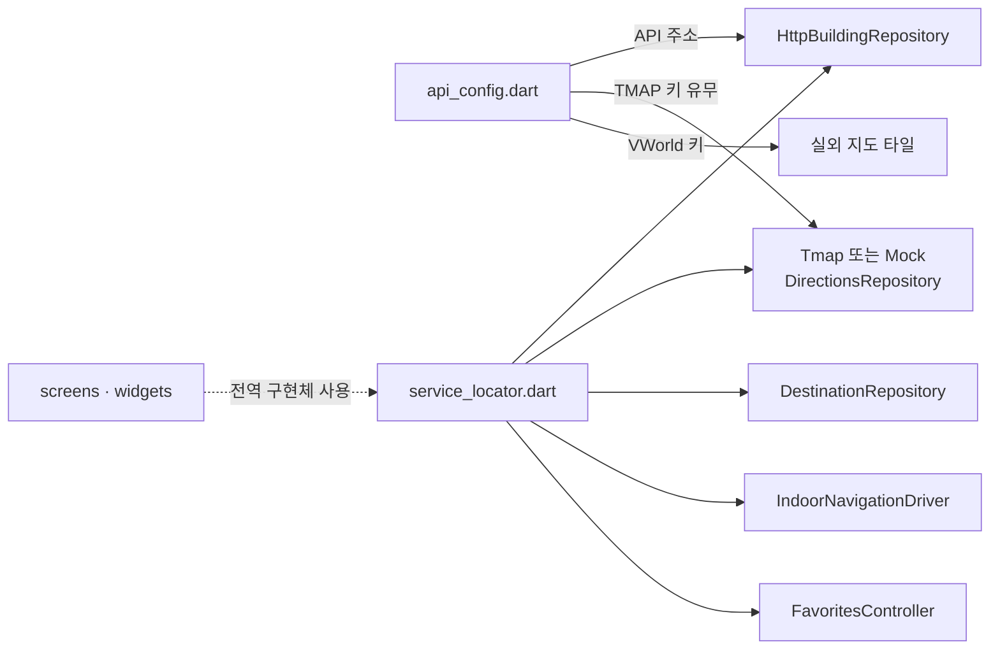

# `lib/core` — 앱 설정과 전역 배선

앱 전체가 공유하는 실행 설정과 구현체 조립을 한곳에 둔다. 화면이나 도메인 규칙을
구현하는 계층이 아니라, **어떤 서버·외부 API·센서·리포지토리를 사용할지 결정하는
조립 지점**이다.

## 구성 파일

| 파일 | 역할 | 주요 항목 |
|---|---|---|
| [`api_config.dart`](api_config.dart) | 실행 환경 설정 | `apiBaseUrl`, `demoBuildingId`, `tmapAppKey`, `vworldApiKey` |
| [`service_locator.dart`](service_locator.dart) | 앱 전역 의존성 조립 | 리포지토리, PDR 드라이버, 위치 스트림, 권한 요청, 즐겨찾기 |

## 설정 우선순위

`apiBaseUrl`은 다음 순서로 정해진다.

1. `--dart-define=API_BASE_URL=...`
2. Android 에뮬레이터: `http://10.0.2.2:8001`
3. 웹·데스크톱·iOS 시뮬레이터: `http://localhost:8001`

TMAP·VWorld 키도 소스에 넣지 않고 `TMAP_APP_KEY`, `VWORLD_API_KEY`로 주입한다.
TMAP 키가 없으면 `directionsRepository`는 직선 경로를 만드는 Mock을 사용한다.

## 전역 조립

- `buildingRepository`와 `destinationRepository`는 테스트에서 교체할 수 있어 `final`이 아니다.
- `destinationRepository`는 현재 `MockDestinationRepository`다. 실제 경량 검색을 붙일 때
  `HttpDestinationRepository`로 바꾼다.
- `pdrMotionSource`와 `indoorNavigationDriver`는 화면 전환 중에도 측위 세션이 유지되도록
  앱 범위 싱글턴이다.
- 권한 요청과 GPS 스트림도 함수 변수로 노출해 플랫폼 채널이 없는 테스트에서 가짜 구현으로 바꾼다.

## 실패 지점

- 실기기에서 `10.0.2.2`는 호스트 PC를 가리키지 않는다. `API_BASE_URL`에 LAN 주소를
  주거나 Android에서는 `adb reverse`를 사용해야 한다.
- `buildingRepository`만 Mock으로 바꾸고, 기존 인스턴스를 감싼
  `destinationRepository`를 다시 만들지 않으면 서로 다른 데이터 소스를 본다.
- 키가 비어 있을 때 TMAP이 조용히 Mock으로 바뀌므로, 실제 API 검증에서는 실행 인자를 확인한다.
- 여기에 화면별 상태나 경로 계산 규칙을 넣으면 전역 결합이 커진다. 계산은 `domain/`,
  사용자 상태는 `state/`, 센서 세션은 `features/indoor_navigation/`에 둔다.

## 자주 하는 작업

| 하고 싶은 것 | 위치 |
|---|---|
| 백엔드 주소 변경 | `--dart-define=API_BASE_URL=...` |
| 외부 API 키 주입 | `--dart-define=TMAP_APP_KEY=...`, `VWORLD_API_KEY=...` |
| 실제/Mock 리포지토리 전환 | `service_locator.dart` |
| 테스트에서 GPS·권한 대체 | `watchPosition`, `requestStartupPermissions` 교체 |

---

> **다음 읽기:** [`lib/routing` — 화면 경로 이름](../routing/README.md)
