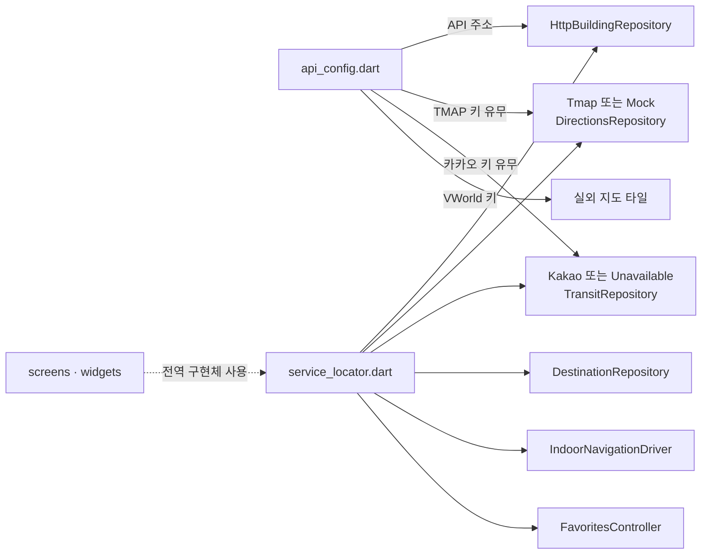

# `lib/core` — 앱 설정, 그리고 전역 배선

앱 전체가 공유하는 실행 설정을 둔다. **아무것도 import하지 않는 바닥 층**이라
어느 계층에서든 읽을 수 있다([계층 검사](../../test/lib_layer_direction_test.dart)).

## 구성 파일

| 파일 | 역할 | 주요 항목 |
|---|---|---|
| [`api_config.dart`](api_config.dart) | 실행 환경 설정 | `apiBaseUrl`, `demoBuildingId`, `tmapAppKey`, `kakaoRestApiKey`, `vworldApiKey` |
| [`tile_url.dart`](tile_url.dart) | 타일 URL 조립 | |
| [`single_flight.dart`](single_flight.dart) | 같은 작업이 겹쳐 도는 것을 막는다 | `SingleFlight` |

### 조립 지점은 여기가 아니라 [`lib/service_locator.dart`](../service_locator.dart)다

**한때 이 폴더에 있었다.** 그런데 그 파일은 repositories·features·state를 전부
import하므로, core에 두면 "바닥 층"이 위쪽을 보게 되어 순환이 생긴다. 조립 루트는
정의상 **가장 위**라 `lib/` 최상단(`app.dart`·`main.dart` 옆)이 맞는 자리다.

아래 문단들은 그 파일 이야기다 — 설정을 읽어 무엇을 조립하는지가 곧 설정의 의미라
한 문서에 둔다.

## 설정 우선순위

`apiBaseUrl`은 다음 순서로 정해진다.

1. `--dart-define=API_BASE_URL=...`
2. Android 에뮬레이터: `http://10.0.2.2:8001`
3. 웹·데스크톱·iOS 시뮬레이터: `http://localhost:8001`

외부 API 키도 소스에 넣지 않고 `TMAP_APP_KEY`, `KAKAO_REST_KEY`, `VWORLD_API_KEY`로
주입한다. TMAP 키로 보행자 경로와 POI 통합검색을, **대중교통만 카카오 키로** 호출한다
(TMAP 대중교통 무료 제공량이 하루 10건이라 옮겼다).

**대중교통은 두 키를 함께 쓴다.** 카카오는 첫 승차지점 앞·마지막 하차지점 뒤 도보를 주지
않아 그 두 구간을 `directionsRepository`(TMAP 보행자)로 채운다. 카카오 키만 있으면 경로가
정류장에서 시작해 정류장에서 끝난다.

키가 없으면 `directionsRepository`는 직선 경로를 만드는 Mock을,
`outdoorPoiRepository`·`transitRepository`는 **기능이 꺼진 구현**을 사용한다 — 뒤 둘은 Mock을
두지 않는다. 없는 가게·없는 버스를 지어내면 사용자를 실제로 그 좌표까지 걸어가게 만들기
때문이다.

값을 매번 명령줄에 적는 대신 `client/config.local.json`(gitignore 대상, 템플릿은 `config.example.json`)에 모아 두고
`flutter run --dart-define-from-file=config.local.json`으로 넘긴다. JSON의 키 이름은 위 `String.fromEnvironment` 이름과 같아야 한다.

## 전역 조립

```mermaid
flowchart LR
    CONFIG["api_config.dart"]
    LOCATOR["service_locator.dart"]

    CONFIG -->|"API 주소"| HTTP["HttpBuildingRepository"]
    CONFIG -->|"TMAP 키 유무"| DIRECTIONS["Tmap 또는 Mock<br/>DirectionsRepository"]
    CONFIG -->|"카카오 키 유무"| TRANSIT["Kakao 또는 Unavailable<br/>TransitRepository"]
    CONFIG -->|"VWorld 키"| MAP["실외 지도 타일"]

    LOCATOR --> HTTP
    LOCATOR --> DIRECTIONS
    LOCATOR --> TRANSIT
    LOCATOR --> DEST["DestinationRepository"]
    LOCATOR --> PDR["IndoorNavigationDriver"]
    LOCATOR --> STATE["FavoritesController"]

    UI["screens · widgets"] -. "전역 구현체 사용" .-> LOCATOR
```

- `buildingRepository`와 `destinationRepository`는 테스트에서 교체할 수 있어 `final`이 아니다.
- `destinationRepository`는 기본이 `HttpDestinationRepository`다(경량 `/query/destination`과
  탐색 `/query/ai`를 함께 쓴다). 오프라인·테스트에서만 `MockDestinationRepository`로 바꾼다.
- `pdrMotionSource`와 `indoorNavigationDriver`는 화면 전환 중에도 측위 세션이 유지되도록
  앱 범위 싱글턴이다.
- 권한 요청과 GPS 스트림도 함수 변수로 노출해 플랫폼 채널이 없는 테스트에서 가짜 구현으로 바꾼다.

## 실패 지점

- 실기기에서 `10.0.2.2`는 호스트 PC를 가리키지 않는다. `API_BASE_URL`에 LAN 주소를
  주거나 Android에서는 `adb reverse`를 사용해야 한다.
- `buildingRepository`만 Mock으로 바꾸고, 기존 인스턴스를 감싼
  `destinationRepository`를 다시 만들지 않으면 서로 다른 데이터 소스를 본다.
- 키가 비어 있을 때 TMAP이 조용히 Mock으로 바뀌므로, 실제 API 검증에서는 실행 인자를 확인한다.
- 여기에 화면별 상태나 경로 계산 규칙을 넣으면 전역 결합이 커진다. 계산은 `domain/`,
  사용자 상태는 `state/`, 센서 세션은 `features/indoor_navigation/`, 지도 색·라벨은
  `map/`에 둔다. **이 규칙은 한 번 지켜지지 않았다** — 지도 스타일 18개가 `core/map/`에
  쌓여 있었고, 그러다 라벨 계산이 화면을 import하는 화살표까지 생겼다.

## 자주 하는 작업

| 하고 싶은 것 | 위치 |
|---|---|
| 백엔드 주소 변경 | `--dart-define=API_BASE_URL=...` |
| 외부 API 키 주입 | `--dart-define=TMAP_APP_KEY=...`, `KAKAO_REST_KEY=...`, `VWORLD_API_KEY=...` |
| 실제/Mock 리포지토리 전환 | `service_locator.dart` |
| 테스트에서 GPS·권한 대체 | `watchPosition`, `requestStartupPermissions`, `isPedometerPermissionGranted` 교체 |

권한 요청은 **하나씩 순서대로** 한다(`defaultRequestStartupPermissions`). `List<Permission>.request()`로
묶어 던지면 OS 다이얼로그가 연달아 겹쳐 떠서, 사용자가 첫 문구를 읽기 전에 다음 창을 마주한다.

---

> **다음 읽기:** [`lib/routing` — 화면 경로 이름](../routing/README.md)
