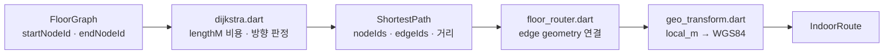

# `lib/domain` — 온디바이스 경로·좌표 계산

Flutter 화면이나 HTTP를 모르는 계산 계층이다. 백엔드가 제공한 그래프를 탐색해 경로를
만들고, 건물 로컬 좌표와 지도 좌표 사이를 변환한다.

## 구성 파일

| 파일 | 역할 | 주요 항목 |
|---|---|---|
| [`dijkstra.dart`](dijkstra.dart) | 가중 그래프 최단 경로 | `ShortestPath`, `dijkstra` |
| [`floor_router.dart`](floor_router.dart) | node/edge 경로를 지도용 경로점으로 변환 | `computeShortestRoute` |
| [`geo_transform.dart`](geo_transform.dart) | 2D affine 피팅·적용, PDR/층 좌표 연결 | `AffineTransform` |

## 단일 층 경로 계산

현재 `BuildingRepository.getShortestRoute` 계약은 층 하나를 받는다. 층 간 길찾기는
건물 전체 그래프, 수직 전이 간선, 층별 지도 조립을 함께 연결해야 하며 단일 층 함수에
임의로 섞지 않는다. 설계는
[`../../../docs/backend/navigate/client-handoff.md`](../../../docs/backend/navigate/client-handoff.md)를 참고한다.

## 의존 경계

- `domain`은 `screens`, `widgets`, `repositories`, HTTP를 import하지 않는다.
- 그래프·경로 값은 `models/`를 사용한다.
- `geo_transform.dart`는 PDR anchor 좌표 계약을 연결하지만 센서 세션은 소유하지 않는다.

## 실패 지점

- 시작/도착 node가 없거나 연결되지 않으면 경로가 없다. 가까운 node를 임의 선택하는 정책은 호출자가 정한다.
- edge 방향과 geometry 점 순서가 반대일 수 있으므로 이동 방향에 맞게 뒤집어야 한다.
- edge `lengthM`이 음수·비정상이면 Dijkstra 전제가 깨진다.
- 좌표 대응점이 부족하거나 거의 일직선이면 affine 피팅이 불안정하다.
- 층별 그래프만으로 수직 전이 edge를 찾을 수 없다.

## 검증 기준

- 시작과 도착이 같을 때 거리 0의 경로가 나온다.
- 단방향 edge는 역방향으로 통과하지 못한다.
- 선택된 edge 길이 합과 `IndoorRoute.distanceMeters`가 일치한다.
- 경로점의 첫·끝이 선택 node와 일치하고 WGS84 순서가 뒤바뀌지 않는다.

---

> **다음 읽기:** [`lib/repositories` — 데이터 접근 경계](../repositories/README.md)
