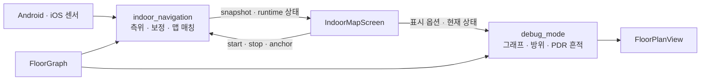

# `lib/features` — 독립 기능 모듈

일반 화면·리포지토리보다 독립적인 기능을 모은다. 현재는 실내 측위(PDR)와 이를
관찰하는 개발 진단 기능으로 나뉜다.

## 문서 목차

| 디렉터리 | 역할 |
|---|---|
| [`indoor_navigation/`](indoor_navigation/README.md) | PDR 공개 계약, 앱 범위 센서 세션, 맵 매칭, 플랫폼 구현, 실기기 진단 |
| [`debug_mode/`](debug_mode/README.md) | 지도 그래프·방위·PDR 흔적을 표시하는 개발용 UI와 상태 |

## 기능 관계

`indoor_navigation`은 운영 기능이고 `debug_mode`는 관찰 도구다. 디버그 모드를 꺼도
센서 입력, 보정, 맵 매칭, 경로 계산 결과가 달라지면 안 된다.

## 의존 경계

- 화면은 `indoor_navigation/contract`의 명령과 상태를 통해 PDR을 사용한다.
- Android/iOS 플러그인 차이는 `indoor_navigation/platform` 안에서 흡수한다.
- `debug_mode`는 PDR과 그래프의 결과를 표시하지만 PDR 세션을 소유하거나 수정하지 않는다.
- 일반 최단 경로 계산은 feature가 아니라 [`../domain/`](../domain/README.md)에 둔다.
- 백엔드·외부 API 접근은 [`../repositories/`](../repositories/README.md)에 둔다.

## 새 feature를 추가할 때

화면 하나에만 쓰이는 위젯 묶음은 `screens/` 또는 `widgets/`에 둔다. 자체 계약·상태·플랫폼
구현처럼 독립적인 수명주기와 경계를 가진 기능만 `features/`에 추가하고, 이 목차와 루트
[`client/README.md`](../../README.md)를 함께 갱신한다.

---

> **다음 읽기:** [`features/indoor_navigation` — PDR 실내 측위](indoor_navigation/README.md)
