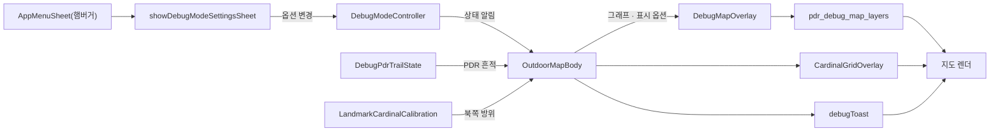

# `features/debug_mode` — 지도·PDR 개발 진단

운영 기능의 계산 결과를 바꾸지 않고, 개발 중 좌표·보정·PDR 상태를 화면에 겹쳐 보거나
기록하기 위한 도구다.

**진입점은 앱 메뉴 하나다** — 상단 바 햄버거 → `개발자` → `디버그 설정`
([`../../screens/map_shell/widgets/sheets/app_menu_sheet.dart`](../../screens/map_shell/widgets/sheets/app_menu_sheet.dart)). 예전에는 지도
왼쪽 아래에 원형 벌레 아이콘 버튼(`DebugModeSettingsButton`)이 떠 있었지만, 일반
사용자가 볼 이유가 없는 개발 도구가 메인 지도를 차지했고 야외에서는 실내 진입 오버레이
상태에 따라 나타났다 사라졌다. 그 버튼은 지웠다 — 지도에는 운영 화면만 남는다.

## 구성 파일

| 파일 | 역할 |
|---|---|
| [`debug_mode_controller.dart`](debug_mode_controller.dart) | 디버그 옵션 상태와 변경 알림 |
| [`debug_mode_sheet.dart`](debug_mode_sheet.dart) | 옵션 설정 UI(`showDebugModeSettingsSheet`) |
| [`debug_map_overlay.dart`](debug_map_overlay.dart) | 지도 위 진단 레이어 조립 |
| [`cardinal_grid_overlay.dart`](cardinal_grid_overlay.dart) | 방위·격자 표시 |
| [`landmark_cardinal_calibration.dart`](landmark_cardinal_calibration.dart) | 랜드마크 기준 방위 보정 계산 |
| [`debug_pdr_trail_state.dart`](debug_pdr_trail_state.dart) | PDR 이동 흔적 상태 |
| [`debug_toast.dart`](debug_toast.dart) | 개발 메시지 표시 |
| [`map_debug_chip.dart`](map_debug_chip.dart) | 지도 위 진단 한 줄 표시(`MapDebugChip`). 야외 지도의 GPS 실내 진입 판정 근거가 여기에 뜬다 |
| [`pdr_map_control.dart`](pdr_map_control.dart) | 디버그 모드에서 지도 위에 뜨는 진단 JSON 공유 버튼(`PdrMapControl`) |
| [`debug_mode.dart`](debug_mode.dart) | 외부 공개 진입점 |

## 연관 관계

```mermaid
flowchart LR
    MENU["AppMenuSheet(햄버거)"]
    SCREEN["OutdoorMapBody"]
    SHEET["showDebugModeSettingsSheet"]
    CONTROLLER["DebugModeController"]
    MAP["DebugMapOverlay"]
    GRID["CardinalGridOverlay"]
    TRAIL["DebugPdrTrailState"]
    CAL["LandmarkCardinalCalibration"]
    TOAST["debugToast"]
    VIEW["pdr_debug_map_layers"]
    RENDER["지도 렌더"]

    MENU --> SHEET -->|"옵션 변경"| CONTROLLER
    CONTROLLER -->|"상태 알림"| SCREEN
    TRAIL -->|"PDR 흔적"| SCREEN
    CAL -->|"북쪽 방위"| SCREEN
    SCREEN -->|"그래프 · 표시 옵션"| MAP
    MAP --> VIEW
    SCREEN --> GRID
    SCREEN --> TOAST
    VIEW --> RENDER
    GRID --> RENDER
    TOAST --> RENDER
```

## 경계

- 디버그 모드가 꺼져 있을 때 운영 경로·위치 계산 결과가 달라지면 안 된다.
- 실제 PDR 세션과 맵 매칭은 `../indoor_navigation/`이 소유한다.
- 지도 렌더 연결은 `screens/outdoor_map/layers/pdr_debug_map_layers.dart`가 담당한다.

## 실패 지점

- overlay에서 좌표를 다시 변환하면 운영 마커와 진단점이 서로 다른 기준을 쓸 수 있다.
- 디버그 상태를 영구 저장하면 다음 실행의 화면을 예기치 않게 바꿀 수 있다. 진입점이
  메뉴 안으로 들어가 지도에 "켜져 있음" 표시가 없으므로, 켜 둔 사실은 앱 메뉴의 부제
  ("사용 중 · …")로만 드러난다.
- 많은 trail 점과 라벨을 매 프레임 다시 만들면 지도 성능 측정 자체를 왜곡한다.

## 자주 하는 작업

| 하고 싶은 것 | 위치 |
|---|---|
| 새 토글 추가 | controller 상태 → sheet UI → overlay 소비 순으로 연결 |
| 좌표 오차 확인 | cardinal grid와 PDR trail을 동시에 표시 |
| 센서 원본 기록 | `../indoor_navigation/debug/` 사용 |

---

> **클라이언트 구조 읽기 완료.** 전체 목차로 돌아가려면 [`client/README.md`](../../../README.md)를 본다.
