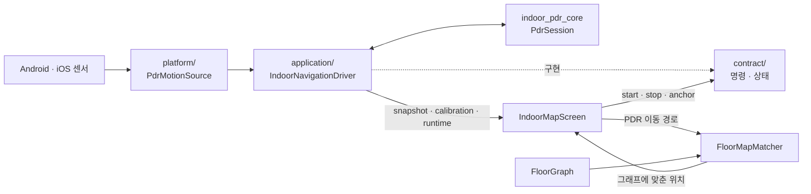

# `features/indoor_navigation` — PDR 실내 측위

기기 센서로 보행 위치를 추정하고 건물 `local_m` 그래프에 맞추는 기능이다. UI와 센서
플러그인 사이에 공개 계약을 두어 화면은 스트림과 명령만 알고, 플랫폼 이벤트 형식과
PDR 코어 내부는 직접 다루지 않는다.

## 디렉터리

| 디렉터리 | 역할 | 주요 파일 |
|---|---|---|
| [`contract/`](contract/README.md) | UI가 의존하는 읽기·명령·좌표 계약 | `indoor_navigation_contract.dart`, `pdr_anchor.dart`, `calibration_state.dart` |
| [`application/`](application/README.md) | 앱 범위 세션 제어와 그래프 맵 매칭 | `indoor_navigation_controller.dart`, `floor_map_matcher.dart` |
| [`platform/`](platform/README.md) | Android/iOS native 센서 이벤트 어댑터 | `pdr_motion_source.dart`, `android_pdr_motion_source.dart`, `ios_pdr_motion_source.dart` |
| [`debug/`](debug/README.md) | 실기기 harness, 세션 기록·공유, 기기 정보 | `pdr_device_harness.dart`, `pdr_debug_session_recorder.dart` |

## 데이터 흐름

## 세션 수명주기

- `startGuidance(floorId)`에서 센서와 새 pedometer 세션을 시작한다.
- 화면 전환만으로 세션을 중지하지 않는다.
- 앱 background에서는 pause하고 센서를 멈추며, foreground 복귀 시 resume한다.
- 층 변경은 pedometer와 보정 anchor를 새 층 기준으로 초기화한다.
- 안내 종료에서 마지막 pedometer 값을 확정한 뒤 센서를 멈춘다.

전역 인스턴스와 앱 lifecycle 연결은
[`../../core/service_locator.dart`](../../core/service_locator.dart)와
[`../../app.dart`](../../app.dart)가 담당한다.

## 보정

사용자가 지도 위치를 지정하면 `PdrAnchor`가 PDR 원점과 층 좌표를 연결한다. 센서 heading이
임의 기준이면 진행 방향을 한 번 더 받아 회전값을 확정한다. `FloorCoordinateTransform`이
이 anchor를 사용해 PDR 좌표를 층 `local_m`으로 바꾼다.

## 맵 매칭

`FloorMapMatcher`는 추정 위치를 `FloorGraph`의 edge 네트워크에 맞춘다. 추적 상태는
`tracking`, `suspect`, `recovered`로 구분해 순간적인 센서 튐을 바로 경로 이탈로 확정하지 않는다.

## 실패 지점

- 화면마다 드라이버를 만들면 센서 구독이 중복되고 화면 전환 때 보정이 사라진다.
- 층 변경 때 step counter를 재설정하지 않으면 이전 층 걸음이 새 층 위치에 누적된다.
- 센서 heading 좌표축과 지도 좌표축을 바로 빼면 회전·반전된 층에서 90°/180° 오차가 난다.
- native source 시작 실패는 `degraded` 상태로 표시해야 하며 UI를 무한 로딩에 두지 않는다.
- 맵 매칭 품질은 그래프 연결성과 좌표 정확도에 의존한다. PDR만 조정하기 전에 그래프를 확인한다.

## 검증

단위 테스트는 [`../../../test/features/indoor_navigation/`](../../../test/features/indoor_navigation/)에
있다. 실제 센서·플랫폼 채널은 [`../../../integration_test/pdr_device_smoke_test.dart`](../../../integration_test/pdr_device_smoke_test.dart)와
device harness로 별도 확인한다.

---

> **다음 읽기:** [`contract` — UI와 PDR의 공개 계약](contract/README.md)
