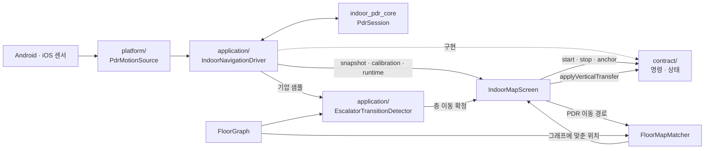

# `features/indoor_navigation` — PDR 실내 측위

기기 센서로 보행 위치를 추정하고 건물 `local_m` 그래프에 맞추는 기능이다. UI와 센서
플러그인 사이에 공개 계약을 두어 화면은 스트림과 명령만 알고, 플랫폼 이벤트 형식과
PDR 코어 내부는 직접 다루지 않는다.

## 디렉터리

| 디렉터리 | 역할 | 주요 파일 |
|---|---|---|
| [`contract/`](contract/README.md) | UI가 의존하는 읽기·명령·좌표 계약 | `indoor_navigation_contract.dart`, `pdr_anchor.dart`, `calibration_state.dart` |
| [`application/`](application/README.md) | 앱 범위 세션 제어와 그래프 맵 매칭 | `indoor_navigation_controller.dart`, `floor_map_matcher.dart` |
| [`platform/`](platform/README.md) | Android/iOS native 센서 이벤트 어댑터 | `pdr_motion_source.dart`, `android_pdr_motion_source.dart`, `ios_pdr_motion_source.dart` |
| [`debug/`](debug/README.md) | 실기기 harness, 세션 기록·공유, 기기 정보 | `pdr_device_harness.dart`, `pdr_debug_session_recorder.dart` |

## 데이터 흐름

```mermaid
flowchart LR
    SENSOR["Android · iOS 센서"]
    SOURCE["platform/<br/>PdrMotionSource"]
    DRIVER["application/<br/>IndoorNavigationDriver"]
    CORE["indoor_pdr_core<br/>PdrSession"]
    CONTRACT["contract/<br/>명령 · 상태"]
    UI["IndoorMapScreen"]
    MATCHER["FloorMapMatcher"]
    GRAPH["FloorGraph"]
    FLOORDET["application/<br/>EscalatorTransitionDetector"]

    SENSOR --> SOURCE --> DRIVER
    DRIVER <--> CORE
    DRIVER -. "구현" .-> CONTRACT
    UI -->|"start · stop · anchor"| CONTRACT
    DRIVER -->|"snapshot · calibration · runtime"| UI
    UI -->|"PDR 이동 경로"| MATCHER
    GRAPH --> MATCHER
    MATCHER -->|"그래프에 맞춘 위치"| UI
    DRIVER -->|"기압 샘플"| FLOORDET
    GRAPH --> FLOORDET
    FLOORDET -->|"층 이동 확정"| UI
    UI -->|"applyVerticalTransfer"| CONTRACT
```

## 세션 수명주기

- `startGuidance(floorId)`에서 센서와 새 pedometer 세션을 시작한다.
- 화면 전환만으로 세션을 중지하지 않는다.
- 에스컬레이터 층 이동이 확인되면 `applyVerticalTransfer`가 걸음 세션을 새로 열고 도착
  노드를 새 anchor로 놓는다(회전값은 물려받으므로 방향 재보정 없음).
- 앱 background에서는 pause하고 센서를 멈추며, foreground 복귀 시 resume한다.
- 층 변경은 pedometer와 보정 anchor를 새 층 기준으로 초기화한다.
- 안내 종료에서 마지막 pedometer 값을 확정한 뒤 센서를 멈춘다.

전역 인스턴스와 앱 lifecycle 연결은
[`../../core/service_locator.dart`](../../core/service_locator.dart)와
[`../../app.dart`](../../app.dart)가 담당한다.

## 보정

사용자가 지도 위치를 지정하면 `PdrAnchor`가 PDR 원점과 층 좌표를 연결한다. 센서 heading이
임의 기준이면 진행 방향을 한 번 더 받아 회전값을 확정한다. `FloorCoordinateTransform`이
이 anchor를 사용해 PDR 좌표를 층 `local_m`으로 바꾼다.

## 맵 매칭

원본 초록·주황 경로는 진단값으로 그대로 보존한다. 제품 현재 위치는
`CorridorTrackingSession`이 snapshot의 새 거리만 `CorridorPositionTracker`에 전달해
세션 상태로 누적한다. 직선에서는 현재 edge에 위치와 heading bias를 함께 수렴시키고,
교차로에서는 주황으로 회전 후보를 관찰한 뒤 초록 거리로 확인된 경우에만 연결 edge와
노드를 확정한다.

제품 위치는 자유 XY 적분값을 조금씩 당기는 방식이 아니라 현재 edge의 누적 진행거리로
계산한다. 따라서 보라색 경로는 항상 그래프 간선 위에 있다. 초록 배치가 늦는 동안에는
주황 tail을 연결 가능한 간선열에 임시 적분해 보라 점선과 현재 마커를 먼저 움직이되,
길안내 기준 위치와 보라 실선은 초록 거리로 후보가 검증될 때까지 바꾸지 않는다.

초록 배치가 간선 끝을 통과하면 해당 배치의 남은 걸음을 버리지 않고 `uncertain` 복구
증거로 이어서 사용한다. 복구 시에는 최근 걸음의 평균 heading 하나가 아니라 직진·회전
순서와 구간 길이를 최대 3개 연결 간선열과 비교한다. 방향 후보가 불명확하면 임시 점선만
표시하고 확정 경로는 유지하며, 연결되지 않은 노드로는 재획득하지 않는다.

`FloorMapMatcher`는 anchor 스냅과 기존 진단/호환 경로 계산에 남아 있지만, 제품 현재
위치를 정하기 위해 매 build마다 원본 경로 전체를 다시 계산하지 않는다.

## 층 따라가기 (에스컬레이터)

기압계로 층 이동을 감지해 도면·경로를 자동으로 바꾸고, 새 층의 에스컬레이터 **도착
노드**로 위치를 옮긴다. 판정은 `application/escalator_transition_detector.dart`가 하고,
근거 분담은 "노드 근접 = 허가, 기압 = 판정, 노드 이름 = 도착 층·지점"이다. 자세한 조건과
범위 한계(±1층 에스컬레이터만, 엘리베이터·계단 제외)는
[`application/README.md`](application/README.md)에 있다.

층 선택기로 다른 층을 훑어보는 것과 이 자동 전환은 **다른 사건**이다. 전자는 PDR 세션과
anchor를 건드리지 않고, 후자만 anchor를 새 층으로 옮긴다. 오탐 시 되돌릴 수 있도록 전환
직후 토스트에 "아니에요"를 띄우고 직전 층·anchor를 복원한다.

## 실패 지점

- 화면마다 드라이버를 만들면 센서 구독이 중복되고 화면 전환 때 보정이 사라진다.
- 층 변경 때 step counter를 재설정하지 않으면 이전 층 걸음이 새 층 위치에 누적된다.
- 센서 heading 좌표축과 지도 좌표축을 바로 빼면 회전·반전된 층에서 90°/180° 오차가 난다.
- native source 시작 실패는 `degraded` 상태로 표시해야 하며 UI를 무한 로딩에 두지 않는다.
- 맵 매칭 품질은 그래프 연결성과 좌표 정확도에 의존한다. PDR만 조정하기 전에 그래프를 확인한다.
- `uncertain`에서 가까운 노드를 임의로 선택하면 평행 복도·벽 너머 복도로 순간이동한다.
- 보라 점선은 저지연 임시 후보라 분기점에서 잠깐 다른 연결 간선을 가리킬 수 있지만, 초록 검증 전에는 길안내 위치로 사용하지 않는다.
- 기압 누적 변화량만으로 층을 바꾸면 기상 드리프트가 층 이동으로 확정된다. 상승 **속도**가 함께 필요하다.
- 기압계 없는 기기(Android 일부, iPhone 5s 이하)에서는 층 따라가기가 꺼진 채로 동작해야 한다.
- 도착 노드를 이름으로 못 찾았을 때 아무 에스컬레이터 노드로 폴백하면 조용히 틀린 위치가 된다.

## 검증

단위 테스트는 [`../../../test/features/indoor_navigation/`](../../../test/features/indoor_navigation/)에
있다. 실제 센서·플랫폼 채널은 [`../../../integration_test/pdr_device_smoke_test.dart`](../../../integration_test/pdr_device_smoke_test.dart)와
device harness로 별도 확인한다.

---

> **다음 읽기:** [`contract` — UI와 PDR의 공개 계약](contract/README.md)
