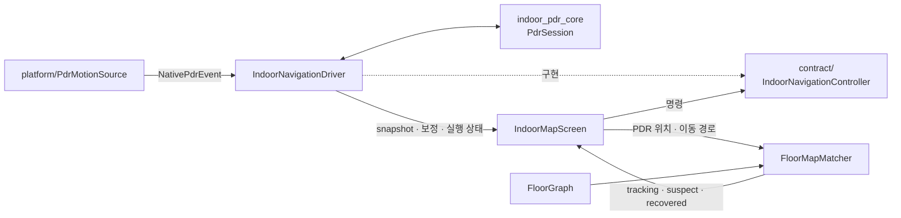

# `indoor_navigation/application` — PDR 세션과 맵 매칭

플랫폼 센서 이벤트를 PDR 코어에 전달해 앱 범위 세션을 운영하고, 화면이 만든 PDR 이동
경로를 층 그래프에 맞춘다. 두 파일은 같은 application 계층이지만 서로 직접 호출하지 않는다.

## 구성 파일

| 파일 | 역할 | 주요 타입 |
|---|---|---|
| [`indoor_navigation_controller.dart`](indoor_navigation_controller.dart) | 센서·PDR 코어·보정·앱 lifecycle을 소유하는 headless 세션 | `IndoorNavigationDriver` |
| [`floor_map_matcher.dart`](floor_map_matcher.dart) | PDR 위치·경로를 보행 가능한 `FloorGraph` edge에 맞춤 | `FloorMapMatcher`, `MapMatchedFloorPoint`, `MapMatchState` |

## 연관 관계

## `IndoorNavigationDriver`

- `startGuidance`가 센서 구독과 새 pedometer 세션을 시작한다.
- native 이벤트는 heading → acceleration peak → pedometer 순으로 `PdrSession`에 전달한다.
- `confirmAnchorByPin`과 `confirmAnchorByFloorDirection`이 PDR 좌표를 층 `local_m`에 고정한다.
- 앱 background/foreground에서는 세션을 폐기하지 않고 pause/resume한다.
- `changeFloor`는 step counter와 anchor를 새 층 기준으로 초기화한다.
- `stopGuidance`는 마지막 pedometer 값을 확정한 뒤 센서를 멈춘다.

## `FloorMapMatcher`

화면이 `FloorGraph`와 PDR 경로를 넘기면 가장 가까운 보행 edge 후보를 평가한다. 순간적인
튐을 곧바로 다른 edge로 확정하지 않고 복구 근거를 누적해 다음 상태를 반환한다.

| 상태 | 의미 |
|---|---|
| `tracking` | 기존 보행 네트워크를 정상 추적 |
| `suspect` | 갑작스러운 edge 전환 후보를 보류 |
| `recovered` | 충분한 근거로 새 edge 또는 연결 경로에 복귀 |

## 실패 지점

- 화면마다 `IndoorNavigationDriver`를 만들면 센서 구독이 중복되고 화면 전환 때 anchor가 사라진다.
- native 이벤트 순서를 바꾸면 heading과 걸음이 서로 다른 시점 기준으로 계산될 수 있다.
- 층 변경 때 pedometer를 reset하지 않으면 이전 층 걸음이 새 층에 누적된다.
- 그래프 edge가 끊겼거나 좌표가 다른 기준이면 matcher 조정만으로 해결할 수 없다.
- `IndoorNavigationDriver`에서 matcher까지 소유하면 화면의 현재 그래프·경로와 수명주기가 결합된다.

## 검증

- 세션·lifecycle: [`../../../../test/features/indoor_navigation/controller_test.dart`](../../../../test/features/indoor_navigation/controller_test.dart)
- 맵 매칭: [`../../../../test/features/indoor_navigation/floor_map_matcher_test.dart`](../../../../test/features/indoor_navigation/floor_map_matcher_test.dart)

---

> **다음 읽기:** [`debug` — PDR 실기기 진단과 기록](../debug/README.md)
