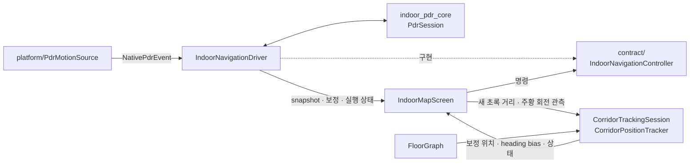

# `indoor_navigation/application` — PDR 세션과 맵 매칭

플랫폼 센서 이벤트를 PDR 코어에 전달해 앱 범위 세션을 운영하고, 원본 PDR과 분리된
제품 위치를 층 그래프 제약으로 지속 보정한다.

## 구성 파일

| 파일 | 역할 | 주요 타입 |
|---|---|---|
| [`indoor_navigation_controller.dart`](indoor_navigation_controller.dart) | 센서·PDR 코어·보정·앱 lifecycle을 소유하는 headless 세션 | `IndoorNavigationDriver` |
| [`floor_map_matcher.dart`](floor_map_matcher.dart) | PDR 위치·경로를 보행 가능한 `FloorGraph` edge에 맞춤 | `FloorMapMatcher`, `MapMatchedFloorPoint`, `MapMatchState` |
| [`corridor_position_tracker.dart`](corridor_position_tracker.dart) | 직선 위치·heading 보정과 교차로 회전 확정을 세션 상태로 유지 | `CorridorPositionTracker`, `CorridorTrackingState` |
| [`corridor_tracking_session.dart`](corridor_tracking_session.dart) | snapshot 누적값에서 새 관측만 tracker에 전달 | `CorridorTrackingSession` |
| [`guidance_trail_session.dart`](guidance_trail_session.dart) | 재탐색과 독립적으로 길안내 시작 이후 실제 보행 궤적을 누적 | `GuidanceTrailSession` |
| [`escalator_transition_detector.dart`](escalator_transition_detector.dart) | 기압 변화 + 에스컬레이터 노드 근접으로 층 이동 판정 | `EscalatorTransitionDetector`, `EscalatorTransition`, `EscalatorDetectorConfig` |
| [`escalator_node_naming.dart`](escalator_node_naming.dart) | 에스컬레이터 노드 이름에서 탑승/도착과 상대 층을 파싱 | `EscalatorNodeName`, `EscalatorDirection`, `EscalatorNodeRole` |
| [`indoor_location_estimate.dart`](indoor_location_estimate.dart) | GPS 기반 절대 추정점을 PDR과 별개로 보존·검증(아래 "GPS 추정점과 PDR의 결합") | `IndoorLocationEstimate`, `IndoorLocationEstimateController` |

## 연관 관계

```mermaid
flowchart LR
    SOURCE["platform/PdrMotionSource"]
    DRIVER["IndoorNavigationDriver"]
    CORE["indoor_pdr_core<br/>PdrSession"]
    CONTRACT["contract/<br/>IndoorNavigationController"]
    UI["IndoorMapScreen"]

    GRAPH["FloorGraph"]
    TRACKER["CorridorTrackingSession<br/>CorridorPositionTracker"]

    SOURCE -->|"NativePdrEvent"| DRIVER
    DRIVER <--> CORE
    DRIVER -. "구현" .-> CONTRACT
    UI -->|"명령"| CONTRACT
    DRIVER -->|"snapshot · 보정 · 실행 상태"| UI

    UI -->|"새 초록 거리 · 주황 회전 관측"| TRACKER
    GRAPH --> TRACKER
    TRACKER -->|"보정 위치 · heading bias · 상태"| UI
```

## `IndoorNavigationDriver`

- `startGuidance`가 센서 구독과 새 pedometer 세션을 시작한다.
- native 이벤트는 heading → acceleration peak → pedometer 순으로 `PdrSession`에 전달한다.
- `confirmAnchorByPin`과 `confirmAnchorByFloorDirection`이 PDR 좌표를 층 `local_m`에 고정한다.
- 앱 background/foreground에서는 세션을 폐기하지 않고 pause/resume한다. 이때는 native
  센서 구독도 함께 멈춘다.
- `pauseStepTracking`/`resumeStepTracking`은 **센서를 끄지 않고** 걸음 누적만 멈춘다.
  에스컬레이터 탑승 구간을 위한 것이라, 하차 판정의 근거인 기압과 방향은 계속 흘러야 한다.
- `changeFloor`는 step counter와 anchor를 새 층 기준으로 초기화한다.
- `stopGuidance`는 마지막 pedometer 값을 확정한 뒤 센서를 멈춘다.

## `CorridorPositionTracker`

원본 경로를 수정하지 않고 제품 위치만 다음 상태로 누적한다.

| 상태 | 의미 |
|---|---|
| `straightTracking` | 진행 방향을 잠근 채 edge의 누적 거리 위에서만 이동하고 heading bias를 최대 0.75°/걸음 보정 |
| `turnPending` | 최근 heading 변화로 시작된 주황 회전 후보를 초록 걸음별 방향·거리로 검증 |
| `nodeConfirmed` | 새 방향 1초·오차 20°·새 edge 1.5m를 만족해 노드를 체크포인트로 확정 |
| `uncertain` | 후보가 불명확하면 edge 끝을 넘지 않고, 기존 방향이나 연결 edge가 다시 안정되면 재획득 |

- 보정 위치는 항상 현재 edge의 `distanceAlongM`으로 계산해 간선 밖 자유 적분을 금지한다.
- 일직선으로 이어진 분할 edge는 체크포인트 확정 없이 남은 걸음 거리를 연속 전달한다.
- 결과는 방향을 **두 개** 내보낸다. `correctedHeadingDeg`는 잠긴 진행 방향의 edge 접선으로
  경로 진행·역주행 판정이 쓰고, `deviceHeadingDeg`는 센서 heading + 학습한 bias로 마커의
  방향 원뿔과 카메라 정렬이 쓴다. 하나로 합치면 안 된다 — edge 접선은 걸음이 있어야
  갱신되므로, 직선 복도에서 제자리 회전하면 화면의 방향이 얼어붙는다.
- 간선 전환은 공유 노드에서만 가능하므로 가까운 평행 간선이나 벽 너머 간선으로 직접 점프하지 않는다.

## `EscalatorTransitionDetector` — 기압으로 층 따라가기

에스컬레이터로 층을 옮기면 층 도면·경로를 자동으로 바꾸고, 새 층의 **도착 노드**로
위치를 옮긴다. 판정 역할 분담이 이 설계의 핵심이다.

| 근거 | 역할 |
|---|---|
| 에스컬레이터 노드 근접(반경 6m·유지 60초) | 판정 **허가**만. 방향은 정하지 않는다 — 한 랜딩에 상행 탑승/도착 노드가 1.5m 거리로 붙어 있어 둘 다 반경에 들어온다 |
| 기압(baseline 대비 Δ) | 올라갔는지 내려갔는지, 실제로 움직이는 중인지 |
| 노드 이름 `{그룹}-UP(TO3F)` / `{그룹}-UP(FR2F)` | 도착 층과 도착 노드 확정 |
| 활성 다층 경로의 전이 노드 ID | 붙어 있는 레인 중 길찾기가 선택한 정확한 탑승·도착 노드 유지 |

- 누적 Δ ≥ 1.8m이고 최근 5초 동안 반대 방향 튐 없이 같은 방향 변화가 3회 이상
  이어지면 **도면을 먼저 새 층으로 전환**한다.
  이때 사용자는 층 사이에 있으므로 마커는 새 층 도착 노드에 고정하고 `pauseStepTracking`
  으로 걸음 누적 자체를 멈춘다(에스컬레이터 진동이 걸음으로 세어지면 하차 지점이 통째로
  어긋난다). 상승·하강 배너를 함께 띄운다 — 마커가 안 움직이는 이유를 알려주지 않으면
  "앱이 멈췄다"로 읽힌다.
- 도면 전환은 전환 직전 카메라(중심·줌·bearing)를 새 층 뷰에 물려주고 짧은 페이드로 덮는다.
  같은 자리에 서서 층만 바뀌는 사건이므로 건물 전체 fit으로 되돌리면 보고 있던 확대 수준을
  잃는다. 층 선택기로 직접 고른 층은 반대로 낯선 층이라 기존처럼 전체 fit을 유지한다.
- 하차 판정은 저지연 고도 EMA를 별도로 쓴다. 수직 속도가 줄면서 첫 걸음이 들어오면 한 샘플,
  걸음이 없으면 저속 샘플 2회에 확정한다. 확정 시 pedometer를 새로 열어 전환 중 걸음이
  도착 노드에서 한꺼번에 튀지 않게 한다.
- 후보 고도가 되돌아가거나 타임아웃되면 조기 도면 전환도 원래 층·경로로 복구한다.
- **센서 주기 주의.** iOS `CMAltimeter` 실측 간격은 1069ms다. 평활 창이 2초였을 때 창 안에
  항상 2샘플만 들어와 최소 샘플 수(3)를 못 채워 **판정기가 한 번도 돌지 않았다**. 지금은 창
  4초에 더해 "최근 3샘플은 창과 무관하게 유지"를 함께 보장한다. 테스트도 1069ms 간격으로 돈다.
- **에스컬레이터에서 걸어도 된다.** 걸음 수는 확정 조건이 아니고, 계단과 구분하기 위한 사후
  분석용(`steps_during`)으로만 기록한다.
- 확정하면 `applyVerticalTransfer`가 걸음 세션을 새로 열고 도착 노드를 PDR 원점에 놓은
  **뒤에** `resumeStepTracking`으로 걸음 누적을 다시 켠다. 순서를 뒤집으면 탑승 중 걸음이
  새 층 원점에 붙는다.
  **회전값은 직전 anchor에서 물려받는다** — 같은 센서 세션이라 heading frame이 끊기지 않으므로
  사용자가 새 층에서 방향 보정을 다시 하지 않는다.
- 확정·거부 이벤트는 모두 디버그 JSON(`floor_transition_events`)에 남는다.
- 다층 길찾기는 단방향 전이 간선만 따라 같은 조건이면 현재 위치에서 가까운
  에스컬레이터를 선택한다. 판정 때는 그 정확한 탑승·도착 노드 ID를 우선하며,
  경로가 없는 경우에도 기압 방향과 같은 후보 중 가장 가까운 탑승 노드를 쓴다.
  도착 노드는 근접한 다른 레인으로 다시 추정하지 않는다.
- 기존 경로와 다른 에스컬레이터를 탔더라도 실제 도착 노드에서 같은 목적지까지 경로를
  다시 계산한다. 반 층 선전환 시점에 즉시 계산하므로 PDR 재활성화를 기다리지 않는다.
  수직 간선은 ETA에 포함하고, 두 층의 끝점을 잇는 파선으로 따로 표시한다.
- 앱 background/foreground 재구독 때 iOS `CMAltimeter` 실행 플래그를 함께 초기화한다.
  실행 중에도 4초 동안 샘플이 없으면 watchdog이 기압 스트림만 다시 시작한다.
- PDR 재개는 선전환과 분리한다. 누적 2.2m 이상에서 저지연 수직 속도가 줄어든
  첫 걸음 또는 저속 샘플 2회로 확정한다. 세션마다 달라지는 절대 고도나 고정 층고를
  쓰지 않고 같은 방향의 지속 변화로 층 이동을 판정한다.

## 안내 경로 진행과 재탐색

- 길안내 시작 이후 실제 graph-matched 보행 궤적은 별도 세션에 회색으로 누적하고,
  현재 투영점 이후의 안내 경로만 파란색으로 그린다. 재탐색은 파란 미래 경로만
  교체하므로 출발점부터 걸어온 회색선은 사라지지 않는다.
- 새 경로가 현재 위치에서 시작하면 진행률을 명시적으로 0m에 고정한 뒤 이후 걸음부터
  누적한다. 경로가 겹쳐도 재탐색 직후 전역 투영으로 뒷구간에 붙지 않는다.
- 이탈 문턱 안에서는 화면 마커만 수용된 파란 경로 투영점을 따른다. 센서 원본과 복도
  보정 결과는 수정하지 않으며, 이탈이 확정되면 실제 보정 위치로 돌아가 재탐색한다.
- 현재 간선이 안내 경로에 없다는 상태가 서로 다른 위치 갱신 3회이면서 2초 이상
  이어지면 같은 목적지를 유지한 채 현 위치에서 온디바이스 다익스트라를 다시 계산한다.
  한 네이티브 이벤트에 여러 걸음이 묶여도 한 번의 증거로만 센다.
- 안내 진행거리가 실제 걸음으로 설명할 수 있는 범위보다 크게 튀면 파란선과 다음 행동은
  마지막 정상 진행점에 유지한다. 걸음이 누적돼 이동량이 설명될 때만 새 진행점을 채택한다.
- **후퇴도 같은 기준으로 막는다.** 빔 1등 재배치나 초록·주황 보폭 차이로 진행거리가
  걸음 없이 2m 넘게 줄면 그 갱신은 보류한다. 실제로 되돌아 걷는 중이면 걸음이 쌓이면서
  곧 통과한다. 안내 중 마커는 이 진행점의 투영 좌표를 쓰므로, 이 억제가 곧 "마커가 뒤로
  튀지 않는다"와 같은 말이다.
- 하단 카드는 시간보다 다음 행동을 우선한다. 첫 의미 있는 회전을 찾아
  7m 이내는 `잠시 후`, 그 밖은 50m 미만 5m·이상 10m 단위로 반올림해 표시한다.
  회전이 없으면 같은 단위의 `N미터 직진`, 층 끝에서는
  `에스컬레이터/엘리베이터 탑승`을 크게 표시하고 시간·남은 거리는 보조 정보로 둔다.
- 다층 경로의 중간 세그먼트 끝은 목적지 도착으로 판정하지 않고 다음 층 이동 지점으로
  안내한다. `목적지 도착`은 마지막 세그먼트이면서 실제 목적지 층일 때만 허용한다.

**v1 범위 한계.** ±1층 에스컬레이터만 판정한다. 엘리베이터·연속 다층 이동(Δ ≥ 10m)은
층고를 추측해야 하므로 `multiFloorUnsupported`로 거부하고 로그만 남긴다. 더현대 실측
한 층(B2→B1) 상승이 6.2m라 거부선은 그보다 충분히 위에 있어야 한다. 계단은 데이터에
노드 타입이 없어 판정 대상이 아니다.

## GPS 추정점과 PDR의 결합

GPS 자동 진입 위치와 사용자 핀 이후 PDR 위치는 같은 값으로 취급하지 않는다.
`IndoorLocationEstimateController`가 GPS 기반 절대 추정점을 별도로 보존한다.

- 정확도 15m 이내 GPS가 층 통로에서 12m 이내면 실제 GPS 좌표를 통로에 투영한다.
- 조건을 통과하지 못하면 백엔드 건물 입구를 통로에 투영한 안전한 추정점으로 폴백한다.
- 실내 지도를 직접 열어도 최초 층 도면이 준비되면 권한 팝업 없이 GPS를 한 번 조회해
  같은 조건으로 추정점을 자동 생성한다. 위치 서비스·권한·5초 타임아웃·정확도·통로
  거리 중 하나라도 실패하면 임의 위치를 만들지 않고 기존 `위치 지정`을 남겨 둔다.
- 자동 추정점은 마커에 즉시 쓴다. 자북 기준 heading이 들어오면 짧은 안정화 대기 뒤
  수렴 플래그가 늦더라도 PDR 앵커로 결합한다. heading이 없거나 임의 기준이면 방향 선택
  모달을 자동으로 띄우지 않고 추정점만 유지한다. 수동으로 다른 층을 살펴보는 동작은
  자동 조회나 앵커 덮어쓰기를 다시 일으키지 않는다.
- 이 추정점은 PDR의 절대 시작 기준이며, PDR이 아직 없거나 그래프로 설명되지 않는 동안의
  임시 표시 위치다.
- GPS 추정점은 30초 뒤 만료되고 층을 바꾸지 않는다. 오래된 실내 GPS가 최신 PDR을
  입구로 끌어당기지 않게 하기 위한 제한이다.

## 실패 지점

- 화면마다 `IndoorNavigationDriver`를 만들면 센서 구독이 중복되고 화면 전환 때 anchor가 사라진다.
- 반대로 `CorridorTrackingSession`은 화면마다 따로 둔다. `IndexedStack`의 실내·야외 화면이
  하나를 공유하면 숨겨진 화면이 다른 그래프를 주입할 때마다 매처가 초기화되어 경로가 한 점으로
  사라지고, 다른 좌표계의 마지막 위치가 현재 도면 위에 표시된다.
- 층 전이 판정에 누적 변화량만 쓰면 기상 드리프트(5분에 3m)가 층 이동으로 확정된다. 이동
  **속도** 조건이 두 경우를 가른다.
- 활성 경로가 없을 때 도착 노드를 못 찾았다고 아무 에스컬레이터 노드로 폴백하면
  조용히 틀린 위치가 된다. 활성 경로에서는 보존한 정확한 도착 노드 ID를 쓰고,
  수동 이동만 이름의 그룹·방향 규칙으로 찾는다.
- native 이벤트 순서를 바꾸면 heading과 걸음이 서로 다른 시점 기준으로 계산될 수 있다.
- 층 변경 때 pedometer를 reset하지 않으면 이전 층 걸음이 새 층에 누적된다.
- 그래프 edge가 끊겼거나 좌표가 다른 기준이면 matcher 조정만으로 해결할 수 없다.
- 제품 위치를 build getter에서 원본 경로 전체로 다시 계산하면 세션의 edge·bias·회전 증거가 사라진다.
- 주황 후보만으로 edge를 바꾸면 휴대폰을 먼저 돌렸을 때 회전 위치가 노드보다 앞당겨진다.
- 센서 heading과 가까운 정·역방향을 매 걸음 다시 고르면 같은 edge에서도 진행 방향이 뒤집힌다.
- 불안정 구간에서 edge 투영을 끄면 교차로·회전 순간에 오히려 벽 내부로 이탈한다.
- 탑승 상태를 끝내는 경로를 하나라도 빠뜨리면(도착 노드 못 찾음, 사용자가 층 선택기로
  직접 이동 등) 배너가 남고 걸음 누적이 멈춘 채로 사용자가 복구할 방법이 없어진다.
  확정·취소·되돌리기·수동 층 선택이 모두 같은 종료 경로를 지나야 한다.

## 검증

- 세션·lifecycle: [`../../../../test/features/indoor_navigation/controller_test.dart`](../../../../test/features/indoor_navigation/controller_test.dart)
- 맵 매칭: [`../../../../test/features/indoor_navigation/floor_map_matcher_test.dart`](../../../../test/features/indoor_navigation/floor_map_matcher_test.dart)
- 복도 상태 보정: [`../../../../test/features/indoor_navigation/corridor_position_tracker_test.dart`](../../../../test/features/indoor_navigation/corridor_position_tracker_test.dart)
- 누적 회색 보행 궤적: [`../../../../test/features/indoor_navigation/guidance_trail_session_test.dart`](../../../../test/features/indoor_navigation/guidance_trail_session_test.dart)
- 층 전이 판정(합성 기압 시계열): [`../../../../test/features/indoor_navigation/escalator_transition_detector_test.dart`](../../../../test/features/indoor_navigation/escalator_transition_detector_test.dart)
- 노드 이름 파싱: [`../../../../test/features/indoor_navigation/escalator_node_naming_test.dart`](../../../../test/features/indoor_navigation/escalator_node_naming_test.dart)

---

> **다음 읽기:** [`debug` — PDR 실기기 진단과 기록](../debug/README.md)
