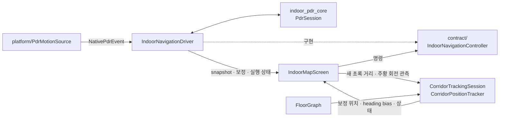

# `indoor_navigation/application` — PDR 세션과 맵 매칭

플랫폼 센서 이벤트를 PDR 코어에 전달해 앱 범위 세션을 운영하고, 원본 PDR과 분리된
제품 위치를 층 그래프 제약으로 지속 보정한다.

## 구성 파일

| 파일 | 역할 | 주요 타입 |
|---|---|---|
| [`indoor_navigation_controller.dart`](indoor_navigation_controller.dart) | 센서·PDR 코어·보정·앱 lifecycle을 소유하는 headless 세션 | `IndoorNavigationDriver` |
| [`floor_map_matcher.dart`](floor_map_matcher.dart) | PDR 위치·경로를 보행 가능한 `FloorGraph` edge에 맞춤 | `FloorMapMatcher`, `MapMatchedFloorPoint`, `MapMatchState` |
| [`corridor_position_tracker.dart`](corridor_position_tracker.dart) | 직선 위치·heading 보정과 교차로 회전 확정을 세션 상태로 유지 | `CorridorPositionTracker`, `CorridorTrackingState` |
| [`corridor_tracking_session.dart`](corridor_tracking_session.dart) | snapshot 누적값에서 새 관측만 tracker에 전달 | `CorridorTrackingSession` |

## 연관 관계

```mermaid
flowchart LR
    SOURCE["platform/PdrMotionSource"]
    DRIVER["IndoorNavigationDriver"]
    CORE["indoor_pdr_core<br/>PdrSession"]
    CONTRACT["contract/<br/>IndoorNavigationController"]
    UI["IndoorMapScreen"]

    GRAPH["FloorGraph"]
    TRACKER["CorridorTrackingSession<br/>CorridorPositionTracker"]

    SOURCE -->|"NativePdrEvent"| DRIVER
    DRIVER <--> CORE
    DRIVER -. "구현" .-> CONTRACT
    UI -->|"명령"| CONTRACT
    DRIVER -->|"snapshot · 보정 · 실행 상태"| UI

    UI -->|"새 초록 거리 · 주황 회전 관측"| TRACKER
    GRAPH --> TRACKER
    TRACKER -->|"보정 위치 · heading bias · 상태"| UI
```

## `IndoorNavigationDriver`

- `startGuidance`가 센서 구독과 새 pedometer 세션을 시작한다.
- native 이벤트는 heading → acceleration peak → pedometer 순으로 `PdrSession`에 전달한다.
- `confirmAnchorByPin`과 `confirmAnchorByFloorDirection`이 PDR 좌표를 층 `local_m`에 고정한다.
- 앱 background/foreground에서는 세션을 폐기하지 않고 pause/resume한다.
- `changeFloor`는 step counter와 anchor를 새 층 기준으로 초기화한다.
- `stopGuidance`는 마지막 pedometer 값을 확정한 뒤 센서를 멈춘다.

## `CorridorPositionTracker`

원본 경로를 수정하지 않고 제품 위치만 다음 상태로 누적한다.

| 상태 | 의미 |
|---|---|
| `straightTracking` | 진행 방향을 잠근 채 edge의 누적 거리 위에서만 이동하고 heading bias를 최대 0.75°/걸음 보정 |
| `turnPending` | 최근 heading 변화로 시작된 주황 회전 후보를 초록 걸음별 방향·거리로 검증 |
| `nodeConfirmed` | 새 방향 1초·오차 20°·새 edge 1.5m를 만족해 노드를 체크포인트로 확정 |
| `uncertain` | 후보가 불명확하면 edge 끝을 넘지 않고, 기존 방향이나 연결 edge가 다시 안정되면 재획득 |

- 보정 위치는 항상 현재 edge의 `distanceAlongM`으로 계산해 간선 밖 자유 적분을 금지한다.
- 일직선으로 이어진 분할 edge는 체크포인트 확정 없이 남은 걸음 거리를 연속 전달한다.
- 표시 heading은 잠긴 진행 방향의 edge 접선을 사용하고 센서 heading·bias는 후보 판단용으로 보존한다.
- 간선 전환은 공유 노드에서만 가능하므로 가까운 평행 간선이나 벽 너머 간선으로 직접 점프하지 않는다.

## 실패 지점

- 화면마다 `IndoorNavigationDriver`를 만들면 센서 구독이 중복되고 화면 전환 때 anchor가 사라진다.
- native 이벤트 순서를 바꾸면 heading과 걸음이 서로 다른 시점 기준으로 계산될 수 있다.
- 층 변경 때 pedometer를 reset하지 않으면 이전 층 걸음이 새 층에 누적된다.
- 그래프 edge가 끊겼거나 좌표가 다른 기준이면 matcher 조정만으로 해결할 수 없다.
- 제품 위치를 build getter에서 원본 경로 전체로 다시 계산하면 세션의 edge·bias·회전 증거가 사라진다.
- 주황 후보만으로 edge를 바꾸면 휴대폰을 먼저 돌렸을 때 회전 위치가 노드보다 앞당겨진다.
- 센서 heading과 가까운 정·역방향을 매 걸음 다시 고르면 같은 edge에서도 진행 방향이 뒤집힌다.
- 불안정 구간에서 edge 투영을 끄면 교차로·회전 순간에 오히려 벽 내부로 이탈한다.

## 검증

- 세션·lifecycle: [`../../../../test/features/indoor_navigation/controller_test.dart`](../../../../test/features/indoor_navigation/controller_test.dart)
- 맵 매칭: [`../../../../test/features/indoor_navigation/floor_map_matcher_test.dart`](../../../../test/features/indoor_navigation/floor_map_matcher_test.dart)
- 복도 상태 보정: [`../../../../test/features/indoor_navigation/corridor_position_tracker_test.dart`](../../../../test/features/indoor_navigation/corridor_position_tracker_test.dart)

---

> **다음 읽기:** [`debug` — PDR 실기기 진단과 기록](../debug/README.md)
