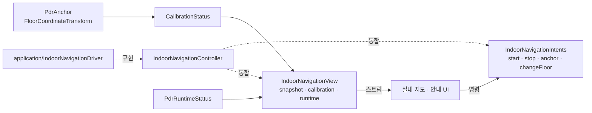
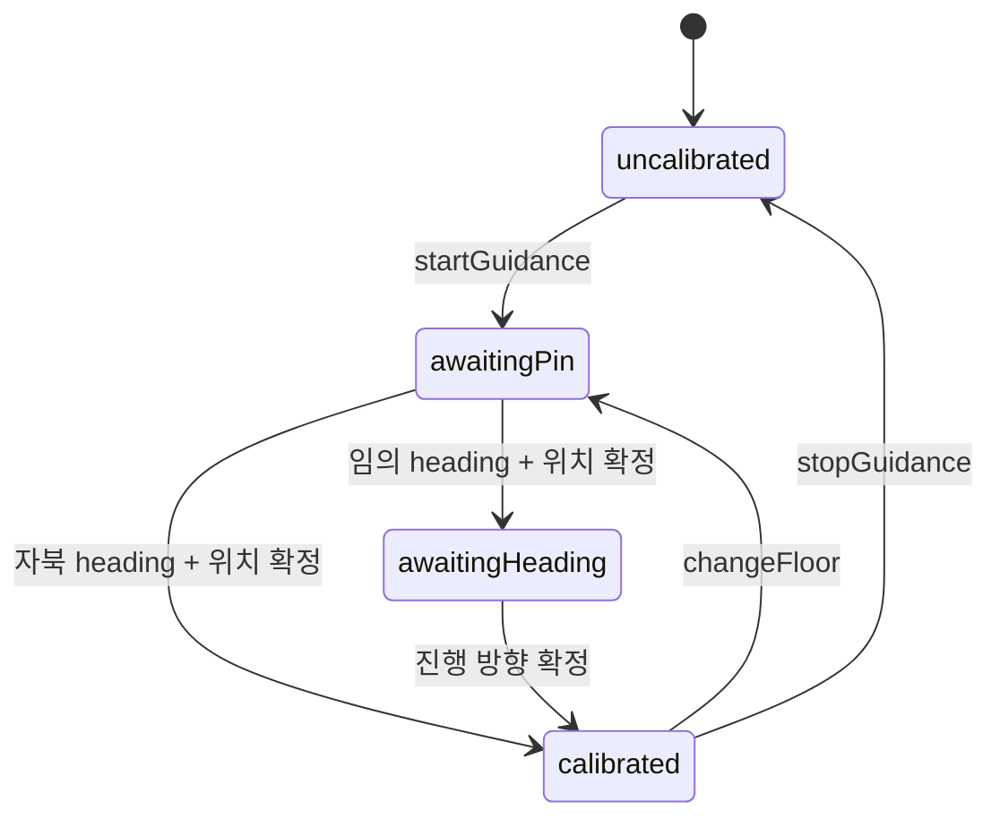

# `indoor_navigation/contract` — UI와 PDR의 공개 계약

UI가 호출할 명령, UI가 구독할 상태, PDR 좌표를 층 좌표에 고정하는 타입을 정의한다.
화면은 application·platform 내부 대신 이 디렉터리의 공개 표면에 의존한다.

## 구성 파일

| 파일 | 역할 | 주요 타입 |
|---|---|---|
| [`indoor_navigation_contract.dart`](indoor_navigation_contract.dart) | 공개 export와 읽기+명령 통합 계약 | `IndoorNavigationController` |
| [`indoor_navigation_intents.dart`](indoor_navigation_intents.dart) | UI → 로직 명령 | `IndoorNavigationIntents` |
| [`indoor_navigation_view.dart`](indoor_navigation_view.dart) | 로직 → UI 읽기 전용 상태 | `IndoorNavigationView` |
| [`calibration_state.dart`](calibration_state.dart) | anchor 확정 단계와 렌더 가능 여부 | `CalibrationPhase`, `CalibrationStatus` |
| [`pdr_anchor.dart`](pdr_anchor.dart) | PDR east/north → 층 `local_m` 변환 | `PdrAnchor`, `PdrToFloorAxes`, `FloorCoordinateTransform` |
| [`pdr_runtime_status.dart`](pdr_runtime_status.dart) | 센서 파이프라인 실행 상태 | `PdrRuntimeState`, `PdrRuntimeStatus` |

## 계약 관계



## 보정 상태



`CalibrationStatus.canRenderPosition`은 `calibrated`이고 anchor가 있을 때만 `true`다.
anchor가 없는 추정 위치를 지도에 먼저 그리지 않는다.

## 좌표 변환

```text
floor = anchorLocalM + PdrToFloorAxes × Rotation(rotationDeg) × pdr
```

- PDR 좌표는 동쪽·북쪽이 양수다.
- 층 `local_m`은 데이터셋에 따라 축 회전이나 y축 반전이 있을 수 있다.
- `PdrToFloorAxes`가 축 차이를, `rotationDeg`가 임의 heading 보정을 담당한다.

## 실패 지점

- UI가 application 구현체를 직접 참조하면 fake controller로 교체하기 어려워진다.
- 명령 메서드에서 UI 상태를 반환하고 상태 스트림에서도 같은 값을 내보내면 두 진실 공급원이 생긴다.
- `PdrRuntimeStatus.warnings`는 사용자 문구가 아니라 식별자다. 화면에서 그대로 노출하지 않는다.
- anchor 확정 때와 위치 변환 때 서로 다른 `PdrToFloorAxes`를 쓰면 이동 방향이 반전된다.
- `awaitingPin` 또는 `awaitingHeading`에서 위치를 렌더하면 보정 전 좌표가 실제 위치처럼 보인다.

## 검증

공개 계약과 좌표·보정 동작은
[`../../../../test/features/indoor_navigation/contract_test.dart`](../../../../test/features/indoor_navigation/contract_test.dart)에서 확인한다.

---

> **다음 읽기:** [`platform` — Android/iOS 센서 어댑터](../platform/README.md)
