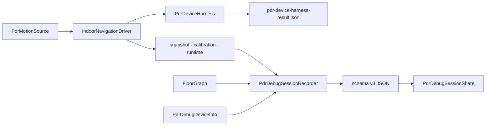

# `indoor_navigation/debug` — PDR 실기기 진단과 기록

센서 세션이 실제 기기에서 시작·정지되는지 확인하고, PDR 품질·보정·맵 매칭 상태를
재현 가능한 JSON으로 기록·공유한다. 운영 측위 계산을 변경하지 않는 관찰 계층이다.

## 구성 파일

| 파일 | 역할 | 주요 항목 |
|---|---|---|
| [`pdr_device_harness.dart`](pdr_device_harness.dart) | 센서 시작·스냅샷·정지 후 안정성을 확인하는 실기기 화면 | `PdrDeviceHarness`, receipt JSON |
| [`pdr_debug_session_recorder.dart`](pdr_debug_session_recorder.dart) | snapshot·품질·anchor·그래프 매칭 정보를 제한된 크기로 수집 | `PdrDebugSessionRecorder`, schema v3 |
| [`pdr_debug_device_info.dart`](pdr_debug_device_info.dart) | OS·기기·앱 버전 메타데이터 수집 | `PdrDebugDeviceInfo` |
| [`pdr_debug_session_share.dart`](pdr_debug_session_share.dart) | 진단 JSON을 임시 파일로 만들어 공유 시트에 전달 | `PdrDebugSessionShare` |

## 진단 흐름

## Device harness

실기기 센서 세션을 시작하고 이벤트 수신을 관찰한 뒤 stop 이후 경로가 더 늘어나지 않는지
확인한다. 결과는 성공/실패 detail과 함께 receipt 파일로 남겨 integration test가 읽을 수 있게 한다.

## Session recorder

- JSON `schemaVersion`은 현재 3이다.
- 품질 표본은 최대 900개로 제한해 장시간 세션에서도 파일 크기가 무한히 늘지 않게 한다.
- PDR 원본/확정 경로, 보정 상태, runtime warning, 그래프 맵 매칭 결과를 함께 기록한다.
- `FloorGraph`가 있으면 `FloorMapMatcher`를 사용해 기록 경로를 네트워크에 맞춘 결과도 포함한다.

## 실패 지점

- recorder가 센서나 controller 수명주기를 소유하면 진단 on/off가 운영 세션을 바꾼다.
- schema를 바꾸고 버전을 올리지 않으면 이전 분석 도구가 새 JSON을 잘못 해석한다.
- 표본 상한 없이 매 snapshot을 저장하면 긴 안내에서 메모리와 공유 파일이 커진다.
- iPad/iOS 공유 시 `sharePositionOrigin`이 없으면 popover 표시가 실패할 수 있다.
- receipt를 쓰기 전에 driver를 dispose하면 마지막 정지 검증 결과가 사라질 수 있다.

## 검증

- harness 위젯: [`../../../../test/features/indoor_navigation/pdr_device_harness_test.dart`](../../../../test/features/indoor_navigation/pdr_device_harness_test.dart)
- recorder: [`../../../../test/features/indoor_navigation/pdr_debug_session_recorder_test.dart`](../../../../test/features/indoor_navigation/pdr_debug_session_recorder_test.dart)
- 실기기 smoke: [`../../../../integration_test/pdr_device_smoke_test.dart`](../../../../integration_test/pdr_device_smoke_test.dart)

---

> **다음 읽기:** [`features/debug_mode` — 지도·PDR 개발 진단](../../debug_mode/README.md)
