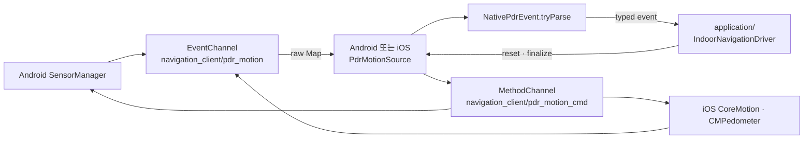

# `indoor_navigation/platform` — Android/iOS 센서 어댑터

native 센서 bridge의 동적 `Map` 이벤트를 Dart의 `NativePdrEvent`로 바꾸고,
application 계층에 동일한 `PdrMotionSource` 계약을 제공한다.

## 구성 파일

| 파일 | 역할 |
|---|---|
| [`pdr_motion_source.dart`](pdr_motion_source.dart) | 이벤트·시작·정지·pedometer 수명주기 인터페이스 |
| [`native_pdr_event.dart`](native_pdr_event.dart) | raw native payload → typed PDR core 이벤트·기압 샘플 파싱 |
| [`android_pdr_motion_source.dart`](android_pdr_motion_source.dart) | Android SensorManager bridge 어댑터 |
| [`ios_pdr_motion_source.dart`](ios_pdr_motion_source.dart) | iOS CoreMotion/CMPedometer bridge 어댑터 |

## 채널과 이벤트 흐름

```mermaid
flowchart LR
    ANDROID["Android SensorManager"]
    IOS["iOS CoreMotion · CMPedometer"]
    EVENT["EventChannel<br/>navigation_client/pdr_motion"]
    ADAPTER["Android 또는 iOS<br/>PdrMotionSource"]
    PARSER["NativePdrEvent.tryParse"]
    DRIVER["application/<br/>IndoorNavigationDriver"]
    COMMAND["MethodChannel<br/>navigation_client/pdr_motion_cmd"]

    ANDROID --> EVENT
    IOS --> EVENT
    EVENT -->|"raw Map"| ADAPTER --> PARSER
    PARSER -->|"typed event"| DRIVER
    DRIVER -->|"reset · finalize"| ADAPTER
    ADAPTER --> COMMAND
    COMMAND --> ANDROID
    COMMAND --> IOS
```

두 플랫폼은 같은 channel 이름과 메서드 표면을 사용한다. `service_locator.dart`가
`defaultTargetPlatform`에 따라 구현체만 선택하므로 controller에는 플랫폼 분기가 없다.

## `PdrMotionSource` 수명주기

| 메서드 | 책임 |
|---|---|
| `start()` | EventChannel 구독 시작. 이미 구독 중이면 중복 구독하지 않음 |
| `stop()` | native event 구독 취소 |
| `resetPedometer()` | 새 step session을 시작하고 session ID 반환 |
| `finalizePedometer()` | 안내 종료 직전 마지막 관측 걸음 확정 |
| `dispose()` | 구독과 broadcast controller 해제 |

`NativePdrEvent.tryParse`는 heading, acceleration peak, pedometer batch를 각각 typed
`indoor_pdr_core` 이벤트로 변환한다. payload가 `Map`이 아니면 `null`로 무시한다.

## 기압계 (`kind: "altitude"`)

층 전이 판정용으로 iOS `CMAltimeter`(~1Hz)와 Android `TYPE_PRESSURE`(5Hz로 조임)를 함께
싣는다. 파싱 결과는 `AltitudeSample`·`AltimeterStatus`이며 `PdrSession`에는 들어가지 않는다.

- 기압 이벤트는 **pedometer·heading 블록을 함께 싣지 않는다.** 두 native bridge 모두 별도
  `emitAltitude()`를 쓴다. 기존 `emit()`은 `kind != "motion"`에서 pedometer 블록을 함께 보내고
  Android는 `lastReportedSteps` 델타 회계까지 진행시키므로, 초당 여러 번 오는 기압 이벤트에
  태우면 걸음 델타가 0으로 잘려 배치 타이밍이 흔들린다.
- `snapshot` 이벤트에는 첫 샘플 전에도 `altimeterAvailable`이 실린다. 기압계가 없는 기기를
  "판정 대기 중"으로 오해하지 않기 위한 값이다.
- 고도 환산은 Dart 한 곳(`pressureAltitudeM`)에서만 한다. iOS의 `relativeAltitude`는 그 계산을
  실측으로 대조하는 진단값으로만 남긴다.

## 실패 지점

- Dart와 native의 EventChannel·MethodChannel 이름이 다르면 이벤트와 명령이 모두 끊긴다.
- `start()` 중복 호출로 구독이 겹치면 같은 걸음을 두 번 처리할 수 있다.
- raw 필드를 강제 cast하면 OS 버전별 선택 필드 누락이 앱 예외로 이어진다.
- `stop()`만 하고 종료 걸음을 finalize하지 않으면 배치 callback 때문에 종료 경로가 흔들릴 수 있다.
- EventChannel 오류를 삼키면 controller가 `degraded` 상태로 전환할 근거를 잃는다.

## 검증

controller 단위 테스트는 fake `PdrMotionSource`로 application 계약을 검증한다. 실제 channel,
권한, 센서 등록과 native payload는
[`../../../../integration_test/pdr_device_smoke_test.dart`](../../../../integration_test/pdr_device_smoke_test.dart)와
device harness에서 실기기로 확인한다.

---

> **다음 읽기:** [`application` — PDR 세션과 맵 매칭](../application/README.md)
