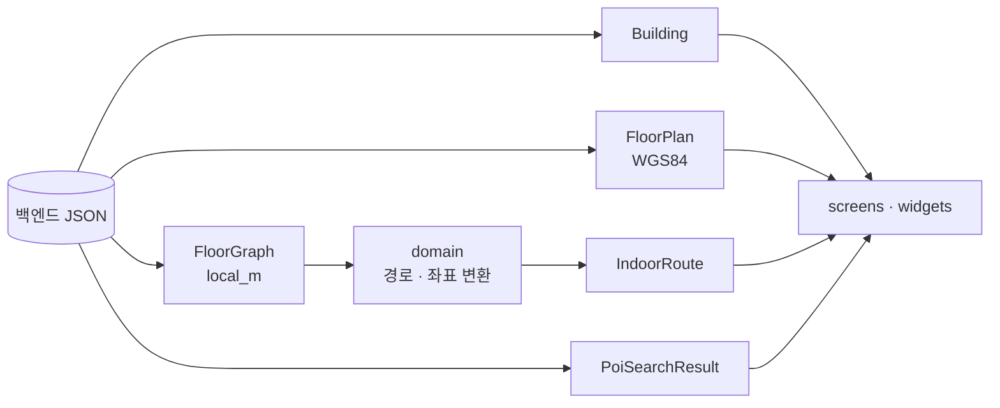

# `lib/models` — 앱 데이터 모델

백엔드 JSON과 화면·리포지토리 사이에서 전달하는 값의 모양을 정의한다. 저장 방식이나
네트워크 호출은 모르며, 파싱·불변 값·간단한 파생값만 책임진다.

## 구성 파일

| 파일 | 주요 타입 | 역할 |
|---|---|---|
| [`building.dart`](building.dart) | `Building` | 건물 정보, 층 목록, 초기 층 |
| [`floor_plan.dart`](floor_plan.dart) | `FloorPlan`, `StorePolygon`, `PoiMarker` | 층 외곽·매장·POI·복도 렌더 데이터 |
| [`floor_graph.dart`](floor_graph.dart) | `FloorGraph`, `GraphNode`, `GraphEdge`, `LocalPoint` | `local_m` 내비게이션 그래프 |
| [`indoor_route.dart`](indoor_route.dart) | `IndoorRoute` | 실내 경로점·거리 |
| [`poi_search_result.dart`](poi_search_result.dart) | `PoiSearchResult` | 목적지 검색 결과 |
| [`directions_route.dart`](directions_route.dart) | `DirectionsRoute` | 실외 보행 경로점·거리·시간 |
| [`favorite_place.dart`](favorite_place.dart) | `FavoritePlace` | 저장 가능한 즐겨찾기 장소 |

## 좌표 모델

- `LocalPoint(x, y)`는 건물 로컬 미터 좌표다.
- `LatLng` 생성자 순서는 위도, 경도다.
- GeoJSON 배열은 경도, 위도 순서이므로 `FloorPlan.fromJson`에서 순서를 바꿔 읽는다.

## 백엔드 계약과의 관계

모델 필드는 백엔드 `dto/` 응답에 맞춰야 한다. 백엔드 필드를 추가·이름 변경할 때는
해당 `fromJson`과 이를 쓰는 리포지토리를 함께 확인한다. 선택 필드는 누락될 수 있지만,
ID·좌표처럼 경로 계산에 필요한 필드를 임의 기본값으로 숨기면 원인을 찾기 어려워진다.

## 실패 지점

- `floor_id`와 사용자 표시용 층 이름을 같은 값으로 가정하지 않는다.
- `GraphEdge.bidirectional`을 무시하면 일방향 에스컬레이터 같은 정책이 깨진다.
- 빈 polygon·graph를 정상 데이터처럼 그리면 화면은 뜨지만 경로·터치 판정이 실패한다.
- 직렬화 가능한 `FavoritePlace`에 런타임 객체를 추가하면 SharedPreferences 복원이 깨진다.

## 자주 하는 작업

| 하고 싶은 것 | 확인 범위 |
|---|---|
| 백엔드 응답 필드 반영 | 해당 모델 `fromJson` + HTTP 리포지토리 + 테스트 |
| 새 지도 요소 추가 | `FloorPlan` + `FloorPlanView` |
| 그래프 속성 추가 | `FloorGraph` + `domain/dijkstra.dart` |
| 즐겨찾기 필드 추가 | `FavoritePlace.toJson/fromJson` + `FavoritesController` |

---

> **다음 읽기:** [`lib/domain` — 온디바이스 경로·좌표 계산](../domain/README.md)
