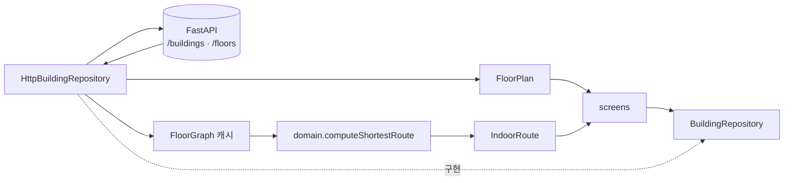

# `lib/repositories` — 데이터 접근 경계

화면이 백엔드·TMAP·assets의 차이를 모르도록 인터페이스로 감싼다. 실제 HTTP 구현과
오프라인/테스트용 Mock이 같은 계약을 구현한다.

## 인터페이스와 구현

| 계약 | 실제 구현 | 대체 구현 | 책임 |
|---|---|---|---|
| [`building_repository.dart`](building_repository.dart) | [`http_building_repository.dart`](http_building_repository.dart) | [`mock_building_repository.dart`](mock_building_repository.dart) | 건물·층 지도·층 그래프와 단일 층 최단 경로 |
| [`destination_repository.dart`](destination_repository.dart) | [`http_destination_repository.dart`](http_destination_repository.dart) | [`mock_destination_repository.dart`](mock_destination_repository.dart) | 목적지·시설 검색과 현재 층 필터 |
| [`directions_repository.dart`](directions_repository.dart) | [`tmap_directions_repository.dart`](tmap_directions_repository.dart) | [`mock_directions_repository.dart`](mock_directions_repository.dart) | 실외 도보 경로 |

구현 선택은 [`../core/service_locator.dart`](../core/service_locator.dart)에서 한다.

## 건물·경로 흐름

서버는 그래프를 제공하고, `HttpBuildingRepository.getShortestRoute`가 캐시한 층 그래프를
`domain/floor_router.dart`에 넘긴다. Dijkstra를 백엔드로 옮기지 않는다.

## 목적지 검색

`DestinationRepository.searchDestinations`는 `currentFloorId`가 있으면 현재 층만,
`null`이면 건물 전체를 검색한다. `HttpDestinationRepository`는 경량
`POST /query/destination` 계약을 사용하고, Mock은 이미 로드된 건물 데이터에서 검색한다.

현재 앱 배선은 Mock 목적지 검색이다. 실제 백엔드 자연어 검색 전환 범위는
[`../../../docs/backend/native/client-handoff.md`](../../../docs/backend/native/client-handoff.md)를 따른다.

## 반환·오류 규칙

- 조회 실패나 경로 없음처럼 화면이 정상 분기할 수 있는 경우는 `null` 또는 빈 목록으로 돌려준다.
- JSON 파싱은 `models/` 생성자에 맡기고, 리포지토리는 endpoint·status·캐시를 책임진다.
- API URL과 키는 `core/api_config.dart`에서만 읽는다.

## 실패 지점

- HTTP 200이어도 `navigation_graph`가 비었거나 node ID가 없으면 경로는 `null`이다.
- `currentFloorId`에 층 표시명(`1F`)을 넘기고 API가 불투명 ID를 기대하면 필터가 실패한다.
- 단일 층 `/floors/{floor}` 그래프로 층 간 경로를 만들 수 없다. 전체 건물 그래프 연동은 별도 작업이다.
- Mock과 HTTP 구현의 빈 검색어·없는 데이터 동작이 다르면 테스트만 통과하고 실제 화면이 달라진다.

## 자주 하는 작업

| 하고 싶은 것 | 방법 |
|---|---|
| 새 데이터 소스 추가 | 계약을 먼저 확장하고 실제/Mock 구현을 함께 수정 |
| endpoint·status 처리 변경 | `http_*_repository.dart` |
| JSON 필드 변경 | [`../models/README.md`](../models/README.md)와 백엔드 응답 계약 함께 확인 |
| 경로 계산 변경 | [`../domain/README.md`](../domain/README.md) |

---

> **다음 읽기:** [`lib/state` — 지속되는 사용자 상태](../state/README.md)
