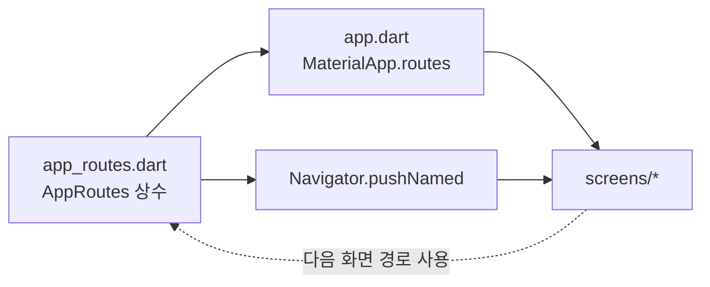

# `lib/routing` — 화면 경로 이름

화면 전환에 사용하는 문자열을 한곳에서 정의한다. 실제 화면 위젯 등록은
[`../app.dart`](../app.dart)의 `MaterialApp.routes`가 담당한다.

## 구성 파일

| 파일 | 역할 |
|---|---|
| [`app_routes.dart`](app_routes.dart) | `AppRoutes`의 route 상수 정의 |

## 등록 흐름

| route | 화면 |
|---|---|
| `/` | `MapShellScreen` |
| `/indoor-map` | `IndoorMapScreen` |
| `/destination` | `DestinationScreen` |
| `/route-guide` | `RouteGuideScreen` |
| `/arrival` | `ArrivalScreen` |
| `/debug/*` | API·층 지도·PDR 진단 화면 |

## 실패 지점

- 상수만 추가하고 `app.dart`에 builder를 등록하지 않으면 named route를 찾지 못한다.
- 화면에서 문자열을 직접 쓰면 이름 변경 시 누락되므로 반드시 `AppRoutes`를 사용한다.
- route argument는 컴파일 타임 검증이 되지 않는다. 받는 화면과 보내는 화면의 타입을 함께 확인한다.

## 새 화면 추가

1. `screens/`에 화면을 만든다.
2. `AppRoutes`에 상수를 추가한다.
3. `app.dart`의 `routes` Map에 위젯 builder를 등록한다.
4. `Navigator.pushNamed` 호출과 argument 수신을 테스트한다.

---

> **다음 읽기:** [`lib/models` — 앱 데이터 모델](../models/README.md)
