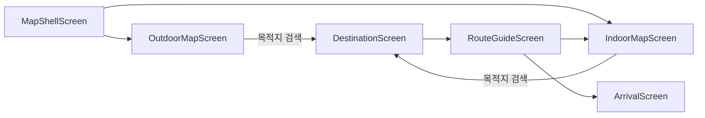
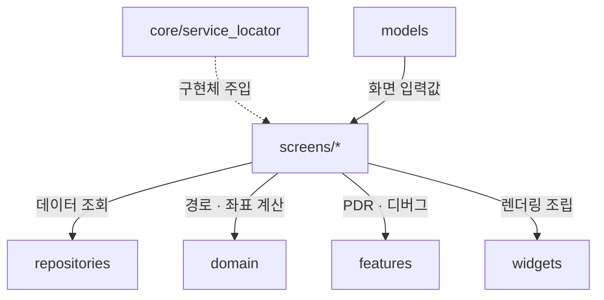

# `lib/screens` — 사용자 흐름을 조립하는 화면 계층

화면은 사용자 입력과 라이프사이클을 받아 리포지토리·도메인·PDR 기능을 호출하고,
결과를 `widgets/`로 그린다. HTTP 요청 형식, Dijkstra 구현, 센서 원시 이벤트 처리는
각 하위 계층에 맡긴다.

## 화면 구성

| 디렉터리 | 화면 | 책임 |
|---|---|---|
| [`map_shell/`](map_shell/map_shell_screen.dart) | `MapShellScreen` | 실외/실내 모드, 상단·하단 바, 시트와 현재 건물·층 상태 조립 |
| [`outdoor_map/`](outdoor_map/outdoor_map_screen.dart) | `OutdoorMapScreen` | GPS, 실외 지도, 건물 진입과 실외 경로 표시 |
| [`indoor_map/`](indoor_map/indoor_map_screen.dart) | `IndoorMapScreen` | 층 지도, 실내 위치·경로, PDR 보정 및 층 선택 |
| [`destination/`](destination/destination_screen.dart) | `DestinationScreen` | 목적지 검색과 선택 |
| [`route_guide/`](route_guide/route_guide_screen.dart) | `RouteGuideScreen` | 선택한 목적지의 안내 진행·도착 전환 |
| [`arrival/`](arrival/arrival_screen.dart) | `ArrivalScreen` | 도착 결과와 다음 이동 |
| [`debug/`](debug/) | 진단 화면 | 백엔드 health, 층 지도 미리보기, PDR SVG 실기기 확인 |

## 사용자 흐름

`MapShellScreen`이 공통 지도 셸과 검색/즐겨찾기/카테고리 시트를 조립한다.
독립 진단이 필요한 기능은 운영 화면에 임시 코드를 넣지 않고 `debug/` 화면으로 분리한다.

## 의존 경계

- 화면은 `http`로 백엔드를 직접 호출하지 않는다. 예외는 연결 자체를 확인하는
  `debug/api_health_check_screen.dart`뿐이다.
- 최단 경로는 서버 호출 결과가 아니라 리포지토리가 받은 `navigation_graph`를
  `domain/`에 넘겨 온디바이스로 계산한다.
- PDR 세션 소유권은 화면이 아니라 앱 범위 `IndoorNavigationDriver`에 있다.

## 실패 지점

- 비동기 응답 뒤 `setState`하기 전에 `mounted`를 확인하지 않으면 화면 이탈 시 예외가 난다.
- route argument가 없거나 예상 타입과 다르면 목적지·경로 안내 화면이 시작되지 않는다.
- 현재 층 ID와 표시명(`floor.id`, `floor.name`)을 섞으면 검색 필터와 그래프 조회가 어긋난다.
- 화면마다 PDR 컨트롤러를 새로 만들면 화면 전환 때 센서 세션과 보정 기준이 초기화된다.

## 자주 하는 작업

| 하고 싶은 것 | 함께 볼 곳 |
|---|---|
| 새 화면/전환 추가 | [`../routing/README.md`](../routing/README.md), `app.dart` |
| 검색 동작 변경 | `destination/`, [`../repositories/README.md`](../repositories/README.md) |
| 지도 표시 변경 | `indoor_map/` 또는 `outdoor_map/`, [`../widgets/README.md`](../widgets/README.md) |
| PDR 화면 연동 | [`../features/indoor_navigation/README.md`](../features/indoor_navigation/README.md) |

---

> **다음 읽기:** [`lib/features` — 독립 기능 모듈](../features/README.md)
