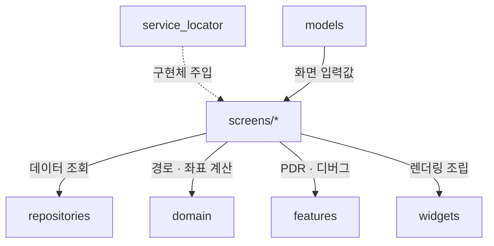

# `lib/screens` — 사용자 흐름을 조립하는 화면 계층

화면은 사용자 입력과 라이프사이클을 받아 리포지토리·도메인·PDR 기능을 호출하고,
결과를 `widgets/`로 그린다. HTTP 요청 형식, Dijkstra 구현, 센서 원시 이벤트 처리는
각 하위 계층에 맡긴다.

## 화면 구성

| 디렉터리 | 화면 | 책임 |
|---|---|---|
| [`map_shell/`](map_shell/map_shell_screen.dart) | `MapShellScreen` | 상단·하단 바, 시트와 현재 건물·층 상태 조립 |
| [`outdoor_map/`](outdoor_map/outdoor_map_screen.dart) | `OutdoorMapBody` | 지도 전부 — GPS·실외 경로, 건물 진입 뒤 실내 도면 오버레이, 실내 위치·경로·층 전환 |

**둘뿐이다.** 목적지 선택·경로 안내·도착은 예전에 각각 화면이었지만 지금은
지도 셸의 시트와 오버레이다. 화면을 넘나들 때마다 지도를 새로 만들고 카메라·층·
PDR 세션을 인계해야 했는데 그 인계가 자주 실패해서 지도 하나로 합쳤다.

## 화면 안의 폴더

두 화면 모두 파일이 스무 개를 넘어 주제별로 한 겹 더 묶었다.

```
map_shell/widgets/   search/   검색 입력과 그 결과 목록
                     sheets/   아래에서 올라오는 시트(place_detail/ 포함)
                     chrome/   지도 위에 상시 떠 있는 바·칩·덮개

outdoor_map/         parts/    화면 본체의 part 열한 개(`OutdoorMapBodyState`)
                     entry/    실내 진입·이탈 판정(GPS·zoom·근접·층 외곽선)
                     gps/      위치 스트림 수명과 신선도
                     layers/   MapLibre 소스·레이어 등록
                     camera/   건물 방향 계산과 카메라 명령
```

`parts/`의 파일 이름에서 `outdoor_map_screen_` 접두사를 뗐다 — 폴더가 그 일을
대신하므로 이름에 두 번 적을 이유가 없다. `part of`는 `'../outdoor_map_screen.dart'`다.

## 사용자 흐름


```mermaid
flowchart LR
    SHELL["MapShellScreen<br/>상단·하단 바, 시트"]
    OUT["OutdoorMapBody<br/>지도 · 실내 오버레이"]

    SHELL --> OUT
    OUT -. "건물 진입 · 층 전환" .-> OUT
```

`MapShellScreen`이 공통 지도 셸과 검색/즐겨찾기/카테고리 시트, 그리고 상단 바 햄버거가
여는 앱 메뉴(`widgets/sheets/app_menu_sheet.dart` — 디버그 설정의 유일한 진입점)를 조립한다.
진단 기능은 별도 화면이 아니라 **디버그 모드 토글**로 지도 위에 겹쳐 보여준다
([`features/debug_mode/`](../features/debug_mode/README.md)) — 진단 화면을 따로
두면 아무도 열지 않아 그대로 썩는다는 것을 한 번 겪었다.

## 의존 경계


```mermaid
flowchart TD
    SCREENS["screens/*"]
    CORE["service_locator"]
    REPO["repositories"]
    DOMAIN["domain"]
    FEATURES["features"]
    MODELS["models"]
    WIDGETS["widgets"]

    CORE -. "구현체 주입" .-> SCREENS
    SCREENS -->|"데이터 조회"| REPO
    SCREENS -->|"경로 · 좌표 계산"| DOMAIN
    SCREENS -->|"PDR · 디버그"| FEATURES
    MODELS -->|"화면 입력값"| SCREENS
    SCREENS -->|"렌더링 조립"| WIDGETS
```

- 화면은 `http`로 백엔드를 직접 호출하지 않는다. 예외 없다 — 전부 리포지토리를 거친다.
- 최단 경로는 서버 호출 결과가 아니라 리포지토리가 받은 `navigation_graph`를
  `domain/`에 넘겨 온디바이스로 계산한다.
- PDR 세션 소유권은 화면이 아니라 앱 범위 `IndoorNavigationDriver`에 있다.

## 실패 지점

- 비동기 응답 뒤 `setState`하기 전에 `mounted`를 확인하지 않으면 화면 이탈 시 예외가 난다.
- route argument가 없거나 예상 타입과 다르면 목적지·경로 안내 화면이 시작되지 않는다.
- 현재 층 ID와 표시명(`floor.id`, `floor.name`)을 섞으면 검색 필터와 그래프 조회가 어긋난다.
- 화면마다 PDR 컨트롤러를 새로 만들면 화면 전환 때 센서 세션과 보정 기준이 초기화된다.

## 자주 하는 작업

| 하고 싶은 것 | 함께 볼 곳 |
|---|---|
| 새 화면/전환 추가 | [`../routing/README.md`](../routing/README.md), `app.dart` |
| 검색 동작 변경 | `destination/`, [`../repositories/README.md`](../repositories/README.md) |
| 지도 표시 변경 | `outdoor_map/`, [`../widgets/README.md`](../widgets/README.md) |
| PDR 화면 연동 | [`../features/indoor_navigation/README.md`](../features/indoor_navigation/README.md) |

---

> **다음 읽기:** [`lib/features` — 독립 기능 모듈](../features/README.md)
