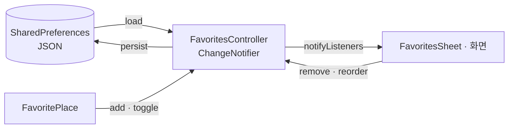

# `lib/state` — 지속되는 사용자 상태

화면 하나보다 오래 유지되고 앱 재실행 뒤에도 복원해야 하는 사용자 상태를 둔다.
현재는 즐겨찾기만 관리한다.

## 구성 파일

| 파일 | 역할 |
|---|---|
| [`favorites_controller.dart`](favorites_controller.dart) | 즐겨찾기 로드·추가·삭제·토글·순서 변경과 저장 |

`FavoritesController`는 `ChangeNotifier`이며 `SharedPreferences`의 JSON 문자열에
`FavoritePlace` 목록을 저장한다. 앱 전역 인스턴스는
[`../core/service_locator.dart`](../core/service_locator.dart)에 있다.

## 상태 흐름

## 실패 지점

- 초기 비동기 load가 끝나기 전에 빈 목록을 최종 상태로 오해하지 않도록 `isLoaded`를 확인한다.
- `FavoritePlace` JSON 형식을 바꾸면 기존 사용자의 저장값과 호환되는지 확인한다.
- 같은 장소를 판별하는 `key` 규칙을 바꾸면 중복 또는 삭제 실패가 생긴다.
- 테스트에서는 실제 기기 저장소 대신 컨트롤러를 교체하거나 mock preferences를 사용한다.

## 새 전역 상태를 추가할 때

서버에서 다시 받을 수 있는 화면 캐시는 먼저 화면/리포지토리에 둔다. 사용자 선택처럼
재실행 뒤에도 남아야 할 값만 이 계층에 추가하고, 직렬화·마이그레이션·초기 로딩 실패를 함께 설계한다.

---

> **다음 읽기:** [`lib/theme` — 공통 시각 규칙](../theme/README.md)
