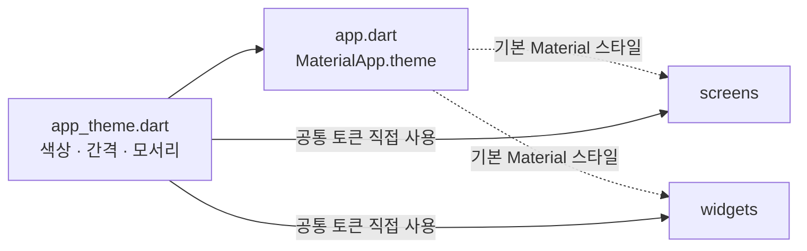

# `lib/theme` — 공통 시각 규칙

앱 전체에서 재사용하는 `ThemeData`, 색상, 간격, 모서리 값을 한곳에 둔다. 화면과 위젯이
각자 비슷한 색·크기를 새로 만들지 않게 하는 시각 계약이다.

## 구성 파일

| 파일 | 역할 |
|---|---|
| [`app_theme.dart`](app_theme.dart) | Material 테마와 앱 공통 디자인 토큰 |

루트 적용 지점은 [`../app.dart`](../app.dart)의 `MaterialApp.theme`이다.

## 적용 관계

## 사용 규칙

- 여러 화면에서 쓰는 값은 `AppTheme`의 의미 있는 이름으로 추가한다.
- 특정 지도 상태나 한 화면에만 쓰는 색은 해당 기능 가까이에 둔다.
- 색만으로 상태를 구분하지 말고 아이콘·문구를 함께 사용한다.

## 실패 지점

- 공통 토큰을 바꾸면 모든 화면에 영향이 있으므로 지도, 시트, 밝은/어두운 배경을 함께 확인한다.
- `Color` 값을 위젯마다 직접 복제하면 테마 변경 시 일부만 남는다.
- 디자인 토큰 이름은 색상 자체보다 용도(`primary`, `surface` 등)를 표현해야 교체가 쉽다.

---

> **다음 읽기:** [`lib/widgets` — 재사용 UI와 지도 렌더링](../widgets/README.md)
