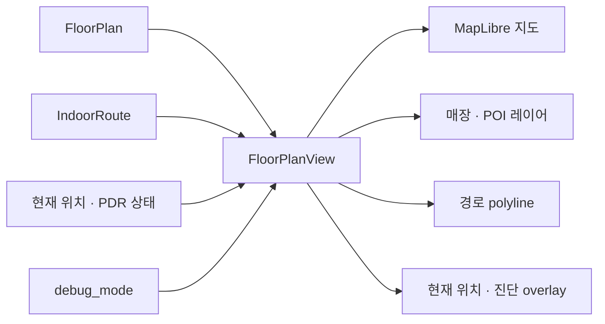

# `lib/widgets` — 재사용 UI와 지도 렌더링

여러 화면에서 다시 쓰는 시각 요소와 상호작용 묶음을 둔다. 단순 버튼부터 MapLibre 기반
층 지도처럼 상태가 큰 위젯까지 포함하지만, 화면 이동과 앱 전체 사용자 흐름은 소유하지 않는다.

## 구성

| 묶음 | 파일 | 역할 |
|---|---|---|
| 지도 | [`floor_plan_view.dart`](floor_plan_view.dart) | MapLibre 층 지도, 매장·POI·현재 위치·경로 표시 |
| 지도 | [`route_polyline.dart`](route_polyline.dart), [`location_marker.dart`](location_marker.dart), [`uncertainty_circle.dart`](uncertainty_circle.dart) | 경로선, 위치와 불확실성 표현 |
| 지도 셸 | [`map_top_bar.dart`](map_top_bar.dart), [`map_bottom_bar.dart`](map_bottom_bar.dart), [`eta_card.dart`](eta_card.dart), [`status_badge.dart`](status_badge.dart) | 지도 화면 공통 조작·상태 |
| 탐색 시트 | [`search_sheet.dart`](search_sheet.dart), [`ai_search_sheet.dart`](ai_search_sheet.dart), [`directions_sheet.dart`](directions_sheet.dart), [`building_switcher_sheet.dart`](building_switcher_sheet.dart) | 매장 검색(경량)·AI 검색(의미), 출발/도착 검색, 건물 전환 |
| 장소 시트 | [`category_stores_sheet.dart`](category_stores_sheet.dart), [`store_info_sheet.dart`](store_info_sheet.dart), [`favorites_sheet.dart`](favorites_sheet.dart) | 카테고리 매장·매장 정보·즐겨찾기 |
| 공통 | [`sheet_header.dart`](sheet_header.dart) | 시트 헤더 |

## 검색은 한 곳, 두 단계

상단 검색창은 입력을 받지 않고 탭하면 [`search_sheet.dart`](search_sheet.dart)를 올린다.
사용자는 "일반 검색"과 "AI 검색"을 구분하지 않는다 — 매장 이름을 치든 자연어를 치든
같은 입력창에 치고, 어느 경로로 찾을지는 시트가 정한다.

- **타이핑 중**: 경량 매칭(`/query/destination`)만. 형태소 정규화(Kiwi)가 이 경로에 있어
  매장 이름은 즉시 걸린다.
- **엔터로 확정**: 경량이 빈손이면 의미 검색(`/query/ai`)까지 자동으로 이어 붙인다.

의미 검색을 타이핑 중이 아니라 확정 시점에만 붙이는 이유는 비용이다. 백엔드가 임베딩
모델을 로드하면 첫 호출이 20초대까지 가므로, 글자마다 던지면 "밥"·"밥 먹"이 전부 모델을
태운다. **이 조건을 지우면 검색이 느려지는 게 아니라 멈춘 것처럼 보인다.**

[`ai_search_sheet.dart`](ai_search_sheet.dart)는 경로 안내 화면의 FAB에서만 쓰는 대화형
검색 패널로 남아 있다.

## `FloorPlanView` 경계

`FloorPlanView`는 받은 `FloorPlan`, `IndoorRoute`, 위치 값을 렌더링한다. API에서 데이터를
가져오거나 최단 경로를 결정하는 책임은 화면·리포지토리에 있다.

```mermaid
flowchart LR
    PLAN["FloorPlan"]
    ROUTE["IndoorRoute"]
    POSITION["현재 위치 · PDR 상태"]
    DEBUG["debug_mode"]
    VIEW["FloorPlanView"]

    PLAN --> VIEW
    ROUTE --> VIEW
    POSITION --> VIEW
    DEBUG --> VIEW

    VIEW --> MAP["MapLibre 지도"]
    VIEW --> LAYERS["매장 · POI 레이어"]
    VIEW --> LINE["경로 polyline"]
    VIEW --> MARKER["현재 위치 · 진단 overlay"]
```

지원하지 않는 플랫폼에서는 `_UnsupportedPlatformNotice`를 표시한다. 웹·모바일별
렌더링 분기가 있으므로 지도 변경은 지원 대상 플랫폼을 나눠 확인한다.

## 콜백 규칙

- 시트는 검색·선택 결과를 콜백으로 돌려주고 route를 직접 바꾸지 않는다.
- 리포지토리를 쓰는 상태형 시트는 `service_locator`에서 주입된 인터페이스를 사용한다.
- 지도 위젯이 받은 모델을 수정하지 않는다. 상태 변경은 소유한 화면으로 올린다.

## 실패 지점

- `LatLng` 순서는 `(latitude, longitude)`, GeoJSON 좌표는 `[longitude, latitude]`다.
- `local_m`, WGS84, 화면 pixel을 섞으면 마커와 경로가 같은 지도를 가리키지 않는다.
- MapLibre controller가 준비되기 전에 source/layer를 갱신하면 초기 렌더가 누락될 수 있다.
- 시트 안에서 직접 전역 상태를 바꾸면 닫힘·재열림 시 선택 상태가 어긋나기 쉽다.

## 자주 하는 작업

| 하고 싶은 것 | 위치 |
|---|---|
| 지도 레이어·마커 변경 | `floor_plan_view.dart` |
| 경로 모양 변경 | `route_polyline.dart`와 `models/indoor_route.dart` |
| 검색 입력/전체 층 토글 변경 | `directions_sheet.dart` |
| 공통 색·간격 변경 | [`../theme/README.md`](../theme/README.md) |

---

> **다음 읽기:** [`lib/screens` — 사용자 흐름을 조립하는 화면](../screens/README.md)
