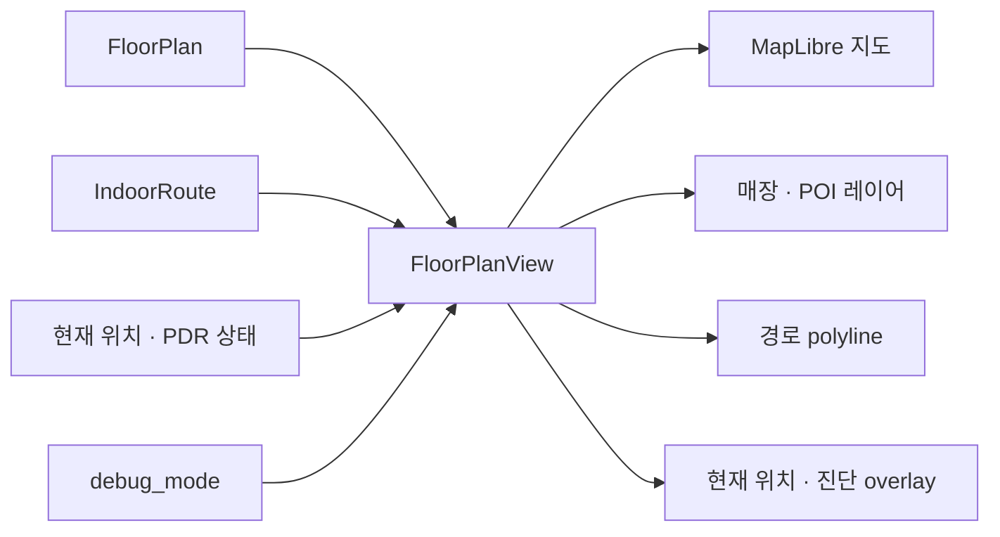

# `lib/widgets` — 재사용 UI와 지도 렌더링

여러 화면에서 다시 쓰는 시각 요소와 상호작용 묶음을 둔다. 단순 버튼부터 MapLibre 기반
층 지도처럼 상태가 큰 위젯까지 포함하지만, 화면 이동과 앱 전체 사용자 흐름은 소유하지 않는다.

## 구성

| 묶음 | 파일 | 역할 |
|---|---|---|
| 지도 | [`floor_plan_view.dart`](floor_plan_view.dart) | MapLibre 층 지도, 매장·POI·현재 위치·경로 표시 |
| 지도 | [`location_marker.dart`](location_marker.dart), [`uncertainty_circle.dart`](uncertainty_circle.dart) | 현재 위치와 불확실성 표현 |
| 지도 | [`floor_facility_style.dart`](floor_facility_style.dart), [`map_overlay_tap_guard.dart`](map_overlay_tap_guard.dart) | 수직이동 구조물·POI 아이콘/색 매핑, 오버레이 닫힘 직후 같은 포인터의 지도 오탭 차단 |
| 지도 | [`store_label_fit.dart`](store_label_fit.dart) | 매장명 라벨 크기를 폴리곤 크기에 맞춰 계산(미터 단위 → zoom에서 px 환산), 줄바꿈 폭 추정 |
| 지도 셸 | [`map_top_bar.dart`](map_top_bar.dart), [`map_bottom_bar.dart`](map_bottom_bar.dart), [`eta_card.dart`](eta_card.dart), [`status_badge.dart`](status_badge.dart) | 지도 화면 공통 조작·상태 |
| 지도 셸 | [`floor_selector.dart`](floor_selector.dart) | 좌하단 세로 층 선택기(기본 접힘·펼치면 최대 5개 노출·현재 층 강조), 실내·야외 진입 오버레이 공유 |
| 탐색 | [`search_panel.dart`](search_panel.dart), [`directions_sheet.dart`](directions_sheet.dart) | 매장 검색(경량)·AI 검색(의미), 출발/도착 검색 |
| 지도 셸 | [`app_menu_sheet.dart`](app_menu_sheet.dart) | 상단 바 햄버거가 여는 앱 메뉴(저장한 장소·길찾기·위치 지정/보정·디버그 설정) |
| 장소 시트 | [`category_stores_sheet.dart`](category_stores_sheet.dart), [`place_detail_sheet.dart`](place_detail_sheet.dart), [`favorites_sheet.dart`](favorites_sheet.dart) | 카테고리 매장·매장 상세·즐겨찾기 |
| 장소 상세 | [`place_detail/`](place_detail/) | 상세 시트 본문의 섹션별 렌더러(summary·hero·menu·매장정보 등) |
| 카테고리 | [`category_icon.dart`](category_icon.dart), [`category_label_order.dart`](category_label_order.dart) | 카테고리 대분류 아이콘·색상(chip·시트·리스트 공유), label 중복 제거·가나다 정렬 |
| 카테고리 | [`category_map_filter.dart`](category_map_filter.dart), [`category_map_icon.dart`](category_map_icon.dart) | 지도 카테고리 강조 필터, 매장명 라벨 옆 대분류 아이콘·이름 좌우 배치 규칙 |
| 카테고리 | [`category_map_fill.dart`](category_map_fill.dart) | 강조된 매장 폴리곤을 선택한 대분류 색으로 칠하는 표현식(옅은 면 + 진한 테두리) |
| 공통 | [`sheet_header.dart`](sheet_header.dart), [`sheet_grab_handle.dart`](sheet_grab_handle.dart) | 시트 헤더, 시트 상단 크기 조절 손잡이 |

## 검색은 한 곳, 두 단계

검색은 [`map_top_bar.dart`](map_top_bar.dart)의 검색창에서 **그 자리에서** 이뤄지고,
결과는 바로 아래에 붙는 [`search_panel.dart`](search_panel.dart)가 보여준다. 한동안은
검색창을 탭하면 입력창이 하나 더 있는 시트가 올라왔는데, 방금 누른 창과 실제로 치는
창이 달라 검색창이 두 개인 것처럼 보였다. **다만 결과를 놓을 자리는 반드시 있어야
한다** — 결과 표시 없이 상단에서만 검색하면 그보다 더 예전처럼 스낵바로만 알리게 되어
"쳤는데 아무것도 안 나온다"가 된다.

사용자는 "일반 검색"과 "AI 검색"을 구분하지 않는다 — 매장 이름을 치든 자연어를 치든
같은 입력창에 치고, 어느 경로로 찾을지는 패널이 정한다.

- **타이핑이 300ms 멎으면**(`query` 변경): 경량 매칭(`/query/destination`). 형태소
  정규화(Kiwi)가 이 경로에 있어 매장 이름은 즉시 걸린다.
- **경량이 빈손이면**: 400ms를 더 기다렸다가 의미 검색(`/query/ai`)까지 자동으로 이어
  붙인다.
- **엔터로 확정**(`submitTick` 증가): 위 두 대기를 건너뛰고 같은 경로를 즉시 탄다.

의미 검색을 엔터에만 걸어 두지 않는 이유는 두 가지다. 한글 IME에서 첫 엔터가 조합
확정에 쓰이면 `onSubmitted`가 오지 않아 의미 검색이 아예 시작되지 않고, 그때까지 화면에는
경량이 빈손이라는 이유만으로 "찾지 못했어요"가 최종 결론처럼 떠 있게 된다. 최종 없음
문구는 의미 검색까지 끝난 `_SearchPhase.noMatch`에서만 나온다. 대신 비용은 디바운스를
두 단으로 나눠 막는다 — 경량은 예전처럼 빠르게 두고 비싼 의미 검색만 늦춘다.

두 요청 모두 실내 지도가 열려 있으면 `currentFloorId`를 함께 보낸다. "화장실"처럼 층
시설을 가리키는 질의가 건물 전체 정렬 순서상 우연히 걸리는 층(예: B6)이 아니라 지금
보고 있는 층으로 확정되게 하기 위해서다. 매장 이름을 아는 검색이 다른 층에 있어 1차가
이 때문에 빈손이 되더라도, 2차 의미 검색(`/query/ai`)은 층을 무시하고 건물 전체를 보므로
(`query_search.match_ai_destination`) 그 매장을 그대로 찾아낸다 — 사용자에게는 "뜻으로
찾았다" 배너가 붙어 나오는 차이만 있다.
층 스코프(`currentFloorId`)를 쓰는 건 이제 `search_panel.dart` 외에도
[`directions_sheet.dart`](directions_sheet.dart)와 카테고리 매장 시트가 있다.

비싼 쪽만 늦추는 이 두 단 디바운스는 지워선 안 된다. 백엔드가 임베딩 모델을 로드하면
첫 호출이 20초대까지 가므로, 글자마다 던지면 "밥"·"밥 먹"이 전부 모델을 태운다.
**이 조건을 지우면 검색이 느려지는 게 아니라 멈춘 것처럼 보인다.**

### 길찾기 시트도 같은 두 단계다

[`directions_sheet.dart`](directions_sheet.dart)의 출발/도착 검색도 같은 흐름을 쓴다.
예전에는 이 시트만 경량 한 번으로 끝나서 "밥 먹을 곳"처럼 이름이 아닌 말은 **항상**
"검색 결과가 없습니다"였다 — 사용자에게는 상단에서는 찾아 주는 말이 길찾기에서는 안
되는, 자리에 따라 다른 검색이었다. 시트는 의미 검색을 직접 호출하지 않고
`semanticSearch` 콜백으로 상위(`map_shell_screen.dart`)에 위임한다.

- 콜백이 **null이면 승격하지 않는다.** 야외(건물 입구를 고르는) 모드가 그렇다 —
  `/query/ai`는 건물 안의 매장을 찾는 계약이라, 건물을 고르는 자리에서 매장을 추천하면
  눌러도 갈 수 없는 목록이 된다.
- 빈 입력은 어느 단계도 태우지 않고 안내 문구를 띄운다(`_SearchPhase.idle`). 예전에는
  이 자리에도 "검색 결과가 없습니다"가 떠서, 아무것도 치지 않았는데 못 찾았다고 말했다.
- 경량과 마찬가지로 층은 넘기지 않는다 — 길찾기는 항상 건물 전체를 뒤진다(위 `ce6fa1f`
  결정과 같은 이유).

동작은 [`../../tests/unit_test/directions_semantic_search_test.dart`](../../tests/unit_test/directions_semantic_search_test.dart)가
고정한다 — 승격이 빠지는 회귀와 항상 승격하는 회귀 둘 다 잡는다.

예전에는 경로 안내 화면(`route_guide_screen.dart`)의 FAB가 `ai_search_sheet.dart`라는
별도 대화형 검색 시트를 열었다. 검색 진입점을 상단 검색 하나로 일원화하기로 하면서
그 시트와 FAB를 제거했다(W12) — 경로 안내 화면은 상단 검색 인프라(포커스 상태·지도
잠금 배선)를 갖고 있지 않아, 그 화면에 검색을 다시 붙이는 대신 진입점 자체를 없앴다.

## 햄버거는 앱 메뉴다 — 개발 도구가 들어가는 유일한 문

[`app_menu_sheet.dart`](app_menu_sheet.dart)는 상단 바 왼쪽 햄버거가 여는 목록이다.
한동안 이 버튼은 실내 모드에서만 뜨는 "건물 선택 (테스트)" 시트였다. 건물을 바꿀 일이
없어져 그 시트는 지웠고, 자리는 화면 구석에 흩어져 있던 진입점을 모으는 데 쓴다 —
저장한 장소·길찾기·위치 지정/보정·**디버그 설정**.

디버그 설정이 여기 있는 것이 핵심이다. 예전에는 지도 왼쪽 아래에 원형 벌레 아이콘
버튼이 떠 있었다. 일반 사용자가 볼 이유가 없는 개발 도구가 메인 지도를 차지했고,
야외에서는 실내 진입 오버레이 상태에 따라 나타났다 사라져 "어디서 켜는지"조차 상태에
얽혀 있었다. 메뉴 항목으로 내리면 지도에는 운영 화면만 남고, 진입 경로는 모드와
무관하게 고정된다. 그래서 햄버거는 이제 **모드와 상관없이 항상 보인다** — 야외에서
숨기면 야외 화면에서만 닿지 않는 항목이 생긴다.

시트는 스스로 아무것도 실행하지 않고 고른 [`AppMenuAction`](app_menu_sheet.dart)만
돌려준다. 실제 동작은 지도 상태를 쥔 `map_shell_screen.dart`가 시트가 닫힌 뒤 수행한다
— 시트가 콜백을 직접 들고 있으면 이미 닫힌 시트의 `context`로 다음 시트를 띄우게 되고,
그 사이 모드가 바뀌면 옛 상태에 대고 동작한다.

**실패 지점.** 목록이 길어지면 기본 시트 높이 상한(화면의 9/16)에 아래쪽 항목부터
조용히 잘린다. 스크롤 되는 줄 모르는 사용자에게는 "메뉴에 디버그 설정이 없다"가 되므로
`isScrollControlled: true`로 띄운다. 항목 구성과 반환값은
[`../../tests/unit_test/app_menu_sheet_test.dart`](../../tests/unit_test/app_menu_sheet_test.dart)가
고정한다.

## 카테고리는 chip 한 번이면 목록이다

지도 위 대분류 chip을 누르면 강조가 걸리는 **동시에**
[`category_stores_sheet.dart`](category_stores_sheet.dart)가 열린다. 소분류 pill도 그 시트
안에 있고, 목록만이 아니라 지도 강조까지 함께 바꾼다(`onSubcategoryChanged`).

- **지도 위에는 대분류 줄만 둔다.** 시트가 곧바로 뜨는데 같은 pill 줄을 지도에도 그리면
  화면에 같은 조작이 두 벌 남는다. 예전의 「목록」 버튼과 "1F에는 없습니다 · 다른 층 28곳"
  안내도 같은 이유로 없앴다 — 층·개수는 시트의 묶음 머리글이 답한다.
- **목록은 현재 층 묶음이 먼저**, 굵은 구분선 뒤에 다른 층이 온다. 현재 층에 없으면 그
  사실을 적고 넘어간다(강조 방식이라 "이 층에 없음"과 "필터 고장"이 지도에서 똑같이 보인다).
- **카테고리를 고르면 지도가 그 매장으로 옮겨 가되 배율은 그대로다.** 시트가 맨 위
  매장을 상위로 올리면(`onFirstStoreChanged`) 지도가 카테고리 줄과 시트 사이에 남는 띠
  한가운데로 카메라를 옮긴다. 층은 옮기지 않으므로 현재 층 매장만 올라온다.
  **확대는 하지 않는다**(`focusKeepZoom`) — 카테고리는 "저 업종이 어디 있나"를 훑는
  행동이라 화면이 당겨지면 층 전체의 배치를 잃는다. 배율을 바꾸는 것은 매장을 콕
  집었을 때(검색 결과·목록 항목 탭)뿐이다.

## `FloorPlanView` 경계

`FloorPlanView`는 받은 `FloorPlan`, `IndoorRoute`, 위치 값을 렌더링한다. API에서 데이터를
가져오거나 최단 경로를 결정하는 책임은 화면·리포지토리에 있다.

```mermaid
flowchart LR
    PLAN["FloorPlan"]
    ROUTE["IndoorRoute"]
    POSITION["현재 위치 · PDR 상태"]
    DEBUG["debug_mode"]
    VIEW["FloorPlanView"]

    PLAN --> VIEW
    ROUTE --> VIEW
    POSITION --> VIEW
    DEBUG --> VIEW

    VIEW --> MAP["MapLibre 지도"]
    VIEW --> LAYERS["매장 · POI 레이어"]
    VIEW --> LINE["경로 polyline"]
    VIEW --> MARKER["현재 위치 · 진단 overlay"]
```

지원하지 않는 플랫폼에서는 `_UnsupportedPlatformNotice`를 표시한다. 웹·모바일별
렌더링 분기가 있으므로 지도 변경은 지원 대상 플랫폼을 나눠 확인한다.

## 콜백 규칙

- 시트는 검색·선택 결과를 콜백으로 돌려주고 route를 직접 바꾸지 않는다.
- 리포지토리를 쓰는 상태형 시트는 `service_locator`에서 주입된 인터페이스를 사용한다.
- 지도 위젯이 받은 모델을 수정하지 않는다. 상태 변경은 소유한 화면으로 올린다.

## 실패 지점

- `LatLng` 순서는 `(latitude, longitude)`, GeoJSON 좌표는 `[longitude, latitude]`다.
- `local_m`, WGS84, 화면 pixel을 섞으면 마커와 경로가 같은 지도를 가리키지 않는다.
- MapLibre controller가 준비되기 전에 source/layer를 갱신하면 초기 렌더가 누락될 수 있다.
- 시트 안에서 직접 전역 상태를 바꾸면 닫힘·재열림 시 선택 상태가 어긋나기 쉽다.

## 자주 하는 작업

| 하고 싶은 것 | 위치 |
|---|---|
| 지도 레이어·마커 변경 | `floor_plan_view.dart` |
| 경로 모양 변경 | `domain/route_guidance.dart`(`RoutePolylineSplit`)와 `models/indoor_route.dart` |
| 길찾기 출발/도착 검색 입력 변경 | `directions_sheet.dart` |
| 공통 색·간격 변경 | [`../theme/README.md`](../theme/README.md) |

---

> **다음 읽기:** [`lib/screens` — 사용자 흐름을 조립하는 화면](../screens/README.md)
