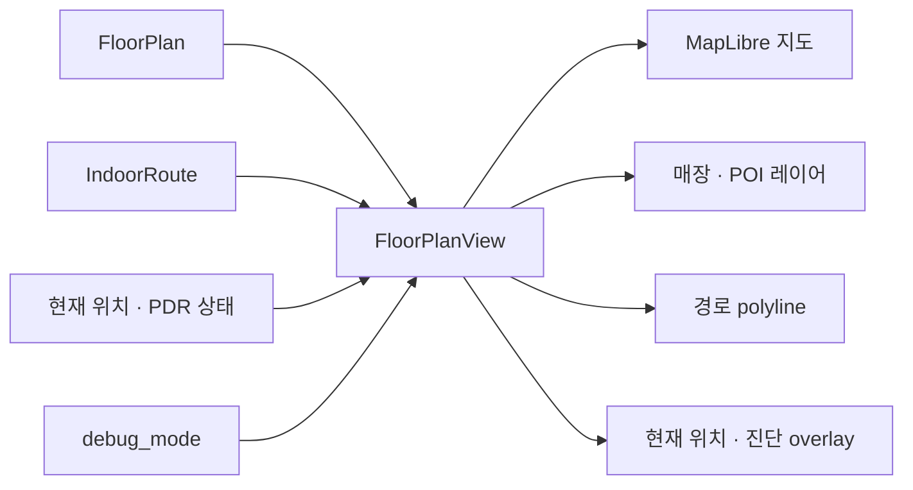

# `lib/widgets` — 재사용 UI와 지도 렌더링

여러 화면에서 다시 쓰는 시각 요소와 상호작용 묶음을 둔다. 단순 버튼부터 MapLibre 기반
층 지도처럼 상태가 큰 위젯까지 포함하지만, 화면 이동과 앱 전체 사용자 흐름은 소유하지 않는다.

## 구성

| 묶음 | 파일 | 역할 |
|---|---|---|
| 지도 | [`floor_plan_view.dart`](floor_plan_view.dart) | MapLibre 층 지도, 매장·POI·현재 위치·경로 표시 |
| 지도 | [`location_marker.dart`](location_marker.dart), [`uncertainty_circle.dart`](uncertainty_circle.dart) | 현재 위치와 불확실성 표현 |
| 지도 | [`floor_facility_style.dart`](floor_facility_style.dart), [`map_overlay_tap_guard.dart`](map_overlay_tap_guard.dart) | 수직이동 구조물·POI 아이콘/색 매핑, 오버레이 닫힘 직후 같은 포인터의 지도 오탭 차단 |
| 지도 셸 | [`map_top_bar.dart`](map_top_bar.dart), [`map_bottom_bar.dart`](map_bottom_bar.dart), [`eta_card.dart`](eta_card.dart), [`status_badge.dart`](status_badge.dart) | 지도 화면 공통 조작·상태 |
| 지도 셸 | [`floor_selector.dart`](floor_selector.dart) | 좌하단 세로 층 선택기(최대 5개 노출·현재 층 강조), 실내·야외 진입 오버레이 공유 |
| 탐색 | [`search_panel.dart`](search_panel.dart), [`directions_sheet.dart`](directions_sheet.dart), [`building_switcher_sheet.dart`](building_switcher_sheet.dart) | 매장 검색(경량)·AI 검색(의미), 출발/도착 검색, 건물 전환 |
| 장소 시트 | [`category_stores_sheet.dart`](category_stores_sheet.dart), [`place_detail_sheet.dart`](place_detail_sheet.dart), [`favorites_sheet.dart`](favorites_sheet.dart) | 카테고리 매장·매장 상세·즐겨찾기 |
| 장소 상세 | [`place_detail/`](place_detail/) | 상세 시트 본문의 섹션별 렌더러(summary·hero·menu·매장정보 등) |
| 카테고리 | [`category_icon.dart`](category_icon.dart), [`category_label_order.dart`](category_label_order.dart) | 카테고리 대분류 아이콘·색상(chip·시트·리스트 공유), label 중복 제거·가나다 정렬 |
| 공통 | [`sheet_header.dart`](sheet_header.dart), [`sheet_grab_handle.dart`](sheet_grab_handle.dart) | 시트 헤더, 시트 상단 크기 조절 손잡이 |

## 검색은 한 곳, 두 단계

검색은 [`map_top_bar.dart`](map_top_bar.dart)의 검색창에서 **그 자리에서** 이뤄지고,
결과는 바로 아래에 붙는 [`search_panel.dart`](search_panel.dart)가 보여준다. 한동안은
검색창을 탭하면 입력창이 하나 더 있는 시트가 올라왔는데, 방금 누른 창과 실제로 치는
창이 달라 검색창이 두 개인 것처럼 보였다. **다만 결과를 놓을 자리는 반드시 있어야
한다** — 결과 표시 없이 상단에서만 검색하면 그보다 더 예전처럼 스낵바로만 알리게 되어
"쳤는데 아무것도 안 나온다"가 된다.

사용자는 "일반 검색"과 "AI 검색"을 구분하지 않는다 — 매장 이름을 치든 자연어를 치든
같은 입력창에 치고, 어느 경로로 찾을지는 패널이 정한다.

- **타이핑이 300ms 멎으면**(`query` 변경): 경량 매칭(`/query/destination`). 형태소
  정규화(Kiwi)가 이 경로에 있어 매장 이름은 즉시 걸린다.
- **경량이 빈손이면**: 400ms를 더 기다렸다가 의미 검색(`/query/ai`)까지 자동으로 이어
  붙인다.
- **엔터로 확정**(`submitTick` 증가): 위 두 대기를 건너뛰고 같은 경로를 즉시 탄다.

의미 검색을 엔터에만 걸어 두지 않는 이유는 두 가지다. 한글 IME에서 첫 엔터가 조합
확정에 쓰이면 `onSubmitted`가 오지 않아 의미 검색이 아예 시작되지 않고, 그때까지 화면에는
경량이 빈손이라는 이유만으로 "찾지 못했어요"가 최종 결론처럼 떠 있게 된다. 최종 없음
문구는 의미 검색까지 끝난 `_SearchPhase.noMatch`에서만 나온다. 대신 비용은 디바운스를
두 단으로 나눠 막는다 — 경량은 예전처럼 빠르게 두고 비싼 의미 검색만 늦춘다.

두 요청 모두 실내 지도가 열려 있으면 `currentFloorId`를 함께 보낸다. "화장실"처럼 층
시설을 가리키는 질의가 건물 전체 정렬 순서상 우연히 걸리는 층(예: B6)이 아니라 지금
보고 있는 층으로 확정되게 하기 위해서다. 매장 이름을 아는 검색이 다른 층에 있어 1차가
이 때문에 빈손이 되더라도, 2차 의미 검색(`/query/ai`)은 층을 무시하고 건물 전체를 보므로
(`query_search.match_ai_destination`) 그 매장을 그대로 찾아낸다 — 사용자에게는 "뜻으로
찾았다" 배너가 붙어 나오는 차이만 있다.
층 스코프(`currentFloorId`)를 쓰는 건 이제 `search_panel.dart` 외에도
[`directions_sheet.dart`](directions_sheet.dart)와 카테고리 매장 시트가 있다.

의미 검색을 타이핑 중이 아니라 확정 시점에만 붙이는 이유는 비용이다. 백엔드가 임베딩
모델을 로드하면 첫 호출이 20초대까지 가므로, 글자마다 던지면 "밥"·"밥 먹"이 전부 모델을
태운다. **이 조건을 지우면 검색이 느려지는 게 아니라 멈춘 것처럼 보인다.**

예전에는 경로 안내 화면(`route_guide_screen.dart`)의 FAB가 `ai_search_sheet.dart`라는
별도 대화형 검색 시트를 열었다. 검색 진입점을 상단 검색 하나로 일원화하기로 하면서
그 시트와 FAB를 제거했다(W12) — 경로 안내 화면은 상단 검색 인프라(포커스 상태·지도
잠금 배선)를 갖고 있지 않아, 그 화면에 검색을 다시 붙이는 대신 진입점 자체를 없앴다.

## `FloorPlanView` 경계

`FloorPlanView`는 받은 `FloorPlan`, `IndoorRoute`, 위치 값을 렌더링한다. API에서 데이터를
가져오거나 최단 경로를 결정하는 책임은 화면·리포지토리에 있다.

```mermaid
flowchart LR
    PLAN["FloorPlan"]
    ROUTE["IndoorRoute"]
    POSITION["현재 위치 · PDR 상태"]
    DEBUG["debug_mode"]
    VIEW["FloorPlanView"]

    PLAN --> VIEW
    ROUTE --> VIEW
    POSITION --> VIEW
    DEBUG --> VIEW

    VIEW --> MAP["MapLibre 지도"]
    VIEW --> LAYERS["매장 · POI 레이어"]
    VIEW --> LINE["경로 polyline"]
    VIEW --> MARKER["현재 위치 · 진단 overlay"]
```

지원하지 않는 플랫폼에서는 `_UnsupportedPlatformNotice`를 표시한다. 웹·모바일별
렌더링 분기가 있으므로 지도 변경은 지원 대상 플랫폼을 나눠 확인한다.

## 콜백 규칙

- 시트는 검색·선택 결과를 콜백으로 돌려주고 route를 직접 바꾸지 않는다.
- 리포지토리를 쓰는 상태형 시트는 `service_locator`에서 주입된 인터페이스를 사용한다.
- 지도 위젯이 받은 모델을 수정하지 않는다. 상태 변경은 소유한 화면으로 올린다.

## 실패 지점

- `LatLng` 순서는 `(latitude, longitude)`, GeoJSON 좌표는 `[longitude, latitude]`다.
- `local_m`, WGS84, 화면 pixel을 섞으면 마커와 경로가 같은 지도를 가리키지 않는다.
- MapLibre controller가 준비되기 전에 source/layer를 갱신하면 초기 렌더가 누락될 수 있다.
- 시트 안에서 직접 전역 상태를 바꾸면 닫힘·재열림 시 선택 상태가 어긋나기 쉽다.

## 자주 하는 작업

| 하고 싶은 것 | 위치 |
|---|---|
| 지도 레이어·마커 변경 | `floor_plan_view.dart` |
| 경로 모양 변경 | `domain/route_guidance.dart`(`RoutePolylineSplit`)와 `models/indoor_route.dart` |
| 검색 입력/전체 층 토글 변경 | `directions_sheet.dart` |
| 공통 색·간격 변경 | [`../theme/README.md`](../theme/README.md) |

---

> **다음 읽기:** [`lib/screens` — 사용자 흐름을 조립하는 화면](../screens/README.md)
