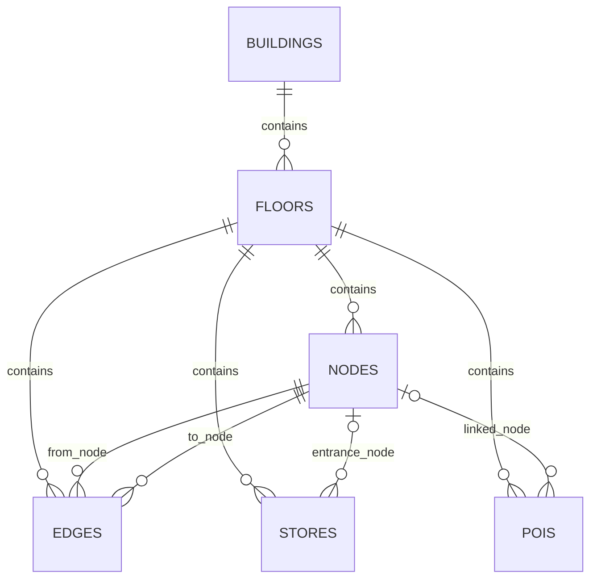
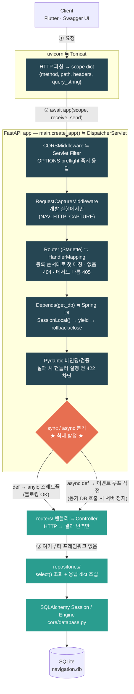
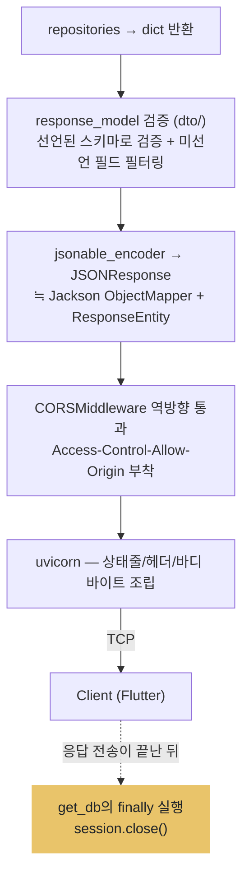
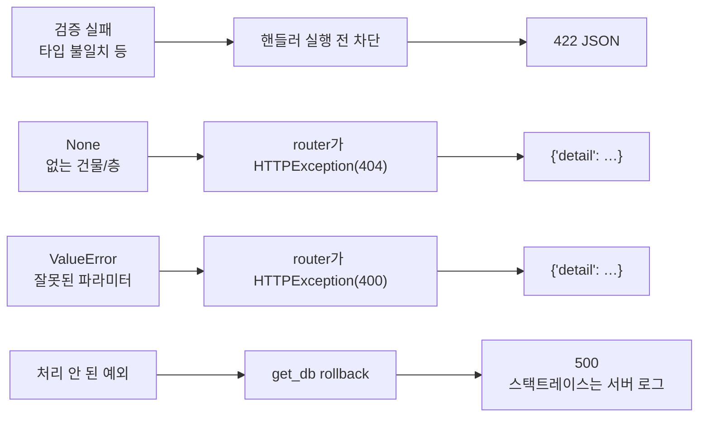
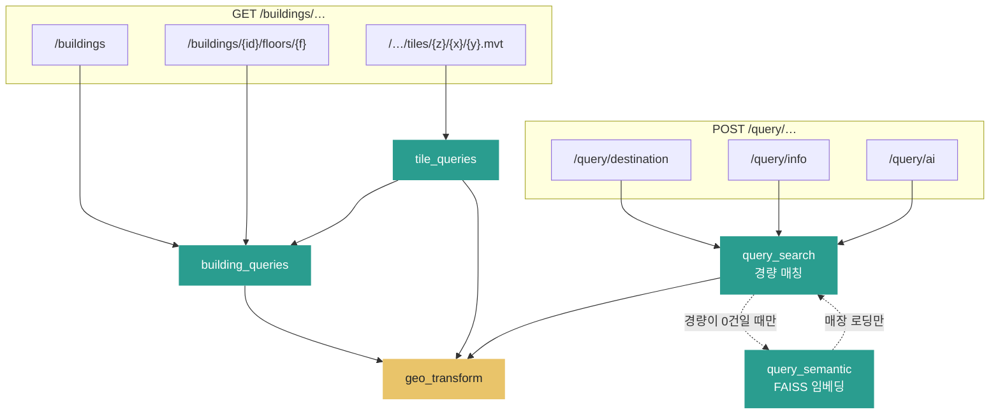
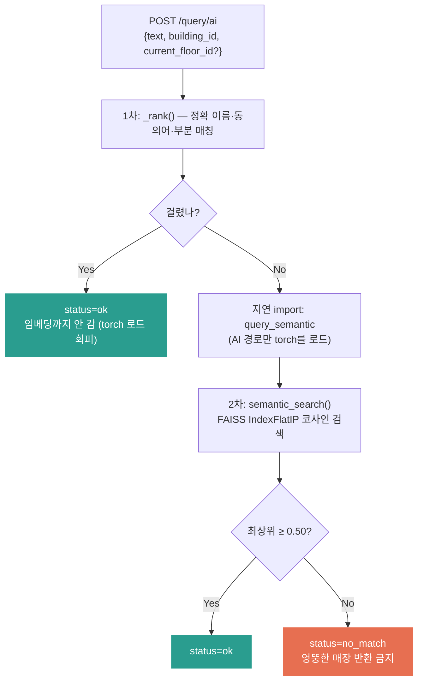

# FastAPI 요청 관통 흐름 — uvicorn부터 SQLAlchemy Session까지

> 요청 하나가 소켓에 도착해서 JSON 응답으로 나갈 때까지의 전체 경로와, 각 구간에서
> 알아야 하는 지식 정리. Spring 대응 개념을 `≒`로 병기한다.
> 기준 코드: `backend/app/main.py`, `app/core/database.py`, `app/routers/`,
> `app/repositories/`.
>
> **경로 계산은 서버에 없다.** 층 지도 응답의 `navigation_graph`(nodes·edges)를 받아
> 클라이언트가 온디바이스 Dijkstra(`client/lib/domain/dijkstra.dart`)를 실행한다.
> 서버는 그래프 데이터를 조회해 내려줄 뿐, 최단 경로를 계산하지 않는다.

## 0. 한 줄 대응표

| FastAPI 세계 | Spring 세계 |
|---|---|
| uvicorn | Tomcat (WAS) |
| ASGI 프로토콜 | Servlet 스펙 |
| `scope` dict / `Request` | `HttpServletRequest` |
| FastAPI `app` 객체 | DispatcherServlet + ApplicationContext |
| CORSMiddleware (미들웨어 스택) | Filter Chain |
| APIRouter / 경로 매칭 | HandlerMapping |
| `Depends(get_db)` | `@Autowired` (단, 기본 스코프가 요청) |
| SQLAlchemy `Session` | JPA `EntityManager` / Hibernate Session |
| `models/` (DeclarativeBase) | JPA `@Entity` |
| `selectinload()` | fetch join / `@BatchSize` |
| Pydantic 바인딩/검증 | `@PathVariable`/`@RequestParam`/`@RequestBody` + Bean Validation |
| `dto/` (response_model) | DTO + Jackson 직렬화 스키마 |
| router 함수 | `@RestController` |
| `HTTPException` + 기본 핸들러 | `@ExceptionHandler` |
| `jsonable_encoder` + `JSONResponse` | Jackson `HttpMessageConverter` + `ResponseEntity` |
| `lifespan` 컨텍스트 매니저 | `@PostConstruct` / `@PreDestroy` |
| pydantic-settings (`NAV_` 환경변수) | `application.yml` |

## 1. 데이터 객체 관계 — ORM 엔티티

스키마의 원천은 DDL 문자열이 아니라 `app/models/`의 SQLAlchemy 모델 선언이다.
`Base.metadata.create_all()`이 이 선언에서 테이블을 생성한다.



| 파일 | 엔티티 | 관계 |
|---|---|---|
| `models/building.py` | `Building`, `Floor` | `Building 1:N Floor` 양방향 (`back_populates`) |
| `models/navigation.py` | `Node`, `Edge` | `Edge → Node` 단방향 2개 (`foreign_keys` 명시) |
| `models/place.py` | `Store`, `Poi` | Floor 기준 컬렉션 + 선택적 Node FK |

전 필드가 들어간 클래스 다이어그램은 [`app/models/README.md`](../../backend/app/models/README.md) 참고.

관계 설계 규칙:

- `Node.outgoing_edges` 같은 역방향 컬렉션은 만들지 않는다. 서버는 그래프를 조회해
  응답 dict로 내보낼 뿐 서버에서 그래프를 순회하지 않으므로 역방향 관계가 필요 없다.
  경로 탐색은 클라이언트가 응답의 `navigation_graph`로 수행한다.
- `geometry`, `polygon`, `footprint_local_m` 같은 지도 좌표 배열은 관계로 분해하지 않고
  SQLite **JSON 컬럼**으로 유지한다. 별도 테이블로 분리하면 불필요한 JOIN만 늘어난다.
- 좌표는 `x_m`, `y_m` 평면 컬럼이다. `{"x": ..., "y": ...}` 중첩 JSON으로의 변환은
  `repositories/`가 응답 dict를 조립할 때 명시적으로 수행한다.

계층별 원천:

```text
테이블 스키마 표현   → models/       (DeclarativeBase 선언)
HTTP 계약 선언       → dto/          (Pydantic response_model)
데이터 조회·조립     → repositories/ (Session + select + dict)
그래프(nodes/edges)  → repositories/가 응답 dict에 실어 내려줌
최단 경로 계산       → 클라이언트 (client/lib/domain/dijkstra.dart)
화면 그래프 그리기   → Flutter
```

> 이 문서의 이전 판은 `schemas/`·`queries/`라는 이름을 썼다. 각각 `dto/`·`repositories/`로
> 바뀌었고, 디렉터리 이름 외에 역할은 같다.

## 2. 전체 관통 흐름 (요청 → 응답 왕복)



## 3. 되돌아가는 길 (응답 방향)



에러가 나는 경우의 경로:



## 4. 두 갈래의 요청 — 지도 조회와 자연어 질의

`/buildings/…`(GET)와 `/query/…`(POST)는 같은 계층 구조를 쓰지만 아래로 내려가는
경로가 다르다.



### 4-1. 층 지도 요청 — 그리고 경로 계산은 어디에

`GET /buildings/{b}/floors/{f}`는 한 층의 렌더링·경로 입력 데이터를 한 번에 내려준다.
핵심은 **DB는 Floor 단위로 필요한 행만 읽고, 응답 dict 조립은 `repositories/`가 명시적으로**
한다는 점이다. `Edge.from_node` 같은 ORM 관계를 루프에서 따라가면 간선마다 lazy load
쿼리(N+1)가 발생하므로, Node·Edge를 Floor 단위로 한 번에 조회해 dict로 조립한다.

```mermaid
flowchart TD
    call["building_queries.get_floor_map(session, building_id, floor_name)"]
    s1["1. Floor 조회 (building_id + floor_name)"]
    s404["없으면 None → 404"]
    s2["2. select(Store/Poi).where(floor_id=…)"]
    s3["3. select(Node/Edge).where(floor_id=…)"]
    asm["응답 dict 조립<br/>stores·pois → 표시용 좌표·이름·카테고리<br/>navigation_graph → {nodes, edges}<br/>from_node_id→'from', x_m/y_m→{x,y} 명시 변환"]
    dtoN["FloorMapResponse<br/>dto/floor_map.py + dto/route.py"]
    cli["Client — navigation_graph로 온디바이스 Dijkstra<br/>client/lib/domain/dijkstra.dart"]
    draw["Polyline·마커 렌더링 (Flutter)"]

    call --> s1
    s1 -.-> s404
    s1 --> s2 --> s3 --> asm --> dtoN --> cli --> draw

    classDef err fill:#e76f51,color:#fff,stroke:none
    class s404 err
```

`GET /buildings/{b}/floors/{f}/graph`는 같은 `navigation_graph`만 따로 내려주는
경량 엔드포인트다. 서버는 두 경로 모두에서 **그래프를 조회해 내려줄 뿐 탐색하지 않는다.**

> **왜 서버가 경로를 계산하지 않나.** 클라이언트가 층 지도 응답의 `navigation_graph`로
> 온디바이스 탐색을 이미 수행하므로 서버측 라우팅은 죽은 코드였다. 서버측 Dijkstra와
> `/route` 엔드포인트를 제거했다. 그래프 파이프라인(Node/Edge, 시드, 층 간 전이 간선,
> `/graph`, 응답의 `navigation_graph`)은 클라이언트의 라우팅 입력으로 그대로 남아 있다.
> 층 간(건물 전체) 경로는 현재 범위에서 빠졌고, 클라이언트는 단일 층 탐색만 수행한다.

### 4-2. 자연어 질의 — 하이브리드 2단 경로

`POST /query/ai`는 경량 문자열 매칭을 먼저 시도하고, 0건일 때만 임베딩 의미 검색으로
넘어간다.



- **브랜드명은 문자열 일치가 임베딩보다 정확하고 안전하다.** 그래서 1차가 먼저다.
- **임계값 0.50은 정밀도 우선 선택이다.** 길찾기에서는 틀린 매장을 안내하는 것이
  "다시 말해 주세요"보다 나쁘다. 근거는 [`docs/backend/native/FAISS.md`](native/FAISS.md) 11-1절.
- `current_floor_id`는 **층 라벨("B2")과 내부 id("FL-…") 둘 다** 받는다. 클라이언트는
  사용자가 보는 라벨만 들고 있기 때문이다.

### 계층별 책임

| 계층 | 담당 | 담당하지 않는 것 |
|---|---|---|
| `models/` | 테이블 스키마 선언 (DeclarativeBase) | HTTP, 조회 로직 |
| `dto/` | HTTP 계약(나가는 모양) 선언 | 값 생성, ORM import |
| `repositories/` | Session 기반 조회, 응답 dict 조립 (그래프 포함) | HTTP 타입 import, 경로 계산 |
| `routers/` | 파라미터 검증, 조회 호출, HTTP 응답·오류 변환 | ORM 조회, 경로 계산 |
| Flutter | `navigation_graph`로 온디바이스 경로 탐색, 렌더링 | — |

### DB 관점과 응답 조립 관점

| 관점 | 실제로 하는 일 |
|---|---|
| SQLite | `WHERE floor_id = ?`로 필요한 Store·Poi·Node·Edge 행만 선별 |
| SQLAlchemy | row를 ORM 객체로 매핑 |
| `repositories/` | 조회 결과를 Flutter 계약에 맞는 dict로 조립 (`navigation_graph` 포함) |
| Flutter | 받은 그래프로 인접 리스트를 만들어 온디바이스 탐색 |

DB는 데이터 선별과 저장을, 서버는 조회·직렬화를, 최단 경로 계산은 클라이언트가 담당한다.

## 5. 단계별 상세 지식

### 0단계. 서버 기동 (요청이 오기 전)

`uvicorn app.main:app --port 8001` 실행 시:

1. uvicorn이 `app.main` 모듈을 **import** → `create_app()` 실행
   (FastAPI 생성, `add_middleware`, `include_router`, `/health` 등록).
   Spring의 ApplicationContext 초기화에 해당하지만 **컴포넌트 스캔이 없다** —
   전부 명시적으로 조립한다.
2. `app.core.database` import 시점에 `Settings` 로드(환경변수 `NAV_DATABASE_URL`)와
   **Engine 생성**이 한 번 일어난다. Engine·SessionLocal은 프로세스 전역이다.
3. 소켓(개발·Docker 모두 8001)을 열고 **asyncio 이벤트 루프** 시작.
4. **`lifespan`에서 DB를 초기화하지 않는다.** `drop_all/create_all/seed`는
   `python -m scripts.seed.reset_and_seed` CLI에서만 실행한다.
   현재 lifespan이 하는 일은 **개발 진단 로그 정리뿐**이며, `NAV_HTTP_CAPTURE`가
   켜졌을 때만 등록된다(`main._development_log_lifespan`).

```python
# main.py — on_event는 FastAPI 0.115에서 deprecated라 lifespan을 쓴다.
@asynccontextmanager
async def _development_log_lifespan(app: FastAPI) -> AsyncIterator[None]:
    start_runtime_logs()      # ← startup: 이전 실행의 로그를 비운다
    try:
        yield                 # ← 여기서 서버가 요청을 받는다
    finally:
        clear_runtime_logs()  # ← shutdown: 진단 파일을 지운다
```

`lifespan`은 `FastAPI()` **생성자 인자**라서, 진단 캡처 여부를 앱을 만들기 전에
결정해야 한다(`on_event`는 앱 생성 후 등록이 가능했다).

### 1단계. uvicorn — TCP → scope

HTTP 바이트를 파싱해 `scope`(dict)를 만든다. method, path, 헤더, 쿼리스트링이
들어있는 `HttpServletRequest`의 원재료다.

### 2단계. 미들웨어

- `add_middleware`로 등록한 것들이 앱을 양파처럼 감싼다. 요청은 바깥→안,
  응답은 안→바깥.
- **CORSMiddleware**는 브라우저의 **preflight OPTIONS**를 라우터 도달 전에 가로채
  즉시 응답하고, 실제 응답에는 `Access-Control-Allow-Origin`을 붙인다.
  CORS는 **브라우저 보안 모델**이다. Flutter 모바일 앱/curl에는 관여하지 않는다.
- **RequestCaptureMiddleware**는 개발 실행에서만 붙는다(`NAV_HTTP_CAPTURE=1`).
  요청 JSON과 응답 상태를 `backend/app/args/*.json`에 남긴다. 비밀값으로 보이는
  키(`password`, `token` 등)는 `***`로 마스킹하고, `/health`는 Docker healthcheck가
  주기적으로 때리므로 **기동 후 첫 한 건만** 기록한다.
  파일 쓰기가 실패해도 실제 API 응답을 막지 않는다(`except OSError: pass`).

### 3단계. 라우팅

- `APIRouter(prefix="/buildings")` + `@router.get("/{building_id}")`는 include 시점에
  정규식으로 컴파일된다.
- **등록 순서대로 첫 매칭 승리.** 고정 경로는 파라미터 경로보다 먼저 등록한다.
- 경로 없음 → 404, 경로는 맞고 메서드 다름 → 405. 둘 다 라우터 단계에서 종료.

### 4단계. Depends (DI)

Spring DI와 결정적으로 다른 점 3가지:

1. **기본 스코프가 싱글톤이 아니라 요청.** 매 요청 `get_db()`가 다시 불려
   새 Session을 만든다. Engine처럼 프로세스 전역이어야 하는 것은 모듈 전역에 둔다.
2. **같은 요청 안에서는 동일 dependency가 캐시**된다 (`use_cache=True` 기본).
3. **`yield` dependency**로 자원 정리를 한다. 현재 `core/database.py`의 `get_db`:

```python
def get_db() -> Iterator[Session]:
    session = SessionLocal()
    try:
        yield session       # ← 여기서 핸들러 실행
    except Exception:
        session.rollback()  # ← 핸들러 밖 예외의 최종 안전망
        raise
    finally:
        session.close()     # ← 응답 전송 후 실행
```

읽기 API뿐이므로 `get_db()`는 자동 commit하지 않는다. 쓰기 유스케이스가 생기면
해당 핸들러/조회 함수가 명시적으로 `session.commit()`한다.

### 5단계. 파라미터 바인딩 + 검증 (Pydantic)

타입 힌트만 보고 값의 출처를 결정한다:

| 시그니처 | 출처 | Spring |
|---|---|---|
| 경로 템플릿에 있는 이름 (`building_id: str`) | URL 경로 | `@PathVariable` |
| 경로에 없는 단순 타입 (`q: str = ""`) | 쿼리스트링 | `@RequestParam` |
| Pydantic 모델 타입 (`body: DestinationRequest`) | 요청 바디 JSON | `@RequestBody` |
| `Depends(...)` | DI | `@Autowired` |

검증 실패는 핸들러 실행 전에 **422**로 차단된다. 예: `/query/destination`의
`text: str = Field(min_length=1)`은 빈 문자열을 핸들러 도달 전에 막는다.
ORM 엔티티(`models/`)와 HTTP 계약(`dto/`)을 분리하는 이유는 Entity/DTO 분리 이유와 같다.

### 6단계. ★ sync vs async (가장 중요)

- **`def` 핸들러** → anyio **스레드풀**(기본 40)에서 실행. 블로킹 IO 안전.
- **`async def` 핸들러** → **이벤트 루프에서 직접** 실행. 내부에서 동기 SQLAlchemy,
  `requests`, `time.sleep()` 같은 블로킹 호출을 하면 **서버 전체가 정지**한다.

규칙: **동기 SQLAlchemy를 쓰는 동안 모든 핸들러는 `def`로 선언한다.**
`async def`는 `httpx`, async SQLAlchemy처럼 await 가능한 스택으로 바꿀 때만 쓴다.

`/query/ai`의 임베딩 검색도 같은 이유로 `def`다. 모델 인코딩은 CPU 바운드 블로킹
작업이라 이벤트 루프에서 직접 돌리면 안 된다.

### 7단계. router → repositories

프레임워크 마법이 없는 순수 Python 구간. 계층별 계약:

- **router**: HTTP만 안다. `None` → 404, `ValueError` → 400 번역. 비즈니스 로직 금지.
- **repositories**: Session 기반 조회와 응답 dict 조립(그래프 포함). `HTTPException`
  import 금지. `None` = 없는 건물/층, 빈 list = 검색 결과 없음이 규약.
- 형식적인 Service 계층은 두지 않는다. 서버는 조회·직렬화만 하고 경로 계산은
  클라이언트가 담당하므로 별도 계산 계층이 필요 없다.

함수 단위 호출 관계는 [`app/repositories/README.md`](../../backend/app/repositories/README.md)에
모듈별 다이어그램으로 있다.

로딩 전략:

- `GET /buildings`는 `selectinload(Building.floors)`로 층 목록 N+1을 제거한다.
- 여러 컬렉션을 `joinedload()`로 한꺼번에 묶으면 곱집합으로 행이 폭증하므로
  컬렉션에는 `selectinload()` 또는 명시적 `select()`만 쓴다.
- 층 지도/그래프 조회는 관계 순회 대신 Floor 단위 명시적 조회로 처리한다.

SQLAlchemy + 스레드 지식:

1. `def` 핸들러는 스레드풀에서 돌므로 요청마다 스레드가 다를 수 있다.
   Session은 스레드 간 공유하면 안 되므로 **요청당 생성·종료**한다 (yield dependency).
   SQLite 연결 옵션에 `check_same_thread=False`를 주는 이유도 스레드풀 실행 때문이다.
2. Engine의 커넥션 풀은 프로세스 전역으로 재사용된다.
3. **FAISS 인덱스는 `store_id`만 캐시하고 ORM 객체는 캐시하지 않는다.** 인덱스는
   요청을 넘어 살아남지만 Session은 요청마다 닫히므로, ORM 객체를 들고 있으면
   detached 객체를 만지게 된다. 매 요청 현재 세션으로 다시 읽는다.

### 8단계. 직렬화

- 반환 dict → `response_model` 스키마로 **검증 + 미선언 필드 필터링**
  (내부 필드 유출 방지 안전장치. `/health`를 포함한 대부분의 엔드포인트에 선언되어 있다)
  → `jsonable_encoder` → `JSONResponse`.
- **예외: 타일과 글리프.** `/…/*.mvt`와 `/fonts/…`는 JSON이 아니라 바이너리를
  그대로 내보내므로 `response_model`이 없다(`Response(media_type=…)` 직접 반환).
- ORM 필드명과 API JSON 키가 다르면 (`from_node_id` → `from`) Pydantic 자동 매핑에
  의존하지 않고 `repositories/`가 명시적으로 dict를 조립한다. Flutter 계약이 우선이다.

### 9단계. 반환

`JSONResponse`가 미들웨어를 역순 통과(CORS 헤더 부착) → ASGI `send` → uvicorn이
HTTP 바이트로 조립해 소켓에 쓴다. yield dependency의 `finally`(session.close)는
응답 전송 후 실행된다.

## 6. 꼭 기억할 것 7개

1. **uvicorn=Tomcat, FastAPI=Spring MVC, ASGI=Servlet 스펙, Session=EntityManager,
   Pydantic=DTO+Validation, Depends=DI** — 역할 대응만 잡으면 구조는 같다.
2. 단일 스레드 이벤트 루프가 기본. **동기 SQLAlchemy를 쓰는 핸들러는 반드시 `def`**
   (`async def` + 동기 DB = 서버 정지).
3. Depends는 **요청 스코프가 기본**. Session은 요청마다, Engine은 프로세스마다.
4. 자원 정리는 **yield dependency** (`rollback`/`close`). 서버 기동 시 DB 초기화 금지 —
   `lifespan`이 하는 일은 개발 진단 로그 정리뿐이다.
5. 컬렉션 로딩은 **selectinload**, 그래프는 **Floor 단위 명시 조회로 내려주고 탐색은
   클라이언트가** — 서버는 경로를 계산하지 않는다(온디바이스 Dijkstra).
6. 라우트는 **등록 순서 매칭** → 고정 경로를 파라미터 경로보다 먼저.
7. 스키마의 원천은 `models/`, HTTP 계약의 원천은 `dto/`, 변환은 `repositories/`가
   명시적으로 수행한다 — Flutter가 소비하는 JSON 키가 항상 우선이다.
