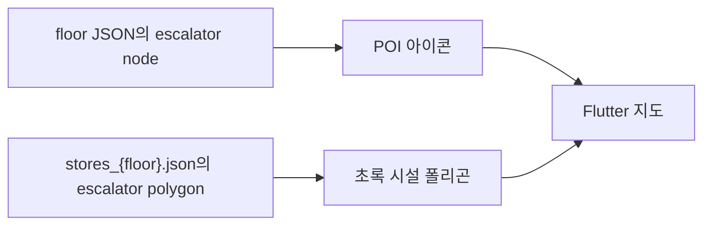
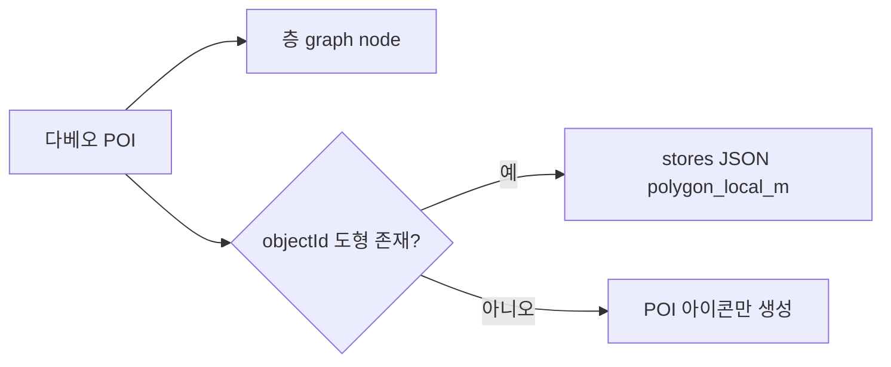

# 에스컬레이터 폴리곤 누락 보정 — 작업 인수인계

## 목적

더현대서울 12개 층 지도에서 에스컬레이터 아이콘(POI)은 보이지만, 그 위치에 대응하는
초록색 설비 면 폴리곤이 일부만 그려지는 문제를 고친다. 경로 그래프나 Flutter 렌더러를
보정하는 작업이 아니라, 실제 Studio 시설 데이터(`stores_{floor}.json`)를 보완하는 작업이다.

## 증상과 확인 결과

클라이언트는 다음 두 데이터를 별도로 렌더링한다.



- 에스컬레이터 node는 12개 층에 총 **152개**가 있다.
- `stores_*.json`의 `subcategory: "escalator"` 폴리곤은 총 **43개**다.
- 원본 폴리곤 1개는 **lane(에스컬레이터 한 대) 1개**에 대응한다. 폭은 12개 층 모두
  1.60m로 같고, 길이는 자기 node에서 마주 보는 줄과의 중앙선까지다. 따라서 필요한
  폴리곤 수는 node 수와 같은 **152개**이며 **109개가 누락**된 상태였다.
  (43개 중 40개는 POI `objectId`로 node에 붙고, 3개는 좌표로 붙는다.)
- 예를 들어 1F와 2F는 node 16개·폴리곤 4개다. 화면에서는 한쪽 에스컬레이터 군만
  초록 사각형으로 보이고, 반대쪽에는 아이콘만 보인다.

> 초안에서는 "폴리곤 하나가 node 2개를 담당하므로 76개가 필요하다"고 봤다. 실제
> 좌표를 재보니 1F ES1 bank의 node 4개는 x로 2m씩 벌어진 나란한 lane 4줄이고,
> 존재하는 폴리곤은 그중 한 줄만 덮는 폭 1.6m짜리였다. 그래서 1:1 대응으로 고쳤다.

`client/lib/widgets/floor_plan_view.dart`는 이름이 `에스컬레이터`인 store 폴리곤을
이미 초록색으로 표시한다. 따라서 클라이언트 렌더링 코드는 이번 범위에서 변경하지 않는다.

## 원인

`scripts/transform/build_studio_from_dabeeo.py`는 다베오 원본 POI의 `objectId`로 연결되는
도형만 `polygon_local_m`에 저장한다. 원본에 연결 도형이 없는 에스컬레이터 POI는 node와
POI 아이콘으로는 남지만, store 폴리곤은 생성되지 않는다.



## 변경 범위

### 바꾼 파일

- `backend/resources/studio/thehyundai-seoul-dabeeo/stores_b6.json` … `stores_6f.json`
  - 12개 층에 `derived-escalator-*` store 109개를 추가했다. 기존 원본 store는
    한 건도 수정하지 않았다.

보정은 **일회성 작업**으로 처리했다. 생성기는 저장소에 남기지 않고 결과 데이터만
커밋한다. 규칙은 아래 "보정 데이터 규칙"에 남겨 두었으니, 다시 만들어야 하면 이
문서를 근거로 재작성한다.

### 건드리지 않은 파일

- `client/lib/widgets/floor_plan_view.dart`: 현재 fill 레이어와 색상 규칙은 이미 맞다.
- 수직 전이 생성(`scripts/transform/vertical_transfers.py`): 경로 데이터는 정상이다.
- 에스컬레이터 node·POI: 새로 추가하면 아이콘 및 경로가 중복되므로 절대 추가하지 않는다.

## 보정 데이터 규칙

보정 store는 기존 스키마를 그대로 사용한다.

```json
{
  "id": "derived-escalator-1f-ND-5_0BwXc265244",
  "name": "에스컬레이터",
  "category": "편의시설",
  "subcategory": "escalator",
  "floor_id": "<기존 floor id>",
  "entrance_node_id": null,
  "entrance_local_m": {"x": 0.0, "y": 0.0},
  "centroid_local_m": {"x": 0.0, "y": 0.0},
  "polygon_local_m": [
    {"x": 0.0, "y": 0.0},
    {"x": 0.0, "y": 0.0},
    {"x": 0.0, "y": 0.0},
    {"x": 0.0, "y": 0.0}
  ],
  "match": {
    "method": "derived_escalator_nodes",
    "review_required": true
  }
}
```

- `id`는 `derived-escalator-{층}-{node id}`다. node id가 층 안에서 유일하므로
  원본 POI ID와 충돌하지 않고, 다시 만들어도 같은 값이 나온다.
- node 이름에서 괄호와 `-UP`/`-DN`을 뗀 앞부분(`ES1`, `ES2-1` …)이 설비 bank다.
- 한 bank의 node는 서로 15~19m 떨어진 **두 줄**로 놓인다. 한 줄 안 lane 간격은
  1.2~2.1m이므로 3m를 기준으로 줄을 가른다.
- 기존 원본 폴리곤은 절대 움직이지 않는다. 폴리곤이 없는 lane만 만든다.

lane을 만드는 방법은 본뜰 원본이 어디 있느냐로 갈린다.

| 상황 | 방법 |
|---|---|
| 같은 줄에 원본이 있다 | 원본을 node 간격만큼 평행 이동(`translate`) |
| 마주 보는 줄에 원본이 있고, 원본 길이가 두 줄 간격의 70% 미만 | 원본이 끝나는 모서리를 중앙선으로 보고 뒤집는다(`mirror`) |
| 마주 보는 줄에 원본이 있고, 원본이 전 구간을 덮는다 | 뒤집지 않고 **원본 폭만큼** 옆으로 민다(`sidestep`) |

세부 규칙은 화면 검토에서 하나씩 잡은 것들이다.

- **각도는 원본 폴리곤의 긴 변에서 가져온다.** node 줄의 중심선으로 축을 잡으면
  두 줄의 가로 어긋남(0.25m)이 0.8° 기울기가 되고, 뒤집으면서 2배가 되어 lane이
  눈에 띄게 삐뚤어진다.
- **가로 위치는 node 좌표가 아니라 원본 lane 중심 + node 간격이다.** node와 lane
  중심이 0.27m 차이 나서, node에 그대로 맞추면 위아래 줄에 단이 생긴다.
- **마주 보는 두 줄의 lane은 열을 맞춘다.** 짝은 가로 순서대로 1:1로 맺는다
  (가까운 것끼리 맺으면 두 lane이 한 열에 겹쳐 붙는다). 이동 한도는 기준 줄 lane
  간격의 절반까지다. 단, 열을 맞춰야 아이콘이 자기 면 위로 들어오는 경우
  (B6처럼 원본이 자기 node에서 1.7m 벗어난 층)에는 한도를 넘겨서라도 맞춘다.
- **마주 보는 lane끼리 딱 맞닿게 세로로도 맞춘다.** 본뜬 원본이 다르면 중앙선이
  2cm쯤 어긋나 미세하게 겹친다.
- **이미 그 자리를 덮는 면이 있으면 만들지 않는다.**

## 최상층·최하층이 다른 점

6F는 원본 하나가 공백부 전 구간(15.5m 중 12.8m)을 덮는다. 연결되는 층이 하나뿐이라
올라가는 lane과 내려가는 lane이 같은 통로를 나란히 쓰고, 두 node는 그 통로의 양 끝에
있다. 여기에 중앙선 규칙을 적용하면 폴리곤이 건물 밖으로 나간다(`y 128.8`, `y 166.6`).
그래서 이 경우만 `sidestep`으로 처리한다. B6는 원본이 절반만 덮어 일반 규칙을 따른다.

또한 두 node 간격(6F 기준 1.2m)은 lane 폭(1.6m)이 아니다. 나란한 lane의 간격이 아니라
같은 통로의 양 끝 사이 거리라, 이 값으로 밀면 두 lane이 0.38m 겹쳐 한 덩어리로 보인다.

## 실패 조건과 방지책

| 실패 조건 | 방지책 |
|---|---|
| 서로 다른 bank를 하나의 폴리곤으로 잘못 연결 | node 이름의 `ES*` bank와 거리 두 기준을 함께 사용 |
| 원본 폴리곤을 중복 생성 | 기존 폴리곤을 가까운 bank·방향에 먼저 배정하고 부족분만 생성 |
| 재실행 때 store가 계속 늘어남 | `derived-escalator-` ID를 먼저 제거하고 원본만 본떠 결정적으로 재생성 |
| 다베오 원본 재생성 뒤 보정이 사라짐 | **미해결.** 아래 "남은 위험" 참고 |
| 경로·아이콘 중복 | node/POI는 수정하지 않고 store 폴리곤만 추가 |
| 생성 위치가 실제 동선과 다름 | 1F 화면 검토 후 12개 층으로 확대; `review_required: true` 유지 |

## 검증 기준과 결과

12개 층 데이터에서 아래를 모두 확인했다.

| 항목 | 결과 |
|---|---|
| 층별 에스컬레이터 폴리곤 수 = node 수 | 152 = 152 |
| 마주 보는 lane 사이 세로 겹침 | 0㎡ |
| 같은 열 위·아래 폴리곤 가로 단차 | 0.000m |
| 파생 lane 각도와 그 층 원본 각도의 차 | 0.00° |
| 아이콘이 자기 면 밖에 있는 lane | 1개 (3F `ES2-1-UP(FR2F)`, 0.16m) |
| 건물 외곽선을 벗어난 꼭짓점 / store ID 중복 / 면적 0 | 0 / 0 / 0 |
| 재생성 시 JSON diff | 없음 |
| `python -m scripts.seed.reset_and_seed` | 통과 |
| `pytest tests -q` | 219 passed, 2 skipped |

`polygon_local_m`은 모두 4점이고 폭은 원본과 같은 1.60m다.

### 화면 검증

백엔드와 Flutter를 AGENTS.md의 UTF-8 foreground 창 규칙대로 띄우고 1F를 먼저
확인한 뒤 12개 층으로 확대했다. 삐뚤어진 각도, 위아래 열 단차, 6F 겹침, B6에서
아이콘이 면 밖에 뜨는 문제를 이 과정에서 잡았다.

재시드는 **서버를 멈춘 뒤에** 한다. uvicorn이 떠 있는 상태에서
`reset_and_seed`를 돌리면 테이블이 드롭되면서 서버가 조용히 죽는다.

Windows PowerShell 5.1에서 `uvicorn ... 2>&1 | ForEach-Object`를 쓰면 Uvicorn의
일반 `stderr` 로그가 `NativeCommandError`처럼 빨갛게 보일 수 있다. 이는 서버 기동 실패와
구분해야 하며, `/health` 응답과 실제 프로세스 상태로 확인한다. 실행 창은 AGENTS.md의
UTF-8 foreground 실행 규칙을 따른다.

## 남은 위험

- **다베오 원본에서 Studio JSON을 재생성하면 이 보정이 전부 사라진다.**
  `build_studio_from_dabeeo.py`는 POI에 `objectId`로 붙은 도형만 쓰기 때문이다.
  보정기를 저장소에 남기지 않았으므로, 재생성할 일이 생기면 이 문서의 규칙으로
  다시 만들어야 한다.
- 같은 줄 이웃 lane끼리 0.26~0.4m 물리는 구간이 있다(B1 2.66㎡, B2 2.09㎡ 등).
  node 간격이 원본 lane 폭 1.6m보다 좁은 자리다. 원본 폭을 깨야 없앨 수 있어 뒀다.
- 생성 위치는 원본 형상과 node 좌표에서 유도한 값이지 실측이 아니다. 모든 보정
  store에 `match.review_required: true`가 남아 있다.
- 4F 중앙 `ES2` bank는 node가 2개(3F 방향만)라 5F로 올라가는 lane이 `ES2-1`
  하나뿐이다. 원본 node가 그렇게 되어 있고 앞뒤 층과도 맞지만, 실제 설비와
  다르면 node 자체가 누락된 것이므로 별도 작업이 필요하다.

## 관련 문서

- [Studio 원본 데이터 구조](../../../backend/resources/studio/README.md)
- [수직 이동 라우팅 설계](vertical-transfer-routing.md)
- [로컬 개발 가이드](../../guide/local-development-guide.md)

---

> **다음 읽기:** [수직 이동 라우팅 설계](vertical-transfer-routing.md)
