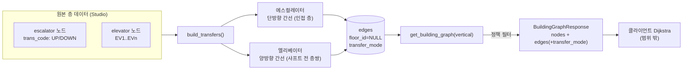

# 수직 이동(엘리베이터·에스컬레이터) 라우팅 — 구현 설계

층 간 이동을 어떤 수단으로, 어느 방향으로, 얼마의 비용으로 할지를 **백엔드가 내보내는 그래프**로
결정하는 설계 문서다. 최단 경로 계산 자체는 클라이언트 온디바이스 Dijkstra
([`client/lib/domain/dijkstra.dart`](../../../client/lib/domain/dijkstra.dart))가 하고,
서버는 nodes·edges만 준다. 따라서 수단 선호·방향·불가능 경로 차단은 **전부 간선의
존재·방향(`bidirectional`)·가중치(`length_m`)로만** 인코딩된다.

> **구현 완료 상태.** 간선 생성은
> [`scripts/transform/vertical_transfers.py`](../../../backend/scripts/transform/vertical_transfers.py),
> 서빙은 `GET /buildings/{id}/graph?vertical=auto|elevator|escalator`
> ([`building_queries.get_building_graph`](../../../backend/app/repositories/building_queries.py))에서 처리한다.
> 기본 정책은 `auto`(층수에 따라 수단 자동 선택). 클라이언트의 다층 그래프 연동은 이 문서 범위 밖이다.

## 1. 해결할 문제

기존 `build_transfers`는 층 간 전이 간선을 **위치 근접만으로** 맞춰 만들었고, 세 가지가 틀렸다.

- **불가능 경로.** 에스컬레이터는 상/하행이 분리돼 있는데(원본 데이터의 `trans_code`가
  `OB-ESCALATOR_UP`/`OB-ESCALATOR_DOWN`으로 방향을 준다), 방향을 버리고 `bidirectional=True`로
  만들어 **상행 전용을 하행으로 타는** 경로가 생겼다.
- **수단 구분 없음.** 엘리베이터·에스컬레이터가 모두 동일한 `length_m = 20.0`이라, Dijkstra는
  수평 보행거리만 보고 골랐다. 에스컬레이터가 더 많고(1F 16개 vs 엘리베이터 5개) 중앙에 있어
  **거의 항상 에스컬레이터가 최단**으로 잡혔다.
- **서빙 누락.** 전이 간선은 `floor_id=None`인데, 그래프 서빙이 `floor_id == floor.id`로 필터해
  **전이 간선이 클라이언트로 나가지 않았다.** 즉 층 간 라우팅이 종단으로 동작하지 않았다.

### 완료 조건 (Definition of Done)

- 에스컬레이터로는 **진행 가능한 방향으로만** 이동한다(불가능 경로 제거).
- **층수 기준으로 수단이 갈린다** — 가까운 한두 층은 에스컬레이터, 여러 층은 엘리베이터.
  단, **가까운 기기**가 있으면 그쪽이 우선한다(근접성 반영).
- 전이 간선이 실제로 **서빙**되어 클라이언트가 층 간 경로를 계산할 수 있다.
- 수단 정책(엘리베이터만/에스컬레이터만)을 **재시드 없이** 바꿀 수 있다.

## 2. 범위

- **범위 안 — 백엔드 그래프.** 전이 간선 생성(방향·비용) + 건물 전체 그래프 서빙 + 정책 필터.
- **범위 밖 — 클라이언트 연동.** 앱이 `GET /{id}/graph`를 받아 다층 그래프로 Dijkstra를 돌리는 작업.
  이 백엔드 변경은 그 연동이 붙기 전까지 **앱 동작을 바꾸지 않는다**(그래프 데이터만 올바르게 준비).
- **범위 밖 — 경로 계산.** 서버는 그래프만. 최단 경로는 클라이언트.
- **범위 밖 — 계단·경사로.** 현재 원본 데이터의 수직 수단은 엘리베이터·에스컬레이터뿐이다.

## 3. 아키텍처 — 층별 그래프 vs 건물 전체 그래프

```
GET /buildings/{id}/floors/{floor}/graph   층 내부 간선만 (floor_id 필터). 한 층 안 경로.
GET /buildings/{id}/graph?vertical=auto     전 층 노드 + 층 내부 간선 + 수직 전이 간선. 층 간 경로.
```

전이 간선은 특정 층에 속하지 않으므로(`Edge.floor_id = NULL`) 층별 조회에서 자연히 빠진다.
건물 전체 그래프만 이들을 합쳐 층 간 이동을 가능하게 한다. 노드에는 `floor_id`를 함께 실어
클라이언트가 전 층 노드를 층별로 다시 나눌 수 있게 한다.



## 4. 에스컬레이터 — 방향을 지키는 단방향 간선

- 원본 노드의 `source.trans_code`(`OB-ESCALATOR_UP`/`_DOWN`)로 방향을 읽는다. 없으면 이름
  (`ES1-UP`/`ES1-DN`)을 폴백으로 본다.
- **인접 층끼리만** 잇는다(에스컬레이터는 한 층씩 오르내린다).
- 방향별로 나눠 매칭한다 — 상행 노드는 상행끼리, 하행 노드는 하행끼리. 그래야 물리적으로 존재하는
  세그먼트만 남고 반대 방향 통행이 끼지 않는다.
- 간선은 `bidirectional=False`. 상행은 아래층→위층, 하행은 위층→아래층으로 `from/to`를 잡는다.

이 두 가지(방향별 매칭 + 단방향)가 **불가능 경로를 원천 차단**한다. 상행 전용 노드만 있으면
하행 간선은 아예 만들어지지 않는다.

> **매칭의 한계.** 한 층에는 "이 층에서 위로 올라가는 에스컬레이터의 시작점"과 "아래층에서 올라온
> 도착점"이 둘 다 상행 노드로 존재한다. 후자는 위층에 대응이 없어 `unresolved`로 남는다 — 이는
> 놓친 간선이 아니라 예상된 진단성 노이즈다. 실데이터에서 상행 16·하행 16 간선이 생성되고,
> 같은 층을 잇는 잘못된 간선은 0건이다.

## 5. 엘리베이터 — 샤프트 직행 + 층수 비례 비용

- 층이 달라도 같은 자리에 있는 엘리베이터를 **샤프트**로 묶는다(위치 근접 클러스터링, 반경 8m).
- 한 번 타면 여러 층을 직행하므로, 샤프트가 **서비스하는 모든 층쌍**을 양방향으로 잇는다
  (인접 층만 잇던 예전 방식과 다르다).
- 비용은 **홉 수**(정렬상 층 간격)에 비례한다. `level` 차가 아니라 홉 수를 쓰는 이유:
  지상/지하 사이에 `level 0`이 없어(1F=1, B1=−1) `level` 차가 실제 층수를 한 칸 부풀린다.

## 6. 비용 모델 — 층수로 수단을 가르는 핵심

클라이언트 Dijkstra는 순수 거리 합만 본다. 수단 선호는 전적으로 이 가중치로 인코딩된다.

| 상수 | 값 | 의미 |
|---|---|---|
| `ESCALATOR_HOP_M` | 20.0 | 에스컬레이터 한 층 세그먼트 비용 (n층 = 20 × n) |
| `ELEVATOR_BOARD_M` | 35.0 | 엘리베이터 고정 탑승비 |
| `ELEVATOR_PER_FLOOR_M` | 5.0 | 엘리베이터 층당 비용 |

두 모델의 교차:

| 이동 층수 n | 에스컬레이터 20n | 엘리베이터 35+5n | 최단 |
|---|---|---|---|
| 1 | 20 | 40 | **에스컬레이터** |
| 2 | 40 | 45 | **에스컬레이터** |
| 3 | 60 | 50 | **엘리베이터** |
| 4 | 80 | 55 | **엘리베이터** |

→ **1~2층은 에스컬레이터, 3층 이상은 엘리베이터**가 최단이 된다.

**근접성은 자동 반영된다.** 기기까지 걸어가는 거리는 층 내부 보행 간선으로 그래프에 이미 있으므로,
훨씬 가까운 에스컬레이터가 있으면 짧은 이동에서 그쪽이 이긴다. 값을 바꾸면 교차점이 바뀐다
— 상수는 `vertical_transfers.py` 상단에 근거 주석과 함께 모여 있다.

## 7. 서빙과 정책

`GET /buildings/{id}/graph?vertical=<정책>`:

- `auto` (기본) — 엘리베이터·에스컬레이터 모두 포함. 비용 모델이 층수에 따라 자동으로 고른다.
- `elevator` — 엘리베이터 전이만(에스컬레이터 회피 — 접근성·유아차 등).
- `escalator` — 에스컬레이터 전이만.

정책은 **서빙 시점 필터**다. 방향·비용은 시드 때 그래프에 이미 구워져 있으므로, 정책만 바꾸면
**재시드 없이** 다른 수단 조합으로 그래프를 받을 수 있다. 잘못된 정책 값은 422.
층 내부 간선(`transfer_mode=None`)은 정책과 무관하게 항상 포함된다. 응답 간선에는
`transfer_mode`가 실려 클라이언트가 "엘리베이터 이용" 같은 안내 문구·아이콘을 고를 수 있다.

## 8. 실패 조건

- **방향 메타 없음.** `trans_code`·이름 어디에서도 방향을 못 읽으면 그 에스컬레이터 노드는
  간선을 만들지 않고 `unresolved`에 남는다(엉뚱한 양방향 간선을 만드는 것보다 낫다).
- **샤프트 대응 없음.** 한 층에만 있는 엘리베이터 노드는 짝이 없어 `unresolved`. 그 노드로는
  층 간 이동이 안 된다.
- **정책이 수단을 다 걸러냄.** 예: 에스컬레이터가 없는 건물에 `vertical=escalator` → 전이 간선 0.
  층 간 경로가 안 나오는 것은 오류가 아니라 정책의 결과다.
- **클라이언트 미연동.** 이 그래프를 받아 다층 Dijkstra를 돌리는 연동이 없으면 앱 동작은 그대로다.

## 9. 검증 기준

| 기준 | 확인 방법 |
|---|---|
| V1 불가능 경로 제거 | 에스컬레이터 간선 전부 `bidirectional=False`, 같은 층을 잇지 않음, 방향이 `level`과 일치 |
| V2 층수 기반 수단 | 1~2층 에스컬레이터·3층+ 엘리베이터가 더 싼 비용 (비용 상수 교차점) |
| V3 근접성 | 기기까지 보행거리가 그래프에 포함되어 가까운 기기가 선택됨 |
| V4 서빙·정책 | 건물 그래프에 전이 간선+`transfer_mode` 포함, `vertical` 필터 동작, 층별 그래프엔 전이 없음 |
| V5 무결성 | 전이 간선이 실존 노드 참조, 서로 다른 층 연결 |

검증 테스트:

- [`tests/unit/test_vertical_transfers.py`](../../../backend/tests/unit/test_vertical_transfers.py) — V1·V2 (방향·비용 모델)
- [`tests/integration/test_building_graph.py`](../../../backend/tests/integration/test_building_graph.py) — V4·V5 (서빙·정책·무결성, 실데이터 방향)
- [`tests/integration/test_real_data_smoke.py`](../../../backend/tests/integration/test_real_data_smoke.py) — 전이 간선 불변식

## 10. 남은 작업 / 위험

- **클라이언트 다층 라우팅 연동(범위 밖).** `GET /{id}/graph`를 받아 층 간 그래프를 조립하고
  `getShortestRoute`가 단일 층이 아니라 건물 전체에서 경로를 내도록 해야 앱에 반영된다.
- **에스컬레이터 `unresolved` 노이즈.** "아래층에서 올라온 도착 노드"가 상행 패스에서 짝이 없어
  진단 카운트가 크게 잡힌다(잘못된 간선은 아님). 필요하면 이름의 `TO/FR` 힌트로 시작·도착
  엔드포인트를 구분해 노이즈를 줄일 수 있다.
- **비용 상수는 데모 튜닝값이다.** 실제 이용 시간·대기 시간을 측정하면 교차점을 다시 잡는다.
