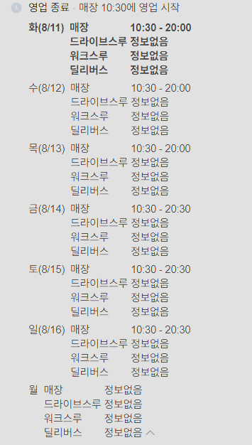
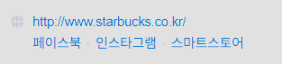
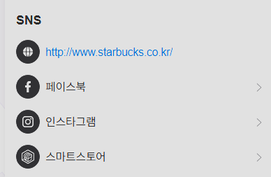

# 매장 상세 — 다음 작업 순서

작성일: 2026-08-11

PR [#89](https://github.com/Routex-labs/Navigation/pull/89) 작업 중 나온 후속 항목을 순서대로
적는다. **위에서부터 하는 것이 맞고**, 순서를 정한 이유도 각 항목에 적었다.

세션이 길어져 인계용으로 남긴다. 이 문서 하나로 이어받을 수 있게 지금 상태와 결정된 것,
아직 안 정한 것을 구분해 적는다.

---

## 지금 상태

- 브랜치 `titianfall/feature-stabucks-detail`, PR #89 열려 있음 (base `main`)
- 상세 시트가 **홈 / 메뉴 / 사진** 탭으로 갈림
- 메뉴: 갈래(음료·푸드) > 카테고리 2단, 세로 목록(왼쪽 글·오른쪽 사진), 4줄 뒤 더보기,
  20종 이상이면 검색창
- 홈: 소개 · 영업 정보(아이콘+값) · 링크 · 매장 정보
- 데이터: 스타벅스 리저브 1곳, 메뉴 30종 (전량 316종은 수집 완료 · 아직 반영 전)
- 검사: 백엔드 592 · 클라이언트 647 통과

로컬 실행은 [로컬 개발 가이드](../../guide/local-development-guide.md), 실기기 설치는
아래 「부록: 실기기 설치」 참고.

---

## 1. 메뉴 전량 수집 — **데이터 확보 완료**

**결과**: 316종 (음료 198 + 푸드 118), `starbucks_menu.json` 289KB, 수집일 2026-08-10.

| 갈래 | 카테고리 |
|---|---|
| 음료 (198) | 콜드 브루 커피 24 · 브루드 커피 3 · 에스프레소 54 · 프라푸치노 20 · 블렌디드 14 · 스타벅스 리프레셔 4 · 스타벅스 피지오 11 · 티(티바나) 44 · 기타 제조 음료 12 · 스타벅스 주스(병음료) 12 |
| 푸드 (118) | 브레드 17 · 케이크 27 · 샌드위치 & 샐러드 23 · 과일 & 요거트 6 · 스낵 & 미니 디저트 41 · 아이스크림 4 |

항목당 필드: `category` `name` `product_cd` `image_url` `name_en` `description`
`volume` `calories` `caffeine` `sodium` `sugars` `protein` `sat_fat` `allergens`
`size` `badges`(NEW·시즌 한정) `is_new` `recomm` `sold_out` `detail_image`

### 수집 방법 — 두 곳이 처음 안내와 달랐다

다시 수집할 일이 생기면 아래를 따른다. 앞서 넘긴 스크립트는 이 두 곳이 틀렸다.

1. **카테고리 묶기.** `div.product_list` 안에 `dl`이 하나뿐이고 그 안에서 `dt`(h3)와
   `dd`(ul)가 번갈아 나온다. `dl.querySelector('dt')`는 첫 `dt`만 잡아 198종이 전부
   "콜드 브루 커피"가 된다. **각 `dd`에서 `previousElementSibling`으로 짝 `dt`를 찾는다.**
   `li.menuDataSet` 안에 중첩 `dl`이 또 있어 `:scope`로 범위를 제한하고, NEW·시즌한정
   배지 `img`가 같은 `dt`에 있어 이미지는 `a[prod]` 안에서만 뽑는다(아니면 223개가 잡힌다)
2. **상세는 DOM이 아니라 JSON-LD에서 읽는다.** `.myAssignZone`은 서버 HTML에서 비어
   있고 JS가 채우므로 `fetch` + `DOMParser`로는 아무것도 안 나온다.
   **`script[type="application/ld+json"]`**에 `name`·`description`·`sku`·`category`·
   `image`와 `additionalProperty`(영문명·사이즈·용량·칼로리·카페인·나트륨·당류·단백질·
   포화지방·알레르기)가 다 있다. 렌더링이 필요 없어 더 안정적이다

### 확인된 사실

- **푸드는 영양정보가 없다.** 추정이 아니라 확인된 사실이다 — 스타벅스가 2023-06-23부터
  푸드 영양정보·알레르기를 HTML 주석으로 감싸 비노출 처리했다. 푸드는
  이름·영문명·설명·카테고리·이미지까지만 가능하다
- 음료 채움률: 설명 196/198, 칼로리·카페인 194/198, 용량 169, 사이즈 154, 알레르기 122
- **이미지 URL은 316종 전부 있고 중복 없음**(unique 316, 누락 0)
- 상세를 못 받은 4종은 **스타벅스 쪽 페이지가 에러**다 — 음료 `바나나 마카다미아 오트
  프라푸치노`·`초코 바나나 마카다미아 오트 프라푸치노`, 푸드 `생크림 크레이프 롤`·
  `쫀득 버터 바이트`. 목록 데이터(이름·이미지·제품코드)는 정상이라 넣을 수 있다.
  `summary.drinks_missing_detail`·`foods_missing_detail`에 명시돼 있다
- "따뜻한 푸드" `h3`는 있으나 항목이 0개라 제외했다

### 정할 것 1 — 사진을 번들에 넣나

**번들을 권한다.** 크기는 문제가 아니다.

| | 지금 | 316종 |
|---|---|---|
| 메뉴 사진 합계 | 331KB (30장, 장당 11KB) | 약 **3.4MB** |
| APK | 323MB | 약 326MB (**+1%**) |

10배가 되는 건 맞지만 APK의 1% 수준이다. 323MB는 사진이 아니라 Flutter 디버그
산출물(`kernel_blob` 72MB + 네이티브 3종 224MB)이다.

**원격 URL 참조는 설계가 이미 거절한 방법이다**(9-1 **D1′**). 이유가 기록돼 있다 —
서버가 남의 이미지를 프록시하지 않고, 시트 첫 프레임이 네트워크를 기다리지 않는다(8절
성능 기준). CDN 경로가 바뀌면 화면이 빈다. **소개 영상 촬영 중에 남의 CDN에 의존하는
것**도 그 자체로 위험하다. 저작권 부담이 링크 수준으로 내려간다는 이점은 있지만, 남의
CDN을 핫링크하는 것은 그것대로 문제다.

파일명은 **제품코드 기준**(`starbucks_menu_9200000004544.jpg`). 이름 기반은 개명·중복에
깨진다. `detail_image`(고해상도 변형)는 목록용으로 과하니 쓰지 않는다.

### 정할 것 2 — 어떤 필드를 스키마에 넣나

수집 데이터에는 지금 스키마에 없는 필드가 여럿 있다. 전부 넣으면 팝업이 영양성분표가
된다.

| 필드 | 판단 |
|---|---|
| `name` `name_en` `description` `category` `image` | 이미 있음 |
| `group`(음료·푸드) | 이미 추가함 |
| `volume` `calories` `caffeine` | 이미 있음 |
| `allergens` | **넣을 만하다.** 사람이 실제로 찾는 정보고 음료 122종에 있다 |
| `badges`(NEW·시즌 한정) | **넣을 만하다.** 줄에 작은 배지로 |
| `sodium` `sugars` `protein` `sat_fat` `size` | **보류.** 팝업 표만 길어진다 |
| `sold_out` `recomm` `detail_category` | 보류 |

### 저작권 — 범위가 316종으로 늘어난다

수집한 이미지 URL과 설명 문구는 스타벅스 코리아 자산이다. 파일럿 문서의 **"데모 식별용 ·
배포 전 교체 필요"** 표시를 30종이 아니라 **316종 전체**로 확장해야 한다. 수집 JSON의
`note`에도 같은 내용이 들어 있다.

### 수집 파일 위치

`starbucks_menu.json`은 저장소에 커밋하지 않았다 — 316종의 설명·이미지 URL이 통째로 든
스타벅스 자산이라 저장소에 박아 두면 저작권 정리 대상이 그만큼 늘어난다. 오버레이에 필요한
필드만 옮기고, 원본은 작업하는 사람이 로컬에 둔다.

---

## 2. 영업시간 — 요일별 구조 + 실시간 판정



**이것이 이 목록에서 가장 큰 변경이다.** 지금은 `demoInfo`에 문자열 한 줄
(`"화~목 10:30–20:00 · 금~일 10:30–20:30 (2026-08-10 월요일 휴점)"`)로 들어 있어서
화면이 "지금 영업 중인지"를 말할 수 없다.

**설계가 이미 답을 정해 뒀다.** [지도·상세 UI 개선 계획](../../client/map-ui-redesign-plan.md)
「보류 항목」의 **B안**이 그것이다 — `hours`를 전용 구조체로 승격하고 클라이언트가
`DateTime.now()`와 비교한다. 문자열로 두면 파싱 로직이 클라이언트로 새어 나가고, 그게
딱 틀리기 좋은 코드다.

**"영업 중/영업 종료" 판정 문자열을 저장하지 않는다**는 원칙은 그대로다. 저장하는 순간
그 값은 저장 시점부터 틀리기 시작한다. 계산은 화면이 한다.

**B안이 요구하는 실패 조건** (설계 문서에 이미 적혀 있음)

- **백화점 휴점일·명절** — 요일 규칙만으론 틀린다. `exceptions: [{date, closed|hours}]` 필요
- **브레이크 타임** — 요일당 구간이 1개라고 가정하면 음식점에서 깨진다. 구간 배열로
- **`updated_at`이 오래되면?** — 낡은 `hours`를 "정보가 오래됐어요"로 낮추거나 숨기는
  규칙을 처음부터 넣는 편이 낫다
- **자정 넘김** — `22:00–02:00`처럼 날짜를 넘기는 구간

**추가로 정할 것**

- 캡처의 `드라이브스루`·`워크스루`·`딜리버스`처럼 **채널별 시간**을 담을지.
  이 매장은 전부 "정보없음"이라 지금 데이터로는 빈 줄만 생긴다
- 스키마 위치: `demoInfo`(허용 목록 매장 전용)에 둘지, 별도 `hours` 필드로 뺄지.
  **별도 필드가 맞다** — `demoInfo`는 라벨-값 자유 문자열이고 `hours`는 구조체다

---

## 3. 전화번호 — "전국 공통" 빼고 복사 버튼


지금 값: `1522-3232 (평일 09:00–18:00) · 전국 공통 고객센터`

- 뒤의 `· 전국 공통 고객센터`를 뺀다
- 번호 옆에 **복사** 버튼. 누르면 클립보드에 담고 "복사했습니다" 토스트

**주의**: `1522-3232`는 이 매장 직통이 아니라 전국 고객센터 번호다. 문구에서 그 사실을
지우면 사용자가 매장에 직접 거는 번호로 오해한다. **"전국 공통"을 빼는 대신 그 사실을
어디에 남길지 정해야 한다** — 라벨을 `고객센터`로 바꾸는 방법이 있다.

복사 동작은 `Clipboard.setData`라 의존성이 필요 없다.

---

## 4. 오픈일 제거

`demoInfo`의 `매장 타입` 값에서 `· 2021년 2월 24일 오픈`을 뺀다. 매장을 고르는 데
쓰이지 않는다. `스타벅스 리저브`만 남긴다.

---

## 5. 링크 — favicon과 목록 형태




지금은 Material 아이콘(🌐 f 📷 🏪) + 라벨 + 바깥으로 나가는 표시다. 원하는 모양은
**브랜드 favicon + 라벨 + `>`**이고, 섹션 제목은 `SNS`.

**결정할 것 — 아이콘을 어떻게 확보하나**

| 방법 | 대가 |
|---|---|
| 브랜드 favicon을 받아 번들에 넣는다 | 브랜드 로고라 **저작권이 메뉴 사진과 같은 문제**가 된다. 데모 식별용으로 취급하고 배포 전 정리 필요 |
| Material 아이콘 유지 + 브랜드 색만 입힌다 | 저작권 부담 없음. 페이스북 파랑·인스타그램 그라데이션 정도는 색으로 흉내 가능 |
| 원격 favicon URL | 시트 첫 프레임이 네트워크를 기다린다 — 설계 9-1 D1′이 금지한 것과 같은 이유 |

**두 번째가 기본값이고**, 첫 번째로 갈 거면 메뉴 사진과 같은 "데모 식별용" 표를
파일럿 문서에 추가해야 한다.

첫 줄(공식 사이트)만 URL을 그대로 보여 주는 것도 캡처의 특징이다. 라벨 대신 주소를
쓸지 정한다.

---

## 6. 근처 매장

같은 건물 안의 가까운 매장을 상세 아래에 붙인다.

**이미 가진 것으로 계산할 수 있다** — 건물 그래프와 매장 좌표가 있고, 검색 결과 거리에
쓰는 `reachableFrom`(온디바이스 다익스트라)이 한 번 돌면 전 노드까지의 거리를 준다.
서버에 새 엔드포인트를 만들 필요가 없다.

**정할 것**

- 기준이 "사용자 위치"인가 "이 매장"인가. **이 매장이 맞다** — 사용자 기준 거리는 이미
  헤더에 있고, 같은 기준으로 두 번 적으면 두 번째 줄이 알려 주는 게 없다
- 같은 업종만인가 전부인가 (카페 상세에서 다른 카페를 권하는 게 맞나)
- 몇 개, 어떤 줄 모양으로
- **`entrance_node_id`가 없는 매장**은 경로 계산이 안 된다. 그 매장들을 뺄지 직선거리로
  대체할지

---

## 7. 전체 카테고리 뷰

캡처(음료/푸드 아래 카테고리별 개수 격자)를 그대로 옮기는 화면이다.

**1번이 끝난 뒤에 한다.** 지금 카테고리가 6개뿐이라 탭 줄과 내용이 겹치는데, 메뉴를 전량
채우면 20개 안팎이 되어 그때 필요해진다.

---

## 하지 않기로 한 것

- **메뉴 가격** — 공식 사이트가 공개하지 않는다. 외부 정리 글에서 20종까지 채웠다가
  되돌렸다. 화면과 스키마에 `price` 자리는 있으므로 공식 출처가 생기면 데이터만 채우면 된다
- **메뉴 사진을 선택 항목으로 내리기** — 크기가 문제가 아니다(장당 11KB). 필수 유지

---

## 남은 위험 (PR #89에 적힌 것)

- `demo_allowlist`의 확인 주기 미정. 확인일 2026-08-10
- 메뉴 사진은 데모 식별용 — 배포 전 교체·허가 필요. 늘린 26장은 원본 URL 미기록
- 메뉴 사진칸을 원본 비율 402:420으로 고정 — 비율이 다른 사진이 오면 여백이 보인다

---

## 부록: 실기기 설치

`adb push`가 이 폰에서 깨진다(전송은 끝나는데 마무리 응답에서 adbd가 죽고 기기가
adb에서 떨어진다). **HTTP로 우회한다.**

```powershell
# 1) 백엔드 (UTF-8 프렐류드 + PYTHONUTF8은 AGENTS.md 참고)
python -m uvicorn app.main:app --host 0.0.0.0 --port 8001

# 2) APK 전송용 서버 — client/build/app/outputs/flutter-apk 에서
python -m http.server 8002

# 3) 폰이 받아서 설치 (PC Tailscale IP: 100.121.75.43)
adb shell "curl -s -o /data/local/tmp/nav.apk http://100.121.75.43:8002/app-debug.apk"
adb shell "pm install -r -t /data/local/tmp/nav.apk"
```

- `config.local.json`의 `API_BASE_URL`은 `http://100.121.75.43:8001`
- 평문 HTTP라 디버그 매니페스트의 `usesCleartextTraffic`이 필요하다(이미 들어 있음)
- 한글 입력이 adb로 안 되므로 앱에서 검색할 때는 **`starbucks`처럼 영문**으로 친다
  (영문 별칭 검색이 main에 들어와 있다)
