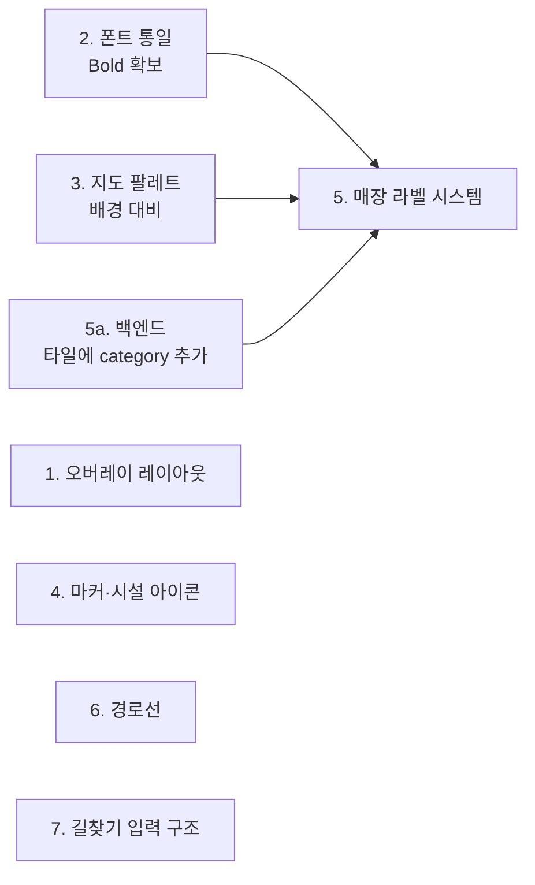

# 지도·상세 UI 개선 계획 (v1)

실내 내비게이션 클라이언트의 지도 표현과 매장 상세 시트를 상용 지도 앱 수준으로
끌어올리기 위한 작업 계획. 헤더 개선 1건은 완료됐고, 나머지 7건은 착수 전이다.

- 설명·주석·커밋은 한국어, 코드·식별자는 영어 (AGENTS.md 규칙).
- 이 문서는 **무엇을 왜 바꾸는지**와 **무엇이 충족되면 맞다고 볼지**를 담는다.
  구현은 항목별 브랜치로 나누어 진행하고, 각 항목마다 검증 기준을 통과한 뒤 커밋한다.
- 아래 수치와 파일 참조는 `b9d35c9`(main) 기준으로 실제 코드·데이터를 확인한 값이다.

---

## 진행 상태

| # | 항목 | 브랜치 | 상태 | 선행 조건 |
|---|---|---|---|---|
| 0 | 상세 헤더 아이콘·층 표기 | `feat/place-detail-header-icon` | **완료** | — |
| 1 | 지도 오버레이 겹침·여백 | `fix/map-overlay-layout` | 착수 전 | 없음 |
| 2 | 폰트 통일 | `chore/typography` | 착수 전 | 없음 |
| 3 | 지도 팔레트 대비 | `style/map-palette` | 착수 전 | 없음 |
| 4 | 마커·시설 아이콘 | `style/map-markers` | 착수 전 | 없음 |
| 5 | 매장 라벨 시스템 | `feat/map-label-system` | 착수 전 | **2, 3 + 백엔드** |
| 6 | 경로선 스타일 | `style/route-line` | 착수 전 | 없음 |
| 7 | 길찾기 입력 구조 | `refactor/directions-top-input` | 착수 전 | 없음 |
| — | 영업시간·연락처 | — | **보류** | 데이터 출처 결정 |
| — | 도착지 이름 라벨 | — | 보류 | 4 이후 |

### 의존 관계



1·4·6·7은 서로 독립이라 순서 자유. 5만 세 갈래 선행 조건이 있다.

**권장 순서: 1 → 2 → 3 → 4 → 5 → 6 → 7**

2(폰트)를 앞에 두는 이유는 폰트가 바뀌면 전체 텍스트 metrics가 달라져 이미 손본
화면을 다시 봐야 하기 때문이다. 늦게 할수록 재작업이 커진다.

---

## 0. 상세 헤더 (완료)

```
66cadaf refactor: 상세 헤더에 카테고리 아이콘을 되살리고 층을 한 줄로 내린다
0721c7e fix: 매장 목록에 영어로 새던 시설 업종을 한글로 보여 준다
12130e5 refactor: 카테고리 아이콘 헬퍼에 대분류 폴백과 한글 표기를 더한다
```

### 무엇이 바뀌었나

```
[변경 전]                          [변경 후]
┌────┐                             ┌────┐
│ B2 │  스타벅스 리저브             │ ☕ │  스타벅스 리저브
└────┘  카페·베이커리               └────┘  B2 · 카페·베이커리
 파란 사각형에 층 텍스트              카테고리 색 아이콘 + 층은 업종과 한 줄
```

**층 배지를 뺀 이유** — 44×44 라운드 사각형은 관습적으로 로고·아바타 자리다.
거기 텍스트가 들어가면 브랜드 마크로 오독된다.

**아이콘을 되살린 이유** — `category_icon.dart`의 아이콘·색 규칙은 이미
카테고리 칩과 카테고리 매장 목록이 쓰고 있었고, 파일 주석에도 "chip과 시트 헤더가
같은 시각 정체성을 갖도록 두 곳에서 공유한다"고 적혀 있다. 상세 시트만 이 시스템에서
이탈해 있었다. 목록에서 보던 글리프가 상세에서도 같은 자리에 있어야 동선이 이어진다.

과거에 지웠던 것은 **모든 매장에 똑같이 붙는 회색 storefront 하나**였다. 지금은
대분류 폴백이 붙어 매장마다 글리프와 색이 달라진다.

### 카테고리 커버리지 (실측)

시트가 열리는 장소는 633개다. (전체 1,640개 중 주차 787 + 에스컬레이터 152 +
엘리베이터 68 = 1,007건은 `kind: excluded`라 시트가 열리지 않는다.)

| 대분류 | 개수 | 아이콘 |
|---|---|---|
| 패션 | 260 | `checkroom` |
| 식음료 | 140 | `restaurant` |
| 편의시설 | 92 | `info_outline` |
| 리빙 | 54 | `weekend_outlined` |
| 뷰티 | 36 | `brush` |
| 서비스 | 30 | `support_agent` |
| 키즈 | 21 | `child_care` |

Studio 원본만 보면 1,640개 중 1,278개가 `category: "매장"`이라 무의미하지만,
`resources/store_categories.json`(id 기준 66건)과 `store_category_by_name.json`
(매장명 기준 494건) 오버라이드를 거치면 **633개 전부가 위 7개 중 하나로 해석된다.**
`storefront` 폴백이 실제로 뜨는 케이스는 없다.

### 곁다리로 고친 것

`restroom`·`facility` 같은 영어 열거값이 업종 문구로 그대로 노출되고 있었다.
화장실 27곳, 편의시설 52곳. 상세 시트와 카테고리 매장 목록 양쪽에서 한글로 바꿨다.

### 검증 결과

`flutter analyze` 이슈 없음 · 테스트 212개 통과 (헤더 관련 6개 신규).

---

## 1. 지도 오버레이 겹침·여백 — `fix/map-overlay-layout`

### 문제

상단 오버레이가 전부 매직 넘버로 쌓여 있다 (`client/lib/screens/map_shell/map_shell_screen.dart`).

```dart
MapTopBar         → Positioned(top: 0)     // 높이가 모드에 따라 변함
SearchPanel       → Positioned(top: 78)    // 하드코딩
_CategoryChipsRow → Positioned(top: 78)    // 하드코딩
_MapPickHintCard  → Positioned(top: 128)   // 하드코딩
_PlaceInfoCard    → Positioned(top: 128)   // 하드코딩
```

그런데 `MapTopBar`는 상태에 따라 높이가 달라진다. 평소엔 한 줄(검색창)이고,
길찾기 draft 상태에선 `_RouteDraftBar`가 **출발/도착 두 줄 + Divider**로 그려진다
(`client/lib/widgets/map_top_bar.dart`).

```
[평소 — 바가 낮음]              [길찾기 — 바가 높음]
┌──────────────────┐           ┌──────────────────┐
│ 🔍 검색하세요     │           │ ◎ 현재 위치       │
└──────────────────┘           │ ─────────────    │
                               │ ◉ POP-UP WEST    │
     ← 여백 과다 →              └──────────────────┘
                               ┌──────────────────┐ ← 겹침
┌──────────────────┐           │ 장소  리빙  뷰티  │
│ 장소  리빙  뷰티  │           └──────────────────┘
└──────────────────┘
        top: 78                        top: 78
```

**겹침과 여백 과다는 같은 원인의 앞뒷면이다.** 78이 두 상태의 어중간한 타협치라
한쪽에선 모자라고 한쪽에선 남는다. 검색 모드의 여백도 동일 원인이다.

### 제안

1. 하드코딩 offset을 버리고 상단 오버레이를 **하나의 Column으로 스택**한다.
   간격이 상수 하나로 통일되고 모드가 바뀌어도 어긋나지 않는다.
2. **길찾기 모드에서 카테고리 칩을 숨긴다.** 칩은 "뭘 찾을까" 탐색 도구인데
   길찾기 draft 상태는 이미 목적지를 정한 뒤다. 검색 모드에 같은 선례가 있고
   코드 주석도 그렇게 적혀 있다 — "검색 중에는 카테고리 열을 접어 두 오버레이가
   겹치지 않게 한다".

### 위험 — 이 항목에서 유일하게 단순하지 않은 부분

`_topBarKey`·`_categoryRowKey`가 **지도 제스처 잠금의 hit-test에 쓰이고 있다.**
지도가 Flutter 위젯이 아니라 MapLibre 플랫폼 뷰라서, 오버레이 위에 포인터가
올라왔을 때 지도가 같이 움직이지 않도록 이 키들의 글로벌 좌표로 판정한다.
Column으로 바꾸면 좌표 계산이 달라질 수 있다.

### 검증 기준

- [ ] 평소 / 검색 / 길찾기 draft 세 모드에서 상단 바와 아래 오버레이 간격이 동일
- [ ] 길찾기 draft 상태에서 카테고리 칩이 보이지 않음
- [ ] 카테고리 칩 위에서 좌우 드래그 시 **지도가 따라 움직이지 않음** (회귀 확인)
- [ ] 칩을 가로로 스크롤할 수 있음
- [ ] `_MapPickHintCard`·`_PlaceInfoCard`도 길찾기 모드에서 상단 바를 안 가림

---

## 2. 폰트 통일 — `chore/typography`

### 문제 — 두 겹이다

**(1) 앱 UI 폰트가 아예 미지정이다.**
`client/pubspec.yaml`의 `fonts:` 섹션은 전부 주석 처리돼 있고, `app_theme.dart`에
`fontFamily`가 없다. 즉 **플랫폼 기본 폰트**를 쓴다.

| 플랫폼 | 실제로 쓰이는 폰트 |
|---|---|
| 웹 (Chrome/macOS) | 브라우저 기본 |
| iOS | Apple SD Gothic Neo |
| Android | Noto Sans CJK |

같은 화면이 기기마다 다르게 보인다.

**(2) 지도 라벨 폰트는 Regular 하나뿐이다.**
`backend/resources/fonts/`에 `Noto Sans KR Regular` 딱 하나. 그래서 지도에서
**굵기로 위계를 만들 수 없다.** 상용 지도는 중요한 POI를 굵게 해서 밀도 속에서도
읽히게 하는데, 우리는 선택지가 없다.

### 제안

**Noto Sans KR로 통일한다.** Pretendard가 더 현대적이지만 지도 glyph를 새로 구워야
하고, 지도 쪽이 이미 Noto Sans KR이라 맞추는 편이 비용이 낮다.

- 앱: `Noto Sans KR` Regular/Medium/Bold를 에셋에 추가, `theme.fontFamily` 지정
- 백엔드: fontstack에 Bold 추가 → 지도 라벨 굵기 위계 확보 (5번의 선행 조건)

### 위험

폰트가 바뀌면 **전체 텍스트의 크기·줄높이·자간이 미세하게 달라진다.** 이미 손본
상세 시트 헤더를 포함해 시트·카드·버튼을 다시 봐야 한다. 그래서 순서를 앞으로 뒀다.

### 검증 기준

- [ ] 웹·iOS에서 같은 화면의 글자 모양이 동일
- [ ] 상세 시트 헤더에서 제목이 2줄로 넘치지 않음 (긴 매장명: `마리떼프랑소와저버/LMC`)
- [ ] 카테고리 칩 텍스트가 잘리지 않음
- [ ] 지도에서 Bold fontstack이 404 없이 로드됨 (`/fonts/{fontstack}/{range}.pbf`)

---

## 3. 지도 팔레트 대비 — `style/map-palette`

### 문제

아웃라인은 **이미 있다.** 문제는 대비가 거의 없다는 것이다
(`client/lib/widgets/floor_plan_view.dart`).

| 요소 | fill | outline | 비고 |
|---|---|---|---|
| 건물 바닥(통로) | `#FFFFFF` | `#00000088` | |
| 매장 폴리곤 | `#F3F1EF` | `#D8D4D1` | **통로와 명도 차 2% 미만** |
| 수직이동 | `#DCEBD4` | `#6FA167` | 이건 잘 보임 |
| 실내 화면 배경 | `#EDF4E7` | — | |

`#FFFFFF`와 `#F3F1EF`가 사실상 같은 색이라 **통로와 매장이 하나의 흰 덩어리로 보인다.**
실내 내비에서 가장 중요한 정보가 "어디로 걸을 수 있나"인데 그게 안 읽힌다.

### 방향은 맞다, 세기만 부족하다

네이버·카카오도 **"걸을 수 있는 곳은 밝게, 막힌 곳은 어둡게"** 규칙을 쓴다
(도로가 흰색, 건물이 회색). 우리도 통로가 흰색이고 매장이 회색이라 방향은 같다.

### 제안

```
통로   #FFFFFF            유지 — 밝은 게 맞다
매장   #F3F1EF → #EAE6E1  명도 차이를 약 3배로
외곽선 #D8D4D1 → #CFC9C2
```

### 위험

- 코드 주석에 **"원본 SVG 디자인(hyundai_floor_map_corrected_v6.svg)의 색상을 그대로
  옮긴다"**고 명시돼 있다. 바꾸면 원본과의 대응이 끊어지므로, 의도적으로 깬다는 걸
  주석에 남겨야 한다.
- 같은 값이 **`client/lib/screens/outdoor_map/indoor_overlay_layers.dart`에도 중복**돼
  있다. 한쪽만 바꾸면 실내 화면과 야외 오버레이의 색이 어긋난다.

### 검증 기준

- [ ] 매장 경계가 통로와 구분되어 보임 (줌 z17, z19 양쪽)
- [ ] 실내 화면과 야외 오버레이의 색이 동일
- [ ] 수직이동(초록)이 여전히 매장과 구분됨
- [ ] 매장명 라벨(`#333333` + 흰 halo)이 어두워진 배경에서도 읽힘

---

## 4. 마커·시설 아이콘 — `style/map-markers`

### 4-a. 도착 핀에 흰 원 + "도착" 텍스트

야외 오버레이 핀은 **단색 빨강**이고, 실내 화면 핀은 **흰 원 + "도착" 텍스트**다.
두 화면의 핀이 다르다.

야외가 단색인 것은 의도된 결정이지만, 이유를 정확히 읽어야 한다
(`client/lib/screens/outdoor_map/outdoor_map_screen.dart` 주석):

> Flutter 웹 CanvasKit에서 **오프스크린 캔버스로 렌더링한 이미지**에는 한글 글리프가
> 있는 폰트가 자동으로 딸려오지 않아 "도착"이 두부(tofu) 박스로 뭉개진다.
> 반면 **MapLibre의 심볼 텍스트는 매장명 라벨과 동일한 경로를 타서 한글이 정상**이다.

즉 **두부 현상은 캔버스에 굽는 쪽의 문제이고, `textField`는 검증된 해결책이다.**
실내 화면이 이미 `textField: '도착'`으로 돌고 있고, 흰 원 중심에 맞추는 offset
계산(`textOffset: [0, -3.7]`, iconSize/textSize 비율 0.033 고정)까지 풀려 있다.

→ **실내 구현을 그대로 이식한다.** 흰 원은 캔버스로 그리고(글리프와 무관), 텍스트는
`textField`로 얹는다.

```
[변경 전]        [변경 후]
   ●              ◉  ← 흰 원 안에 "도착"
   ▼              ▼
 단색 빨강        실내 화면과 동일
```

### 4-b. 시설 아이콘 크기

`indoorIconSizeExpr`는 zoom 16→20 구간에서 `0.33 → 0.6`으로 보간한다.
실내 화면(`kIndoorPoiIconSize = 0.42`)보다 최대값이 크다.

⚠️ **이건 과거 피드백을 뒤집는 변경이다.** 코드 주석:

> 화장실·정수기 같은 시설이 **잘 안 보인다는 피드백에 맞춰** 실내 배율과 같은
> 1.5배로 올렸고

지금 "너무 크다"는 지적은 줌인 상태(z20 근처)에서 나온 것이고, 과거 피드백은
줌아웃 상태에서 나왔다. 같은 보간식의 양 끝이다.

→ **최대값만 `0.6 → 0.45`로 낮추고 최소값 `0.33`은 유지한다.**

### 4-c. 시설물 텍스트 라벨 제거

에스컬레이터 **152개**, 엘리베이터 **68개**가 전부 매장과 **똑같은 무게의 텍스트
라벨**을 달고 있다. 도면이 "에스컬레이터"로 도배되어 정작 읽어야 할 매장명이 묻힌다.

```
[변경 전]                      [변경 후]
  ⬤ 에스컬레이터                  ⬤
  ⬤ 에스컬레이터                  ⬤
  ⬤ 에스컬레이터                  ⬤
  ⬤ 에스컬레이터                  ⬤
```

구글·네이버도 에스컬레이터에 텍스트를 붙이지 않는다. 아이콘이 이미 무슨 시설인지
말하므로 이름은 중복이다. **크기 조정보다 이쪽이 효과가 크다.**

### 검증 기준

- [ ] 도착 핀에 "도착"이 두부 없이 표시됨 (**웹에서 반드시 확인** — 두부는 웹 전용 문제)
- [ ] 실내 화면과 야외 오버레이의 도착 핀 모양이 동일
- [ ] z16 줌아웃에서 화장실·정수기가 여전히 식별 가능 (**과거 피드백 회귀 방지**)
- [ ] z20에서 시설 아이콘이 매장명을 가리지 않음
- [ ] 에스컬레이터 밀집 구역에서 매장명이 읽힘

---

## 5. 매장 라벨 시스템 — `feat/map-label-system`

### 목표

상용 지도처럼 **작은 카테고리 아이콘 + 카테고리 색 텍스트**로 매장 라벨을 그린다.
색만으로 종류가 읽혀서 이름을 다 읽지 않아도 훑을 수 있다.

```
[변경 전]              [변경 후]
                          ☕
 스타벅스 리저브          스타벅스 리저브   ← 주황 (식음료)
 노스페이스              👕
 (전부 #333333)          노스페이스        ← 보라 (패션)
```

### ⚠️ 차단 요인 — 백엔드 선행 작업이 필수다

`backend/app/geo/tiling.py`의 stores 레이어 properties:

```python
"properties": {"id": store.id, "name": store.name, "kind": "store"}
```

**`category`가 실려 있지 않다.** MapLibre가 `['get', 'category']`로 색·아이콘을
고를 수 없으므로 **클라이언트 스타일링만으로는 불가능하다.**

**5a. 백엔드 (선행)**
- `tiling.py` stores properties에 `category`·`subcategory` 추가
- `tile_cache` 무효화 — 캐시된 타일에는 새 속성이 없다

**5b. 클라이언트**
- 카테고리 아이콘 심볼 레이어 추가 (기존 시설 아이콘과 같은 `addImage` 패턴 재사용)
- 라벨 `textColor`를 카테고리 색으로 (`_colorByCategory` 7종 재사용)
- 중요 매장은 Bold (2번의 선행 조건)

### 위험 — 라벨 폭주

매장이 **633개**다. 전부 아이콘을 달면 지금 에스컬레이터처럼 겹쳐 쌓인다.
현재 시설 아이콘은 `iconAllowOverlap: true`로 **충돌 회피를 아예 꺼둔 상태**다.

→ zoom별 표시 필터 + 심볼 충돌 회피를 켜서 밀도를 조절해야 한다.
상용 지도가 하는 것도 정확히 이것이다.

### 검증 기준

- [ ] 타일 응답에 `category`가 실림 (`/buildings/.../tiles/{z}/{x}/{y}.mvt` 디코드 확인)
- [ ] 캐시를 비운 뒤 새 타일이 나감
- [ ] z17 줌아웃에서 라벨이 겹치지 않음
- [ ] z20에서 매장 대부분이 라벨을 가짐
- [ ] 카테고리가 없는 매장(서버가 새 카테고리 추가 시)이 기본 색으로 폴백
- [ ] 카테고리 색 7종이 배경(3번에서 바뀐 값) 위에서 모두 판독 가능

---

## 6. 경로선 스타일 — `style/route-line`

### 현재 — 구현이 두 개고 서로 다르다

| | 야외 + 실내 오버레이 | 실내 화면 |
|---|---|---|
| 파일 | `outdoor_map_screen.dart` | `floor_plan_view.dart` |
| casing | **흰색 8px** | **없음** |
| 본선 | `AppColors.primary` 5px, opacity 1 | `#1A73E8` 5px, **opacity 0.6** |
| 지나온 구간 | 없음 | **회색 처리 있음** (`#9AA0A6`) |

### 문제

1. **흰 casing이 무의미하다.** 실내 도면 배경이 흰색이다. 흰 선 위의 흰 테두리는
   보이지 않는다. 경로선이 맨살로 보이는 직접 원인이다.
2. 실내 화면은 casing도 없는데 **opacity까지 0.6**이라 더 흐리다.
3. 같은 기능인데 두 화면의 값이 다르다.

### 제안 — 네이버·카카오를 따른다

두 서비스 모두 **진한 파랑 아웃라인**을 쓴다. 흰색이 아니다. 그래야 흰 배경·회색
배경 어디서든 선이 떠 보인다. 그리고 그 안에 흰 요소를 넣는다 — 네이버는 흰 chevron
화살표, 카카오는 흰 점선 중앙선.

```
진한 파랑 아웃라인   9px      (신규)
밝은 파랑 본선       5.5px    (기존, opacity 1.0으로)
흰 chevron 화살표    반복     (신규, symbolPlacement: 'line')
+ zoom별 두께 보간
```

**화살표가 가장 체감이 크다.** 방향이 시각적으로 확정되면서 선이 "그려진 선"에서
"가야 할 길"로 바뀐다.

부수 작업: 야외에도 "지나온 구간 회색"을 추가해 실내와 맞춘다 (실내엔 이미 있다).

### 위험

- **층 전환 구간(`_transferRouteLayerId`)에는 화살표를 붙이지 않는다.** 이미
  점선(`lineDasharray`)이고, 그 구간은 수평 이동이 아니라 층 이동이라 방향
  화살표의 의미가 다르다.
- 화살표 아이콘도 `addImage`로 등록해야 한다.

### 검증 기준

- [ ] 흰 도면 위에서 경로선 경계가 보임
- [ ] 실내 화면과 야외 오버레이의 경로선이 동일하게 보임
- [ ] z16~z20에서 선 두께가 자연스럽게 변함
- [ ] 화살표가 진행 방향(출발→도착)을 가리킴
- [ ] 층 전환 점선 구간에 화살표가 없음
- [ ] 경로 진행 시 지나온 구간이 회색으로 바뀜

---

## 7. 길찾기 입력 구조 — `refactor/directions-top-input`

### 문제

길찾기 동작이 **두 군데**에 있다. 상단 바에 출발/도착 draft가 보이고, 실제 입력은
하단 시트(`client/lib/widgets/directions_sheet.dart`)다.

### 상용 지도의 공통점

| 서비스 | 입력 필드 | 하단 시트 |
|---|---|---|
| 구글 · 애플 | **상단** | 결과·옵션만 |
| 네이버 · 카카오 | **상단 고정 전용 화면** | — |

**입력 필드는 예외 없이 위에 있다.** 우연이 아니라 **키보드가 아래에서 올라오기
때문**이다. 입력창이 아래 있으면 키보드에 밀려 올라가면서 지도를 다 덮는다.

그 흔적이 이미 우리 코드에 있다:

```dart
resizeToAvoidBottomInset: false   // Scaffold 리사이즈를 끔
_searchPanelMaxHeight(context)    // 키보드 높이를 직접 빼서 계산
```
> 키보드가 올라와도 Scaffold를 리사이즈하지 않으므로, 패널이 키보드 밑으로
> 들어가지 않도록 여기서 직접 높이를 깎는다.

**하단 입력을 유지하는 한 이 수동 계산이 계속 따라다닌다.**

### 제안

```
상단 바의 출발/도착 필드 탭
  → 그 자리에서 아래로 패널이 펼쳐짐 (최근·즐겨찾기·검색 결과)
  → "지도에서 선택", "전체 층에서 찾기"도 이 패널 안으로
하단 시트 제거
```

### 위험

범위가 가장 크다. `directions_sheet.dart` 제거 + 시트 chain 계약
(`StoreInfoAction`, `_runSheetChain`) 재배선이라 **상세 시트·카테고리 시트까지
영향이 간다.** 그래서 마지막에 둔다.

### 검증 기준

- [ ] 키보드가 올라와도 입력 필드가 가려지지 않음
- [ ] 출발·도착을 서로 바꾸는 동작이 유지됨
- [ ] 상세 시트에서 "도착"을 눌러 넘어오는 기존 chain이 깨지지 않음
- [ ] `resizeToAvoidBottomInset` 수동 계산을 제거할 수 있음
- [ ] 뒤로가기로 draft가 유실되지 않음

---

## 보류 항목

### 영업시간·연락처 — 데이터 출처 결정이 먼저다

⚠️ **이건 UI 작업이 아니다. 저장소가 의도적으로 금지하고 있고 코드로 강제한다.**

`backend/resources/store_details/_schema.json`의 `forbidden_labels`:

```
"영업시간", "영업 시간", "운영시간", "운영 시간",
"전화", "전화번호", "대표번호", "연락처", "문의", "평점", "리뷰"
```

`backend/app/repositories/place_details.py`가 시드 **적재 전에** 검증 실패시킨다.
스키마 주석에 남은 이유:

> 출처가 없어 검증할 수 없고, 영업시간류는 시간이 지나면 자동으로 거짓이 된다.
> 한때 businessInfo가 이 검사를 건너뛰어 **출처 없는 영업시간·대표번호가 응답에
> 실려 나간 적이 있다.**

즉 **이미 한 번 사고가 났고 그래서 막아둔 규칙**이다. JSON에 값만 넣으면 시드가
죽고, 검증만 빼면 그때 사고를 반복한다.

**선택지**

| 안 | 내용 | 평가 |
|---|---|---|
| A | `forbidden_labels`에서 빼고 `source` URL 필수화 | 정직하지만 "영업 중" 판정 불가 |
| B | **`hours`·`phone` 전용 필드로 승격** + `source` 필수 | **권장** |
| C | "데모 데이터" 배지 달고 그냥 표시 | 비추 — 결국 거짓이 화면에 뜬다 |

**B를 권장하는 이유:** `"10:30~20:00"` 문자열로는 **"지금 영업 중"을 계산할 수 없다.**
문자열 파싱 로직이 클라이언트로 새어나가고, 그게 딱 틀리기 좋은 코드다. 구조체면
검증기가 형식을 잡아주고 클라이언트는 `DateTime.now()`와 비교만 하면 된다.
`forbidden_labels`는 자유 라벨 방어용으로 그대로 남긴다 — 규칙을 우회하는 게 아니라
검증된 경로를 따로 뚫는 것이다.

**B로 갈 때 미리 정해야 할 실패 조건**

- **백화점 휴점일·명절** — 요일 규칙만으론 틀린다. `exceptions: [{date, closed|hours}]` 필요
- **브레이크 타임** — 요일당 구간이 1개라고 가정하면 음식점에서 깨진다. 구간 배열로
- **`updated_at`이 오래되면?** — 영업시간은 낡으면 거짓이 된다. N일 지난 `hours`는
  "정보가 오래됐어요"로 낮추거나 숨기는 규칙을 처음부터 넣는 게 낫다
- **출처를 뭘로?** — 더현대서울 공식 매장 페이지 URL 하나로 정하면 될 것 같지만
  **이건 사람이 결정해야 한다**

**UI 배치안 (데이터가 준비되면)**

현재 "매장 정보" 섹션은 주소 한 줄뿐이라 제목이 내용보다 크다. 그게 소개 섹션과
이질적으로 느껴지는 원인이다. 탭 분리(홈/메뉴/정보)는 반대다 — 섹션이 4개뿐인데
탭 바가 시트 높이를 먹고 클릭이 한 번 더 는다.

| 위치 | 내용 | 이유 |
|---|---|---|
| 헤더 바로 아래 | `영업 중 · 22:00 종료` 한 줄 | 실제 의사결정은 "몇 시부터 몇 시"가 아니라 **"지금 열었나"** |
| 소개 → 사진 → 메뉴 | 지금 그대로 | 순서 문제 없음 |
| 매장 정보 | 영업시간(요일별) · 연락처 · 주소 | 3줄이 되면 섹션 제목이 이름값을 한다 |

연락처는 탭하면 전화가 걸리게 한다. 주소를 맨 아래로 내린 기존 판단은 유지한다.

### 도착지 이름 라벨 배지

네이버·카카오는 텍스트를 핀 **안**에 넣지 않는다.

```
  [도착]     ← 둥근 배지
    ▼        ← 핀
 수유리우동집  ← 도착지 이름
```

정보량이 훨씬 많고 **출발 마커도 따로 있다** (우리는 현재 위치 점뿐). 대신
레이어·배지 이미지·라벨 충돌 처리가 붙어 비용이 크다. 4번(핀 통일)이 끝난 뒤 판단.

---

## 참고 — 색상 팔레트

`client/lib/theme/app_theme.dart`

| 이름 | 값 | 용도 |
|---|---|---|
| `primary` (`blue500`) | `#4A87F1` | 주 액션, 층 표기, 경로선 |
| `blue50` | `#EEF4FE` | 보조 버튼 배경 |
| `blue100` | `#D6E4FC` | 구분선, 가운뎃점 |
| `dest` | `#E53935` | 도착 핀 |
| `muted` | `#757575` | 보조 텍스트 |

`client/lib/widgets/category_icon.dart` — 카테고리 색 (5번에서 라벨 색으로 재사용)

| 카테고리 | 색 | 아이콘 |
|---|---|---|
| 패션 | `#7E57C2` | `checkroom` |
| 편의시설 | `#607D8B` | `info_outline` |
| 식음료 | `#F57C00` | `restaurant` |
| 리빙 | `#00897B` | `weekend_outlined` |
| 서비스 | `#3F51B5` | `support_agent` |
| 키즈 | `#EC407A` | `child_care` |
| 뷰티 | `#E53935` | `brush` |

⚠️ 뷰티(`#E53935`)가 도착 핀 색(`dest`)과 같다. 5번에서 라벨 색으로 쓸 때
도착 핀과 혼동되지 않는지 확인이 필요하다.

---

## 작업 규칙

- 항목별로 브랜치를 나눈다. 한 브랜치에 성격이 다른 변경을 섞지 않는다.
- 커밋 제목은 한 줄, `feat:`/`fix:`/`refactor:`/`style:`/`chore:` 접두사 + 한글.
- `Co-Authored-By` 및 협업자 태그는 붙이지 않는다.
- 각 항목의 검증 기준을 통과한 뒤 커밋한다. **특히 "회귀 방지"로 표시된 항목은
  과거 피드백을 뒤집는 변경이므로 반대 상태를 반드시 같이 확인한다.**
- 로컬 확인은 `client/`에서 `flutter run --dart-define-from-file=config.local.json`.
  코드를 고친 뒤에는 실행 중인 터미널에서 `r`(hot reload)만 누르면 된다.
  `pubspec.yaml`·`config.local.json`을 건드렸을 때만 재시작이 필요하다.
