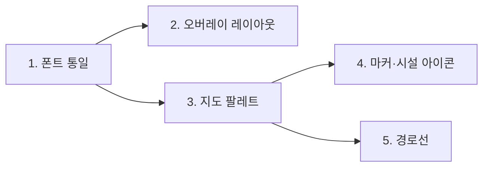
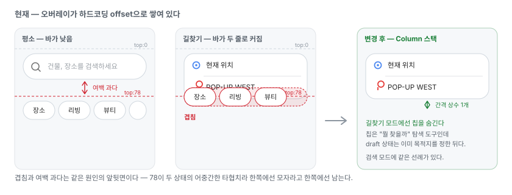
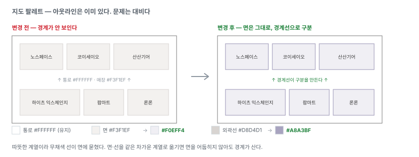
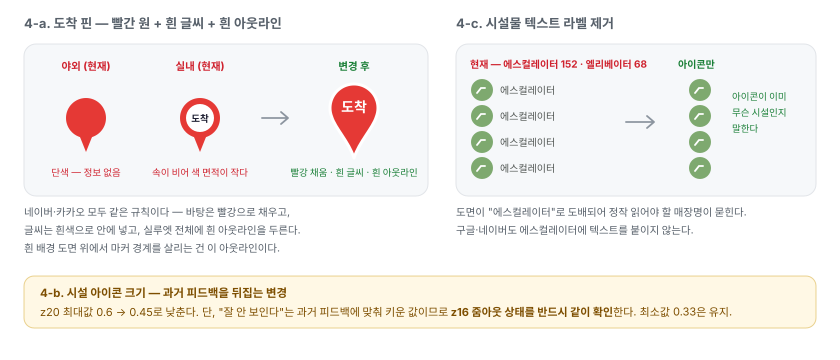
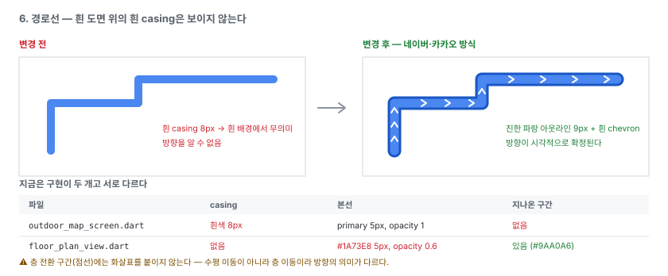
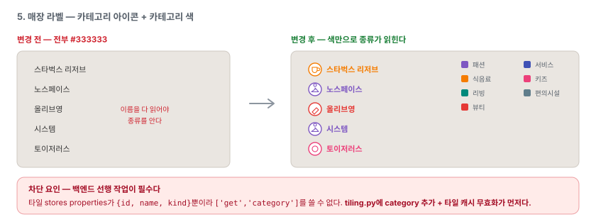
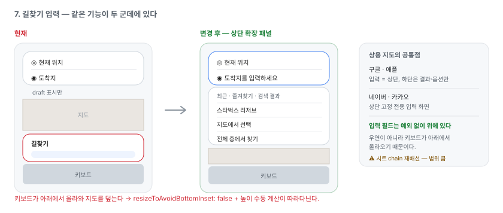

# 지도·상세 UI 개선 계획 (v1)

실내 내비게이션 클라이언트의 지도 표현과 매장 상세 시트를 상용 지도 앱 수준으로
끌어올리기 위한 작업 계획. **0~5번은 완료됐고, 남은 것은 6·7번이다.**

- 설명·주석·커밋은 한국어, 코드·식별자는 영어 (AGENTS.md 규칙).
- 이 문서는 **무엇을 왜 바꾸는지**와 **무엇이 충족되면 맞다고 볼지**를 담는다.
  항목마다 커밋을 나누고, 각 항목의 검증 기준을 통과한 뒤 다음 항목으로 넘어간다.
- 아래 수치와 파일 참조는 `b9d35c9`(main) 기준으로 실제 코드·데이터를 확인한 값이다.

---

## 진행 상태

| # | 항목 | 상태 | 비고 |
|---|---|---|---|
| 0 | 상세 헤더 아이콘·층 표기 | **완료** | PR #71 머지 |
| 1 | 폰트 통일 | **완료** | PR #74 머지 |
| 2 | 지도 오버레이 겹침·여백 | **완료** | PR #74 머지 |
| 3 | 지도 팔레트 대비 | **완료** | PR #74 머지 |
| 4 | 마커·시설 아이콘 | **완료** | PR #74 머지 |
| 5 | 경로선 스타일 | **완료** | PR #74 머지 |
| 6 | 매장 라벨 시스템 | **다음 차수** | 백엔드 선행 완료 · 클라이언트만 남음 |
| 7 | 길찾기 입력 구조 | **다음 차수** | 시트 chain 재배선으로 범위가 큼 |
| — | 영업시간·연락처 | 보류 | 데이터 출처 결정 필요 |
| — | 도착지 이름 라벨 | 보류 | 4 이후 |

### 지난 차수 (1~5번, 완료)

1번부터 5번까지 순서대로 진행했다. 번호가 곧 실행 순서였다.
항목마다 커밋을 나눴다.



- **1 → 2**: 폰트가 바뀌면 `MapTopBar`의 높이가 달라진다. 레이아웃을 먼저 잡으면
  폰트 교체 후 다시 봐야 한다.
- **3 → 4, 5**: 마커 테두리 색과 경로선 casing 색은 **배경 대비를 보고 고르는 값**이다.
  배경을 나중에 바꾸면 두 색을 다시 정해야 한다.
- 4와 5는 서로 독립이라 순서 자유.

### 남은 항목 (6번)

- **6번(매장 라벨)** — 차단 요인이던 백엔드 작업이 끝났다(아래 6번 본문 참조).
  이제 클라이언트 스타일링만 남았다. `feature/store-icons` 브랜치 이력은 아직
  확인이 필요하다(아래 참조).

**7번(길찾기 입력)은 끝났다(2026-08-09).** 다만 제안했던 "상단 바에서 아래로 펼쳐지는
패널"이 아니라 **전용 길찾기 화면**으로 갔다 — 이동 수단(자동차·대중교통·도보)이 맨
위에 붙으면서 상단 바 안에 다 넣을 수 없었다. 자세한 내용은 아래 7번 본문.

설계는 아래 본문에 그대로 남겨 둔다 — 착수할 때 이 문서에서 이어받는다.

### 진행 확인 (2026-08-03, main `be56059`)

**이전 판(2026-08-02)의 "1~7번 하나도 착수되지 않았다"는 기록은 틀렸다.**
그 시점에 이미 `feat/map-ui-refresh`에서 1~5번이 진행 중이었고, PR #74로 머지됐다.
아래는 현재 코드에서 다시 확인한 값이다.

| # | 확인한 것 | 파일 |
|---|---|---|
| 1 | `fontFamily: 'Pretendard'` · pubspec에 400·500·600·700·800 등록 | `app_theme.dart`, `pubspec.yaml` |
| 2 | 하드코딩 offset 대신 `_overlayGap` 상수 하나로 쌓은 Column | `map_shell_screen.dart` |
| 3 | 도면 색이 `map_palette.dart` 한곳으로 모임 | `core/map_palette.dart` |
| 4 | 도착 핀 두 화면 통일 · 시설물 텍스트 라벨 제거 | `outdoor_map_screen.dart`, `floor_plan_view.dart` |
| 5 | 진한 테두리 + 진행 방향 화살표, 두 화면 동일 | `core/map_route_style.dart` |
| 6 | 타일에 `category`·`subcategory`는 실림 — **라벨은 아직 `textColor: '#444846'` 고정, 카테고리 아이콘 레이어 없음** | `backend/app/geo/tiling.py`, `floor_plan_view.dart` |
| 7 | **완료(2026-08-09)** — `directions_sheet.dart` 제거, 전용 길찾기 화면으로 대체. `resizeToAvoidBottomInset: false`는 상단 검색 패널이 계속 써서 그대로 | `screens/route_planner/`, `map_shell_screen.dart` |

⚠️ **`feature/store-icons` 원격 브랜치가 삭제된 이력이 있다.** 이름이 6번과 겹치는데
PR 목록에도, main에도 흔적이 없다. 누가 착수했다 접었거나 로컬에만 남겨뒀을 수 있으니
**6번을 시작하기 전에 팀에 확인**한다.

---

## 0. 상세 헤더 (완료)

```
66cadaf refactor: 상세 헤더에 카테고리 아이콘을 되살리고 층을 한 줄로 내린다
0721c7e fix: 매장 목록에 영어로 새던 시설 업종을 한글로 보여 준다
12130e5 refactor: 카테고리 아이콘 헬퍼에 대분류 폴백과 한글 표기를 더한다
```

### 무엇이 바뀌었나


**층 배지를 뺀 이유** — 44×44 라운드 사각형은 관습적으로 로고·아바타 자리다.
거기 텍스트가 들어가면 브랜드 마크로 오독된다.

**아이콘을 되살린 이유** — `category_icon.dart`의 아이콘·색 규칙은 이미
카테고리 칩과 카테고리 매장 목록이 쓰고 있었고, 파일 주석에도 "chip과 시트 헤더가
같은 시각 정체성을 갖도록 두 곳에서 공유한다"고 적혀 있다. 상세 시트만 이 시스템에서
이탈해 있었다. 목록에서 보던 글리프가 상세에서도 같은 자리에 있어야 동선이 이어진다.

과거에 지웠던 것은 **모든 매장에 똑같이 붙는 회색 storefront 하나**였다. 지금은
대분류 폴백이 붙어 매장마다 글리프와 색이 달라진다.

### 카테고리 커버리지 (실측)

시트가 열리는 장소는 633개다. (전체 1,640개 중 주차 787 + 에스컬레이터 152 +
엘리베이터 68 = 1,007건은 `kind: excluded`라 시트가 열리지 않는다.)

| 대분류 | 개수 | 아이콘 |
|---|---|---|
| 패션 | 260 | `checkroom` |
| 식음료 | 140 | `restaurant` |
| 편의시설 | 92 | `info_outline` |
| 리빙 | 54 | `weekend_outlined` |
| 뷰티 | 36 | `brush` |
| 서비스 | 30 | `support_agent` |
| 키즈 | 21 | `child_care` |

Studio 원본만 보면 1,640개 중 1,278개가 `category: "매장"`이라 무의미하지만,
`resources/store_categories.json`(id 기준 66건)과 `store_category_by_name.json`
(매장명 기준 494건) 오버라이드를 거치면 **633개 전부가 위 7개 중 하나로 해석된다.**
`storefront` 폴백이 실제로 뜨는 케이스는 없다.

### 곁다리로 고친 것

`restroom`·`facility` 같은 영어 열거값이 업종 문구로 그대로 노출되고 있었다.
화장실 27곳, 편의시설 52곳. 상세 시트와 카테고리 매장 목록 양쪽에서 한글로 바꿨다.

### 검증 결과

`flutter analyze` 이슈 없음 · 테스트 212개 통과 (헤더 관련 6개 신규).

---

## 1. 폰트 통일

### 문제 — 두 겹이다

**(1) 앱 UI 폰트가 아예 미지정이다.**
`client/pubspec.yaml`의 `fonts:` 섹션은 전부 주석 처리돼 있고, `app_theme.dart`에
`fontFamily`가 없다. 즉 **플랫폼 기본 폰트**를 쓴다.

| 플랫폼 | 실제로 쓰이는 폰트 |
|---|---|
| 웹 (Chrome/macOS) | 브라우저 기본 |
| iOS | Apple SD Gothic Neo |
| Android | Noto Sans CJK |

같은 화면이 기기마다 다르게 보인다.

**(2) 지도 라벨 폰트는 Regular 하나뿐이다.**
`backend/resources/fonts/`에는 지도용 Regular 글리프 하나만 둔다. 그래서 지도에서
**굵기로 위계를 만들 수 없다.** 상용 지도는 중요한 POI를 굵게 해서 밀도 속에서도
읽히게 하는데, 우리는 선택지가 없다.

### 제안

**Pretendard로 통일한다.** 세 가지 이유다.

1. **우리 문제가 "좁은 공간의 작은 글자"다.** 카테고리 칩, 업종 줄, 지도 라벨 모두 폭이
   빠듯한 자리다. Pretendard는 자폭이 좁아 같은 자리에 여유가 생긴다.
2. **iOS에서 변화가 가장 작다.** 지금 iOS는 Apple SD Gothic Neo를 쓰는데 Pretendard가
   애초에 그걸 대체하려고 만들어진 글꼴이라 메트릭이 비슷하다. iOS는 거의 그대로 두고
   웹·안드로이드만 끌어올리는 셈이 된다.
3. **지도 라벨까지 같은 가족으로 간다.** `make_glyphs.js`는 글꼴 종류를 가리지 않으므로
   같은 파일로 SDF를 구우면 UI와 지도가 진짜로 한 글꼴이 된다. 이 항목의 원래 목표다.

라이선스는 OFL이라 번들 가능하다.

- 앱: `Pretendard-Regular/Medium/SemiBold/Bold/ExtraBold.otf` → `client/assets/fonts/`,
  `pubspec.yaml`에 실제 사용 weight(400·500·600·700·800)를 모두 등록 + `theme.fontFamily` 지정
- 지도: Regular glyph만 생성 → `backend/resources/fonts/Pretendard Regular/`
- fontstack 이름은 `client/lib/core/map_fonts.dart` 상수 하나로 모은다

### 위험

폰트가 바뀌면 **전체 텍스트의 크기·줄높이·자간이 미세하게 달라진다.** 이미 손본
상세 시트 헤더를 포함해 시트·카드·버튼을 다시 봐야 한다. 그래서 순서를 앞으로 뒀다.

### 검증 기준

- [ ] 웹·iOS에서 같은 화면의 글자 모양이 동일
- [ ] 상세 시트 헤더에서 제목이 2줄로 넘치지 않음 (긴 매장명: `마리떼프랑소와저버/LMC`)
- [ ] 카테고리 칩 텍스트가 잘리지 않음
- [ ] 지도에서 Pretendard fontstack이 non-empty glyph를 로드함

---

## 2. 지도 오버레이 겹침·여백

### 문제

상단 오버레이가 전부 매직 넘버로 쌓여 있다 (`client/lib/screens/map_shell/map_shell_screen.dart`).

```dart
MapTopBar         → Positioned(top: 0)     // 높이가 모드에 따라 변함
SearchPanel       → Positioned(top: 78)    // 하드코딩
_CategoryChipsRow → Positioned(top: 78)    // 하드코딩
_MapPickHintCard  → Positioned(top: 128)   // 하드코딩
_PlaceInfoCard    → Positioned(top: 128)   // 하드코딩
```

그런데 `MapTopBar`는 상태에 따라 높이가 달라진다. 평소엔 한 줄(검색창)이고,
길찾기 draft 상태에선 `_RouteDraftBar`가 **출발/도착 두 줄 + Divider**로 그려진다
(`client/lib/widgets/map_top_bar.dart`).



**겹침과 여백 과다는 같은 원인의 앞뒷면이다.** 78이 두 상태의 어중간한 타협치라
한쪽에선 모자라고 한쪽에선 남는다. 검색 모드의 여백도 동일 원인이다.

### 제안

1. 하드코딩 offset을 버리고 상단 오버레이를 **하나의 Column으로 스택**한다.
   간격이 상수 하나로 통일되고 모드가 바뀌어도 어긋나지 않는다.
2. **길찾기 모드에서 카테고리 칩을 숨긴다.** 칩은 "뭘 찾을까" 탐색 도구인데
   길찾기 draft 상태는 이미 목적지를 정한 뒤다. 검색 모드에 같은 선례가 있고
   코드 주석도 그렇게 적혀 있다 — "검색 중에는 카테고리 열을 접어 두 오버레이가
   겹치지 않게 한다".

### 위험 — 이 항목에서 유일하게 단순하지 않은 부분

`_topBarKey`·`_categoryRowKey`가 **지도 제스처 잠금의 hit-test에 쓰이고 있다.**
지도가 Flutter 위젯이 아니라 MapLibre 플랫폼 뷰라서, 오버레이 위에 포인터가
올라왔을 때 지도가 같이 움직이지 않도록 이 키들의 글로벌 좌표로 판정한다.
Column으로 바꾸면 좌표 계산이 달라질 수 있다.

### 검증 기준

- [ ] 평소 / 검색 / 길찾기 draft 세 모드에서 상단 바와 아래 오버레이 간격이 동일
- [ ] 길찾기 draft 상태에서 카테고리 칩이 보이지 않음
- [ ] 카테고리 칩 위에서 좌우 드래그 시 **지도가 따라 움직이지 않음** (회귀 확인)
- [ ] 칩을 가로로 스크롤할 수 있음
- [ ] `_MapPickHintCard`·`_PlaceInfoCard`도 길찾기 모드에서 상단 바를 안 가림

---

## 3. 지도 팔레트 대비

### 문제

아웃라인은 **이미 있다.** 문제는 대비가 거의 없다는 것이다
(`client/lib/widgets/floor_plan_view.dart`).

| 요소 | fill | outline | 비고 |
|---|---|---|---|
| 건물 바닥(통로) | `#FFFFFF` | `#00000088` | |
| 매장 폴리곤 | `#F3F1EF` | `#D8D4D1` | **통로와 명도 차 2% 미만** |
| 수직이동 | `#DCEBD4` | `#6FA167` | 이건 잘 보임 |
| 실내 화면 배경 | `#EDF4E7` | — | |

`#FFFFFF`와 `#F3F1EF`가 사실상 같은 색이라 **통로와 매장이 하나의 흰 덩어리로 보인다.**
실내 내비에서 가장 중요한 정보가 "어디로 걸을 수 있나"인데 그게 안 읽힌다.

### 방향은 맞다, 세기만 부족하다

네이버·카카오도 **"걸을 수 있는 곳은 밝게, 막힌 곳은 어둡게"** 규칙을 쓴다
(도로가 흰색, 건물이 회색). 우리도 통로가 흰색이고 매장이 회색이라 방향은 같다.

### 제안



### 위험

- 코드 주석에 **"원본 SVG 디자인(hyundai_floor_map_corrected_v6.svg)의 색상을 그대로
  옮긴다"**고 명시돼 있다. 바꾸면 원본과의 대응이 끊어지므로, 의도적으로 깬다는 걸
  주석에 남겨야 한다.
- 같은 값이 **`client/lib/screens/outdoor_map/indoor_overlay_layers.dart`에도 중복**돼
  있다. 한쪽만 바꾸면 실내 화면과 야외 오버레이의 색이 어긋난다.

### 검증 기준

- [ ] 매장 경계가 통로와 구분되어 보임 (줌 z17, z19 양쪽)
- [ ] 실내 화면과 야외 오버레이의 색이 동일
- [ ] 수직이동(초록)이 여전히 매장과 구분됨
- [ ] 매장명 라벨(`#333333` + 흰 halo)이 어두워진 배경에서도 읽힘

---

## 4. 마커·시설 아이콘



### 4-a. 도착 핀 — 빨강 채움 + 흰 글씨 + 진한 빨강 테두리

지금은 야외 오버레이 핀이 **단색 빨강**이고, 실내 화면 핀은 **흰 원 + 진한 "도착"
텍스트**다. 두 화면의 핀이 다르고, 어느 쪽도 상용 지도의 도착 마커와 닮지 않았다.

**네이버·카카오 레퍼런스** — 두 서비스 모두 같은 규칙을 쓴다.

- 바탕은 **빨강으로 채운다.** 흰 원을 파서 속을 비우지 않는다.
- 글씨는 **흰색**으로 그 안에 넣는다.
- 마커 실루엣 전체에 **한 톤 진한 빨강 테두리**를 두른다. 흰색이 아니다.

→ **이 규칙을 따른다.** 흰 원을 되살리는 방향은 버린다 — 속을 비우면 마커의 색 면적이
줄어 멀리서 눈에 덜 띈다.

**테두리를 흰색으로 하면 안 되는 이유**는 5번 경로선에서 짚은 것과 같다. 실내 도면
바닥이 `#FFFFFF`라 **흰 테두리는 흰 배경 위에서 아무 일도 하지 않는다.** 경로선의 흰
casing이 안 보이는 것과 정확히 같은 실수를 마커에서 반복하게 된다. 같은 색조를 어둡게
쓰면 흰 배경에서도, 회색 매장 폴리곤 위에서도, 야외 지도 위에서도 경계가 살아난다.

```
핀 머리   빨강(AppColors.dest = #E53935) 채움, 반지름 24
꼬리      머리에서 가늘게 떨어지는 곡선. 현재 핀(직선 탄젠트)보다 얇고 길게
글씨      흰색 "도착". 머리 안에서 숨 쉬도록 현재보다 키운다
테두리    진한 빨강 3px, 머리와 꼬리를 포함한 실루엣 전체
```

⚠️ 진한 빨강의 정확한 값은 정하지 않았다. 문서 도식에는 `#A81B18`을 썼지만 이건
`#E53935`를 어둡게 잡아 본 값이고, **레퍼런스에서 추출한 값이 아니다.** 구현할 때
네이버·카카오 마커를 실제로 열어 확인하거나, `dest`를 기준으로 명도만 낮춘 값을
팀에서 확정한다.

⚠️ 머리 모양이 바뀌므로 실내 핀의 `textOffset: [0, -3.7]`을 **그대로 쓰면 안 된다.**
이 값은 기존 이미지에서 흰 원 중심이 밑변으로부터 112px인 것과 `iconSize/textSize`
비율 0.033을 곱해 나온 값이다. 꼬리 길이가 바뀌면 머리 중심의 상대 위치도 바뀌므로
같은 방식으로 다시 계산한다.

### 텍스트는 반드시 `textField`로 얹는다

야외 핀이 단색인 것은 의도된 결정이었고, 이유를 정확히 읽어야 한다
(`client/lib/screens/outdoor_map/outdoor_map_screen.dart` 주석):

> Flutter 웹 CanvasKit에서 **오프스크린 캔버스로 렌더링한 이미지**에는 한글 글리프가
> 있는 폰트가 자동으로 딸려오지 않아 "도착"이 두부(tofu) 박스로 뭉개진다.
> 반면 **MapLibre의 심볼 텍스트는 매장명 라벨과 동일한 경로를 타서 한글이 정상**이다.

즉 **두부 현상은 캔버스에 굽는 쪽의 문제이고, `textField`는 검증된 해결책이다.**
빨간 원·아웃라인은 캔버스로 그리고(도형이라 글리프와 무관), **"도착" 글씨만
`textField`로 얹는다.** 캔버스에 글씨까지 구우면 웹에서 두부가 된다.

실내 화면이 이미 `textField: '도착'`으로 돌고 있어 offset 계산
(`textOffset: [0, -3.7]`, iconSize/textSize 비율 0.033 고정)을 그대로 쓸 수 있다.
바뀌는 건 `textColor`가 진한 색에서 **흰색**이 되는 것뿐이다.

⚠️ 흰 글씨는 빨강 위에서 대비가 충분하지만 크기가 작아지면 뭉개진다. z16 축소
상태에서 판독되는지 확인하고, 필요하면 `textHaloColor`에 진한 빨강을 줘 획을 살린다.

### 4-b. 시설 아이콘 크기

`indoorIconSizeExpr`는 zoom 16→20 구간에서 `0.33 → 0.6`으로 보간한다.
실내 화면(`kIndoorPoiIconSize = 0.42`)보다 최대값이 크다.

⚠️ **이건 과거 피드백을 뒤집는 변경이다.** 코드 주석:

> 화장실·정수기 같은 시설이 **잘 안 보인다는 피드백에 맞춰** 실내 배율과 같은
> 1.5배로 올렸고

지금 "너무 크다"는 지적은 줌인 상태(z20 근처)에서 나온 것이고, 과거 피드백은
줌아웃 상태에서 나왔다. 같은 보간식의 양 끝이다.

→ **최대값만 `0.6 → 0.45`로 낮추고 최소값 `0.33`은 유지한다.**

### 4-c. 시설물 텍스트 라벨 제거

에스컬레이터 **152개**, 엘리베이터 **68개**가 전부 매장과 **똑같은 무게의 텍스트
라벨**을 달고 있다. 도면이 "에스컬레이터"로 도배되어 정작 읽어야 할 매장명이 묻힌다.

구글·네이버도 에스컬레이터에 텍스트를 붙이지 않는다. 아이콘이 이미 무슨 시설인지
말하므로 이름은 중복이다. **크기 조정보다 이쪽이 효과가 크다.**

### 검증 기준

- [ ] 도착 핀에 "도착"이 두부 없이 표시됨 (**웹에서 반드시 확인** — 두부는 웹 전용 문제)
- [ ] 핀이 빨강으로 채워지고 글씨가 흰색이며 실루엣에 흰 아웃라인이 있음
- [ ] **흰 배경 도면 위**에서 핀 경계가 배경과 구분됨 (아웃라인이 하는 일)
- [ ] z16 축소 상태에서 흰 "도착" 글씨가 뭉개지지 않음
- [ ] 실내 화면과 야외 오버레이의 도착 핀 모양이 동일
- [ ] z16 줌아웃에서 화장실·정수기가 여전히 식별 가능 (**과거 피드백 회귀 방지**)
- [ ] z20에서 시설 아이콘이 매장명을 가리지 않음
- [ ] 에스컬레이터 밀집 구역에서 매장명이 읽힘

---

## 5. 경로선 스타일



### 현재 — 구현이 두 개고 서로 다르다

| | 야외 + 실내 오버레이 | 실내 화면 |
|---|---|---|
| 파일 | `outdoor_map_screen.dart` | `floor_plan_view.dart` |
| casing | **흰색 8px** | **없음** |
| 본선 | `AppColors.primary` 5px, opacity 1 | `#1A73E8` 5px, **opacity 0.6** |
| 지나온 구간 | 없음 | **회색 처리 있음** (`#9AA0A6`) |

### 문제

1. **흰 casing이 무의미하다.** 실내 도면 배경이 흰색이다. 흰 선 위의 흰 테두리는
   보이지 않는다. 경로선이 맨살로 보이는 직접 원인이다.
2. 실내 화면은 casing도 없는데 **opacity까지 0.6**이라 더 흐리다.
3. 같은 기능인데 두 화면의 값이 다르다.

### 제안 — 네이버·카카오를 따른다

두 서비스 모두 **진한 파랑 아웃라인**을 쓴다. 흰색이 아니다. 그래야 흰 배경·회색
배경 어디서든 선이 떠 보인다. 그리고 그 안에 흰 요소를 넣는다 — 네이버는 흰 chevron
화살표, 카카오는 흰 점선 중앙선.

```
진한 파랑 아웃라인   9px      (신규)
밝은 파랑 본선       5.5px    (기존, opacity 1.0으로)
흰 chevron 화살표    반복     (신규, symbolPlacement: 'line')
+ zoom별 두께 보간
```

**화살표가 가장 체감이 크다.** 방향이 시각적으로 확정되면서 선이 "그려진 선"에서
"가야 할 길"로 바뀐다.

부수 작업: 야외에도 "지나온 구간 회색"을 추가해 실내와 맞춘다 (실내엔 이미 있다).

### 위험

- **층 전환 구간(`_transferRouteLayerId`)에는 화살표를 붙이지 않는다.** 이미
  점선(`lineDasharray`)이고, 그 구간은 수평 이동이 아니라 층 이동이라 방향
  화살표의 의미가 다르다.
- 화살표 아이콘도 `addImage`로 등록해야 한다.
- **흰 casing을 쓰는 레이어가 경로선 말고 하나 더 있다** —
  `_pdrConfirmedTrailCasingLayerId`(PDR 디버그 궤적, `#FFFFFF` 6.25px).
  `#FFFFFF` casing을 일괄 치환하면 이것까지 바뀐다. **디버그 전용이고 이 항목의
  범위가 아니므로 건드리지 않는다.** 대상은 `_routeCasingLayerId` 하나뿐이다.

### 검증 기준

- [ ] 흰 도면 위에서 경로선 경계가 보임
- [ ] 실내 화면과 야외 오버레이의 경로선이 동일하게 보임
- [ ] z16~z20에서 선 두께가 자연스럽게 변함
- [ ] 화살표가 진행 방향(출발→도착)을 가리킴
- [ ] 층 전환 점선 구간에 화살표가 없음
- [ ] 경로 진행 시 지나온 구간이 회색으로 바뀜

---

## 6. 매장 라벨 시스템 <sub>다음 차수</sub>

### 목표

상용 지도처럼 **작은 카테고리 아이콘 + 카테고리 색 텍스트**로 매장 라벨을 그린다.
색만으로 종류가 읽혀서 이름을 다 읽지 않아도 훑을 수 있다.



### ✅ 차단 요인 해소 — 백엔드 선행 작업은 끝났다

`backend/app/geo/tiling.py`의 stores 레이어 properties에 `category`·`subcategory`가
실린다(카테고리 필터 작업에서 함께 처리). MapLibre가 `['get', 'category']`로 색·아이콘을
고를 수 있으므로 이제 클라이언트 스타일링만으로 가능하다.

**6a. 백엔드 (선행) — 완료**
- ~~`tiling.py` stores properties에 `category`·`subcategory` 추가~~ → 값이 `None`이면
  키를 아예 넣지 않는다. 인코더(`mapbox_vector_tile`)가 `None`을 조용히 버리는 동작에
  기대지 않고 계약을 호출부에 둔 것이라, `['has', 'category']`로 판정할 수 있다.
- ~~`tile_cache` 무효화~~ → **추가 조치가 필요 없다.** 캐시는 프로세스 메모리라 배포 시
  재시작으로 비워진다. 다만 응답의 `Cache-Control: max-age=60` 때문에 배포 직후 최대
  60초간 클라이언트가 옛 타일을 들고 있을 수 있다(자연 만료로 자가 치유).
- 타일 크기는 층별로 +7.4~9.4%(최대 +1.1KB) 늘었지만, 같은 작업에서 응답 gzip을 켜
  **전체적으로는 오히려 절반이 됐다**(실측 48% 절감).

**6b. 클라이언트가 참고할 것 — 대분류 어휘가 바뀌었다**

`_colorByCategory` 7종을 재사용하라고 아래에 적혀 있는데, 그 사이 대분류가 **9종**이
됐다. `식음료`가 사용자 말이 아니어서 **음식점·카페·식품관**으로 나뉘었고, 편의시설
소분류의 영어 원본값(`restroom`·`facility` 등)도 한글로 옮겼다. 색은
`client/lib/widgets/category_icon.dart`가 계속 단일 출처다.

- 카테고리 아이콘 심볼 레이어 추가 (기존 시설 아이콘과 같은 `addImage` 패턴 재사용)
- 라벨 `textColor`를 카테고리 색으로 (`_colorByCategory` **9종** 재사용)
- 중요 매장은 Bold (1번의 선행 조건)

### 위험 — 라벨 폭주

매장이 **633개**다. 전부 아이콘을 달면 지금 에스컬레이터처럼 겹쳐 쌓인다.
현재 시설 아이콘은 `iconAllowOverlap: true`로 **충돌 회피를 아예 꺼둔 상태**다.

→ zoom별 표시 필터 + 심볼 충돌 회피를 켜서 밀도를 조절해야 한다.
상용 지도가 하는 것도 정확히 이것이다.

### 검증 기준

- [x] 타일 응답에 `category`가 실림 (`/buildings/.../tiles/{z}/{x}/{y}.mvt` 디코드 확인)
- [x] ~~캐시를 비운 뒤 새 타일이 나감~~ → 배포 재시작이 캐시를 비운다(위 6a)
- [ ] z17 줌아웃에서 라벨이 겹치지 않음
- [ ] z20에서 매장 대부분이 라벨을 가짐
- [ ] 카테고리가 없는 매장(서버가 새 카테고리 추가 시)이 기본 색으로 폴백
- [ ] 카테고리 색 **9종**이 배경(2번에서 바뀐 값) 위에서 모두 판독 가능

---

## 7. 길찾기 입력 구조 <sub>완료 · 2026-08-09</sub>

### 문제

길찾기 동작이 **두 군데**에 있다. 상단 바에 출발/도착 draft가 보이고, 실제 입력은
하단 시트(`client/lib/widgets/directions_sheet.dart`)다.

### 상용 지도의 공통점

| 서비스 | 입력 필드 | 하단 시트 |
|---|---|---|
| 구글 · 애플 | **상단** | 결과·옵션만 |
| 네이버 · 카카오 | **상단 고정 전용 화면** | — |

**입력 필드는 예외 없이 위에 있다.** 우연이 아니라 **키보드가 아래에서 올라오기
때문**이다. 입력창이 아래 있으면 키보드에 밀려 올라가면서 지도를 다 덮는다.

그 흔적이 이미 우리 코드에 있다:

```dart
resizeToAvoidBottomInset: false   // Scaffold 리사이즈를 끔
_searchPanelMaxHeight(context)    // 키보드 높이를 직접 빼서 계산
```
> 키보드가 올라와도 Scaffold를 리사이즈하지 않으므로, 패널이 키보드 밑으로
> 들어가지 않도록 여기서 직접 높이를 깎는다.

**하단 입력을 유지하는 한 이 수동 계산이 계속 따라다닌다.**

### 제안

상단 바의 출발/도착 필드를 탭하면 그 자리에서 아래로 패널이 펼쳐진다(최근·즐겨찾기·
검색 결과). "지도에서 선택", "전체 층에서 찾기"도 이 패널 안으로 들어오고, 하단 시트는
제거한다.

### 실제로 간 길 (2026-08-09)

제안보다 한 단계 더 갔다. **전용 길찾기 화면**(`screens/route_planner/`)을 만들고,
길찾기 버튼과 상단 초안 바의 두 행이 모두 그 화면을 연다.

이유는 이동 수단이다. 자동차·대중교통·도보를 **입력보다 위에** 놓아야 "어떻게 갈지를
먼저 정하고 목적지를 넣는" 흐름이 되는데, 그 줄까지 상단 바 안에 넣으면 지도가 보이는
높이가 남지 않는다. 화면을 나누면 입력 중에는 지도를 덮고, 경로가 나오면 머리와 아래
카드만 남겨 지도를 되돌려 줄 수 있다.

- 자동차·도보: 고르는 즉시 지도에 경로 하나 + 아래 요약 카드("안내시작").
- 대중교통: 후보 목록 → 하나를 고르면 지도 + 끌어 올릴 수 있는 상세 시트. 그 시트의
  X는 **목록으로 되돌아간다**(지도로 닫지 않는다).

지도를 새로 만들지 않고 이미 떠 있는 야외 지도에 그린다 — 이유는
[`lib/screens/README.md`](../../client/lib/screens/README.md#길찾기-화면은-지도를-새로-만들지-않는다).



### 위험

범위가 가장 크다. `directions_sheet.dart` 제거 + 시트 chain 계약
(`StoreInfoAction`, `_runSheetChain`) 재배선이라 **상세 시트·카테고리 시트까지
영향이 간다.** 그래서 마지막에 둔다.

### 검증 기준

- [x] 키보드가 올라와도 입력 필드가 가려지지 않음 — 입력이 화면 맨 위로 올라갔다
- [x] 출발·도착을 서로 바꾸는 동작이 유지됨 — 머리 오른쪽 swap 버튼
- [x] 상세 시트에서 "도착"을 눌러 넘어오는 기존 chain이 깨지지 않음 — 시트 chain은
      건드리지 않았다. 상세 시트는 지금도 `_startRoute`로 곧장 간다
- [ ] `resizeToAvoidBottomInset` 수동 계산을 제거할 수 있음 — **못 했다.** 상단 검색
      패널(`SearchPanel`)이 여전히 하단에서 키보드와 겹치므로 그 계산이 남아 있다.
      [네이버지도 분석 문서](naver-map-ui-ux-analysis.md)의 E 항목과 함께 봐야 한다
- [x] 뒤로가기로 draft가 유실되지 않음 — 두 칸이 바뀔 때마다 상위에 알려
      (`onEndpointsChanged`) 화면을 닫아도 상단 초안 바에 남는다

---

## 보류 항목

### 영업시간·연락처 — 데이터 출처 결정이 먼저다

⚠️ **이건 UI 작업이 아니다. 저장소가 의도적으로 금지하고 있고 코드로 강제한다.**

`backend/resources/store_details/_schema.json`의 `forbidden_labels`:

```
"영업시간", "영업 시간", "운영시간", "운영 시간",
"전화", "전화번호", "대표번호", "연락처", "문의", "평점", "리뷰"
```

`backend/app/repositories/place_details.py`가 시드 **적재 전에** 검증 실패시킨다.
스키마 주석에 남은 이유:

> 출처가 없어 검증할 수 없고, 영업시간류는 시간이 지나면 자동으로 거짓이 된다.
> 한때 businessInfo가 이 검사를 건너뛰어 **출처 없는 영업시간·대표번호가 응답에
> 실려 나간 적이 있다.**

즉 **이미 한 번 사고가 났고 그래서 막아둔 규칙**이다. JSON에 값만 넣으면 시드가
죽고, 검증만 빼면 그때 사고를 반복한다.

**선택지**

| 안 | 내용 | 평가 |
|---|---|---|
| A | `forbidden_labels`에서 빼고 `source` URL 필수화 | 정직하지만 "영업 중" 판정 불가 |
| B | **`hours`·`phone` 전용 필드로 승격** + `source` 필수 | **권장** |
| C | "데모 데이터" 배지 달고 그냥 표시 | 비추 — 결국 거짓이 화면에 뜬다 |

**B를 권장하는 이유:** `"10:30~20:00"` 문자열로는 **"지금 영업 중"을 계산할 수 없다.**
문자열 파싱 로직이 클라이언트로 새어나가고, 그게 딱 틀리기 좋은 코드다. 구조체면
검증기가 형식을 잡아주고 클라이언트는 `DateTime.now()`와 비교만 하면 된다.
`forbidden_labels`는 자유 라벨 방어용으로 그대로 남긴다 — 규칙을 우회하는 게 아니라
검증된 경로를 따로 뚫는 것이다.

**B로 갈 때 미리 정해야 할 실패 조건**

- **백화점 휴점일·명절** — 요일 규칙만으론 틀린다. `exceptions: [{date, closed|hours}]` 필요
- **브레이크 타임** — 요일당 구간이 1개라고 가정하면 음식점에서 깨진다. 구간 배열로
- **`updated_at`이 오래되면?** — 영업시간은 낡으면 거짓이 된다. N일 지난 `hours`는
  "정보가 오래됐어요"로 낮추거나 숨기는 규칙을 처음부터 넣는 게 낫다
- **출처를 뭘로?** — 더현대서울 공식 매장 페이지 URL 하나로 정하면 될 것 같지만
  **이건 사람이 결정해야 한다**

**UI 배치안 (데이터가 준비되면)**

현재 "매장 정보" 섹션은 주소 한 줄뿐이라 제목이 내용보다 크다. 그게 소개 섹션과
이질적으로 느껴지는 원인이다. 탭 분리(홈/메뉴/정보)는 반대다 — 섹션이 4개뿐인데
탭 바가 시트 높이를 먹고 클릭이 한 번 더 는다.

| 위치 | 내용 | 이유 |
|---|---|---|
| 헤더 바로 아래 | `영업 중 · 22:00 종료` 한 줄 | 실제 의사결정은 "몇 시부터 몇 시"가 아니라 **"지금 열었나"** |
| 소개 → 사진 → 메뉴 | 지금 그대로 | 순서 문제 없음 |
| 매장 정보 | 영업시간(요일별) · 연락처 · 주소 | 3줄이 되면 섹션 제목이 이름값을 한다 |

연락처는 탭하면 전화가 걸리게 한다. 주소를 맨 아래로 내린 기존 판단은 유지한다.

### 도착지 이름 라벨 배지

네이버·카카오는 텍스트를 핀 **안**에 넣지 않는다.

```
  [도착]     ← 둥근 배지
    ▼        ← 핀
 수유리우동집  ← 도착지 이름
```

정보량이 훨씬 많고 **출발 마커도 따로 있다** (우리는 현재 위치 점뿐). 대신
레이어·배지 이미지·라벨 충돌 처리가 붙어 비용이 크다. 4번(핀 통일)이 끝난 뒤 판단.

---

## 참고 — 색상 팔레트

`client/lib/theme/app_theme.dart`

| 이름 | 값 | 용도 |
|---|---|---|
| `primary` (`blue500`) | `#4A87F1` | 주 액션, 층 표기, 경로선 |
| `blue50` | `#EEF4FE` | 보조 버튼 배경 |
| `blue100` | `#D6E4FC` | 구분선, 가운뎃점 |
| `dest` | `#E53935` | 도착 핀 |
| `muted` | `#757575` | 보조 텍스트 |

`client/lib/widgets/category_icon.dart` — 카테고리 색 (6번에서 라벨 색으로 재사용)

| 카테고리 | 색 | 아이콘 |
|---|---|---|
| 패션 | `#7E57C2` | `checkroom` |
| 편의시설 | `#607D8B` | `info_outline` |
| 식음료 | `#F57C00` | `restaurant` |
| 리빙 | `#00897B` | `weekend_outlined` |
| 서비스 | `#3F51B5` | `support_agent` |
| 키즈 | `#EC407A` | `child_care` |
| 뷰티 | `#E53935` | `brush` |

⚠️ 뷰티(`#E53935`)가 도착 핀 색(`dest`)과 같다. 6번에서 라벨 색으로 쓸 때
도착 핀과 혼동되지 않는지 확인이 필요하다.

---

## 작업 규칙

- **항목마다 커밋을 나눈다.** 한 커밋에 두 항목을 섞지 않는다.
- 커밋 제목은 한 줄, `feat:`/`fix:`/`refactor:`/`style:`/`chore:` 접두사 + 한글.
- `Co-Authored-By` 및 협업자 태그는 붙이지 않는다.
- 각 항목의 검증 기준을 통과한 뒤 커밋한다. **특히 "회귀 방지"로 표시된 항목은
  과거 피드백을 뒤집는 변경이므로 반대 상태를 반드시 같이 확인한다.**
- 로컬 확인은 `client/`에서 `flutter run --dart-define-from-file=config.local.json`.
  코드를 고친 뒤에는 실행 중인 터미널에서 `r`(hot reload)만 누르면 된다.
  `pubspec.yaml`·`config.local.json`을 건드렸을 때만 재시작이 필요하다.
