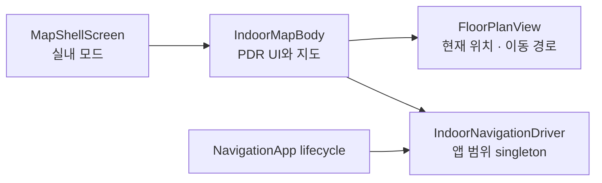
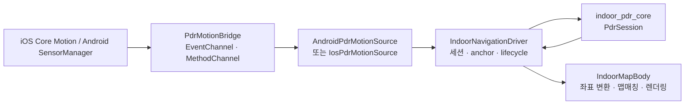

# PDR 앱 통합 가이드

이 문서는 현재 앱에 연결된 PDR(Pedestrian Dead Reckoning)의 구조와 동작을 설명한다.
센서 실험용 랩의 화면·경로 색상·비교 지표가 아니라, 사용자가 실내 지도에서 PDR을
시작하고 위치를 보며 길찾기에 사용하는 흐름을 기준으로 한다.

## 1. 현재 적용 범위

PDR은 `MapShellScreen`의 **실내 지도 모드** 안에 붙어 있다. 실내 지도에서 사용자가
시작 위치를 지정하면, 이후 휴대폰 센서로 계산한 상대 이동을 해당 층의 지도 좌표로
바꾸고 통행 그래프 위에 표시한다.

- PDR은 GPS 대체용 절대 위치가 아니라 **시작점 기준 상대 위치**를 계산한다.
- 따라서 PDR 시작 뒤에는 반드시 지도에서 현재 위치를 한 번 지정해야 한다.
- 위치와 이동 경로는 navigation graph가 있는 층에서만 표시할 수 있다.
- PDR이 활성화된 상태에서 다른 화면으로 이동해도 세션은 유지된다. 앱이 백그라운드로
  가면 센서를 멈추고, 복귀하면 다시 시작한다.

## 2. 프론트엔드 결선 위치

PDR UI와 지도 렌더링은 아래 파일에 모여 있다.

| 구분 | 위치 | 역할 |
|---|---|---|
| 지도 셸 | `client/lib/screens/map_shell/map_shell_screen.dart` | 홈/실내 모드를 전환하고 권한을 요청한다. 실내 모드일 때 `IndoorMapBody`를 표시한다. |
| 실내 지도 + PDR UI | `client/lib/screens/indoor_map/indoor_map_screen.dart` | 시작·종료 버튼, 시작점 지정, 방향 보정 대화상자, 위치·경로 렌더링, JSON 공유를 담당한다. |
| 전역 세션 생성 | `client/lib/core/service_locator.dart` | 플랫폼별 센서 소스와 `IndoorNavigationDriver`를 앱 범위 singleton으로 생성한다. |
| 앱 lifecycle 연결 | `client/lib/app.dart` | `NavigationApp`이 background/foreground 변화를 driver에 전달한다. |

`IndoorMapBody`는 driver의 snapshot과 calibration stream을 구독한다. PDR 좌표가
유효해지면 이를 지도 위 현재 위치와 `pdrPathPoints`로 `FloorPlanView`에 전달한다.
실내 길찾기의 출발 노드도 PDR 현재 위치가 있으면 그 위치를 우선 사용한다.



## 3. UI 동작

### 시작부터 위치 표시까지

1. 사용자가 실내 지도 우측의 `PDR 시작`을 누른다.
2. 지도에 navigation graph가 없으면 시작하지 않고 안내 메시지를 표시한다.
3. driver가 센서 스트림과 새 걸음 세션을 시작한다. 지도에는 `현재 위치를 지도에서 탭하세요` 안내가 남는다.
4. 사용자가 현재 서 있는 지점을 탭하면 화면 좌표를 층의 `local_m` 좌표로 변환해 anchor 후보로 전달한다.
5. 기기가 자북 기준 heading을 제공하면 anchor가 바로 확정된다. 그렇지 않으면 `위쪽·오른쪽·아래쪽·왼쪽` 중 현재 기기가 향한 도면 방향을 고르는 대화상자가 열린다.
6. anchor가 확정된 뒤에만 현재 위치와 이동 경로를 지도에 표시한다.

시작점을 확정하기 전에는 계산 중인 상대 좌표를 지도에 표시하지 않는다. 사용자가 지정한
실제 지도 위치와 PDR 좌표계를 연결하기 전에는 지도상 위치가 의미 없기 때문이다.

### 사용 중 동작

- 지도에는 PDR 원본 좌표를 층 좌표로 변환한 뒤, 통행 가능한 navigation graph에 맞춘
  현재 위치와 경로가 표시된다.
- PDR 위치가 있으면 실내 길찾기는 그 위치에서 가장 가까운 매장 입구 노드를 출발점으로
  잡는다. PDR 위치가 없을 때는 기존의 임시 출발점 방식을 사용한다.
- PDR 실행 중 층을 바꾸면 현재 세션과 보행계 기준을 초기화하고 새 층의 시작점 지정을
  다시 요청한다.
- 시작점 지정 중에는 취소 버튼으로 세션을 종료할 수 있다.

### 종료와 디버그 내보내기

`PDR 종료`를 누르면 driver는 native 센서가 가진 마지막 걸음 상태를 먼저 반영한 뒤
센서를 멈춘다. 기록된 snapshot이 있으면 종료 후 `JSON 공유` 버튼과 SnackBar 동작으로
세션 정보를 내보낼 수 있다. 이 JSON은 현장 거리·heading·맵매칭을 분석하기 위한
디버그 자료이며, 일반 사용자 흐름의 필수 단계는 아니다.

## 4. 앱 구조와 데이터 흐름



### 플랫폼 경계

Android와 iOS 모두 다음 채널 계약을 사용한다.

| 채널 | 방향 | 용도 |
|---|---|---|
| `navigation_client/pdr_motion` | native → Flutter | heading, 걸음·보행계, 가속도 피크가 담긴 이벤트 stream |
| `navigation_client/pdr_motion_cmd` | Flutter → native | `resetPedometer`, `finalizePedometer` 명령 |

Flutter 쪽 어댑터는 raw platform map을 `NativePdrEvent`로 바꾸는 역할만 한다. 어떤
걸음 수와 방향을 위치 계산에 반영할지는 `IndoorNavigationDriver`와 PDR core가 결정한다.
native 구현은 다음에 있다.

```text
client/android/app/src/main/kotlin/com/navigation/navigation_client/PdrMotionBridge.kt
client/ios/Runner/PdrMotionBridge.swift
```

### 세션 소유와 lifecycle

`IndoorNavigationDriver`는 위젯과 분리된 headless 컨트롤러다. `service_locator.dart`에서
한 번 생성되므로 지도 위젯이 다시 만들어져도 센서 세션과 계산 상태를 다시 만들지 않는다.

- `startGuidance`: PDR core와 native pedometer를 새 세션으로 초기화하고 센서 스트림을 연다.
- `stopGuidance`: 마지막 pedometer 상태를 반영하고 센서를 중지한다.
- background: core를 pause하고 native 센서를 멈춘다.
- foreground: native 센서를 다시 시작하고 core를 resume한다.
- `changeFloor`: 새 pedometer 세션을 열고 anchor를 다시 받는다.

UI가 호출하는 명령과 UI가 구독하는 상태는
`client/lib/features/indoor_navigation/contract/`에 분리되어 있다. 이 경계 덕분에
지도 UI는 센서 구현을 직접 알 필요가 없다.

## 5. PDR 계산 로직

PDR 계산 코어는 `packages/indoor_pdr_core/`에 있으며 Flutter 위젯이나 플랫폼 채널에
의존하지 않는다. 핵심 진입점은 `PdrSession`이다.

### 입력 처리 순서

한 native 이벤트 안에 여러 센서 값이 있으면 driver는 아래 순서로 core에 전달한다.

```text
heading → 가속도 보행 피크 → 보행계 배치
```

이 순서를 유지하면 늦게 들어온 보행계 배치도 해당 시점의 heading 기록을 찾아 경로에
배치할 수 있다.

### 위치 계산

1. heading 이벤트는 보정된 기기 방향, 안정성, 자력계 품질 등을 갱신한다.
2. PDR core는 heading을 부드럽게 처리하고 보행 방향 보정을 적용한다.
3. 보행계 이벤트의 새 걸음 수에 보폭을 곱해 이동 거리를 만든다.
4. 각 걸음을 당시의 보행 방향에 배치해 로컬 미터 좌표 경로를 누적한다.
5. 결과는 `PdrSnapshot`으로 전달된다. snapshot에는 현재 위치, 경로, 걸음 수, 거리,
   heading, 품질 정보가 포함된다.

iOS는 `CMPedometer`의 거리·cadence·pace를 보폭 추정에 활용할 수 있다. Android는
`STEP_COUNTER`를 우선 사용하며, 현재 기본 보폭은 0.70 m다. 가속도 피크는 위치 계산의
확정 걸음 수를 대체하지 않고, 보행계 배치의 시간 정렬과 품질 진단을 보조한다.

### 지도 좌표로 변환하고 통로에 맞추기

PDR core의 좌표는 세션 시작점 기준의 로컬 미터 좌표다. anchor가 확정되면 회전과
이동을 적용해 층의 `local_m` 좌표로 변환한다.

```text
floorPoint = rotate(pdrPoint, rotationDeg) + anchorLocalM
```

`FloorMapMatcher`는 변환된 점을 navigation graph의 가까운 간선에 투영한다. 직전 간선을
약하게 우선해 평행 복도나 분기점에서 경로가 불필요하게 튀는 현상을 줄인다. 매칭된 좌표는
WGS84로 바뀐 뒤 `FloorPlanView`에 전달된다. 맵매칭은 센서 오차를 수정하는 알고리즘이
아니라, 지도에서 통로를 벗어난 경로가 보이지 않게 하는 표시 보정이다.

## 6. 상태와 제한 사항

### runtime 상태

| 상태 | 의미 |
|---|---|
| `idle` | PDR 세션이 꺼져 있음 |
| `starting` | 센서 stream을 열고 첫 이벤트를 기다리는 중 |
| `running` | 센서 이벤트를 받아 PDR core에 반영 중 |
| `paused` | 앱 background로 센서 추적을 멈춘 상태 |
| `stopping` | 마지막 보행계 상태를 반영하고 종료하는 중 |
| `degraded` | 권한·센서·채널 문제로 정상 추적을 보장할 수 없음 |

### 현재 전제

- 해당 층의 `navigation_graph`가 없거나 비어 있으면 PDR을 시작할 수 없다.
- 시작점 지정이 부정확하면 이후 경로도 같은 만큼 어긋난다.
- 자력계 교란, 휴대 방식, 급회전, Android의 고정 보폭은 누적 위치 오차를 만들 수 있다.
- graph가 실제 통로와 다르면 맵매칭 결과도 잘못된 통로에 표시될 수 있다.

## 7. 확인 방법

코드 변경 뒤에는 다음을 실행한다.

```bash
cd client
flutter analyze
flutter test

cd ../packages/indoor_pdr_core
dart test
```

실기기에서는 실내 지도에서 PDR 시작 → 지도 탭으로 시작점 지정 → 짧은 이동 → 종료 →
JSON 공유 순서로 확인한다. Android와 iOS, 휴대 방식, 알려진 실제 거리별 결과는 별도로
기록해 보폭과 heading 품질을 검토한다.
