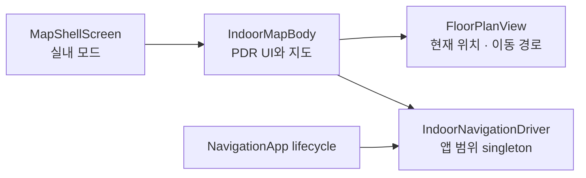
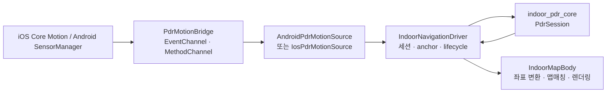
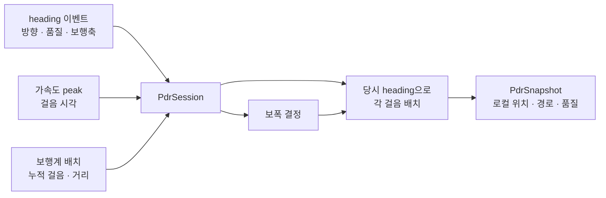

# PDR 앱 통합 가이드

이 문서는 현재 앱에 연결된 PDR(Pedestrian Dead Reckoning)의 구조와 동작을 설명한다.
센서 실험용 랩의 화면·경로 색상·비교 지표가 아니라, 사용자가 실내 지도에서 PDR을
시작하고 위치를 보며 길찾기에 사용하는 흐름을 기준으로 한다.

## 1. 현재 적용 범위

PDR은 `MapShellScreen`의 **실내 지도 모드** 안에 붙어 있다. 실내 지도에서 사용자가
시작 위치를 지정하면, 이후 휴대폰 센서로 계산한 상대 이동을 해당 층의 지도 좌표로
바꾸고 통행 그래프 위에 표시한다.

- PDR은 GPS 대체용 절대 위치가 아니라 **시작점 기준 상대 위치**를 계산한다.
- 따라서 PDR 시작 뒤에는 반드시 지도에서 현재 위치를 한 번 지정해야 한다.
- 위치와 이동 경로는 navigation graph가 있는 층에서만 표시할 수 있다.
- PDR이 활성화된 상태에서 다른 화면으로 이동해도 세션은 유지된다. 앱이 백그라운드로
  가면 센서를 멈추고, 복귀하면 다시 시작한다.

## 2. 프론트엔드 결선 위치

PDR UI와 지도 렌더링은 아래 파일에 모여 있다.

| 구분 | 위치 | 역할 |
|---|---|---|
| 지도 셸 | `client/lib/screens/map_shell/map_shell_screen.dart` | 홈/실내 모드를 전환하고 권한을 요청한다. 실내 모드일 때 `IndoorMapBody`를 표시한다. |
| 실내 지도 + PDR UI | `client/lib/screens/indoor_map/indoor_map_screen.dart` | 시작·종료 버튼, 시작점 지정, 방향 보정 대화상자, 위치·경로 렌더링, JSON 공유를 담당한다. |
| 전역 세션 생성 | `client/lib/core/service_locator.dart` | 플랫폼별 센서 소스와 `IndoorNavigationDriver`를 앱 범위 singleton으로 생성한다. |
| 앱 lifecycle 연결 | `client/lib/app.dart` | `NavigationApp`이 background/foreground 변화를 driver에 전달한다. |

`IndoorMapBody`는 driver의 snapshot과 calibration stream을 구독한다. PDR 좌표가
유효해지면 이를 지도 위 현재 위치와 `pdrPathPoints`로 `FloorPlanView`에 전달한다.
실내 길찾기의 출발 노드도 PDR 현재 위치가 있으면 그 위치를 우선 사용한다.



## 3. UI 동작

### 시작부터 위치 표시까지

1. 사용자가 실내 지도 우측의 `PDR 시작`을 누른다.
2. 지도에 navigation graph가 없으면 시작하지 않고 안내 메시지를 표시한다.
3. driver가 센서 스트림과 새 걸음 세션을 시작한다. 지도에는 `현재 위치를 지도에서 탭하세요` 안내가 남는다.
4. 사용자가 현재 서 있는 지점을 탭하면 화면 좌표를 층의 `local_m` 좌표로 변환해 anchor 후보로 전달한다.
5. 기기가 자북 기준 heading을 제공하면 anchor가 바로 확정된다. 그렇지 않으면 `위쪽·오른쪽·아래쪽·왼쪽` 중 현재 기기가 향한 도면 방향을 고르는 대화상자가 열린다.
6. anchor가 확정된 뒤에만 현재 위치와 이동 경로를 지도에 표시한다.

시작점을 확정하기 전에는 계산 중인 상대 좌표를 지도에 표시하지 않는다. 사용자가 지정한
실제 지도 위치와 PDR 좌표계를 연결하기 전에는 지도상 위치가 의미 없기 때문이다.

### 사용 중 동작

- 지도에는 PDR 원본 좌표를 층 좌표로 변환한 뒤, 통행 가능한 navigation graph에 맞춘
  현재 위치와 경로가 표시된다.
- PDR 위치가 있으면 실내 길찾기는 그 위치에서 가장 가까운 매장 입구 노드를 출발점으로
  잡는다. PDR 위치가 없을 때는 기존의 임시 출발점 방식을 사용한다.
- PDR 실행 중 층을 바꾸면 현재 세션과 보행계 기준을 초기화하고 새 층의 시작점 지정을
  다시 요청한다.
- 시작점 지정 중에는 취소 버튼으로 세션을 종료할 수 있다.

### 종료와 디버그 내보내기

`PDR 종료`를 누르면 driver는 native 센서가 가진 마지막 걸음 상태를 먼저 반영한 뒤
센서를 멈춘다. 기록된 snapshot이 있으면 종료 후 `JSON 공유` 버튼과 SnackBar 동작으로
세션 정보를 내보낼 수 있다. 이 JSON은 현장 거리·heading·맵매칭을 분석하기 위한
디버그 자료이며, 일반 사용자 흐름의 필수 단계는 아니다.

## 4. 앱 구조와 데이터 흐름



### 플랫폼 경계

Android와 iOS 모두 다음 채널 계약을 사용한다.

| 채널 | 방향 | 용도 |
|---|---|---|
| `navigation_client/pdr_motion` | native → Flutter | heading, 걸음·보행계, 가속도 피크가 담긴 이벤트 stream |
| `navigation_client/pdr_motion_cmd` | Flutter → native | `resetPedometer`, `finalizePedometer` 명령 |

Flutter 쪽 어댑터는 raw platform map을 `NativePdrEvent`로 바꾸는 역할만 한다. 어떤
걸음 수와 방향을 위치 계산에 반영할지는 `IndoorNavigationDriver`와 PDR core가 결정한다.
native 구현은 다음에 있다.

```text
client/android/app/src/main/kotlin/com/navigation/navigation_client/PdrMotionBridge.kt
client/ios/Runner/PdrMotionBridge.swift
```

### 세션 소유와 lifecycle

`IndoorNavigationDriver`는 위젯과 분리된 headless 컨트롤러다. `service_locator.dart`에서
한 번 생성되므로 지도 위젯이 다시 만들어져도 센서 세션과 계산 상태를 다시 만들지 않는다.

- `startGuidance`: PDR core와 native pedometer를 새 세션으로 초기화하고 센서 스트림을 연다.
- `stopGuidance`: 마지막 pedometer 상태를 반영하고 센서를 중지한다.
- background: core를 pause하고 native 센서를 멈춘다.
- foreground: native 센서를 다시 시작하고 core를 resume한다.
- `changeFloor`: 새 pedometer 세션을 열고 anchor를 다시 받는다.

UI가 호출하는 명령과 UI가 구독하는 상태는
`client/lib/features/indoor_navigation/contract/`에 분리되어 있다. 이 경계 덕분에
지도 UI는 센서 구현을 직접 알 필요가 없다.

## 5. PDR 메커니즘

PDR 계산 코어는 `packages/indoor_pdr_core/`에 있으며 Flutter 위젯·플랫폼 채널·지도에
의존하지 않는다. 센서마다 다른 원시 값을 platform bridge가 typed 이벤트로 정리하고,
`PdrSession`이 이 이벤트들을 조합해 세션 시작점 기준의 로컬 미터 경로를 만든다.



### iOS와 Android의 차이

두 플랫폼은 같은 `NativePdrEvent` 계약을 만들지만, OS가 제공하는 센서 값과 신뢰할 수
있는 기준은 다르다.

| 항목 | iOS | Android |
|---|---|---|
| native 구현 | `client/ios/Runner/PdrMotionBridge.swift` | `client/android/app/src/main/kotlin/com/navigation/navigation_client/PdrMotionBridge.kt` |
| 방향의 기본 입력 | `CMMotionManager.deviceMotion` | `TYPE_ROTATION_VECTOR`, 없으면 `TYPE_GAME_ROTATION_VECTOR` |
| 방향 기준 | `.xMagneticNorthZVertical`을 우선 사용하고, 불가하면 `.xArbitraryCorrectedZVertical` | 일반 rotation vector는 자북 기준, game rotation vector는 절대 북 기준이 아님 |
| 걸음 수 기준 | `CMPedometer.numberOfSteps` | `STEP_COUNTER`가 들어오면 이를 우선; 아직 live가 아니면 `STEP_DETECTOR`를 fallback으로 사용 |
| 거리·보폭 입력 | OS 거리, cadence, pace를 제공할 수 있음 | OS 거리·pace는 없음. cadence와 가속도 amplitude는 진단용 후보만 계산 |
| 권한 | 앱 시작 시 sensor 권한 요청 | Android 10 이상에서는 `ACTIVITY_RECOGNITION` 권한이 있어야 step 센서를 등록 |

두 플랫폼 모두 기기의 상단 축을 기본 진행 방향으로 사용한다. 휴대폰이 세워진 경우에는
후면 카메라 방향을 섞어 세로로 쥔 경우와 평평하게 든 경우의 방향 불연속을 줄인다.
또한 world frame으로 옮긴 수평 가속도의 약 1.3초 구간을 PCA로 분석해 보행축과 신뢰도를
추정한다. 이 보행축에는 앞/뒤가 모호하므로, core가 현재 heading과 가까운 쪽을 선택한다.

#### iOS 센서 처리

`PdrMotionBridge.swift`는 `DeviceMotion`을 약 100 Hz로 수집하고 Flutter에는 약 30 ms
간격으로 motion 이벤트를 보낸다. DeviceMotion에서 heading, attitude, user acceleration,
gyro, magnetic field를 읽는다. `CMPedometer`는 걸음 수·누적 거리·cadence·pace를 별도
callback으로 보내며, 이 값은 보통 짧은 시간 단위로 묶여 도착한다.

- 자북 기준 attitude frame을 쓸 수 있으면 anchor에 추가 방향 선택이 필요 없다.
- arbitrary corrected frame으로 fallback하면 절대 북쪽과 도면의 관계가 없으므로, UI가
  사용자의 도면 방향 선택을 받아 회전각을 확정한다.
- 가속도 peak는 Schmitt trigger와 refractory interval로 검출하지만, 걸음 수를 확정하는
  데 쓰지 않는다. 늦은 `CMPedometer` 배치의 걸음을 당시 heading에 맞춰 놓기 위한
  시각 기록과 품질 진단에 쓴다.
- 종료 시 `finalizePedometer`가 후속 callback을 막고 마지막 snapshot을 내보내므로,
  종료 뒤 늦게 도착한 callback이 이미 끝난 경로를 늘리지 못한다.

#### Android 센서 처리

`PdrMotionBridge.kt`는 rotation vector, linear acceleration, accelerometer, gravity,
gyroscope, magnetic field를 등록한다. 회전·가속도 계열은 약 100 Hz 목표로 받고, step
센서는 각 센서에 맞는 시스템 지연 설정으로 받는다.

- `STEP_COUNTER`는 기기 부팅 이후 누적값이므로, PDR 시작 시점의 값을 baseline으로 잡고
  이후 delta만 세션 걸음 수로 사용한다. counter가 live가 되면 `STEP_DETECTOR`나 가속도
  peak가 확정 경로를 독자적으로 늘리지 않는다.
- `STEP_COUNTER`를 아직 받지 못한 환경에서는 `STEP_DETECTOR`를 fallback 걸음 수로 쓴다.
  detector 이벤트는 cadence와 step timing도 제공한다.
- rotation vector의 자력계 품질이 낮거나, 자기장 변화·heading 불일치·낮은 정확도가
  감지되면 짧게 gyro 적분 방향을 사용한다. 일반 rotation vector에서 시작한 gyro hold는
  마지막 자북 frame을 이어가지만, game rotation vector나 순수 gyro hold는 arbitrary
  기준으로 취급되어 수동 방향 보정이 필요하다.
- 종료 직전에는 counter의 마지막 관측값을 한 번 반영하고 세션을 동결한다.

### 코어 파일이 함께 동작하는 방식

`PdrSession` 하나가 모든 계산을 구현하는 구조가 아니다. 아래 모듈들이 상태를 나눠
관리하며, `PdrSession`은 입력 순서와 snapshot 생성을 조정한다.

| 파일 | 책임 |
|---|---|
| `application/pdr_session.dart` | 전체 coordinator. heading → peak → pedometer 순서로 입력을 반영하고 `PdrSnapshot`을 발행한다. |
| `application/pedometer_batch_processor.dart` | 세션 ID와 누적 걸음 수로 새 걸음 delta를 계산하고, 늦게 온 보행계 배치를 tracking 구간에 맞게 분할한다. |
| `application/tracking_timeline.dart` | background pause/resume처럼 보행계 배치 중간에 tracking 상태가 바뀐 경우, tracking이 켜져 있던 시간/peak 비율만 반영한다. |
| `application/stride_estimator.dart` | 한 걸음의 거리를 결정하고 급격한 보폭 변화는 제한한다. |
| `application/heading_trackers.dart` | 최근 heading 기록, 팔 흔들림 판별, 보행축 기반의 `walkOffset`을 관리한다. |
| `application/path_accumulator.dart` | 각 확정 걸음을 해당 시각의 heading으로 로컬 좌표 경로에 누적한다. |
| `application/accel_preview_track.dart` | 가속도 peak 기반의 보조 경로와 peak 거부 사유를 별도로 유지한다. 지도 위치를 결정하지 않는다. |
| `application/quality_metrics.dart` | 보행계 과소 계수·가속도 peak 과다 검출 가능성을 품질 신호로 계산한다. |
| `application/pdr_session_config.dart` | 기본 보폭(0.70 m), 경로 최대 점 수, 품질 임계값 등 세션 설정을 제공한다. |

### 1. heading과 보행 방향

`PdrSession.onHeading`은 native의 fused heading, 자력계 품질, gyro heading, 기울기,
보행축을 받아 보관한다. 이후 다음 순서로 실제 이동 방향을 만든다.

1. 새 heading은 최단 각도 차이를 기준으로 지수 smoothing한다. heading이 안정적이면
   빠르게, 불안정하거나 팔 흔들림이 감지되면 더 천천히 반영한다.
2. `HeadingHistory`가 약 20초의 `(시각, 보행 방향, fused heading)` 샘플을 보관한다.
3. `SwingDetector`는 약 1.5초의 방향 변화에서 왕복 흔들림과 실제 회전을 구분한다.
4. `WalkOffsetEstimator`는 흔들림이 안정적이고 PCA 보행축 신뢰도가 충분할 때만
   `walkOffset`을 천천히 갱신한다. 실제 회전이 감지되면 잠시 보정을 멈춘다.
5. 최종 보행 방향은 `fusedHeading + walkOffset`이다.

이 과정은 휴대폰이 몸의 진행 방향과 정확히 일치하지 않을 때의 오차를 줄이기 위한
보정이다. 보행축 신뢰도가 낮거나 회전 중이면 보정을 강제로 적용하지 않는다.

### 2. 보행계 배치, 보폭, 거리

`PedometerBatchProcessor`는 누적 걸음 수에서 이전 값을 빼 delta를 구한다. 새 세션보다
오래된 `stepSessionId` 이벤트는 버리고, heading을 아직 받지 못한 경우에도 경로를 늘리지
않는다. 늦게 도착한 배치가 pause/resume 경계를 가로지르면 `TrackingTimeline`이 실제
tracking 구간에 해당하는 걸음만 남긴다.

`StrideEstimator`가 선택하는 한 걸음 길이의 우선순위는 다음과 같다.

1. iOS가 제공한 누적 거리의 delta ÷ step delta
2. iOS cadence와 pace로 계산한 거리
3. 기본 보폭 0.70 m

유효 보폭 범위는 0.35~1.20 m이며, 이전 추정값에서 한 번에 크게 바뀌지 않도록 제한하고
누적 걸음 수가 적을 때는 조금 더 빠르게 적응한다. Android의 cadence 및 가속도 amplitude
기반 후보는 현재 실제 거리 스케일에 적용하지 않는다. 현장 라벨 데이터 없이 기기·휴대
방식 차이를 일반화하지 않기 위한 결정이다.

### 3. 각 걸음을 경로에 배치하기

보행계 callback은 실시간으로 한 걸음씩 오지 않을 수 있다. `PathAccumulator`는 배치 안의
각 걸음을 바로 현재 heading으로 몰아넣지 않고, 가능한 경우 가속도 peak 시각을 사용해
배치 구간에 분산한다. 각 시각에서 `HeadingHistory`의 가장 가까운 이전 heading을 찾아
적용한다. peak 시각이 부족하면 보행계 batch의 시작·끝 시각 사이에 균등 배치한다.

각 걸음의 로컬 좌표 증분은 아래와 같다. `headingDeg`는 북쪽이 0도이고 동쪽이 90도인
규약이다.

```text
east  += sin(headingDeg) × stepDistanceM
north += cos(headingDeg) × stepDistanceM
```

이 누적 결과가 제품에서 사용하는 위치와 경로다. 별도의 가속도 peak 기반 보조 경로는
peak 간격, cadence 불일치, 확정 경로보다 과도하게 앞서는 정도를 검사해 품질 진단에만
사용한다. 이 보조 경로가 제품 위치를 대체하거나 자동으로 섞이지는 않는다.

### 4. 품질 상태

`PdrSnapshot`에는 위치 외에도 `healthy`, `caution`, `degraded` 품질 상태와 warning이
들어 있다. 보행계가 가속도 peak에 비해 장시간 지나치게 적게 증가하면 `degraded`로,
가속도 peak의 과다 검출이나 두 거리의 큰 차이는 `caution` 신호로 처리한다. 이 신호는
자동으로 다른 경로를 채택하기 위한 값이 아니라 UI와 현장 디버그가 센서 상태를 해석하기
위한 정보다.

### 지도 좌표로 변환하고 통로에 맞추기

PDR core의 좌표는 세션 시작점 기준의 로컬 미터 좌표다. anchor가 확정되면 회전과
이동을 적용해 층의 `local_m` 좌표로 변환한다.

```text
floorPoint = rotate(pdrPoint, rotationDeg) + anchorLocalM
```

`FloorMapMatcher`는 변환된 점을 navigation graph의 가까운 간선에 투영한다. 직전 간선을
약하게 우선해 평행 복도나 분기점에서 경로가 불필요하게 튀는 현상을 줄인다. 매칭된 좌표는
WGS84로 바뀐 뒤 `FloorPlanView`에 전달된다. 맵매칭은 센서 오차를 수정하는 알고리즘이
아니라, 지도에서 통로를 벗어난 경로가 보이지 않게 하는 표시 보정이다.

## 6. 상태와 제한 사항

### runtime 상태

| 상태 | 의미 |
|---|---|
| `idle` | PDR 세션이 꺼져 있음 |
| `starting` | 센서 stream을 열고 첫 이벤트를 기다리는 중 |
| `running` | 센서 이벤트를 받아 PDR core에 반영 중 |
| `paused` | 앱 background로 센서 추적을 멈춘 상태 |
| `stopping` | 마지막 보행계 상태를 반영하고 종료하는 중 |
| `degraded` | 권한·센서·채널 문제로 정상 추적을 보장할 수 없음 |

### 현재 전제

- 해당 층의 `navigation_graph`가 없거나 비어 있으면 PDR을 시작할 수 없다.
- 시작점 지정이 부정확하면 이후 경로도 같은 만큼 어긋난다.
- 자력계 교란, 휴대 방식, 급회전, Android의 고정 보폭은 누적 위치 오차를 만들 수 있다.
- graph가 실제 통로와 다르면 맵매칭 결과도 잘못된 통로에 표시될 수 있다.

## 7. 확인 방법

코드 변경 뒤에는 다음을 실행한다.

```bash
cd client
flutter analyze
flutter test

cd ../packages/indoor_pdr_core
dart test
```

실기기에서는 실내 지도에서 PDR 시작 → 지도 탭으로 시작점 지정 → 짧은 이동 → 종료 →
JSON 공유 순서로 확인한다. Android와 iOS, 휴대 방식, 알려진 실제 거리별 결과는 별도로
기록해 보폭과 heading 품질을 검토한다.
