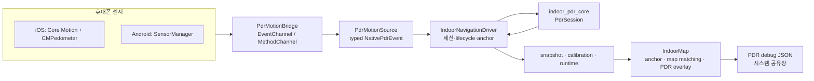

# PDR 앱 통합·UI·플랫폼 동작 가이드

이 문서는 현재 `dev` 기반 PDR 통합의 단일 기준 문서다. PDR이 앱에 연결된 위치,
실내 지도 UI에서의 사용 흐름, Android/iOS의 센서·거리·heading 처리, 맵매칭과
디버그 JSON 내보내기 방식을 함께 설명한다.

## 1. 범위와 기본 원칙

PDR(Pedestrian Dead Reckoning)은 GPS가 약한 실내에서 휴대폰의 걸음과 방향을 사용해
**세션 시작점으로부터의 상대 이동**을 추정한다. 따라서 센서 결과만으로 곧바로
지도 좌표가 되지는 않는다. 사용자가 지도에서 시작 위치(anchor)를 정하고, 이후
PDR 로컬 미터 좌표를 층 도면의 `floor_local_m` 좌표로 변환해 표시한다.

- 확정 경로는 보행계 기준의 **초록 경로**다. 지도와 길찾기에 사용하는 기준값이다.
- 가속도 peak 기반 **주황 preview**는 진단용이다. 초록 경로를 대체하거나 평균내지
  않으며, 메인 실내 지도에서는 기본으로 표시하지 않는다.
- 맵매칭은 경로를 통행 graph 위에 스냅해 표시 드리프트를 줄이는 장치다. 센서 거리나
  heading 자체를 정확하게 만드는 보정은 아니다.
- 앱은 PDR 세션을 화면이 아니라 앱 범위 singleton으로 소유한다. IndoorMap과 다른
  화면 사이를 이동해도 세션은 유지되고, 종료·층 변경·background에서만 멈춘다.

## 2. 전체 구조



### 코드 배치

| 계층 | 주요 위치 | 책임 |
|---|---|---|
| PDR 계산 코어 | `packages/indoor_pdr_core/` | 걸음 배치, 보폭, heading, 경로 누적, 품질 계산 |
| Flutter 플랫폼 어댑터 | `client/lib/features/indoor_navigation/platform/` | EventChannel raw map을 typed event로 변환 |
| 세션·공개 계약 | `client/lib/features/indoor_navigation/application/`, `contract/` | start/stop, lifecycle, anchor, runtime/snapshot stream |
| Android bridge | `client/android/.../PdrMotionBridge.kt` | `SensorManager` 센서 수집과 EventChannel 송신 |
| iOS bridge | `client/ios/Runner/PdrMotionBridge.swift` | Core Motion/CMPedometer 수집과 EventChannel 송신 |
| 앱·지도 결선 | `client/lib/app.dart`, `core/service_locator.dart`, `screens/indoor_map/` | 앱 lifecycle, 전역 driver, 지도 UI/맵매칭 |

## 3. 앱에 붙는 방식

### 앱 범위 세션

`core/service_locator.dart`는 플랫폼에 맞는 `PdrMotionSource`와
`IndoorNavigationDriver`를 한 번만 만든다.

```text
Android  → AndroidPdrMotionSource
iOS      → IosPdrMotionSource
             ↓
      IndoorNavigationDriver (singleton)
             ↓
         PdrSession
```

따라서 위젯마다 driver를 새로 만들면 안 된다. 새로 만들면 경로·pedometer baseline·anchor가
끊긴다.

`NavigationApp`은 `WidgetsBindingObserver`로 앱 lifecycle을 관찰한다.

- background: `onAppBackgrounded()` → PDR core를 pause하고 native 센서를 stop
- foreground: `onAppForegrounded()` → native 센서를 start하고 PDR core를 resume
- 일반 화면 전환: PDR를 stop하지 않음

### Flutter와 native의 채널

두 플랫폼은 아래 이름을 공통으로 쓴다.

| 채널 | 방향 | 용도 |
|---|---|---|
| `navigation_client/pdr_motion` | native → Flutter | motion, pedometer, 초기 snapshot 이벤트 stream |
| `navigation_client/pdr_motion_cmd` | Flutter → native | `resetPedometer`, `finalizePedometer` 명령 |

`IndoorNavigationDriver`는 native event를 항상 `heading → accel peak → pedometer`
순으로 core에 전달한다. 이 순서 덕분에 늦게 도착하는 보행계 배치도 당시의 heading을
찾아 경로에 배치할 수 있다.

## 4. UI에서 PDR 사용하기

### 화면의 실제 사용자 흐름

실내 지도 우측의 `PDR 시작` 제어를 기준으로 동작한다.

1. 사용자가 `PDR 시작`을 누른다.
2. driver가 센서와 새 pedometer 세션을 시작하고, 지도에 현재 서 있는 위치를 탭하라고 안내한다.
3. 지도 탭 좌표를 floor `local_m`으로 역변환해 anchor 위치로 저장한다.
4. heading이 자북 기준이면 anchor가 즉시 확정된다.
5. heading이 arbitrary 기준이면 현재 휴대폰이 향한 도면 방향을 선택해 회전각을 추가 보정한다.
6. 보행하면 초록 PDR 경로와 blue-dot·방향 포인터가 나타난다. 표시 경로는 floor graph에
   맵매칭된 경로다.
7. `PDR 종료`는 마지막 보행계 상태를 flush한 뒤 센서를 중지한다.
8. 종료 뒤 `JSON 공유` 스낵바 또는 PDR 제어 옆 공유 아이콘으로 디버그 세션을 내보낸다.

anchor를 고르기 전에는 위치를 표시하지 않는다. 존재하지 않는 정확도를 표시하지 않기 위한
의도적인 동작이다.

### UI가 읽는 상태와 보내는 명령

UI 공개 계약은 다음 barrel에 있다.

```dart
import 'package:navigation_client/features/indoor_navigation/contract/indoor_navigation_contract.dart';
```

| 읽기 상태 | 의미 |
|---|---|
| `snapshots`, `currentSnapshot` | 확정 경로·거리·걸음·heading·품질, 그리고 진단용 preview |
| `calibration`, `currentCalibration` | anchor 진행 상태와 확정 anchor |
| `runtimeStatuses`, `currentRuntimeStatus` | 센서 시작·실행·pause·오류 상태 |

| UI 명령 | 용도 |
|---|---|
| `startGuidance(floorId: ...)` | 센서와 새 PDR 세션 시작 |
| `stopGuidance()` | 마지막 보행계 상태를 반영하고 세션 종료 |
| `confirmAnchorByPin(floorPointM: ...)` | 지도 탭으로 anchor 위치 확정 |
| `confirmAnchorByHeading(floorHeadingDeg: ...)` | arbitrary heading 기준의 회전 보정 |
| `changeFloor(floorId: ...)` | 세션·pedometer를 reset하고 새 층 anchor 요구 |

### 캘리브레이션 상태

| phase | UI 동작 |
|---|---|
| `uncalibrated` | 위치를 그리지 않음 |
| `awaitingPin` | 지도에서 현재 위치를 탭하도록 안내 |
| `awaitingHeading` | 기기가 향한 도면 방향을 선택하도록 안내 |
| `calibrated` | anchor가 확정됐으므로 위치·경로를 표시 |

`CalibrationStatus.canRenderPosition`이 true일 때만 PDR 위치를 지도에 그린다.

### 좌표 변환과 맵매칭

PDR core의 `PdrLocalPoint(eastM, northM)`는 세션 시작점 기준 미터 좌표다.
anchor 뒤에는 다음 rigid transform으로 층 좌표로 바꾼다.

```text
floorPoint = R(rotationDeg) × pdrPoint + anchorLocalM
```

`IndoorMapBody`는 이 경로를 `FloorMapMatcher`에 전달한다. matcher는 가장 가까운
통행 graph edge에 투영하고, 분기·평행 복도에서는 직전 edge와 진행 방향을 고려해
불필요한 edge 점프를 줄인다. 이후 floor 좌표를 지도 WGS84 표현으로 변환해
`FloorPlanView`에 전달한다.

메인 지도에서 보이는 것은 다음과 같다.

- 흰 casing과 초록 중심선의 맵매칭 PDR trail
- 현재 위치 blue-dot과 heading 포인터
- 시작/종료/anchor 안내 및 JSON 공유 제어

## 5. iOS PDR 동작

### 센서 입력

`PdrMotionBridge.swift`는 다음을 사용한다.

- `CMPedometer`: 누적 걸음, Apple 거리 추정, cadence, pace
- `CMMotionManager.deviceMotion`: attitude, user acceleration, gyro, magnetic field

DeviceMotion은 자북 기준 `.xMagneticNorthZVertical`을 우선 요청한다. 이 frame을
쓸 수 없으면 `.xArbitraryCorrectedZVertical`로 fallback한다. fallback은 절대 북쪽과
도면 방향의 관계를 보장하지 않으므로 UI가 수동 방향 보정을 요청한다.

motion은 약 100 Hz로 수집하되 Flutter event는 약 30 ms 간격으로 제한한다. bridge는
기기 top 축을 기본 진행 방향으로 쓰고, 기기가 충분히 기울면 후면 카메라 축을 섞어
세로·평면 휴대 사이의 방향 불연속을 줄인다.

### 확정 걸음과 거리

`CMPedometer` callback은 대개 배치로 도착한다. 그 안의 `numberOfSteps`와 Apple 거리
추정을 확정 경로에 반영한다.

- 거리 보폭은 Apple 거리 delta ÷ step delta를 최우선으로 사용한다.
- Apple 거리 정보를 쓸 수 없으면 cadence·pace에서 보폭을 계산한다.
- 둘 다 없을 때만 fallback 보폭을 사용한다.
- callback이 늦게 도착해도 가속도 peak 시각과 heading history로 배치 안 걸음을 당시
  방향에 나눠 배치한다.

가속도 peak는 걸음을 별도로 확정하는 값이 아니다. 늦은 pedometer 배치의 시간 배치와
preview/품질 진단에만 쓴다.

### iOS heading과 보행 방향

DeviceMotion의 fused heading을 최단각 지수 smoothing한다. 짧은 gyro 적분 값은
heading jump 진단과 연속성 보조로 사용한다. world-frame 수평 user acceleration의 약
1.3초 PCA 주축으로 보행축을 추정하고, 팔 흔들림이 안정적으로 감지됐을 때만
`walkOffset`을 서서히 적용한다. 실제 회전 구간에서는 보정 적용을 잠시 막는다.

## 6. Android PDR 동작

### 센서 입력

`PdrMotionBridge.kt`는 `SensorManager`에서 다음 센서를 등록한다.

- `TYPE_ROTATION_VECTOR` 우선, 없으면 `TYPE_GAME_ROTATION_VECTOR`
- `TYPE_GYROSCOPE`, `TYPE_MAGNETIC_FIELD`
- `TYPE_LINEAR_ACCELERATION`, `TYPE_ACCELEROMETER`, `TYPE_GRAVITY`
- `TYPE_STEP_COUNTER`, `TYPE_STEP_DETECTOR`

Android 10 이상에서는 `ACTIVITY_RECOGNITION` 권한이 있어야 step 센서를 등록한다.

### 확정 걸음과 거리

Android는 iOS처럼 OS가 추정한 보행 거리를 제공하지 않는다.

- `STEP_COUNTER`가 들어오기 시작하면 누적 카운터 delta만 확정 걸음으로 사용한다.
- `STEP_DETECTOR`와 가속도 peak는 cadence·시간 배치·진단용이며, counter가 live인
  상태에서 확정 경로를 독자적으로 늘리지 않는다.
- `STEP_COUNTER`를 쓸 수 없을 때만 `STEP_DETECTOR`를 확정 걸음 fallback으로 쓴다.
- 보폭은 현재 기본 0.70 m의 고정 fallback을 확정 경로에 사용한다. cadence와 가속도
  amplitude로 만든 candidate(Weinberg 계열)는 내부 shadow 후보일 뿐 자동 거리
  스케일에는 적용하지 않는다.

따라서 Android 경로의 거리 오차는 iOS보다 기기·사람·휴대 방식의 영향을 크게 받을 수 있다.
개인별 실제 거리로 보폭을 보정하면 좋아지지만, 그것은 개인화이므로 기본 로직에는 자동으로
반영하지 않는다.

### Android heading

rotation vector가 정상일 때 이를 기본 heading으로 사용한다. 자력계 품질이 low/uncalibrated,
자기장 크기 변화가 크거나, rotation heading accuracy가 나쁘거나, rotation vector와 gyro
heading의 차이가 큰 경우에는 짧은 gyro hold를 사용한다.

- 9-axis `TYPE_ROTATION_VECTOR`에서 시작한 gyro hold는 마지막 자북 기준 frame을 유지한다.
- `GAME_ROTATION_VECTOR` 또는 순수 gyro hold는 절대 북쪽을 보장하지 않으므로 수동
  도면 방향 보정 대상이다.
- 가속도를 world frame으로 옮긴 뒤 약 1.3초 PCA로 보행축을 추정하고, 안정된 팔 흔들림에만
  walkOffset을 천천히 적용한다.

## 7. PDR core 계산과 품질

`PdrSession`은 Flutter·지도·플랫폼 코드에 의존하지 않는 순수 Dart 계산 계층이다.

### 초록 확정 경로와 주황 preview

| 경로 | 입력 | 용도 |
|---|---|---|
| 초록 confirmed | iOS `CMPedometer` 또는 Android `STEP_COUNTER` | 지도 위치·거리의 기준 |
| 주황 accel preview | 가속도 step peak | 센서 과다/과소 감지와 타이밍 진단 |

quality는 다음과 같은 신호를 제공한다.

- `healthy` / `caution` / `degraded`
- native pedometer 과소 계수 의심
- preview와 confirmed 거리 차이, preview 과다 계수 의심
- heading source/stability, magnetic accuracy, rotation heading accuracy
- cadence, pitch/roll, peak reject histogram

preview와 confirmed의 차이가 크다고 자동으로 초록 경로를 주황 경로로 바꾸지 않는다.
이 차이는 센서 상태를 분석하기 위한 신호다.

## 8. PDR 디버그 JSON

PDR 종료 뒤 내보내는 JSON은 현장 실측 분석용이다. 파일에는 고주파 원시 IMU와 GPS를
넣지 않고, 필요한 결과와 품질만 담는다.

| JSON 영역 | 내용 |
|---|---|
| session/map context | 시작·내보내기 시각, 기기/앱 버전, 건물·층·graph 요약 |
| anchor | floor 좌표, 회전각, heading 기준, 수동 보정 여부 |
| summary | 확정 걸음·거리·heading, preview 요약, 최종 품질·warning |
| paths | PDR 로컬 경로, 맵매칭 전 floor 경로, 맵매칭 후 경로 |
| quality samples | 최대 1 Hz의 heading·cadence·자력계·거리 품질 |
| runtime | 최종 PDR runtime state와 warning |

파일과 함께 실제 시작점·도착점, 걸은 방식, 알려진 실제 거리를 전달해야 정확한 분석이
가능하다. 예를 들어 “1F A 기둥에서 B 기둥까지 왕복, 실제 15.4m”처럼 설명한다.

## 9. runtime 상태와 오류

| 상태 | 의미 |
|---|---|
| `idle` | 안내와 센서 세션이 꺼짐 |
| `starting` | EventChannel을 열고 첫 native event를 기다림 |
| `running` | native event를 받아 PDR core로 전달 중 |
| `paused` | background로 tracking·센서를 멈춘 상태 |
| `stopping` | 명시적 종료와 마지막 pedometer flush 처리 중 |
| `degraded` | 권한·센서·채널 오류로 정상 추적을 보장할 수 없음 |

주요 warning은 `sensorStartFailed`, `sensorStreamError`, `sensorStopFailed`,
`sensorResumeFailed`, `pedometerResetFailed`, `pedometerFinalizeFailed`다. warning은
사용자 문구가 아니라 UI와 분석 코드가 해석할 안정된 식별자다.

## 10. 검증 방법과 한계

### 자동 검증

```bash
cd client
flutter analyze
flutter test

cd ../packages/indoor_pdr_core
dart test
```

Android 디버그 APK는 JDK 21로 빌드한다.

```bash
cd client
JAVA_HOME=/opt/homebrew/opt/openjdk@21/libexec/openjdk.jdk/Contents/Home \
  flutter build apk --debug
```

### 현장 검증 순서

1. 두 플랫폼에서 PDR 시작 → anchor 탭 → 종료가 되는지 확인한다.
2. 알려진 직선 거리와 왕복 구간을 걷고, 초록 거리·heading·맵매칭 경로를 비교한다.
3. JSON을 공유하고 시작·도착·실제 거리 설명을 함께 기록한다.
4. Android/iOS, 휴대 위치, 보행 속도를 나눠 비교한다.

### 알려진 한계

- Android의 기본 확정 거리는 아직 고정 보폭 기반이므로 개인·보행 패턴별 거리 오차가
  누적될 수 있다.
- heading은 자력계 교란, 기기 방향, 팔 흔들림, 급회전에 민감하다.
- 맵매칭은 지도 graph가 실제 통로를 정확히 표현하고 anchor가 맞을 때만 도움이 된다.
  잘못된 graph에는 경로가 잘못된 edge로 스냅될 수 있다.
- 현장 실측 JSON이 쌓이기 전에는 임계값·Android 보폭 후보를 자동 보정에 사용하지 않는다.
