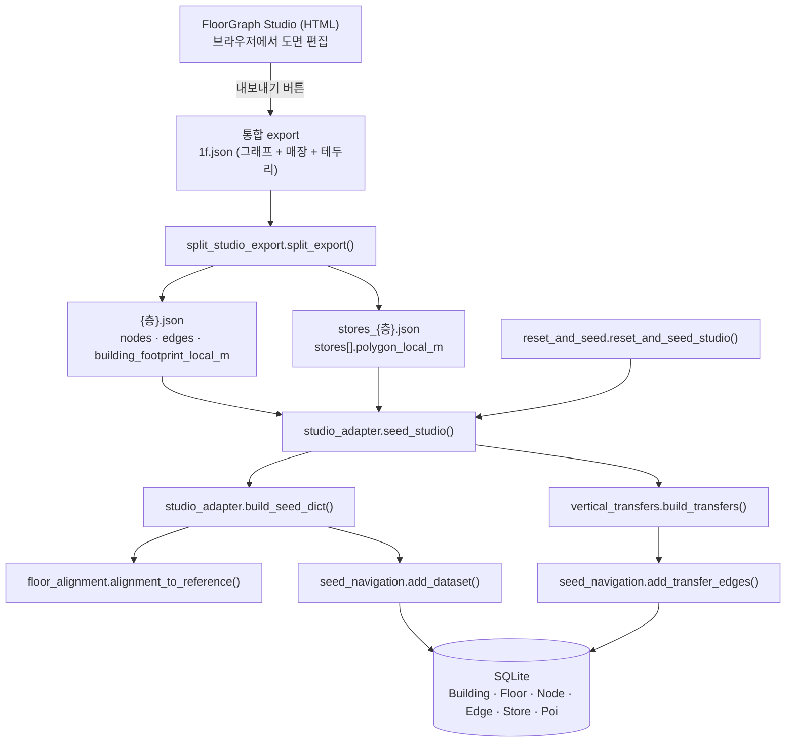
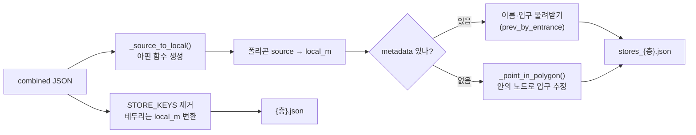
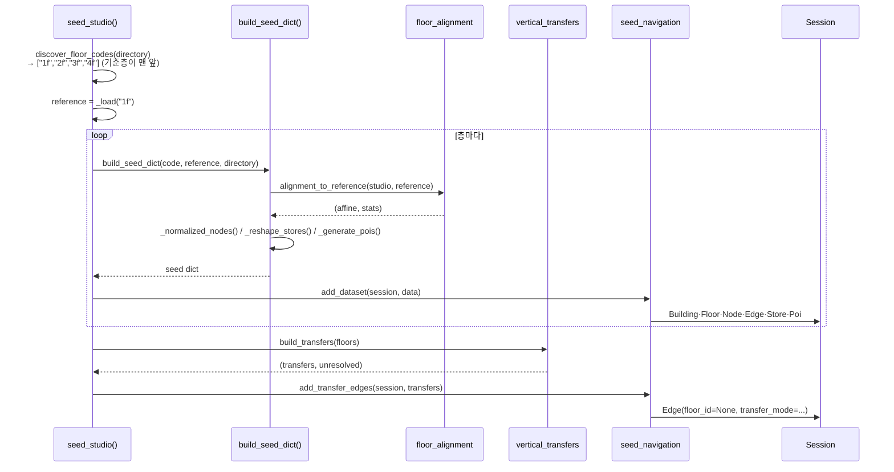
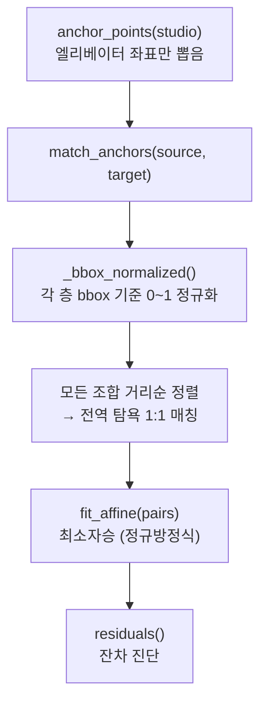
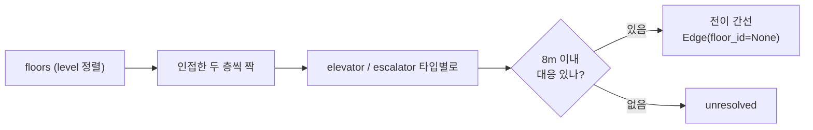
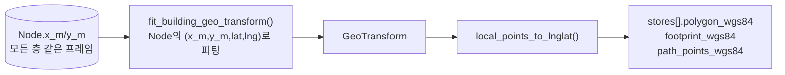

# Studio 데이터 파이프라인 — 함수가 무엇을 주고받는가

> FloorGraph Studio(HTML)에서 그린 도면이 DB에 들어가고 API로 나가기까지,
> **어떤 함수가 어떤 자료를 받아 무엇을 돌려주는지** 추적한 문서.
> HTTP 요청 처리 흐름은 [fastapi-request-flow.md](fastapi-request-flow.md)를 참고.
>
> 기준 코드: `backend/scripts/` (split_studio_export · studio_adapter · floor_alignment ·
> vertical_transfers · seed_navigation · reset_and_seed)

## 0. 전체 그림



핵심은 **두 번의 좌표 변환**이다. 이걸 놓치면 전부 어긋난다.

1. `split_export`: **source → local_m** (편집기 내부 좌표 → 미터)
2. `build_seed_dict`: **층 local_m → 건물 local_m** (층별 프레임 → 건물 공통 프레임)

---

## 1. 왜 변환이 두 번인가 (먼저 이해할 것)

### 1단계 — 편집기는 미터로 저장하지 않는다

Studio는 매장 폴리곤과 건물 테두리를 **source 좌표**(dabeeo 3000×3000 공간, ~1000 단위)로
저장한다. 키 이름이 `store_polygons_local_m`, `building_footprint_local_m`이라 미터처럼
보이지만 **아니다.** 과거 호환성 때문에 남은 이름이다.

```
편집기 저장값:  {"x": 1068.8, "y": 1147.2}     ← source (dabeeo 단위)
실제 미터:      {"x": 31.9,   "y": 32.4}       ← local_m
```

`split_export`가 파일 안의 `coordinate_system.affine_transforms.source_to_local_m`으로
변환해준다.

### 2단계 — 층마다 미터 기준이 다르다

Studio는 **층마다 좌표 변환을 따로 피팅**해 내보낸다. 그래서 같은 건물인데 층마다
치수가 다르게 나온다.

| 층 | local_m 프레임 크기 |
|---|---|
| 2F | 111 × 94 m |
| 3F | 70 × 85 m |
| 4F | 67 × 102 m |

그런데 백엔드는 건물당 `local_m → wgs84` 변환을 **하나만** 피팅한다
(`app/queries/geo_transform.py:fit_building_geo_transform` — 건물의 모든 층 Node를
모아서 피팅). 층 프레임이 제각각이면 이 피팅이 무의미해진다.

**해결**: 엘리베이터는 층이 달라도 물리적으로 같은 자리에 있다. 이걸 대응점(앵커)으로
삼아 모든 층을 기준층(1F) 프레임으로 정규화한다.

---

## 2. split_studio_export — 통합 export를 2개로 쪼갠다

```python
split_export(
    combined_path: Path,      # Studio가 내보낸 통합 JSON
    floor_code: str,          # "1f"
    out_dir: Path,
    prev_dir: Path | None,    # 기존 stores JSON에서 id/wgs84/match 물려받기
    carry_over: bool,         # 이번 export에 없는 기존 매장 유지 여부(기본 False)
) -> tuple[Path, Path]        # (그래프 경로, stores 경로)
```

### 입력이 담고 있는 것

| 키 | 좌표계 | 설명 |
|---|---|---|
| `nodes` / `edges` | `position.local_m` 등 | 내비게이션 그래프 |
| `store_polygons_local_m` | **source** | 폴리곤 배열 |
| `store_polygon_metadata` | — | 폴리곤과 **인덱스로 대응**하는 이름/입구 |
| `building_footprint_local_m` | **source** | 건물 테두리 |

### 내부 흐름



**주의할 규칙 3가지** (실제로 버그가 났던 곳)

- `store_polygon_metadata[i]` ↔ `store_polygons_local_m[i]` **인덱스 대응**이다.
  키로 연결돼 있지 않다.
- `centroid_local_m`은 metadata에 있어도 **신뢰하지 않는다.** 편집기가 source 좌표로
  넣어두는 경우가 있어 단위가 섞인다. 변환된 폴리곤에서 `_centroid()`로 다시 계산한다.
- 입구를 공유하는 폴리곤(남/여 화장실)은 물려받은 id가 겹친다 → 접미사로 분리한다.
  `store.id`는 PK라 층 안에서 유일해야 한다.

---

## 3. studio_adapter — 층 JSON을 seed dict로

진입점은 `seed_studio()`. 층을 찾아 하나씩 조립하고, 마지막에 전이 간선을 만든다.

```python
seed_studio(
    *, session=None,
    floor_codes: list[str] | None = None,
    directory: Path = STUDIO_DIR,   # 테스트가 합성 픽스처를 시드할 수 있게 주입
) -> list[dict]                     # 층별 요약(정규화 잔차 포함)
```



### build_seed_dict가 돌려주는 것

```python
{
  "building": {
      "id", "name", "area_m2", "perimeter_m",
      "footprint_local_m",          # 건물 프레임으로 정규화된 테두리
      "floor": {"id", "name", "level"},
  },
  "nodes":  [...],   # 정규화 + wgs84 재계산 + ID 층 스코프
  "edges":  [...],   # ID 층 스코프
  "stores": [...],   # 좌표 정규화, centroid는 {"local_m": ...} 구조로 감쌈
  "pois":   [...],   # elevator/escalator 노드에서 생성
  "_alignment": {"anchors", "mean", "max", "identity"},   # 진단용
}
```

### 이 단계에서 일어나는 손질 4가지

| 함수 | 하는 일 | 왜 |
|---|---|---|
| `_scoped(floor_id, id)` | `"{floor_id}:{id}"` | 층마다 `node_003` 같은 ID가 재사용돼 충돌한다 |
| `_normalized_nodes()` | 좌표 정규화 + **wgs84 재계산** | 3F/4F export에는 wgs84가 아예 없다 |
| `_scope_edges()` | geometry·length **버림** | 정규화 전 층 좌표라 그대로 두면 노드와 어긋난다.<br/>`add_dataset`이 양 끝 노드로 다시 만든다 |
| `_reshape_stores()` | `centroid` → `{"local_m": ...}` | `seed_navigation`이 기대하는 구조 |

> `_generate_pois()`는 **정규화·스코프가 끝난 nodes**를 받는다. 원본 nodes를 주면
> ID와 좌표가 어긋난다.

---

## 4. floor_alignment — 층 프레임을 건물 프레임으로

```python
alignment_to_reference(studio: dict, reference: dict) -> tuple[Affine, dict]
```

`Affine`은 2×3 튜플. `((a,b,c), (d,e,f))` → `x' = ax+by+c`, `y' = dx+ey+f`.
기준층 자신이면 `IDENTITY`를 돌려준다(변환 없음).



**왜 bbox 정규화를 먼저 하나**: 층마다 스케일이 달라서(2F 111m vs 3F 70m) 절대 거리로는
짝지을 수 없다. 각자 bbox로 0~1 정규화하면 "좌상단 엘리베이터끼리" 비교할 수 있다.

**왜 전역 탐욕인가**: 한쪽을 순서대로 순회하며 탐욕적으로 고르면 양쪽 개수가 다를 때
(1F 5개 vs 3F 4개) 짝이 밀린다. 실제로 3F 정합이 9.19m로 깨졌었다.
모든 조합을 거리순으로 정렬해 가까운 쌍부터 확정하면 1.28m로 맞는다.

| 상수 | 값 | 의미 |
|---|---|---|
| `ANCHOR_TYPE` | `"elevator"` | 층 간 위치가 고정이라 대응점으로 쓸 수 있다 |
| `MIN_ANCHORS` | 3 | 아핀 6-DOF를 풀려면 최소 3점 |

**현재 정합 품질** (실데이터)

| 층 | 앵커 | 잔차 평균 | 최대 |
|---|---|---|---|
| 1F | — | 기준층(항등) | — |
| 2F | 5 | 1.64 m | 2.60 m |
| 3F | 4 | 1.28 m | 2.05 m |
| 4F | 5 | 1.66 m | 2.42 m |

---

## 5. vertical_transfers — 층을 잇는다

```python
build_transfers(floors: list[dict]) -> tuple[list[dict], list[dict]]
#   floors: [{"code","floor_id","name","level","nodes"}]
#   반환:   (전이 간선, 짝을 못 찾은 노드)
```

**입력 nodes는 반드시 정규화된 뒤여야 한다.** 층 프레임이 제각각인 상태로 넣으면
"같은 자리"를 위치로 판단할 수 없다.



| 상수 | 값 | 의미 |
|---|---|---|
| `MATCH_RADIUS_M` | 8.0 | 같은 수직 통로로 볼 최대 수평 거리(정규화 잔차 1~3m 감안) |
| `TRANSFER_LENGTH_M` | 20.0 | 층 이동 비용. 실제 높이가 아니라 라우팅에서 층 이동을 억제하는 값 |

> **왜 이름이 아니라 위치로 매칭하나**: 예전 `link_vertical_transfers`는 엘리베이터
> 이름(EV1, EV2…)으로 그룹핑했다. Studio에서 새로 만든 층은 이름이 전부 "엘리베이터"라
> 이름으로는 구분되지 않는다.

> **level 주의**: 이 데이터의 level은 **위층일수록 작다**(6F=0 … 1F=5 … B1=6).
> 층 높이 인덱스가 아니라 "위에서부터 세는 표시 순서"다.

---

## 6. seed_navigation — dict를 ORM으로

파일을 직접 읽지 않는다. **한 층 dict를 받아 Session에 추가만** 한다.
DDL은 `reset_database`가, 트랜잭션 경계는 `studio_adapter`가 담당한다.

```python
add_dataset(session: Session, data: dict) -> None          # 한 층
add_transfer_edges(session: Session, transfers: list) -> None  # 층 간
```

| seed dict | → ORM 컬럼 |
|---|---|
| `nodes[].position.local_m.{x,y}` | `Node.x_m`, `Node.y_m` |
| `nodes[].position.wgs84.{lat,lng}` | `Node.lat`, `Node.lng` |
| `edges[]` | `Edge` (+ `edge_geometry_and_length()`로 geometry/length 보완) |
| `stores[].centroid.local_m` | `Store.centroid_x_m/y_m` |
| `building.footprint_local_m` | `Building.footprint_local_m` |

**두 함수의 결정적 차이**

```python
add_dataset       → Edge(floor_id=floor_id, transfer_mode=None)   # 층 내부
add_transfer_edges → Edge(floor_id=None,    transfer_mode="elevator")  # 층 간
```

`floor_id=None`이라 **단일 층 조회에서 자동으로 빠진다**(`WHERE floor_id = ?`).
층 간 전이 간선은 건물 전체 그래프를 쓰는 소비자(예: 클라이언트의 다층 경로 탐색)가
`floor_id IS NULL`을 함께 실어 사용한다. 현재 서버는 경로를 계산하지 않으며,
클라이언트가 `navigation_graph`로 온디바이스 탐색을 수행한다.

**Building은 한 번만 생성한다.** `add_dataset`이 `session.get(Building, id)`로 확인하고
없을 때만 만든 뒤 `flush()`한다. 그래서 첫 번째 층(=기준층 1F)의 `footprint_local_m`이
건물 외곽으로 채택되고, 나머지 층의 테두리는 쓰이지 않는다.

---

## 7. 여기서 API로 어떻게 나가는가

정규화 덕분에 **모든 층이 같은 프레임**이라, 건물 변환 하나로 전 층을 wgs84로 옮길 수 있다.



이 피팅이 성립하려면 **모든 층 Node에 lat/lng이 있어야** 한다. 그래서
`_normalized_nodes()`가 기준층 아핀으로 wgs84를 다시 계산해 넣는다.

---

## 8. 실행 방법

```bash
# 1) Studio 통합 export → 2개 파일 (backend/ 에서)
python -m scripts.transform.split_studio_export <통합export.json> --floor 2f

# 2) DB 초기화 + 전 층 적재
python -m scripts.seed.reset_and_seed

# 3) 적재 진단만 보기(층별 정규화 잔차·전이 수)
python -m scripts.seed.studio_adapter
```

Docker는 컨테이너 시작 시 `reset_and_seed`를 자동 실행한다(`docker-compose.yml`).

---

## 9. 테스트가 무엇을 지키는가

| 대상 | 데이터 | 검증 |
|---|---|---|
| `tests/integration/test_multi_floor.py` | 합성 픽스처 `test-tower` | 정규화·전이·층 간 경로를 **값으로** 단언 |
| `tests/integration/test_real_data_smoke.py` | 실제 Studio 데이터 | 불변식만(참조 무결성, 전 노드 wgs84, 노드가 건물 범위 내) |

픽스처는 2F를 일부러 다른 프레임으로 만들어 둔다.

```
2F_local = 2 × 1F_local + (5, 3)
```

정규화가 제대로면 2F 엘리베이터가 1F와 **정확히 같은 좌표**로 복원된다. 실데이터는
정답을 모르니 이 검증을 못 한다 — 그래서 합성 픽스처가 필요하다.

실데이터 쪽에 매장 수 같은 값을 단언하지 않는 이유: Studio에서 편집할 때마다 바뀌므로
회귀가 아니라 노이즈가 된다.

---

## 10. 알려진 한계

- **전이 미해결 13개** — 2F 에스컬레이터가 4개뿐(3·4F는 15~16개)이라 8m 이내 짝을
  못 찾는다.
- **건물 외곽은 층별로 못 가진다** — `Building.footprint_local_m`이 건물당 하나라
  기준층 것만 쓰인다.
- **지하층을 넣으면 초기 층이 깨진다** — 클라이언트가 `floors.first`를 기본 층으로
  쓰는데(`indoor_map_screen.dart`), level이 B1=6이라 내림차순 정렬 시 지하가 앞에 온다.
  근본적으로 "기본 층"은 정렬 순서로 정할 게 아니다(응답에 `default_floor` 등이 필요).
- **정규화는 엘리베이터에 의존한다** — 엘리베이터가 3개 미만인 층은 정규화할 수 없다
  (`MIN_ANCHORS`).
